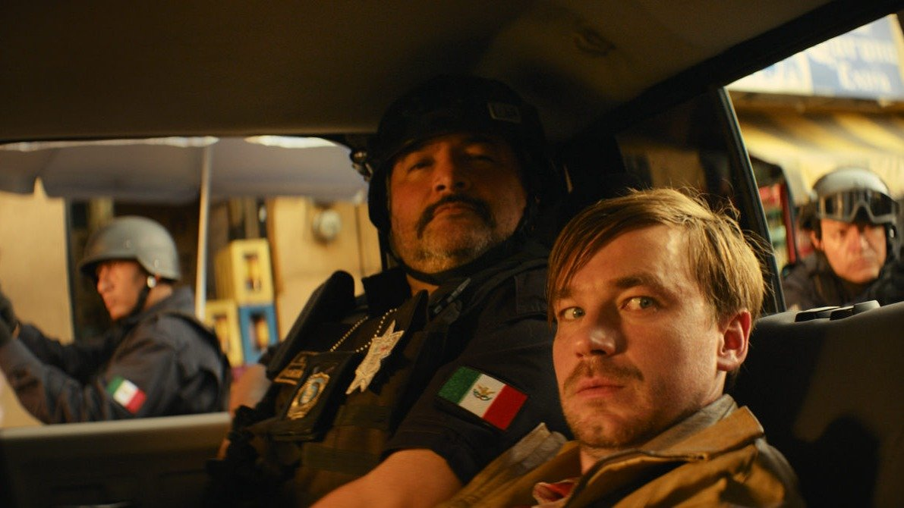

# Он не Коля, он — Вася. 23 января на экраны выходит авантюрная плутовская комедия «Василий» режиссера Дмитрия Литвиненко

- **URL:** https://novayagazeta.ru/articles/2025/01/21/on-ne-kolia-on-vasia
- **Дата:** 2025-01-21
- **Автор:** Лариса Малюкова

## Он не Коля, он — Вася

## 23 января на экраны выходит авантюрная плутовская комедия «Василий» режиссера Дмитрия Литвиненко

Кадр из фильма «Василий»

Картина рассказывает про меняющихся местами близнецов из детдома: Василия — скромного учителя ОБЖ из поселка Ковылкино и его брата Колю, который в Мексике кинул наркокартель на деньги да еще увел любимую женщину наркобарона, красавицу Бониту, многодетную мать. В общем, если бы не навыки ОБЖ, не спасти брату Васе брата Колю.

Тема разлученных близнецов — одна из золотых жил Голливуда и окрестностей. Принцы (и принцессы с лицом самых известных киноблизняшек сестер Олсен) населили разнообразные опусы от «Ловушки для родителей» до «Близнецов» Райтмана (впрочем, совершенно не похожих друг на друга) и «Связанных насмерть». Близнецов играли Николас Кейдж, Лиза Кудроу, Шварценеггер, Леонардо ди Каприо, Том Харди, Марк Руффало, Джереми Айронс. У нас свои звезды. Точнее звезда. Александр Петров. Он и Васю — застенчивого, доброго провинциала играет, и всех кидающего-подставляющего Колю с кликухой Bazil. Врун и мошенник, живущий принципом: кто рано встает, тот в тюрьму не пойдет. Готов и богатых грабить, и бедных, таково воспитание усыновленного американцами парнишки.

Комедия горячительная, вроде бы на высоком градусе, но сюжетно незамысловатая, вторичная, сверхсентиментальная, с очевидными, местами телевизионными ходами и разворотами.

Цензуре не подкопаться — наркотиков в кадре не показывают. Русские не сдаются. Родина покалеченную душу лечит.

Вообще, фильм «Брат» здесь вольготно рулит. Первая часть так и называется: «Брат». Слоган следующей: «Я узнал, что у меня мексиканская семья».

Кадр из фильма «Василий»

Поддержите нашу работу!

1000 500 300 Нажимая кнопку «Стать соучастником», я принимаю условия и подтверждаю свое гражданство РФ

Если у вас есть вопросы, пишите [email protected] или звоните:+7 (929) 612-03-68

Да и спасает брат Вася Колю, который его безустанно предает и продает, руководствуясь простым багровским принципом (почти дословной цитатой): «Брат он мой!»

А вокруг зажигает жаркая мексиканская экзотика: карнавал, пустыня, квартал красных фонарей, погони. И русская попса по-испански: «А эта свадьба пела и плясала», «Я люблю тебя до слез», а еще привет всем «пацанам» в «Седой ночи», которая летит из прямо из Тихуаны в тихую и мирную деревню Ковылкино.

Читайте также

В тихом омуте

Новый фильм Франсуа Озона «Что случилось осенью» уже с 23 января в прокате

Будут ли смотреть это кино? Обязательно. У нас и «Небриллиантовая рука» стала лидером новогодней битвы за зрителя. За праздники по ТВ и в онлайн-кинотеатрах пародийную поделку под Гайдая посмотрели 44,8 млн зрителей. Любопытно, что сама «Бриллиантовая рука» стала чемпионом проката 1969 года, и тогда фильм посмотрели 76,7 миллиона зрителей. Изуродованный Гайдай вот-вот догонит оригинал. Перефразируя Жозефа де Местра: «Каждый народ имеет то кино, которое он заслуживает».

Лариса Малюкова ведет телеграм-канал о кино и не только. Подписывайтесь тут.

### Этот материал входит в подписки

Смотровая площадкаКино с Ларисой Малюковой

Культурные гидыЧто читать, что смотреть в кино и на сцене, что слушать

### Добавляйте в Конструктор свои источники: сайты, телеграм- и youtube-каналы

Войдите в профиль, чтобы не терять свои подписки на разных устройствах

Поддержите нашу работу!

1000 500 300 Нажимая кнопку «Стать соучастником», я принимаю условия и подтверждаю свое гражданство РФ

Если у вас есть вопросы, пишите [email protected] или звоните:+7 (929) 612-03-68
