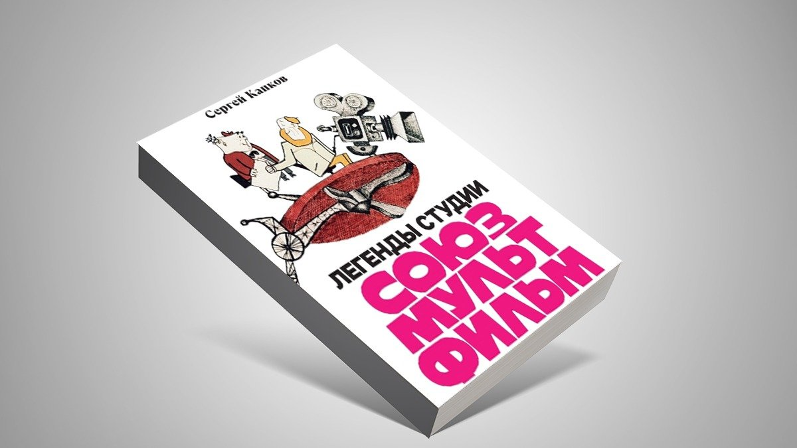

# Щас спою. В издательстве «Бослен» вышла книга о золотом веке советской анимации «Легенды студии «Союзмультфильм»

- **URL:** https://novayagazeta.ru/articles/2025/01/25/shchas-spoiu
- **Дата:** 2025-01-25
- **Автор:** Лариса Малюкова

## Щас спою

## В издательстве «Бослен» вышла книга о золотом веке советской анимации «Легенды студии «Союзмультфильм»

Автор «Легенд» — Сергей Капков, шеф-редактор киностудии «Союзмультфильм», худрук Национальной анимационной премии «Икар».

Книга Капкова — о тех, кто создавал шедевры и просто хорошие мультфильмы (что тоже непросто). О картинах, на которых взросло не одно поколение, о картинах, которые до сих пор кормят и поят и «Союзмультфильм», и наше игровое кино (от «Чебурашки» до «Летучего корабля» и «Домовенка Кузи»).

Здесь захватывающие истории зарождения Винни-Пуха, Карлсона, Волка и Зайца, Бременских музыкантов (тех самых, а не игровых, ставших кассовым хитом), Чебурашки, Чиполлино.

В чем их секрет? Как создавались и менялись их образы, характеры?

Как создавались целые миры их обитания — чудесные в своей подлинности?

Это не киноведение в прямом смысле слова. На протяжении многих лет Сергей собирает коллекцию из историй, монологов и бесед с аниматорами разных поколений. Он умеет слушать. Сохраняет интонацию. И поэтому в этой книжке нет формальных текстов. Поэтому рассказы о золотом веке советской мультипликации разворачиваются в пространстве от профессиональных секретов вроде эклера — до баек и розыгрышей, которыми славился «Союзмультфильм».

Более того, атмосфера радости, увлеченности мультипликацией, разбитного вольнодумства, каторжного труда и бражничества и были той почвой, на которой произрастали фильмы на все времена.

Жена русского Диснея, гения движения Бориса Дежкина («Шайбу! Шайбу!», «Чиполлино»), рассказывает, что он рисовал дни и ночи. Если его посылали за хлебом и бутылкой молока, немедленно появлялись рисунки. Он переносил на бумагу любое движение природы: как течет река, шелестят листья, порхает бабочка, распускаются цветы. Это какое-то особое «одушевленное зрение».

А мультипликатор Виолетта Колесникова вспоминает, как она и Мария Мотрук (жена Федора Хитрука) придумали неправильную походку Винни-Пуху. Она вообще в основном разыгрывала Винни-Пуха и Ослика. А прототипом для Винни-Пуха — «поэта и лентяя», стал потрепанный мишка с примятым ухом из детства замечательного художника Владимира Зуйкова.

От Эдуарда Назарова узнаем, что лучший российский мультфильм (по версии опроса профессионалов) «Жил-был Пес» родился из «телеграфной» украинской сказки в 15 строк и фразы «Сейчас спою», превратившейся в мем.

Художник-постановщик Виктор Никитин открывает секрет, как создавалась Шамаханская царица — в «Сказке о Золотом Петушке» она стала символом разрушительной силы красоты. Сначала Никитин рисовал ее обнаженной, чтобы мультипликаторам было ясно, как ее двигать. А уж потом ее «условно» минималистично одели, но так, чтобы от нее было не оторвать глаз. А гениальный мультипликатор Марина Восканьянц гениально сделала сцену танца Шамаханской царицы с влюбленным в нее Додоном.

Поддержите нашу работу!

1000 500 300 Нажимая кнопку «Стать соучастником», я принимаю условия и подтверждаю свое гражданство РФ

Если у вас есть вопросы, пишите [email protected] или звоните:+7 (929) 612-03-68

Котеночкин поначалу намеревался пригласить для озвучки Волка Высоцкого, чтобы он и пел хриплым голосом свои песни. Но руководство замахало руками и ногами: «Даже не думай! На пленуме ЦК комсомола сказали, что это одиозная фигура, тлетворно влияющая на нашу советскую молодежь!» И на его место взяли Папанова.

Кстати, походку Волка придумал не Котеночкин, а мультипликатор Виктор Лихачев. Вообще, у каждого персонажа целый «коллектив» родителей: от художника до режиссера, от мастера до мультипликатора, актера и звукорежиссера. У каждого народного любимца своя уникальная история «происхождения».

Читайте также

Голоса в темноте

Книги о памяти, истории и культурной идентичности

Облик «Бременских музыкантов», по воспоминаниям Инессы Ковалевской, родился благодаря французским журналам, которые она с трудом достала, — оттуда и рискованное мини, джинсы, бейсболки. Разбойники же буквально сошли с настенного календаря, который принесла редактор Наталья Абрамова, — на нем была знаменитая троица Вицин, Никулин, Моргунов. Принимали фильм со скандалом, а Ковалевскую со студии практически выгоняли.

В этой книге оживают голоса не только известных режиссеров, но и художников, мультипликаторов, мастеров кукол, актеров, композиторов, звукооператоров. Всех тех, чьи имена на страшной скорости пролистываются перед титром «Конец». Всех их Сергей Капков постарался сделать видимыми, помог нам услышать их голоса и заново оценить тот прекрасный труд, который и превращает ремесло в искусство.

### Этот материал входит в подписку

Культурные гидыЧто читать, что смотреть в кино и на сцене, что слушать

### Добавляйте в Конструктор свои источники: сайты, телеграм- и youtube-каналы

Войдите в профиль, чтобы не терять свои подписки на разных устройствах

Поддержите нашу работу!

1000 500 300 Нажимая кнопку «Стать соучастником», я принимаю условия и подтверждаю свое гражданство РФ

Если у вас есть вопросы, пишите [email protected] или звоните:+7 (929) 612-03-68
