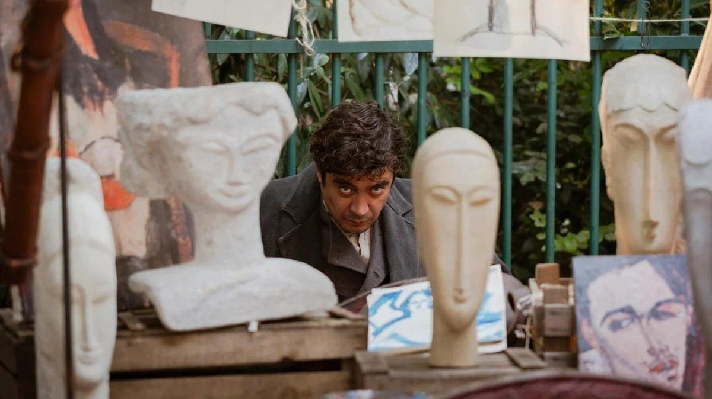

# Кабаре Модильяни. С 30 января на экранах фильм Джонни Деппа «Моди: Три дня на крыльях безумия»

- **URL:** https://novayagazeta.ru/articles/2025/01/30/kabare-modiliani
- **Дата:** 2025-01-30
- **Автор:** Лариса Малюкова

## Кабаре Модильяни

## С 30 января на экранах фильм Джонни Деппа «Моди: Три дня на крыльях безумия»

Кадр из фильма «Моди. Три дня на крыльях безумия». Источник: Кино-Театр.Ру

Эта версия «Моди» поживей классического байопика «Модильяни» Майкла Дэвиса. С клоунскими собутыльниками художниками от бога Утрилло и Сутиным. С обманщиком, плутом, визионером и обреченным гением Модильяни (Риккардо Скамарчио), которого не понять скучным коллекционерам, оценщикам и денежным мешкам. С его кошмарами. И масками смерти, которая душит.

А начинается все, как спектакль-кабаре: Модильяни в знаменитом кафе Le Dome на Монпарнасе длинным багетом лупит грубого вояку, антисемита. И после короткой драки, переворачивания столов, вылетает в раритетное витражное окно на улицу. Его ищет полиция. У него нет денег на еду и вино. Ему удается за копейки продать портрет на Монмартре как последнюю картину только что погибшего малоизвестного гения Модильяни. И со всех сторон ему говорят, что на его портретах мертвые глаза, в них нет жизни.

Теперь ему надо срочно убраться из города (его ищет полиция после дебоша) и остаться, потому что через день в Париж приедет знаменитый коллекционер Морис Ганьята (Аль Пачино), в коллекции которого работы Ренуара, Пикассо, Сезанна. Такой шанс невозможно упустить.

Это не байопик — всего лишь три бешеных дня из жизни Модильяни.

Похоже, Депп в этой несколько сумбурной картине в какой-то мере снимал историю и про себя. Про существование на краю, «когда тебе в любую минуту могут голову снести».

Художники выбирают взять в руки кисть или винтовку, война гремит в раблезианском Париже, смешивая вечеринки с бомбежками. И порой кажется, что кровь из его горла — брызги той же неистребимой крови беспощадной войны.

И хотя у него нет ни гроша в кармане, пока еще можно любить божественную Беатрис, писать ее и лепить. У него впереди целых четыре года до смерти. И плевать на проклятых покупателей его таланта, видящих в живом — мертвое, а в мертвом — живое.

Кажется, что безумные здесь все, но прежде всего Хаим Сутин (Райан МакПарланд), который не моется, ловит мух, молится Рембрандту, ищет правильный свет. В его запертой наглухо комнате гниют коровьи туши (он их пишет день за днем, распространяя по всей округе страшное зловоние), и куриная лапка — его Голгофа.

Кадр из фильма «Моди. Три дня на крыльях безумия». Источник: Кино-Театр.Ру

Поддержите нашу работу!

1000 500 300 Нажимая кнопку «Стать соучастником», я принимаю условия и подтверждаю свое гражданство РФ

Если у вас есть вопросы, пишите [email protected] или звоните:+7 (929) 612-03-68

Депп, похоже, хотел сделать зрительское кино под ядреный noodling Саши Путтнэма в духе Бреговича. Про проклятых художников, готовых гореть на алтаре искусства, не желающих лгать и приспосабливаться. Ни в жизни, ни в искусстве. Про бражника и бродяжку, поклоняющегося Данте и готового разбить, уничтожить свои скульптуры в отсутствие понимания и любви. Про вечные взаимоотношения «поэта и книгопродавца».

Увы, в фильме многовато суеты, хаоса, не хватает ясности, прозрачности сюжета. При этом ощущение, что действие тормозит, бежит на месте.

А название «Ветер на крыльях безумия» — строка из его любимого Бодлера. Главный вопрос, когда само время двинулось с катушек, может, именно безумие в своем высшем воплощении — произведении искусства поможет ответить на вопрос: созидать или разрушать?

Лариса Малюкова ведет телеграм-канал о кино и не только. Подписывайтесь тут.

### Этот материал входит в подписки

Смотровая площадкаКино с Ларисой Малюковой

Культурные гидыЧто читать, что смотреть в кино и на сцене, что слушать

### Добавляйте в Конструктор свои источники: сайты, телеграм- и youtube-каналы

Войдите в профиль, чтобы не терять свои подписки на разных устройствах

Поддержите нашу работу!

1000 500 300 Нажимая кнопку «Стать соучастником», я принимаю условия и подтверждаю свое гражданство РФ

Если у вас есть вопросы, пишите [email protected] или звоните:+7 (929) 612-03-68
