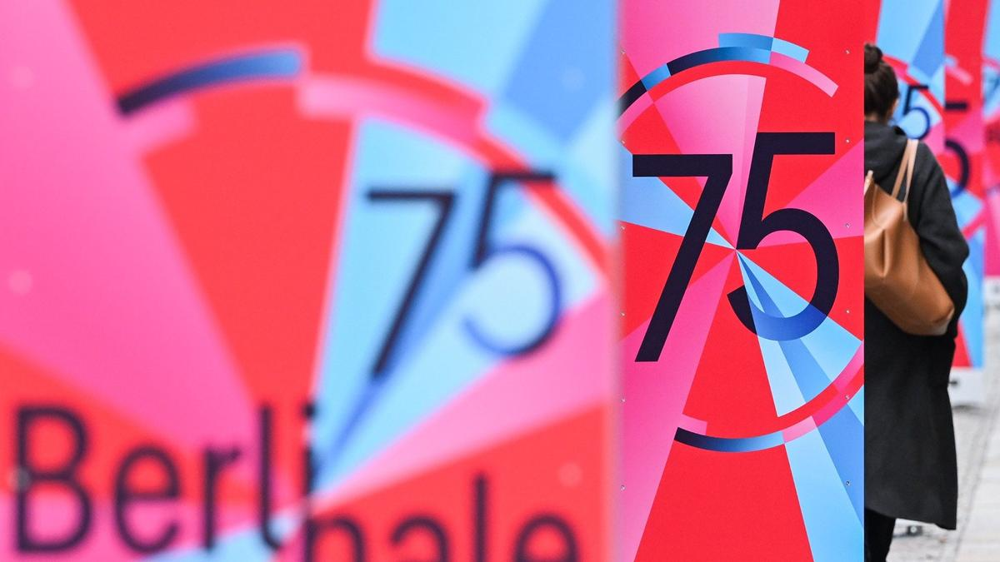

# Мечты о горячем молоке. 75-й Берлинский кинофестиваль открывается 13 февраля. Рассказываем о наиболее интересных картинах программы

- **URL:** https://novayagazeta.ru/articles/2025/02/12/mechty-o-goriachem-moloke
- **Дата:** 2025-02-12
- **Автор:** Лариса Малюкова

## Мечты о горячем молоке

## 75-й Берлинский кинофестиваль открывается 13 февраля. Рассказываем о наиболее интересных картинах программы

Фото: dpa / picture-alliance

## Конкурс

Среди 19 конкурсных работ новые фильмы Ричарда Линклейтера, Хон Сан Су, Мишеля Франко и Раду Жуде. Почти половина картин созданы или сорежиссированы женщинами.

- «Голубая луна». Режиссер Ричард Линклейтер («Перед полуночью», «Перед рассветом», «Отрочество»)

Трижды оскаровский номинант Ричард Линклейтер снял музыкальную биодраму по сценарию Роберта Каплоу. Она расскажет о жизни поэта-песенника Лоренца Харта — либреттиста, сотрудничавшего с Робертом Роджерсом. Вместе они написали более 500 песен (в том числе знаменитую «Голубую луну»), 28 мюзиклов, многие из которых гремели на Бродвее. Киноистория о последних годах жизни поэта-песенника Харта.

У Линклейтера уже есть два «Серебряных медведя» за режиссуру («Перед рассветом», «Отрочество»).

В главных ролях: Маргарет Куолли, Эндрю Скотт, Итан Хоук, Бобби Каннавале, Патрик Кеннеди.

Кадр из фильма «Голубая луна»

- «Мечты». Режиссер Мишель Франко («После Люси», «Хроник», «Новый порядок»)

Обладатель наград Каннского и Венецианского кинофестивалей привезет в Берлин драму «Мечты».

О молодом мексиканском танцоре, вознамерившемся добиться всемирной славы. В погоне за своей мечтой Фернандо переезжает в Сан-Франциско. Он верит, что его состоятельная возлюбленная, социалистка и филантроп Дженнифер, поможет ему. Однако мечты редко совпадают с реальностью.

Франко уже во второй раз подряд после «Памяти» 2023 года работает вместе с актрисой Джессикой Честейн, на сей раз ей досталась роль балерины, пытающейся преуспеть в Сан-Франциско.

В главных ролях: Джессика Честейн, Руперт Френд, Маршалл Белл, Джим Андерсон.

Кадр из фильма «Мечты»

- «Горячее молоко». Режиссер Ребекка Ленкевич

Дебютный режиссерский проект сценаристки Ребекки Ленкевич. В основе фильма роман Деборы Леви, повествующий о 25-летней Софии и ее прикованной к креслу матери Роуз, которые отправляются в испанский прибрежный город Альмерия — там находится клиника некоего Гомеса. Роуз страдает от загадочных симптомов паралича и надеется получить помощь целителя. Атмосфера этого залитого солнцем города действует на Софию возбуждающе. Она всю жизнь страдала вместе с матерью, и только здесь начинает избавляться от оков множества запретов.

Кадр из фильма «Горячее молоко»

- «Что эта природа говорит тебе». Режиссер Хон Са Су

Донхва, тридцатилетний поэт, везет свою девушку Джунхи, с которой встречался три года, из Сеула в дом ее родителей за пределами Ичхона. Он восхищен размером дома и красотой холмистых садов вокруг, он знакомится с отцом Джунхи, проводит день с их семьей, посещают буддийский храм у реки. А дальше начинаются откровенные разговоры, которые снимают покровы с «видимостей», обнажая суть вещей.

- «Континенталь 25». Режиссер Раду Жуде

Его «Continental 25» — не только философское эссе о судьбе Европы, но и попытка диалога с классическим фильмом 1952 года Роберто Росселлини «Европа 51». Клуж, город на северо-западе Трансильвании. Бездомного мужчину выгнали из убежища в подвале дома, после чего он совершает самоубийство. Орсоля, судебный пристав, осуществившая выселение, пытается справиться с чувством вины. Жуде («Безумное кино для взрослых» (2021)) описывает свой проект как историю о «решении моральной дилеммы задним числом». Режиссер уже побеждал на Берлинале в 2020 году с комедией «Невезучий трах, или Безумное порно».

- «Если бы у меня были ноги, я бы тебя пнул». Режиссер: Мэри Бронштейн

Премьера страшноватого драмеди Мэри Бронштейн состоялась на фестивале «Сандэнс». Это мрачнейшая история материнства. Линде приходится справляться с целой россыпью проблем: загадочной болезнью своего ребенка, отсутствием мужа, пропажей человека и все более враждебными отношениями с психотерапевтом.

Поддержите нашу работу!

1000 500 300 Нажимая кнопку «Стать соучастником», я принимаю условия и подтверждаю свое гражданство РФ

Если у вас есть вопросы, пишите [email protected] или звоните:+7 (929) 612-03-68

Кадр из фильма «Если бы у меня были ноги, я бы тебя пнул»

- «Ледяная башня». Режиссер Люсиль Хадзихалилович

Совместное производство Франции, Германии и Италии. Французская кинематографистка Люсиль Хадзихалилович представляет фэнтези-драму. 1970-е. Марион Котийяр перевоплощается в актрису Кристину, которая снимается в экранизации сказки Андерсена «Снежная королева». А беглая сиротка-подросток Жанна находит убежище на студии, где снимается этот фильм, и попадает под чары Кристины.

В картине снимались режиссер Гаспар Ноэ, наш Воланд — Аугуст Диль и другие.

В основной конкурс смотра вошла украинская драма «Лента времени» Катерины Горностай, ее предыдущая лента «Стоп-Земля» была показана на Берлинском кинофестивале и выиграла награду «Хрустальный медведь» в секции Generation 14plus. «Лента времени» — документальное кино о том, как изменилась система обучения в реалиях военного времени.

В этом году фестиваль возглавит Триши Таттл, она сменила на посту худрука Берлинале лидера отборочной команды Карло Шатриана. До этого Таттл занималась Лондонским кинофестивалем. На Берлинале она учредила конкурс дебютных фильмов «Перспективы», куда вошли ленты из Египта, Индии, Тайваня, Венгрии и других стран.

Триши Таттл. Фото: dpa / picture-alliance

В секции Special — 22 фильма, в том числе научно-фантастическая лента «Микки 17». Это первый фильм режиссера Пон Чжун Хо после оскаровского триумфа его «Паразитов». Сюжет основан на научно-фантастическом романе Эдварда Эштона и посвящен жизни Микки Барнса, участвовавшего в колонизации ледяного мира. Герой Роберта Патиссона подписывает контракт, согласно которому его можно «восстанавливать» после гибели, то есть создавать его точную копию с теми же воспоминаниями. Его участь — быть «перезагружаемым» сотрудником, сознание которого после смерти каждый раз перемещают в новое тело. Но во время очередного «перерождения» что-то идет не так… Неожиданный ракурс христологической темы.

«Я никогда не работал с режиссером, у которого был бы столь уникальный стиль. Он излучает ауру, систематичен, уверен в себе и безупречно реализует свой замысел», — говорит актер.

В кастинге также Тони Коллетт, Марк Руффало и Стивен Ян.

- «Нечто в перьях». Режиссер Дилан Саузерн

Хоррор-драма британского режиссера Саузерна («Заткнись и играй хиты», «У печали есть крылья») сочинена по мотивам романа Макса Портера «Горе — это вещь с перьями» об отце семейства, чья жизнь рушится после смерти супруги. Вскоре мужчина начинает видеть мистического ворона. В главной роли Бенедикт Камбербэтч.

Сериал Джастина Курзеля «Узкая дорогая на дальний север» основан на романе Ричарда Флэнагана, отмеченном Букеровской премией. Это история жизни Дорриго Эванса, разворачивающаяся во время Второй мировой. Его страстная любовь, ужасы в лагере для военнопленных в Бирме и путь к признанию как уважаемого хирурга. В главной роли Джейкоб Элорди.

«Совершенный незнакомец» Джеймса Мэнголда — раскритикованный коллегами фильм о раннем этапе творчества Боба Дилана, которого сыграл Тимоти Шаламе.

В секцию Forum отобрали документальный проект Виталия Манского «Подлетное время», наблюдение режиссера за жизнью его родного города Львова. Неигровая картина «Когда над морем вспыхнула молния» Евы Нейман — наблюдения за жизнью в Одессе, подвергаемой бомбардировкам.

Читайте также

Про рок

На экраны выходит фееричный байопик «Пророк. История Александра Пушкина» — под современную музыку и с Юрой Борисовым в главной роли

Открывает Берлинале-2025 драма Тома Тыквера «Свет». Том Тыквер уже дважды открывал Берлинале: в 2002 году международной лентой «Рай» и в 2009 году — политическим триллером «Интернэшнл».

Председателем жюри фестиваля станет американский режиссер Тодд Хейнс, не только режиссер, лауреат многих фестивалей, но и магистр искусств. Он — выпускник престижного университета искусств и наук Бард-колледж.

На церемонии открытия почетным «Золотым медведем» за жизненные достижения наградят Тильду Суинтон, актрису безграничных возможностей.

### Этот материал входит в подписки

Смотровая площадкаКино с Ларисой Малюковой

Культурные гидыЧто читать, что смотреть в кино и на сцене, что слушать

### Добавляйте в Конструктор свои источники: сайты, телеграм- и youtube-каналы

Войдите в профиль, чтобы не терять свои подписки на разных устройствах

Поддержите нашу работу!

1000 500 300 Нажимая кнопку «Стать соучастником», я принимаю условия и подтверждаю свое гражданство РФ

Если у вас есть вопросы, пишите [email protected] или звоните:+7 (929) 612-03-68
