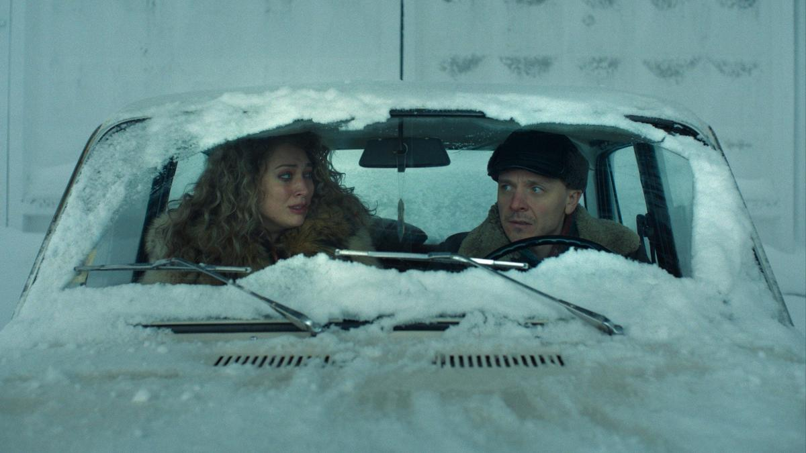

# Танго с аутсорсом. Что нового посмотреть российскому зрителю в кино и на платформах. Лариса Малюкова — о премьерах месяца

- **URL:** https://novayagazeta.ru/articles/2025/02/15/tango-s-autsorsom
- **Дата:** 2025-02-15
- **Автор:** Лариса Малюкова

## Танго с аутсорсом

## Что нового посмотреть российскому зрителю в кино и на платформах. Лариса Малюкова — о премьерах месяца

Кадр из сериала «Аутсорс». Источник: кинопоиск

## Приглашение на казнь

- «Аутсорс» — самый неожиданный сериал «нового сезона» — начал выходить на платформе OkkO

Во-первых, не избитая наконец-то тема (из оставшихся полуразрешенных): исполнители наказания отдают (продают) право на убийство. Вот такие метаморфозы пережил Чичиков/Раскольников во время «прогресса» человечества. Торговля душами сегодня идет споро — уже не важно, живыми или мертвыми. И главное, у каждого продавца — свои весомые резоны. Для них это тоже вопрос жизни и смерти. Или хотя бы единственный способ — таким кощунственным образом — осуществления мечты.

Во-вторых, творческая команда: автор Анна Козлова («Краткий курс счастливой жизни», «Садовое кольцо»), режиссер — Душан Глигоров («Хрустальный», «Трасса»), его соавтор и оператор — Батыр Моргачев. Впечатляет тюремный мир, который они создали на экране: мрачные коридоры, суровая геометрия лестничных пролетов, ржавые двери с глазками (в них видим героев и их жертв), разломанный кафель и, наконец, нечто вроде темной душевой — комната для исполнения приговора.

Через клетку смотрим не только на преступников, но и на надзирателей, вспоминая Довлатова, писавшего о внутренней родственности охранников и заключенных. Пространства с измененной геометрией, то чрезмерно вытянутые, то с отлетевшими вверх потолками помещения, как любит Моргачев. Глубинные кадры, бессердечные интерьеры, а вокруг — изумительные просторы Камчатского края во всем скупом северном великолепии под ледяным солнцем: смертельно красивый и холодный край света. Но и «дивный мир» за пределами тюрьмы, живущий по праву сильного, не слишком отличается от казенного дома…

Кадр из сериала «Аутсорс». Источник: кинопоиск

В-третьих, снайперский кастинг. Не хотелось бы никого выделять. И все же… Иван Янковский снова на высоте, его герой просто переливается добром и злом. Видимым гуманизмом и циничностью. Это как если бы свинцовый мальчик Плюмбум, озаренный идейностью, вырос. Отдельно хотелось бы сказать о Карине Разумовской (в «Трассе» она играла главную роль). Ее в образе мамаши подвергнувшейся насилию девочки не узнать: в вечной лисьей шапке с салатом оливье в голове. Да и Даша Савельева в роли докторши, на которую навалился подлейший диагноз — отчаяние, страх и надежда.

В-четвертых, вопрос жизни и смерти, поставленный ребром. Государство разрешает убивать… но после суда. «Ты веришь суду?» — задаются вековечным вопросом герои. И сами себе отвечают.

Разумеется, речь идет о 90-х. Но требования вернуть «окончательный приговор» звучат все громче. Вы верите суду?

«Аутсорс» — «Наказание как преступление». Приглашение на казнь. Добро пожаловать!

Где смотреть: на платформе OkkO

## «Танго на осколках» — на платформе KION.

Кадр из сериала «Танго на осколках». Источник: кинопоиск

- Мелодрама с элементами мистики продюсерской компании Валерия Тодоровского «Мармот-фильм»
- 17-я картина режиссера Сергея Сенцова («Дылды», «Престиж», «1703»). В главной роли — Юлия Снигирь

Ее непроницаемая холодная Нора — бизнес-консалтинг-леди однажды обнаруживает мужа мертвым. Да еще в квартире, которую он снимал для любовницы. А в шкафу среди его вещей — танцевальный костюм. Она приходит в танцевальный клуб. Пытается с помощью танго что-то понять: про мужа, детей, друзей. Но главное — про себя. И там, в зале среди танцующих… замечает своего мужа.

Они возвращаются. Зачем? Может, чтобы хотя бы после смерти поговорить по-человечески. Быть честными друг с другом. Узнать друг друга.

К примеру, он хочет выбрать для своих поминок зал с караоке и с шашлыком. Он серьезно? Да он обезумел! И кто мог знать, что он любил караоке? Нора, впрочем, знакомится не только с отбывшим в иной мир мужем, но и с его любовницей, со своими детьми-подростками, которых она затерроризировала стремлением… к совершенству. Отдавая всю себя бизнесу, она и своих домашних держала под контролем, назойливо «причиняла добро» близким. И поэтому рядом с ней душно. Может, поэтому, узнав про тайную жизнь отца, дочь восклицает: «Хотя бы кто-то его любил».

Кадр из сериала «Танго на осколках». Источник: кинопоиск

И неожиданно танго помогает ей хотя бы немного отпустить себя, купить откровенный наряд для танцев. Быть не столь совершенной — смешной, нелепой, напиться. Искать близости с мужчинами. Открыть тайну своей второй личности… И — если повезет — наконец-то почувствовать боль.

Поддержите нашу работу!

1000 500 300 Нажимая кнопку «Стать соучастником», я принимаю условия и подтверждаю свое гражданство РФ

Если у вас есть вопросы, пишите [email protected] или звоните:+7 (929) 612-03-68

Так что это кино не про танцы — про спасение. И танго здесь — схватка души и плоти, жизни и смерти — ей в помощь.

Сериал про скелетов, танцующих в шкафу танго, не великий, но эмоционально заряженный. Можно вспомнить фильмы «Я люблю тебя» или «Вечность между нами» о связи с ушедшими близкими. Или «Давайте потанцуем», где герой Ричарда Гира идет в школу танцев, чтобы прорвать пелену рутинного существования. Но прежде всего, в «Танго на осколках» угадываются мотивы «Любовника» — замечательной картины Валерия Тодоровского. В ней похоронивший жену и убитый горем муж знакомился с ее любовником, словно открывая ее заново. Магия «Любовника» подпитывалась блистательным дуэтом Янковский–Гармаш. «Танго на осколках» полностью держится и спасается игрой Юлии Снигирь, которой удается временами скрывать вторичность сценария и рыхлость диалогов. Но в «Новом сезоне» это была одна из лучших ролей конкурса.

Где смотреть: KION и START

## Стоит ли оказываться в заложниках у ИИ?

Кадр из фильма «On и Она». Источник: кинопоиск

- Фильм «On и Она» Евгения Корчагина с Юлией Пересильд в главной роли уже в кинотеатрах

Ксения — разработчик новых технологий искусственного интеллекта, в частности, цифровых двойников, которые помогли бы человеку избежать многих ошибок, так как успевают мгновенно просчитать возможные варианты любого решения. Но после провала презентации проекта она отправляется в двухнедельный отпуск, арендовав с помощью интернет-серфинга умный дом на берегу океана. Дом, оснащенный искусственным интеллектом по имени Маркус, удовлетворит любое желание гостя, поддержит разговор, включит любимый фильм или музыку, угостит правильным вином, организует доставку экзотической еды и напитков — в общем, выполнит любые мечты. Причем со скидкой, так как Ксения — первый жилец сверхкомфортного отдыха, и ее отзыв «крайне важен для нас»

Так Ксения и окажется в заложниках у ИИ. Авторы считают, что это дело вкуса. Может, в будущем кому-то и понравится.

Кадр из фильма «On и Она». Источник: кинопоиск

Режиссер экологической комедии «Говорит Земля!» Иван Корчагин снял фантастический триллер с элементами мелодрамы. Юлия Пересильд и здесь почти на «космической станции». Дом убаюкивает, ублажает ее, как может. Она танцует под плейлист, собранный из ее любимых хитов, заказывает экзотические блюда, плавает в бассейне с морской водой, тренируется с виртуальным коучем по фитнесу. Ее обслуживает роботизированный Малыш и помощник ИИ, напоминающий R2-D2, запрограммирован строго на угадывание ее желаний. Где найти такого возлюбленного: по утрам он приносит кофе, а по вечерам настроит на сон.

Ксения наслаждается в тропическом раю, который незаметно превращается в… тюрьму.

Вспоминаются и «Черное зеркало», и ромком Марии Шрадер «Я твой человек», и мотивы «Убийства на краю света».

Сюжет, прямо скажем, незамысловат. На полный метр его растянули за счет танцев и разнообразных «райских наслаждений» Ксении–Пересильд, клипово снятых и смонтированных. Можно, конечно, интерпретировать историю как сюжет про абьюзивные отношениям богатого (даром, что цифрового) папика и его «подопечной» возлюбленной, но для этого не хватает остроты. Все слишком глянцево, поверхностно. Решение авторов оставить окончательный выбор за женщиной, мне кажется, верным. И выбор этот будет непредсказуемым.

Лариса Малюкова ведет телеграм-канал о кино и не только. Подписывайтесь тут.

### Этот материал входит в подписки

Смотровая площадкаКино с Ларисой Малюковой

Культурные гидыЧто читать, что смотреть в кино и на сцене, что слушать

### Добавляйте в Конструктор свои источники: сайты, телеграм- и youtube-каналы

Войдите в профиль, чтобы не терять свои подписки на разных устройствах

Поддержите нашу работу!

1000 500 300 Нажимая кнопку «Стать соучастником», я принимаю условия и подтверждаю свое гражданство РФ

Если у вас есть вопросы, пишите [email protected] или звоните:+7 (929) 612-03-68
