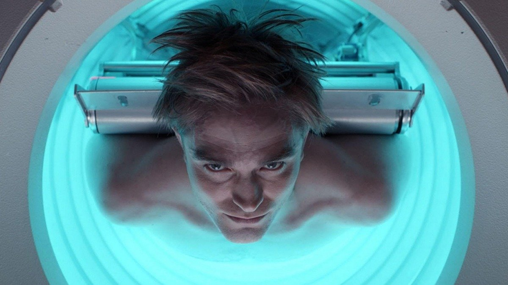

# Диктатура любви и сумерек. Самые ожидаемые премьеры Берлинале-2025 «Микки 17» и «Мечты»

- **URL:** https://novayagazeta.ru/articles/2025/02/17/diktatura-liubvi-i-sumerek
- **Дата:** 2025-02-17
- **Автор:** Лариса Малюкова

## Диктатура любви и сумерек

## Самые ожидаемые премьеры Берлинале-2025 «Микки 17» и «Мечты»

Кадр из фильма «Микки 17»

Обладатель наград Каннского и Венецианского кинофестивалей Мишель Франко привез в Берлин драму «Мечты».

Он снял любовную драму как провокационную историю на одну из самых актуальных политических тем.

Нет, это не про Ромео и Джульетту, которым строят капканы родственники или мешают социальные преграды.

О страстном романе молодого мексиканского танцовщика и прекрасной миллионерши. Жгучий брюнет Фернандо (Исаак Эрнандес), рискуя жизнью, пересекает границу в рефрижераторе, набитом людьми, как сельди в бочке, и заявляется в дом в Сан-Франциско к своей богатой американской возлюбленной Дженнифер (Джессика Честейн), которая старше его примерно в два раза. Но нет преград для настоящей страсти. Дженнифер принадлежит миллионерскому клану, который, в частности, поддерживает людей искусства, в том числе балетную труппу в Сан-Франциско и балетный фонд в Мехико, в котором она, судя по всему, и познакомилась с Фернандо. Поэтому юноша и рисует себе претворение «мечт» в жизнь. И даже попадает в заветную труппу в Сан-Франциско.

Но дальше все идет не по плану. Понятно, что Дженнифер не может представить внезапно нагрянувшего возлюбленного своему властному отцу или своему властному брату. Но дело не только в этом. Дело в самой неотразимой Дженнифер. Одно дело, когда она на частном самолете летает к восхитительному любовнику в Мексику в их уютное гнездышко — дом, утопающий в зелени. И совсем другое — видеть представителя третьего мира рядом с собой в своем блестящем звездно-полосатом мире. Для нее любить равняется обладать. Она знает, как лучше для них обоих. И будущее Фернандо ею прорисовано досконально, он для нее, по сути, жиголо и не имеет права уклоняться от намеченного ею курса. Она же так искренне, от всей души любит его! Дженнифер в этом отношении ничем не отличается от своих авторитарных родственников, она такой же представитель клана: не терпит другого мнения, других взглядов. Но главное — репутация фамилии. Она не может позволить нанести ей урон. По сути, это образ власти, которая лучше знает, как следует жить, о чем мечтать ее подопечным.

За отношениями возлюбленных — рисунок отношений между Америкой и Мексикой.

Кадр из фильма «Мечты»

Причем на фоне последних агрессивных действий Трампа в отношении нелегальных иммигрантов в Штатах и его антимексианских высказываний: «Мексика больше не сможет злоупотреблять нашим доверием. Не будет больше никаких открытых границ. Я — величайший строитель, и я построю самую большую стену в истории, самую большую. И знаете, кто заплатит за это? Мексика». А его «царь границ» Том Хоман организует массовые депортации по всей стране. Кстати, одна из самых запоминающихся сцен в фильме — как раз сцена депортации. Латиноамериканских нелегалов заталкивают на ночь в помещение с цементным полом за решеткой, они кричат: «Мы всего лишь эмигранты, мы не преступники! Вы обращаетесь с нами, как со свиньями!»Фильм отчасти плакатный. Ему не хватает тонкости и глубины.

Но Джессика Честейн («Древо жизни», «Сцены из супружеской жизни») превосходна. Она играет сложнейший характер. Ее Дженнифер действительно любит Фернандо, ей всего лишь надо контролировать его поступки. Только и всего. Точно так же, как она контролирует бизнес, свою жизнь. Но есть в ее характере и уязвимость, она катастрофически одинока. И, по сути, величественные мрачные мужчины в костюмах: ее отец и брат любят ее так же, как она — Фернандо: контролируя ее поведение.

По Франко, мечты — наше последнее убежище. Надо лишь не ошибиться с выбором мечты.

Уже второй раз подряд Мишель Франко снимает Честейн. Фильм «Память» с ней и Питером Сарсгаардом была про отношения бывших возлюбленных, встретившихся в Нью-Йорке и пытающихся открыть дверь в прошлое.

## «Это моя жизнь»

«Микки 17» — самая ожидаемая громкая премьера Берлинале — дистопия оскароносного Пон Джун-хо, снятая через шесть лет после его оглушительного успеха «Паразитов», в программе «Специальные показы».

Сай-фай, основанный на романе Эдварда Эштона, скрещенный с политической сатирой и романтической драмой. Вроде бы развлекательное кино, но снова Пон Джун-хо, как и в «Паразитах», превратил экран в зеркало, отражающее очередную «сумеречную зону».

2054-й. Мы знакомимся с Микки (Роберт Паттисон), когда он совершенно замороженный, заснеженный, едва не погибает в какой-то дикой ледяной пещере на дикой ледяной и на первый взгляд безжизненной планете Нифльхейм, которую люди решили колонизировать. На земле им уже не выжить.

Кадр из фильма «Микки 17»

Поддержите нашу работу!

1000 500 300 Нажимая кнопку «Стать соучастником», я принимаю условия и подтверждаю свое гражданство РФ

Если у вас есть вопросы, пишите [email protected] или звоните:+7 (929) 612-03-68

Микки — одноразовый расходник — героический биоклон, выполняющий самые опасные задачи и самые невыполнимые миссии. От испытаний автомобилей до экспедиций на чужие планеты, где он может заразиться смертоносным вирусом. Его работа — периодически погибать, и тогда его — «сломанного» — бросают в топку. После очередной итерации новенькое тело регенерируется вместе с частью воспоминаний, чтобы создать на высокоточном 3D-принтере следующего Микки: 15, 16, 17. Пока на планете Нифльхейм человечество не встретит криперов, гигантских слизнеподобных клыкастых существ, которые, по мнению президента планеты Маршалла, должны быть уничтожены. И пока очередной одноразовый Микки 17-й не влюбится в храбрую любвеобильную Нашу (Наоми Аки), а рядом с ним не появится новая «улучшенная» версия Микки 18…

Паттинсон играет Микки во всех перевоплощениях. И смертельно зараженного. И раздавленного в машине. И с оторванной рукой.

И того, кто задолжал преступным ростовщикам вместе со своим партнером Тимо (Стивен Юн) (в этот момент звучит тема «Крестного отца»). Микки и Тимо вынуждены отправиться в очередную опасную межпланетную экспедицию. Ее организовал ненасытный популист-правитель Кеннет Маршалл (Марк Руффало), осознавший, как именно следует использовать новые технологии и «жизнеспособные продукты».

Пон Джун-хо закручивает в многожанровую спираль научно-фантастический хоррор, соединяя в разных долях кошмар, язвительную футуристическую политическую сатиру и нежную лавстори. «Чужие» представители далекой многонаселенной планеты — насекомые-бегемоты с щупальцами, клыками и когтями — готовы не только убить, но и спасти и даже поцеловать. Правда, этот поцелуй дорогого стоит. Но главное, с ними можно найти общий язык.

В развитии сюжета хаотичная история несколько путается, но фильм смотрится лихо. Авторы высмеивают не только безжалостные формы капитализма, но и жесткие диктатуры других территорий. А еще — знаменитые хиты: от «Чужого» и «Крестного отца» до постапокалиптического сериала «Сквозь снег».

Кадр из фильма «Микки 17»

Актеры играют жирно, с видимым удовольствием. Марк Руффало, рисуя своего президента, и Тони Коллетт — его «вторая половина» — вообще не жалеют красок, нисколько не преуменьшая алчного злодейского злодейства самодуров-автократов, для которых люди — только расходный материал. И черты, и мимика, и жестикуляция одного президента легко угадываются в герое Руффало.

Впрочем, центр фильма — Микки-Паттинсон с его кошачьими глазами, странным — то застывшим, то живым лицом, словно он сам с другой планеты. Его герой (точнее, герои) — книга со многими главами. Дублеры Микки похожи и совершенно разные. Кажется, с каждым новым воплощением он становится все более человечным. А главным способом выживания для человечества, по мысли Пон Джун-хо, оказывается самое дефицитное сегодня чувство — эмпатия.

Пон Джун-хо не жалеет компьютерной графики для визуальных эффектов, завораживающих ледяных пейзажей, мрачной механики лабораторий для адских человеческих опытов.

Он смешивает трагическое и смешное. Но за всем буйством фантазии — простые и актуальные идеи.

Борьба за ресурсы перечеркнула накопленный веками гуманизм. Продвинутая наука (привет Илону Маску) и ее идея мультиплицирования рьяно помогает правящему режиму полностью искоренить индивидуальность. В какой-то момент возлюбленная Микки скажет: «Факт остается фактом, мы оказались в государстве войны». И на пресс-конференции режиссер много раз повторил, что не эффекты, но именно идеи человечности для него главное в этой истории. Поэтому главным синглом становится «It’s My Life» Албана из альбома One Love: «Это моя жизнь / И это мой разум. / Я буду делать то, что хочу».

Пресс-показ самого громкого фильм Берлинале «Микки 17» безбожно задерживали. Представительницы дистрибьюторской компании бегали по проходам главного фестивального зала, громко объявляя эмбарго до 19 часов. Фильм дорогой (около 150 млн долларов), продюсеры боялись отрицательных рецензий перед премьерой (особенно после коммерческого провала «Джокера 2»). Но кажется, напрасно. Авторский сай-фай приняли отлично. На пресс-конференции интересовались очевидными параллелями с сегодняшней Америкой. Режиссер мягко отводил прямые аналогии: в этом персонаже они с Руффало соединили черты многих правителей.

- «Микки 17» выйдет в мировой прокат 7 марта.

Читайте также

Поговори с лампой

Кинофестиваль в Берлине открылся драмой «Свет». Лариса Малюкова — о фильме, зависшем между драмой и развлечением

Лариса Малюкова ведет телеграм-канал о кино и не только. Подписывайтесь тут.

### Этот материал входит в подписки

Смотровая площадкаКино с Ларисой Малюковой

Культурные гидыЧто читать, что смотреть в кино и на сцене, что слушать

### Добавляйте в Конструктор свои источники: сайты, телеграм- и youtube-каналы

Войдите в профиль, чтобы не терять свои подписки на разных устройствах

Поддержите нашу работу!

1000 500 300 Нажимая кнопку «Стать соучастником», я принимаю условия и подтверждаю свое гражданство РФ

Если у вас есть вопросы, пишите [email protected] или звоните:+7 (929) 612-03-68
