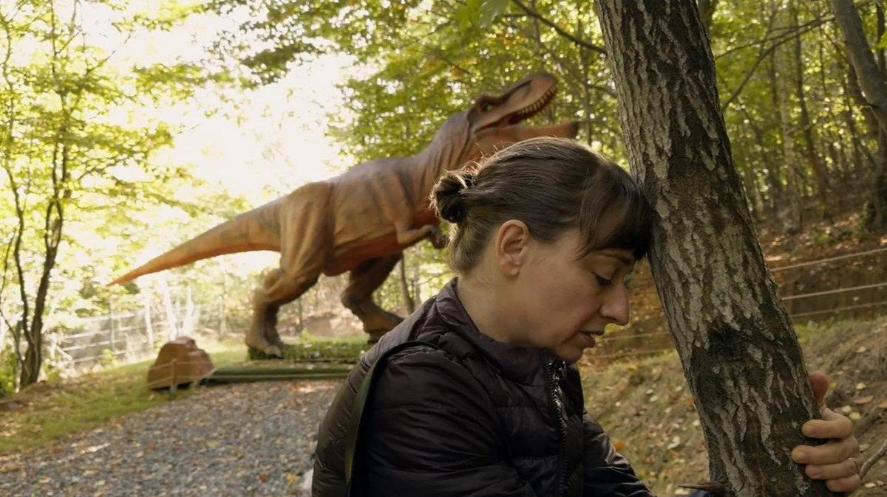

# Мечты о мире. Итоги Берлинале: от социальных драм — к розовощекому роману взросления и к вязанию

- **URL:** https://novayagazeta.ru/articles/2025/02/24/mechty-o-mire
- **Дата:** 2025-02-24
- **Автор:** Лариса Малюкова

## Мечты о мире

## Итоги Берлинале: от социальных драм — к розовощекому роману взросления и к вязанию

Кадр из фильма «Континент 25» Раду Жуде

В отсутствие явных лидеров награждения ждали без обычного интереса. К тому же выяснилось, что конкурсная программа довольно бледно отражала вызовы нынешнего бурлящего в разнообразных конфликтах социума.

Главной интригой оставался вопрос: что предпочтет Тодд Хейнс и его жюри: фильмы с социальной подоплекой или картины про мечты, которых в конкурсе было вдоволь?

Жюри выбрало две темы: мечты и истории материнства.

Поэтому «Континент 25» Раду Жуде получил лишь приз за сценарий. Умное и бескомпромиссное кино на самую из больных тем — тему вины. Однако в воронке простой истории, как это случается в картинах Жуде — концентрация болезненных для современного общества экзистенциальных тем и проблем, таких как процветающий моральный релятивизм, незажитые раны политических «переделов мира», вновь проснувшегося национализма. И когда совершившую проступок румынку венгерского происхождения хейтят в румынской Сети, ее именуют «венгерской шлюхой». Да и ее внутренние конфликты связаны с историческим прошлым венгерской Трансильвании, переданной когда-то Румынии. И все эти геополитические темы связываются жгутом в сердце одной травмированной своей необъяснимой виной женщины. Но само это ощущение вины становится для нее прорывом сквозь привычные стены обывательского бытования — к человечности, признаком которой оказывается больная совесть.

Кадр из фильма «Континент 25» Раду Жуде

Полностью проигнорировало жюри и картину «Мечты» Мишеля Франко. В любовный роман, рвущийся по живому, авторы зашили социальную метафору — взаимоотношений Америки и Мексики. Сделано это хотя и плакатно, но ярко и убедительно.

Жюри выбрало совсем другие, более розовощекие, как сотканные из мягкой шерсти, «Мечты» норвежского режиссера Дага Йохана Хаугеруда, который наконец победоносно завершил свою трилогию («Секс/Мечты/Любовь») и получил «Золотого медведя». Новая глава — о том, о чем в России писать нельзя. Скажем так, о 17-летней библиофилке, мечтательной Йоханне, рассматривающей облака как души людей, которая буквально теряет свою облачную голову, аппетит и здоровье, увидев предмет обожания. И когда через год бабушка Йоханны — в прошлом известная поэтесса — прочитает рукопись первого романа-исповеди, эротичного и тактильного, а затем даст почитать маме… У взрослых возникнут вопросы.

Сюжет, который размывает границу между реальностью и воображением подростка, между меланхолией и юмором. Получился обаятельный роман взросления.

Когда юность влюблена в саму любовь. На пресс-конференцию и фотоколл актрисы и режиссер пришли с вязанием, у которого в фильме своя важная роль.

Кадр из фильма «Мечты»

Из множества фильмов про страдания и проблемы материнства — прежде всего, психологические (одна из любимых сегодня феминистских тем) — жюри выбрало самый яркий фильм с провокационным названием «Если бы у меня были ноги, я бы тебя пнула» американки Мэри Бронштейн. Роуз Бирн, получившая награду за лучшую роль (с некоторых пор в Берлине не делят актеров по гендеру), играет мать больного ребенка, с которым постоянно общается. При этом на протяжении всего фильма мы этого ребенка не видим. В кадре — героиня Бирн — сверхкрупно. Ее изменчивое лицо и становится отражением нервного срыва. Да и все окружающее ее пространство, в том числе гигантская черная прореха в потолке, скорее всего — отблеск этого искаженного болью восприятия, когда весь мир сгущается в личный экзистенциальный ад, а драма превращает в хоррор. Маленькую дочь героини Бирн мы увидим только в финале — как катарсис, свет в этой темной истории. Прекрасная экспериментальная работа актрисы, скорей всего, ее не минет оскаровская номинация.

Кадр из фильма «Если бы у меня были ноги, я бы тебя пнула»

«Голубая тропа» режиссера Габриэля Маскаро получила Гран-при жюри. Антиэйджистская утопия про побег-путешествие одной бабушки в новую жизнь из «рая дожития». Маскаро — один из известнейших бразильских режиссеров. Обладатель множества наград, в том числе «Венецианских горизонтов» (за фильм «Неоновый бык»).

Его четвертый фильм — микс антиутопии и притчи. 77-летнюю Терезу (Дениз Вайнберг) отправляют сначала на пенсию (с миленькой фермы, где она занимается переработкой «миленьких» аллигаторов), а потом — в колонию для стариков.

Как поет из всех чайников пропаганда: самый прекрасный рай дожития.

Поддержите нашу работу!

1000 500 300 Нажимая кнопку «Стать соучастником», я принимаю условия и подтверждаю свое гражданство РФ

Если у вас есть вопросы, пишите [email protected] или звоните:+7 (929) 612-03-68

Стариков с почетом запихивают в памперсы, выдают нарядные рюкзачки и… полный назад. Старикам здесь не место. Тереза, мечтающая о полете на самолете, хотя бы на частном, не может без разрешения дочери купить билет. Ее документы проверяют ежечасно. Непослушных стариков грузят в открытые автозаки и увозят… в рай, откуда не возвращаются. Зачем мешать молодым жить их жизнь?

Но у Терезы свои планы на будущее. И в этих планах как раз все наоборот: не заканчивать, а начинать жизнь. Она заведет себе прекрасную бой-подругу (шарлатанку в летах, продающую Библии прямо со своей лодки), найдет себе дом на воде, сыграет «по-крупному». И научится уважать себя, свои желания, свое ощущение свободы.

Кинопутешествие мимо экзотических берегов Амазонки напомнит и «Фицкарральдо» Херцога, и отдаленно — «Аталанту» Виго,

но Маскаро сгущает краски: умопомрачительные пейзажи тропиков и «королевы рек» Амазонки чередуются с бедными кварталами и убогими деревнями, сюрреалистическим кладбищем из стекловолокна, заброшенным парком развлечений. Не только красоты, поэзия, но и темперамент настроенных на жизнь героинь растопят мрак антиутопии про разновидность тоталитаризма — надеждой.

В пандан этим поощренным жюри мечтам — еще одна. Эстетская «зимняя сказка» для взрослых «Ледяная башня» с великолепной дивой грез, снежной королевой Марион Котийяр, которая играет кинодиву в роли королевы из льда. На киносъемки в далекие 70-е попадает 60-летняя девочка из приюта (Клара Пачини). И не может оторвать глаз от ослепительной исполнительницы роли Снежной королевы в сверкающем блестящем платье. Но тираническая дива, затворившая себя в «ледяной башне» отчужденности, требует от поклонницы безусловного подчинения. И в какой-то момент обе героини оказываются на краю жизни и ледяной смерти.

Кадр из фильма «Голубая тропа»

Режиссер Люсиль Хадзихалилович, двоюродная сестра Дэвида Линча и жена Гаспара Ноэ (он сыграл в фильме кинорежиссера), соединяет в одном сюжетном узоре фэнтези, драму и артхаусные приемы.

Авторы получили приз за выдающийся художественный вклад в создание фильма.

Читайте также

Человечество для всех

Берлинский кинофестиваль стал политической трибуной для тех, кто понимает, что прежний порядок рушится

Российских картин на фестивале не было. Было много украинских фильмов — практически во всех секциях. Среди них самым чувственным высказыванием мне показался фильм «Когда над морем вспыхнет молния» Евы Нейман из программы «Форум». Документальная трагикомедия, по интонации близкая духу кино Киры Муратовой — о жителях нынешней Одессы. Несколько исповедей сегодняшних одесситов, словно реинкарнация персонажей муратовских картин: с их причудами, переживаниями, страхами, мечтами. Пышнотелая повариха из Абхазии, без устали шинкующая, режущая, взбивающая, вспоминает свою счастливую семью, своего сына, которого давно не видела. Еврейская бабушка рассказывает, как в детстве ей повезло: ее не расстреляли фашисты.

Блеклая морщинистая вдова кормит беспризорных котов, и ее дом с фотографиями близких и кошками на диване чем-то напомнил мне квартиру Киры Георгиевны Муратовой.

Глубокомысленный пьяница изрекает банальности про «жизнь продолжается». Но центр фильма — мальчишка, уличный философ, мечтающий устроить пир на весь мир. И чтобы была огромная пицца. И шоколадный торт. И можно было загадать любое желание, которое обязательно исполнится, «когда над морем вспыхнет молния». А все плохое, что сейчас происходит, — просто дурные сны. Калейдоскоп впечатлений и людей, складывающийся в пеструю ленту жизни под обстрелами. И долгий ночной кадр: темный-темный дом под звуки ночной тревоги и пробегающие маленькие лучи света фонариков спасающихся людей.

Лариса Малюкова ведет телеграм-канал о кино и не только. Подписывайтесь тут.

### Этот материал входит в подписки

Смотровая площадкаКино с Ларисой Малюковой

Культурные гидыЧто читать, что смотреть в кино и на сцене, что слушать

### Добавляйте в Конструктор свои источники: сайты, телеграм- и youtube-каналы

Войдите в профиль, чтобы не терять свои подписки на разных устройствах

Поддержите нашу работу!

1000 500 300 Нажимая кнопку «Стать соучастником», я принимаю условия и подтверждаю свое гражданство РФ

Если у вас есть вопросы, пишите [email protected] или звоните:+7 (929) 612-03-68
