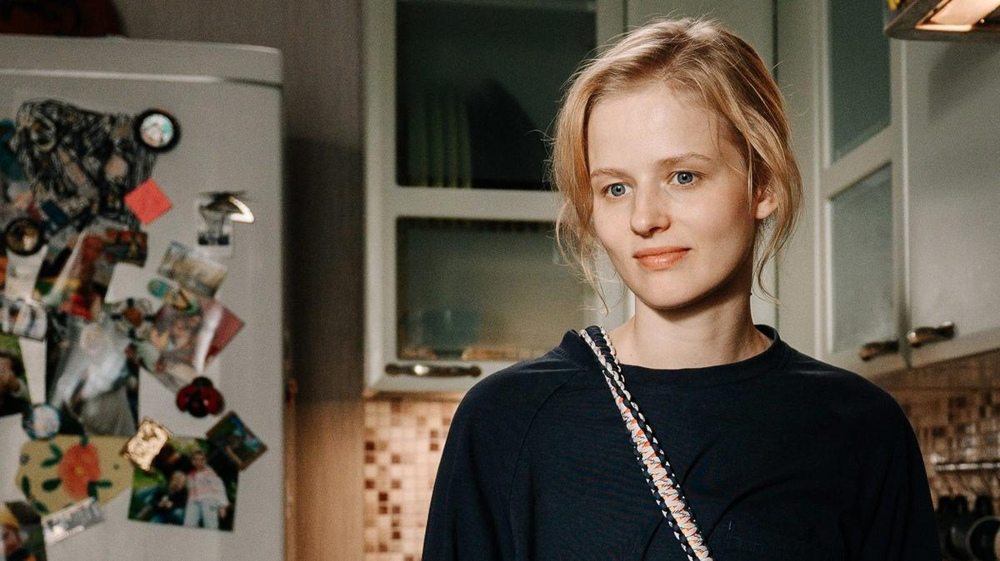

# Триумф жизни и ее хрупкость. На экраны выходит сериал «Между нами химия» — кино не про болезнь. Про любовь

- **URL:** https://novayagazeta.ru/articles/2025/03/06/triumf-zhizni-i-ee-khrupkost
- **Дата:** 2025-03-06
- **Автор:** Лариса Малюкова

## Триумф жизни и ее хрупкость

## На экраны выходит сериал «Между нами химия» — кино не про болезнь. Про любовь

Кадр из сериала «Между нами химия». Источник: Кино-Театр.Ру

Сериал — дебют Карины Чувиковой, выпускницы киношколы «Индустрия». «У нас собака появилась. Марта с парнем целовалась. У меня рак. Вот и все новости к этому часу».

Таня (Саша Бортич) — таксистка. Вдова. Воспитывает двоих детей, по ночам вывозит сильно выпивших мужчин с тусовок. В общем, молодая женщина без иллюзий. Порой она с детьми выходит на крышу и устраивает под пиццу сеанс связи с их отцом. Потому что папа — суперсекретный галактический исследователь, изучает фотосинтез. Избран из миллиона человек для спецпрограммы. Марта (дочь-подросток), в отличие от своего младшего брата Вани, разумеется, не верит в эту «кринжатину». Но ради мамы… ок, в общем, налаживает контакт с космосом.

И — как это бывает — внезапно обустроенный мир Тани рушится: ей объявляют страшный диагноз. Это же поразительно: тебе выносят приговор… А вокруг все продолжается, как ни в чем ни бывало: выпившие клиенты, уроки детей и их мечты о каникулах на море.

Вроде бы пора убиваться, но есть вопрос, который надо срочно решить: с кем останутся дети, если болезнь окажется сильнее? Возможно, времени мало, значит, следует торопиться и за год найти себе приличного мужа и отца дочке и сыну. Есть, конечно, и вероятные опекуны: меркантильная и елейная до тошноты старшая сестра (Нелли Уварова) с мужем — яростным подкаблучником (Павел Ворожцов). Друзья? Кажется, они не готовы. Начинается бег по кругу: онкоцентр, работа, дом… и свидания. Таня теперь иначе смотрит на мужчин, с которыми ее сталкивает жизнь: на мудрого и спокойного лечащего врача Дмитрия Олеговича (Евгений Сангаджиев), на отзывчивого «замечательного соседа» (Кузьма Котрелев), на «первого встречного-поперечного» — из дейтингового приложения вроде «Знакомства.ру» (Илья Лыков) и, наконец, на товарища по несчастью из онкоцентра (Никита Ефремов — в роли с секретом).

Этот зашкаливающий по эмоциям квест сложен профессионально и живо в духе лучших роковых драм: от «Сладкого ноября» до «Третьей звезды» (вспоминается и руминовская картина «Я буду рядом», завоевавшая приз «Кинотавра»). Карине Чувиковой удается найти баланс между трагедией и иронией, неизбежностью и надеждой, а в душное пространство болезни, боли и страха впустить воздух и даже смех. Авторы (сценаристки Карина Чувикова, Юлия Гулян («Ника») и Евгения Хрипкова («Звоните ДиКаприо!») не закрывают глаза на острые углы проблемы (решаемой ли — большой вопрос). Они не обманывает зрителя, раскрашивая трагическую тему розовыми красками, не давят на слезные железы. Не боятся смеха. Ну да, порой сквозь слезы. При этом к самой теме онкологии подходят бережно, деликатно.

Кадр из сериала «Между нами химия». Источник: Кино-Театр.Ру

В итоге получается кино не про химиотерапию и про «химию» между близкими. Про триумф жизни и ее хрупкость, про зыбкие миражи, из которых шьют паруса надежды. Даже когда надеяться не на что.

Без Саши Бортич это была бы совсем другая история, не столь экспрессивная, тактильная. Бортич при ее природной органике не боится ярких эмоциональных всплесков. Она все время разная в перепадах настроения. Уверенная и растерянная, раздраженная и смиренная, из тех баб, что «в горящую избу…», и теряющая самообладание.

Кадр из сериала «Между нами химия». Источник: Кино-Театр.Ру

Поддержите нашу работу!

1000 500 300 Нажимая кнопку «Стать соучастником», я принимаю условия и подтверждаю свое гражданство РФ

Если у вас есть вопросы, пишите [email protected] или звоните:+7 (929) 612-03-68

Она пытается услышать совет, который дает ей «опытный» онкобольной, герой Никиты Ефремова: «Надо думать не про смерть, а про жизнь, не убиваться о потенциальных сиротах, а быть с детьми».

И в какой-то момент становится ясно, что Саша ищет спасения не только в капельницах, но прежде всего в любви. И космос, на связь с которым она регулярно выходит с пиццей, не может ей не ответить.

«Кастинг был очень долгий, на главную роль много кого смотрели, — признается режиссер. — Когда пришла Саша Бортич, все встало на свои места, история заиграла по-новому. Мы писали историю хорошей матери, попавшей в плохую ситуацию. Надеемся, что зрители увидят в ее приключениях интересные им темы».

Читайте также

Если я умру, кто-то скажет ту-ру-ру

На фестивале Original + показали новые сериалы, которые мы увидим в ближайшее время. А может, и не в самое ближайшее. Время сегодня такое — лучше не загадывать

«Между нами химия» — врачующий курс терапии. И люди разговаривают здесь, как люди. Ищут лекарство от тоски, отчаяния и панических атак в… фастфуде, ведерке с мороженым, разговоре по душам. Даже если он происходит во время химиотерапии.

На III фестивале онлайн-кинотеатров «Новый сезон» сериал взял призы в двух категориях: Чувикова была признана открытием смотра, а исполнившая главную роль Саша Бортич стала лучшей актрисой фестиваля.

До обучения в киношколе «Индустрия» Карина Чувикова окончила Санкт-Петербургский политех по специальности «государственное и муниципальное управление», работала на «Лендоке», управляющей в магазине.

Лариса Малюкова ведет телеграм-канал о кино и не только. Подписывайтесь тут.

### Этот материал входит в подписки

Смотровая площадкаКино с Ларисой Малюковой

Культурные гидыЧто читать, что смотреть в кино и на сцене, что слушать

### Добавляйте в Конструктор свои источники: сайты, телеграм- и youtube-каналы

Войдите в профиль, чтобы не терять свои подписки на разных устройствах

Поддержите нашу работу!

1000 500 300 Нажимая кнопку «Стать соучастником», я принимаю условия и подтверждаю свое гражданство РФ

Если у вас есть вопросы, пишите [email protected] или звоните:+7 (929) 612-03-68
