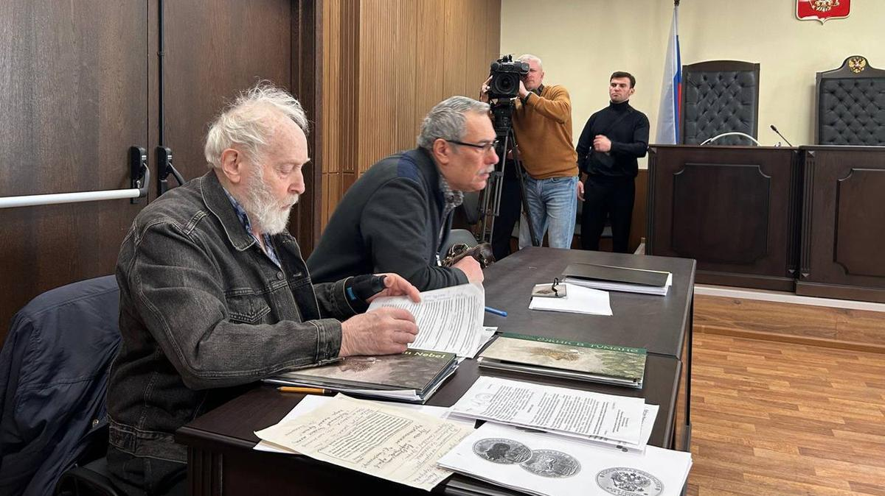

# Положь Ёжика! Режиссер Норштейн пришел судиться с Центробанком, который начеканил его персонажа на монетах

- **URL:** https://novayagazeta.ru/articles/2025/03/11/polozh-iozhika
- **Дата:** 2025-03-11
- **Автор:** Лариса Малюкова

## Положь Ёжика!

## Режиссер Норштейн пришел судиться с Центробанком, который начеканил его персонажа на монетах

Адвокат Виктор Михайлович Осипов и режиссер Юрий Борисович Норштейн в суде. Фото: Лариса Малюкова / «Новая газета»

В Мещанском суде состоялось слушание дела по иску Франчески Ярбусовой к Центробанку, выпустившему монеты с изображением ею созданного персонажа «Ёжика в тумане». Монет было выпущено много. Одних только серебряных — 700. И под миллион — менее ценного значения. Интересы художницы Франчески представляли в суде адвокат Виктор Михайлович Осипов и режиссер Юрий Борисович Норштейн, который участвовал в создании легендарного героя легендарного фильма. Да не участвовал, он его и придумал на основе сказки Козлова, вместе с художником фильма Ярбусовой. Об этом процессе «рождения» Ёжика есть замечательные страницы в норштейновской фундаментальной дилогии «Снег на траве».

В чем суть конфликта. Режиссер возмущен тем, что монеты выпущены без согласования с авторами (их даже в известность не поставили), мало того, в искаженном — по сравнению с оригиналом — виде.

Банк доказывает, что использовали кадр из мультфильма.

Но дело в том, что для облика Ёжика на монетах использован не кадр, а иллюстрация из книги Норштейна и Ярбусовой «Ёжик в тумане», изданной Фондом Юрия Норштейна после выхода мультфильма!

Это произведение живописи — рисунок Ёжика, окруженного мотыльками — акварель, по нанесенной белилами основе. Мягкий воздушный рисунок.

Поэтому истцы доказывают, что такого кинокадра в фильме нет.

Читайте ранее

«Если в краткой форме — воровство, плагиат, пошлость». Юрий Норштейн возмущен выпуском монет к 50-летию «Ежика в тумане»

Чтобы продемонстрировать, что ЦБ использовал не фрагмент мультфильма, а картинку из книги, Норштейн со своим оператором Максимом Граником сделали на прозрачном целлулоиде копию рисунка и наложили ее на эскиз монеты — практически полное совпадение. В мультфильме Ёжик совсем другой, он составлен из отдельных микродеталей — так устроена техника перекладки (чтобы двигать персонаж). Ракурса, положения персонажа, как на акварельном изображении, в самом мультфильме нет.

Еще одна проблема, с точки зрения авторов, как именно использовали оригинальный рисунок: персонаж развернули в другую сторону, была искажена цветовая гамма, мотыльков поменяли на более понятные звездочки. Да и лесок рядом: был сосновый, стал хвойный. Было сложно, стало проще.

Ни на монетах, ни на официальных материалах банка (на их сайте) нет указания имени настоящих авторов. То есть они есть, но другие.

Автором «реверса» монеты с изображением персонажа Ярбусовой значится некий А.Д. Щаблыкин. Видимо, он и изготовил объемное монетное изображение.

Представьте, если бы на гравюрах Дюрера значились имена гравировщиков. Скульптору помогают довести его скульптуру до окончательной формы рубщики, литейщики, камнетесы, увеличители, форматоры, чеканщики. Их имен в галереях и каталогах вы тоже не сыщете.

Из базы данных Банка России:

Поддержите нашу работу!

1000 500 300 Нажимая кнопку «Стать соучастником», я принимаю условия и подтверждаю свое гражданство РФ

Если у вас есть вопросы, пишите [email protected] или звоните:+7 (929) 612-03-68

«Выполненное в цвете изображение героя мультфильма «Ёжик в тумане», стоящего на холмике, изображение которого выполнено рельефом, на фоне выполненного в технике лазерного матирования пейзажа в тумане вверху слева по окружности — рельефная надпись «Ёжик в тумане»

Фото: сайт Центробанка

Представители банка объясняют, что они действовали в рамках лицензионного договора с «Союзмультфильмом», который они и считают единственным правообладателем. И в суде просили привлечения к процессу представителей «Союзмультфильма» в качестве третьей стороны.

Режиссер называет изображение на монетах плагиатом, обвиняя председателя правления ООО «Союзмультфильм» Юлиану Слащеву. По его словам, она создала организацию на базе одноименной киностудии и забрала права на всех персонажей от художников, которые внесли значительный вклад в развитие отечественной мультипликации.

«Союзмультфильм» давно уже доказывает свое право и на фильмы, и на персонажей. Руководство студии именует создание фильма и персонажа — «служебным заданием». Но в 1975-м — годе рождения «Ёжика в тумане» — о «служебных заданиях», по словам Юрия Борисовича, никто и не слыхивал. Была мука творчества, поиск уникального, единственного возможного живого изображения. Такого, чтобы и спустя полвека он казался современным, трогательным, мудрым и наивным как ребенок.

Исключительное право на изображение персонажа мультфильма «Ёжик в тумане», как доказывает адвокат Осипов, принадлежит истцу на основании законодательства, действовавшего в период создания мультфильма.

Большой вопрос, признают ли Франческу Ярбусову автором изображения. Будет ли удовлетворен иск о компенсации морального вреда и исключительного права авторов (двухкратная стоимость контрафактных материалов). Но ясно одно — будут еще судебные заседания: банк против художника, студия против режиссера, снискавшего славу российской анимации во всем мире. И «Союзмультфильму» тоже.

Странно, правда? И это в юбилейный год одного из прекраснейших анимационных творений. Не случайно «Ёжик в тумане» в результате опроса 140 мультипликаторов и критиков из разных стран занял первую строчку в списке «лучших мультфильмов всех времен и народов».

### Этот материал входит в подписку

Судовой журналГромкие процессы и хроника текущих репрессий

### Добавляйте в Конструктор свои источники: сайты, телеграм- и youtube-каналы

Войдите в профиль, чтобы не терять свои подписки на разных устройствах

Поддержите нашу работу!

1000 500 300 Нажимая кнопку «Стать соучастником», я принимаю условия и подтверждаю свое гражданство РФ

Если у вас есть вопросы, пишите [email protected] или звоните:+7 (929) 612-03-68
