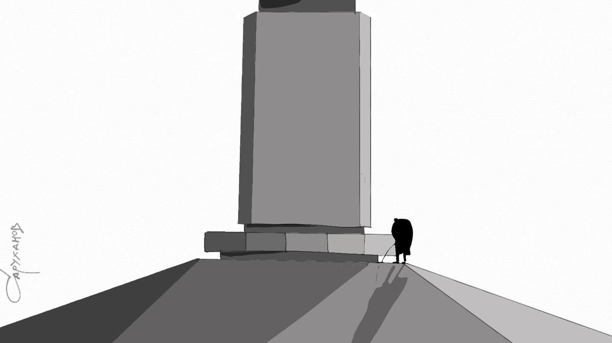

# Плоские утехи. Эго Сарика Андреасяна задевает не гениальность Тарковского, а то, что кому-то не нравится пошлость и пустота. Послесловие к конфликту

- **URL:** https://novayagazeta.ru/articles/2025/03/18/ploskie-utekhi
- **Дата:** 2025-03-18
- **Автор:** Лариса Малюкова

## Плоские утехи

## Эго Сарика Андреасяна задевает не гениальность Тарковского, а то, что кому-то не нравится пошлость и пустота. Послесловие к конфликту

Петр Саруханов / «Новая газета»

Вокруг скандальных заявлений Сарика Андреасяна (фильмы «Беременный», «Защитники» и «Онегин») на встрече со студентами Московской международной киношколы продолжает закручиваться вихрь не менее скандальных реакций. Депутат Госдумы Гусев предложил пересмотреть финансирование фильмов Андреасяна, «ненавидящего фильмы Тарковского всеми фибрами своей армянской души». А студентам, говорят, потом досталось за «дебош».

Хотелось бы пройти мимо этого случая, который скорей всего забудется уже завтра, с выходом очередной картины братьев Андреасянов, которые, кстати, в основном за свой счет, окучивают популярные бренды из разных эпох: от Пушкина до Чикатило, от «Домовенка Кузи» до «Денискиных рассказов» и «Простоквашино». Они уже подступились к «Сказке о царе Салтане» и даже к «Войне и миру» («на серьезных щах» конкурируя с Урсуляком).

А помимо этого — развлекающих аудиторию всеми возможными незатейливыми способами, вроде «Жизни по вызову».

Но, как мне кажется, это история не про конфликт коммерции и искусства.

Благодаря шумному скандалу именно Сарик Андреасян, назвавший апологетов авторского, фестивального кино «нищими, кончеными, блюющими кинематографистами», оказался символом процветающей сегодня в российском кинематографе разноцветной пошлости, которую, по мнению разнообразных создателей, «пипл хавает».

Сарик Андреасян. Фото: телеграм-канал Сарика Андреасяна

Этот кинематограф, заполнивший афишу, не призывает к размышлению, дискуссии, анализу действительности. Напротив: отвлекает, ублажает, щекочет пятки. Но прежде всего упрощает, приводит к общему знаменателю смыслы, формы, самого человека. Сводит его к простой формуле. И в этом своем стремлении пошлость всегда способствует фашизации общества, торжеству агрессивной посредственности и убивающей все непохожее усредненности. Процветает не уникальный художник, а ремесленник, востребован не думающий штучный зритель, а массовый, легко манипулируемый человек, серая масса гогочущих над незамысловатыми шутками послушных подчинению «потребителей».

По Ушакову, «пошлость равна заурядности, низкопробности в духовном, нравственном отношении, чужда высшим интересам и запросам». Может ли заурядность, невежество быть успешным? Еще как. Зачем школьнику перечитывать «Евгения Онегина», заучивать монолог мучающейся сомнением и тайным, непозволительным чувством Татьяны. Когда можно посмотреть фильм «Онегин», расправившийся с пушкинским ямбом. Авторы переписали роман, превратив в просторечную и глянцевую «библию для детей» — с бильярдом, няней, «папенькой с маменькой» и Татьяной Дмитриевной Лариной — нарядной дамой в летах. После показа вспомнился булгаковский поэт Рюхин и его отчаянный монолог возле памятника Пушкину: «Что он сделал? Я не постигаю. Что-нибудь особенное есть в этих словах: Буря мглою? Не понимаю!.. Повезло, повезло! Стрелял в него этот белогвардеец Дантес и раздробил бедро и обеспечил бессмертие».

Фильм «Онегин» популярен, как легкое костюмное шоу, сладкая газировка, он попсово иллюстративен, лишен мук глубины, парадоксов. Да и острозаточенных летящих пушкинских рифм заодно. «Талант — единственная новость»? К чему удивлять, раздражать новациями. Есть проверенный короткий путь к успеху, мгновенному легкому удовольствию. Как сонм разнообразных «содержанок», который хлынул на платформы из всех продакшнов.

Пошлость напориста, посконна, заурядна и низкопробна, при этом одержима славой и деньгами, как облезшая пиковая дама. Надень парик, живи на яркой стороне!

Читайте также

Итак, она звалась Татьяна Дмитриевна

Сарик Андреасян переработал пушкинского «Онегина» в просторечную и глянцевую «Библию для детей» — с бильярдом, няней и «папенькой с маменькой»

Поддержите нашу работу!

1000 500 300 Нажимая кнопку «Стать соучастником», я принимаю условия и подтверждаю свое гражданство РФ

Если у вас есть вопросы, пишите [email protected] или звоните:+7 (929) 612-03-68

У Набокова есть лекция под названием «Пошляки и пошлость» («Poshliaki and poshlost»). Не только про неприкрытую бездарность, но главным образом про «ложную, поддельную значительность, поддельную красоту, поддельный ум, поддельную привлекательность».

Происходит подмена. Фальшь именуется чистым звуком, подделка — искусством. Пошлость сдвигает оптику во взгляде на мир, историю, культуру, язык. Стирает границы между ложью и правдой. Утверждая первенство серости, штампов, комфорта, ведет к пустоте.

Возник уже целый отряд режиссеров, снимающих под видом комедий и драм — пустоту. И многие зрители с удовольствием за собственные деньги эту пустоту смотрят. «Никогда не бывает моды на пошлость, тупость и бескультурье, — утверждает американская писательница Джулиана Вильсон, — но всегда находятся те, кто приучен восторгаться посредственностью».

Оригинальное уникальное искусство — неудобно, некомфортно, труднодостижимо, к нему надо пробиваться. Пошлость — пафос очевидности.

На протяжении всей жизни Набоков доказывал, что понятие пошлости — одновре­менно эстети­ческое и моральное.

Пошляк всегда с гонором, завышенным мнением о себе и своих «продуктах» (в частности, о популярности своих фильмов, книг). Пошлость лавинообразно самодовольна. Не лишена цинизма, любит быть обласканной властью, не терпит критики. Тогда она ощеривается и нападает, причем использует проверенные временем идеологические клише как средство массового поражения или доноса: «Именно эти киношколы, — настаивает Сарик Андреасян, — воспитывают тех самых либералов, которые ненавидят свою страну и пытаются провоцировать любого, кто мыслит не так, как им рассказали. Тарковский в помощь, ребята!»

В подобных всплесках обнажается не безобидность, но агрессия.

Среди признаков фашизма, перечисленных Умберто Эко, отрицание сути культуры, которая логично связывалась приверженцами автократии с критическим мышлением. Поэтому брат пошлости — популизм, формирование образа врага.

Пошлость наступательна, окрашена ревностью к прорывам подлинного искусства, которое именует «деградирующим кинематографом». Своих же критиков она мгновенно обвиняет в порочном мировоззрении, которое «мешает нам строить сильное государство». Прочь авторское мрачное кино, связанное с реальной болью общества, «вся эта ваша чернуха». Будем воспевать исключительно светлое, под барабанный бой и зов трубы «Защитников».

Как любил повторять Петр Наумович Фоменко: «Пошлость, как чума — проникает всюду, в том числе и в театры…»

В том числе и на экран. Конъюнктура, сэр, — ничего личного.

### P.S.

На встрече со студентами МШК (Московская школа кино) я поинтересовалась их отношением к этому конфликту. Мнения были разные, но в итоге выступающие сошлись на том, что творческая несостоятельность переваривается в яд ненависти, а корни разногласий — в плохо скрываемой зависти гению.

Читайте также

«Онегин», добрый мой пират

Данные кинопроката и списки «запрещенки» в кино многое говорят о российском зрителе

Поддержите нашу работу!

1000 500 300 Нажимая кнопку «Стать соучастником», я принимаю условия и подтверждаю свое гражданство РФ

Если у вас есть вопросы, пишите [email protected] или звоните:+7 (929) 612-03-68
