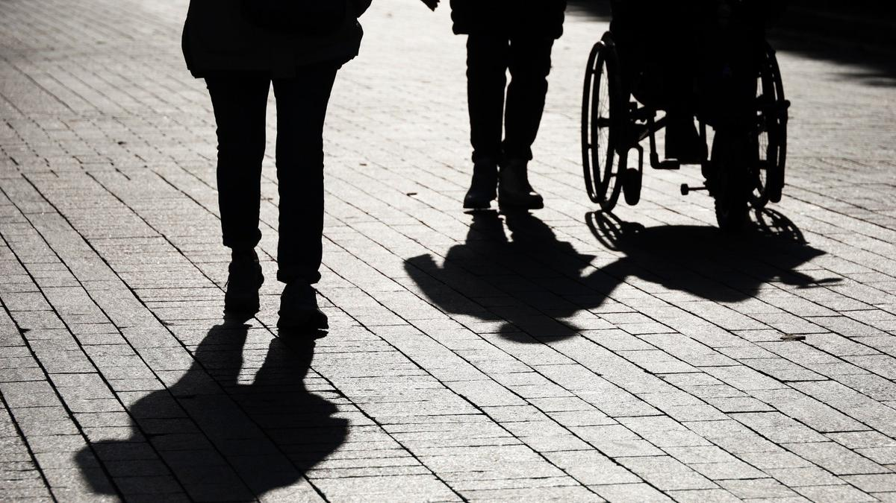

# Вне зоны доступа. Несмотря на распоряжение правительства, театры и концертные залы так и не стали безбарьерной средой

- **URL:** https://novayagazeta.ru/articles/2025/03/25/moskva-vne-zony-dostupa
- **Дата:** 2025-03-25
- **Автор:** Лариса Малюкова

## Вне зоны доступа

## Несмотря на распоряжение правительства, театры и концертные залы так и не стали безбарьерной средой

Фото: Олег Елков / ТАСС

Все начиналось празднично и красиво. Солист оркестра «Новой оперы» пригласил нас с подругой на спектакль. В «Новой опере» давали «Аиду». Отличные (почти все) голоса. Прекрасный хор, у которого прописана своя трагическая роль. Вместо декораций — песчаная анимация (временами хромающая по вкусу). Но не в этом дело.

Я очень люблю «Новую оперу» — один из самых молодых музыкальных театров Москвы. Сильная труппа, замечательные дирижеры. Новейшая в стиле ар-нуво дворцовая архитектура: нарядное, с впечатляющими витражными стеклами фойе, лестница из итальянского мрамора и прочие изыски и фонтаны. Театр прекрасно вписался в старинный и атмосферный сад Эрмитаж с кружевом беседок.

Моя подруга Маша — известный адвокат. Из-за настигшей ее болезни больше 10 лет в инвалидном кресле. И это никак не мешает ее активной жизни в разных странах, в том числе театральной. Мир все больше предоставляет людям с ограниченными возможностями творческой и мобильной активности, помогает не опускать руки. Уже много лет существует фестиваль «Кино без барьеров» о насыщенной жизни людей с инвалидностью.

Но никогда еще посещение театра не было столь унизительно.

Нас радушно встретили служители театра, но вскоре выяснилось, что человеку в коляске нельзя попасть в зрительный зал! То есть можно проехать за дверь и остаться у входа, в таком длинном полуосвещенном «тамбуре».

И то после того, как войдут все зрители. Ну, чтобы им не мешать. И дальше лицезреть узкий край сцены. И чувствовать себя совершенно отрезанным от действия, к которому подключены все остальные.

В зал из фойе ведут всего несколько ступенек!

Но «не положено». Кем? Зачем?

Театр, таким образом, исключил колясочников из своих зрителей.

Фото: соцсети

Правда, на сайте мы нашли вот такое пояснительное объявление: «К сожалению, здание нашего театра не обеспечивает полную физическую доступность для людей с двигательными особенностями. Просим зрителей, использующих специальные средства передвижения (инвалидные коляски или скутеры), при планировании визита в театр обязательно обратиться в Службу главного администратора по телефону <…> для планирования размещения специального средства передвижения в партере зрительного зала Театра».

Простите, размещения где? В партере? Но нам только что объяснили, что это воспрещено.

Какая-то вопиющая дискриминация. И эйблизм. При всей нарядности театра и видимой любезности его сотрудников.

Этот вроде бы частный случай обнаружил гигантскую брешь столицы с ее продвинутыми «культурными учреждениями». После поста в соцсетях (в том числе в запрещенных) мне пишут колясочники:

- «С тем же столкнулись и на новой сцене Мариинки. Кресло скатывали на глазах изумленной публики…»
- «Большинство московских театров не оборудовано для инвалидов.
- Оборудованы лишь совсем новые, как, например, «Геликон-опера». Почему журналистов так мало интересует эта тема?»
- «Мы тоже часто бываем на культурных мероприятиях. Увы, многие учреждения культуры, театры и концертные залы не приспособлены для людей с ограниченными возможностями. Положительным является лишь тот факт, что люди всегда готовы приходить на помощь…»
- «Лет десять назад была акция колясочников — они подъезжали большой группой к тем зданиям, где все было так, как описано у вас. Видимо, есть какая-то структура, которая их объединяет и помогает. Надо ее подключить к решению вопроса».
- «Вот что любопытно: как театр прошел экспертизу по доступной среде?»

Согласно закону «О социальной защите инвалидов в Российской Федерации» гражданам должен быть обеспечен беспрепятственный доступ к объектам социальной инфраструктуры. Провести вечер в театре по-человечески хотели бы многие — удается далеко не всем. Но даже если малоподвижный человек, преодолев все препоны, доберется до театра, не факт, что его пустят в зрительный зал.

Пишут мне в личных сообщениях и представители театров. Правда, просят не публиковать имена. Оказывается, не в их компетенции осилить проблему.

Поддержите нашу работу!

1000 500 300 Нажимая кнопку «Стать соучастником», я принимаю условия и подтверждаю свое гражданство РФ

Если у вас есть вопросы, пишите [email protected] или звоните:+7 (929) 612-03-68

Хотя своими силами некоторые из директоров организовывали экспертизу, приглашали специалистов по безбарьерным пространствам, во многих театрах есть готовые экспертные заключения и рекомендации общественных организаций. Необходимо лишь решение властей, в частности Департамента Москвы по культуре. Необходимы желание и воля урегулировать этот не такой уж нерешаемый вопрос.

Мы так много читаем и слышим про развитие в столице доступной среды для инвалидов. Доступная среда — государственная программа, призванная облегчить жизнь маломобильных людей, предоставляющая им возможность максимально интегрироваться в общество, утвержденная постановлением Правительства Российской Федерации от 29 марта 2019 г. № 363.

Фото: Дмитрий Духанин / Коммерсантъ

При этом в реальности мизерное количество театров и концертных залов в Москве, спроектированных или построенных ранее 2007 года, имеет безбарьерную среду для зрителей с ограниченными возможностями. Формально эта норма обязательна для залов (и иных общественных пространств) только с 2005 года. Но практика показывает, насколько несложно адаптировать общественные зоны и зрительные залы для инвалидов-колясочников. Установить накладные рельсы на лестницах, поставить автономные подъемники или подъемно-опускные площадки, пандусы, специальные поручни. Сделать вход в театр с уровня тротуара.

Полагаю, что толковые архитекторы могли бы предложить массу красивых, а главное, правильных решений. При реконструкции Большого театра, например, были учтены требования архитектурной доступности: установлены пандусы, оборудованы специальный вход и подъемник в гардероб, места в амфитеатре и съемные кресла в партере для колясочников и инвалидов по зрению.

Мы написали письмо мэру о том, что в московских театрах в реальности нет «Доступной среды» для людей с инвалидностью и просим решить эту проблему социального неравенства. Ждем ответа.

### Этот материал входит в подписку

Смотровая площадкаКино с Ларисой Малюковой

### Добавляйте в Конструктор свои источники: сайты, телеграм- и youtube-каналы

Войдите в профиль, чтобы не терять свои подписки на разных устройствах

Поддержите нашу работу!

1000 500 300 Нажимая кнопку «Стать соучастником», я принимаю условия и подтверждаю свое гражданство РФ

Если у вас есть вопросы, пишите [email protected] или звоните:+7 (929) 612-03-68
