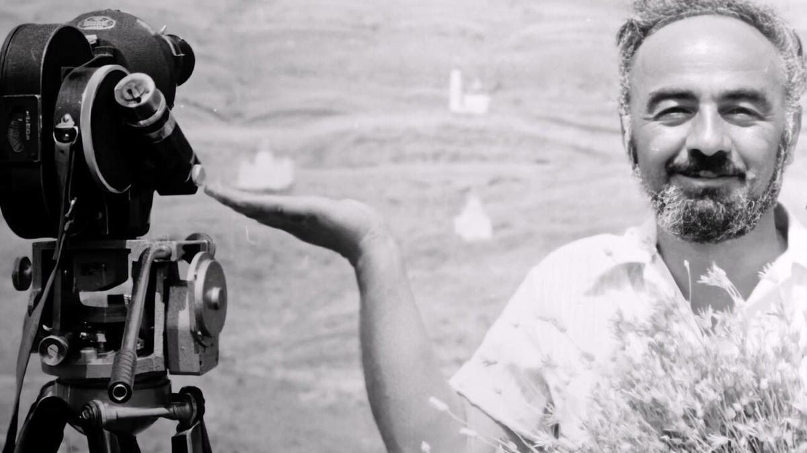

# Исповедь сиреневого ветра. Фильм Али Хамраева про Сергея Параджанова продолжает путешествие по миру

- **URL:** https://novayagazeta.ru/articles/2025/04/01/ispoved-sirenevogo-vetra
- **Дата:** 2025-04-01
- **Автор:** Лариса Малюкова

## Исповедь сиреневого ветра

## Фильм Али Хамраева про Сергея Параджанова продолжает путешествие по миру

Сергей Параджанов. Кадр из фильма

После мировой премьеры на Роттердамском кинофестивале его показ состоялся в Алматы. «Я не хоронил Параджанова», — говорит режиссер в самом начале фильма. А гроб с телом Параджанова плывет над многотысячной толпой в Ереване. Под высоким небом, которое он и называл домом. Как заметит Роман Балаян, этот человек никогда и не жил на земле. И вот уже сам Параджанов весело рассказывает о вполне себе драматичном земном детстве, как родители при обысках бриллианты прятали у него во рту. И сразу байка — как он был тенором и даже всерьез думал о певческой карьере. Все это почти правда, но перевязанная серебряной нитью его воображения, рассыпанная в природе его бурлескного дарования.

Фильм как исповедь замечательного режиссера Али Хамраева, как признание в любви к другу и гению, создающему творения без срока давности, существующему вне времени и пространства.

Али Хамраев. Кадр из фильма

С Параджановым Али Иргашалиевич общался и дружил с 1985-го, когда Хамраев принимал его в Ташкенте.

Армянин, родившийся в Тбилиси, учившийся в Москве, работавший в Киеве и Закавказье, классик украинского, грузинского, армянского кино. Художник мира, ломавший стереотипы и границы — между искусствами и странами.

Хамраев не снимает юбилейный байопик (в прошлом году мир отмечал столетие гения). Он просто собрал талантливых друзей, коллег и последователей: оператор Юрий Клименко, который снимал параджановскую «Легенду о Сурамской крепости» — предание персидской Грузии ХIII века, режиссеры и друзья — Роман Балаян, Ираклий Квирикадзе, Артавазд Пелешян, фотограф Юрий Мечитов (это его снимок — летящий Параджанов, превратившийся в символ), Андрей Хржановский. В дружеский круг мастеров входил и Андрей Тарковский. Это связь близких, которую не разорвать ни временем, ни арестом, ни смертью.

Кадр из фильма «Сиреневый ветер Параджанова»

Съемки почти без денег, камеру дал сын Балаяна. Через знакомых и соцсети отыскивали редкие фото, старые кадры, видеосъемки, уникальную хронику

(например, запись роттердамской пресс-конференции Параджанова в 1988-м, когда он впервые вырвался за границу после освобождения из тюрьмы).

Их воспоминания, байки самого Параджанова, хроника, анимация сшиваются в причудливый узор судьбы. Истории художника, не вписывающегося, выламывающегося за любые рамки, творящий свою судьбу по наитию, создающий параллельную душной реальности воздушную жизнь. Но и в эту жизнь вторгается травля, изгнание. Унижение. Невозможность работать. Тюрьма.

Разнообразные органы и организации запрещали фильмы, пытались стереть его самого в лагерную пыль. Но он был не похож на жертву системы, даже в тюрьме — в круге последнем — творил из мусора произведения искусства. Например, знаменитые параджановские таллеры. Он вырезал на кефирных крышечках профили великих предков: от Богоматери до Пушкина и Гоголя, превращал их в медальоны (теперь ими можно любоваться в ереванском Музее Параджанова). Один из таких медальонов попал в руки к Феллини. Он отлил по ней серебряную медаль, которая стала главным призом фестиваля в Римини. Ее вручали Милошу Форману, Марчелло Мастроянни.

Отлученный на многие годы от экрана, он и в тюремных условиях продолжал увлеченно рисовать и создавать коллажи.

Поддержите нашу работу!

1000 500 300 Нажимая кнопку «Стать соучастником», я принимаю условия и подтверждаю свое гражданство РФ

Если у вас есть вопросы, пишите [email protected] или звоните:+7 (929) 612-03-68

Кадр из фильма «Сиреневый ветер Параджанова»

Как оценить его влияние на кинематограф авторов бывших республик СССР? На того же Али Хамраева, ведь не случайно его философскую сказку «Человек уходит за птицами» обвиняли в параджановщине. В этой легенде столкновение поэзии и презренной прозы, полета мечты — и цинизма материальной выгоды.

Перед нами хроника со съемочной площадки легендарных «Теней забытых предков». Вот Параджанов показывает актрисе танец. И не останавливает съемки. Сам танцует… с камерой. Он напевает народную песню, вплетенную в партитуру «Теней», его руки взлетают, а он кружится, будто дервиш.

У него не было национальности. Мог бы снимать не только украинское, грузинское, армянское, но и французское, японское, иранское — всечеловеческое универсальное кино, превращающее каждый кадр в живопись. Какой у живописи язык?

Он говорил, что Бог един. И язык кино — всем понятен. У него не было возраста. Был мудрец и ребенок, для которого не существует пределов притяжения. И клоун.

Кадр из фильма «Сиреневый ветер Параджанова»

В фильме вспоминают историю, приезда Жоржа Помпиду с женой в Киев. Помпиду возжелал встретиться с Параджановым. А режиссер устроил целое представление. Когда гости подъехали к его пятиэтажке, вырубилось электричество, лифт не работал. Тут же подученные красавцы-гайдуки подхватили на руки жену Помпиду и понесли на пятый этаж.

На первый взгляд он был неунывающим, насмешливым и сентиментальным, а в действительности очень хрупким, уязвимым.

Есть в фильме рабочие кадры к «Исповеди», фильму, который мог стать для Параджанова его главным фильмом. Возвращением, как в «Амаркорде», к пепелищу детства. Элегией о потерянном рае. Даже состоялся первый съемочный день. Он же и последний. Здоровье было совсем разрушено.

Очевидцы рассказывают, что у него был целый мир в голове. Этот мир он и воспроизводил в кино. Просил звукорежиссера найти звук из XVI века — шорох и шепот сиреневого ветра.

### Этот материал входит в подписки

Смотровая площадкаКино с Ларисой Малюковой

Культурные гидыЧто читать, что смотреть в кино и на сцене, что слушать

### Добавляйте в Конструктор свои источники: сайты, телеграм- и youtube-каналы

Войдите в профиль, чтобы не терять свои подписки на разных устройствах

Поддержите нашу работу!

1000 500 300 Нажимая кнопку «Стать соучастником», я принимаю условия и подтверждаю свое гражданство РФ

Если у вас есть вопросы, пишите [email protected] или звоните:+7 (929) 612-03-68
