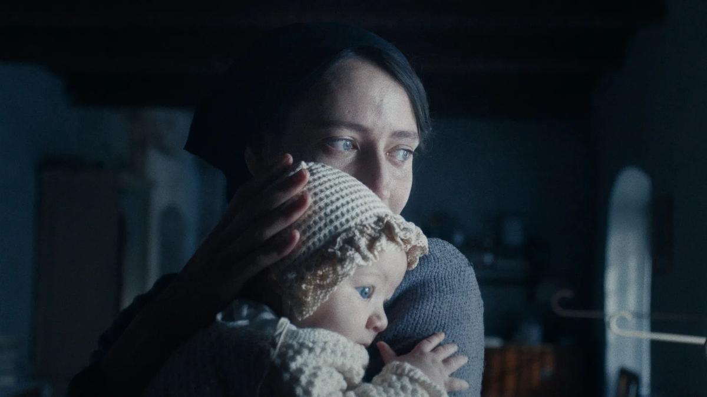

# Санта Лючия. На экраны выходит фильм «Горная невеста», завоевавший Гран-при Венецианского кинофестиваля

- **URL:** https://novayagazeta.ru/articles/2025/04/02/santa-liuchiia
- **Дата:** 2025-04-02
- **Автор:** Лариса Малюкова

## Санта Лючия

## На экраны выходит фильм «Горная невеста», завоевавший Гран-при Венецианского кинофестиваля

Кадр из фильма «Горная невеста»

Горячее молоко по утрам детям, степенный, суровый, отлаженный уклад семейного сумрачного дома учителя. Ослепительные горные пейзажи вокруг затерянной в Альпах итальянской деревни. Здесь всё и все буквально укутаны снегом.

1944-й. Гром войны не достигает этого ледяного царства. И деревня Вермильо по-прежнему живет в своем отдельном мире неизменных ритуалов, традиций. Перед Рождеством по улицам Вермильо, как всегда, на своем ослике проедет святая Лючия и раздаст детям нехитрые подарки. В будни Лючия (Мартина Скринци) — старшая дочь строгого деревенского учителя. Семья их живет трудно, едва сводя концы с концами. Недавно умер маленький брат Лючии, которого не сумели вылечить. Учитель решает, кого из трех дочерей отправить в школу, денег хватит на обучение только одной. С деньгами вообще туго: едва хватает на еду. Приходится делать ежедневный выбор: духовная пища или еда. Учитель, помимо истории, помогает детям услышать в минорных ноктюрнах Шопена, циклах Шуберта или «Временах года» Вивальди, как жарко пастуху на склоне горы в полдень, как горлица перещебетывается со щеглом, «увидеть-рассмотреть» все четыре времени года.

При этом самому образованному и строгому учителю не достает душевной тонкости, которой обладают его дочери или неспособный к учебе сын.

Кадр из фильма «Горная невеста»

Но однажды из снежного леса выйдут два дезертира — Аттилио (Сантьяго Фондевила), сын деревни, и Пьетро (Джузеппе Де Доменико), чужестранец, пришелец из Сицилии. Знакомство с Лючией перерастет в роман, роман — в брак. А потом случится долгожданный мир. И принесет одним счастье, возвращение сыновей домой, другим — беду. Пьетро придется уехать на родину, сообщить матери, что он жив. А для Лючии начнутся трудные времена.

Вторая полнометражная работа итальянского режиссера Мауры Дельперо (ее дебют «Материнский инстинкт» рассказывал о совсем юных мамах, живущих в религиозном приюте Буэнос-Айреса) вся построена на оппозициях: мир — война, свет — мрак, материальное — духовное. Ее новый фильм сравнивают с работами Аличе Рорвахер. Но если Рорвахер предпочитает магический реализм, вкрапления в обычную жизнь видимых и невидимых чудес, то

Дельперо насыщает реализм романтикой, соединяет грубую действительность (смерть ребенка, диктат учителя в его доме) с опоэтизированной любовной историей, оборванной вполне прозаически.

Кадр из фильма «Горная невеста»

В своей простой истории она не боится сложных вопросов и дилемм. На беглеца-дезертира Пьетро в деревне многие смотрят косо, у них дети тоже воюют. В местной таверне разгорается диспут. «Только трусы бегут от войны, — считают одни, — сопляки, прячутся за юбки мамы». «Вот бы все были трусами — тогда бы вообще не было войн», — парируют другие. Но, похоже, от войны, даже далекой, устали все. И Пьетро, неграмотный поэт, описывает состояние солдата: как будто ты жив… но не совсем. Его ближайший друг Чиро, выборочно расстрелянный в плену, упал рядом с ним. Его рука коснулась ботинка Пьетро, который успел зажмуриться. Но все видел с закрытыми от ужаса глазами. Сейчас Пьетро в классе для взрослых учится писать. Ему это жизненно необходимо, чтобы написать любовное признание Лючии. Для постановщицы и по совместительству автора сценария Мауры Дельперо история, рассказанная в картине, имеет особенное значение. «Этот фильм — проявление любви к моему отцу, его семье и их маленькому, затерянному в горах городку. Личная история, в которой выказана дань уважения коллективной памяти».

Кадр из фильма «Горная невеста»

Поддержите нашу работу!

1000 500 300 Нажимая кнопку «Стать соучастником», я принимаю условия и подтверждаю свое гражданство РФ

Если у вас есть вопросы, пишите [email protected] или звоните:+7 (929) 612-03-68

Фильм сравнивают и с «Маленькими женщинами» Греты Гервиг. Это тоже роман взросления. Три дочери учителя — три модели судьбы, три способа взять ответственность за свою жизнь в патриархальном социуме. Младшая — самая талантливая, схватывающая на лету знания о музыке, литературе. Ей и посчастливится продлить образование. Средняя, Ада, упорно учится, но знания ей даются с трудом. И отец оставит ее, разрешив уйти в монастырь. Старшая, Лючия, посмеет связать свою жизнь с дезертиром. Любить без оглядки… и будет ждать его писем после отъезда.

Главное достоинство этой размеренной, даже несколько затянутой картины — изображение, тщательно и продуманно вписанное в драматургию. В холодноватой серо-белой гамме — сдержанные по цвету тона и много-много снега.

Кадр из фильма «Горная невеста»

Кажется, что захватывающие горные пейзажи, заснеженные леса и просыпающаяся весной природа (в такт с темами Вивальди) — сама существует в конфликте с войной. Отвечает за это изобретательное головокружение оператор Михаил Кричман, который на протяжении многих лет работал с Андреем Звягинцевым. Он мастерски «управляет» светом. Темные живописные кадры семейных сцен внутри дома с давящими стенами — словно потемневшая от времени живопись. Они контрастируют с сиянием горных вершин.

Крупные планы в дрожащих отсветах пламени костра на снегу или свечей — запоминающиеся портреты. Самый поразительный кадр — молитва Ады: в одном кадре темень и свет. Как и в самой истории, столкновение живых страстей и боли людей с величественным безразличием гор и очень далекого зимнего солнца.

Лариса Малюкова ведет телеграм-канал о кино и не только. Подписывайтесь тут.

### Этот материал входит в подписки

Смотровая площадкаКино с Ларисой Малюковой

Культурные гидыЧто читать, что смотреть в кино и на сцене, что слушать

### Добавляйте в Конструктор свои источники: сайты, телеграм- и youtube-каналы

Войдите в профиль, чтобы не терять свои подписки на разных устройствах

Поддержите нашу работу!

1000 500 300 Нажимая кнопку «Стать соучастником», я принимаю условия и подтверждаю свое гражданство РФ

Если у вас есть вопросы, пишите [email protected] или звоните:+7 (929) 612-03-68
