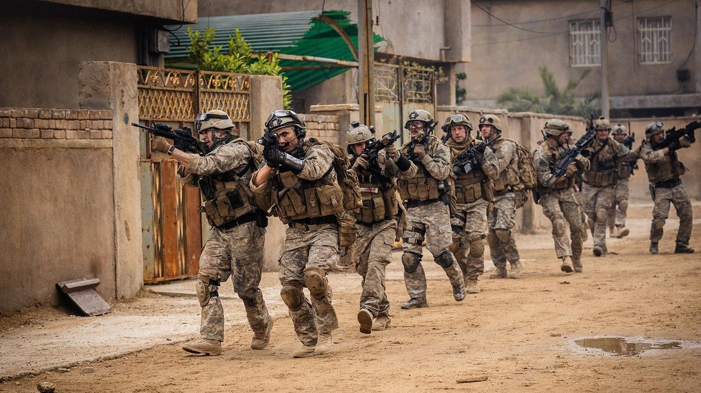

# Идите на кровь и дым. В прокате фильм «Под огнем» — беспощадный взгляд на войну без романтики и интриг

- **URL:** https://novayagazeta.ru/articles/2025/04/09/idite-na-krov-i-dym
- **Дата:** 2025-04-09
- **Автор:** Лариса Малюкова

## Идите на кровь и дым

## В прокате фильм «Под огнем» — беспощадный взгляд на войну без романтики и интриг

Кадр из фильма «Под огнем»

Режиссер Алекс Гарленд, автор «Гражданской войны», одного из самых обсуждаемых фильмов прошлого сезона, собравшего 127 млн долларов, не расстается с темой войны. Новая картина — на основе реальных событий, почти реконструкция. Похоже на наблюдение в реальном времени за миссией спецназа в Ираке в 2006-м. Сценарий Гарленд сочинял, скрупулезно восстанавливая цепь событий вместе с бывшим «морским котиком» Рэем Мендозой, который брал интервью у своих боевых товарищей.

Вся история — про реальный инцидент в Центральном Ираке. Несколько часов в обычном — на две квартиры — доме в провинции Рамади, куда прибыла команда спецназа с двумя иракскими переводчиками, чтобы обеспечить безопасный проход сухопутных войск в этом районе на следующий день. Впрочем, мотивации на войне неважны. Просто один ужасающий день в осаде, собранный из осколков воспоминаний участников и очевидцев.

Рано утром группа входит в квартиру, где живет иракская семья.

Гражданские — взрослые и дети — смертельно напуганы, но солдатам нужно место для маневра. Вот эта комната с бордовыми обоями и такими неподходящими красными тюлевыми занавесками с цветочками и становится местом сражения.

Снайпер Эллиотт Миллер (Космо Джарвис) рассматривает жителей близлежащих улиц через прицел. Нет, не этих играющих детей, не этих торговцев фруктами. А, например, вот этих мужчин призывного возраста, скрывающихся один за другим в невзрачном здании напротив. Вот эти тени в чердачных зарешеченных окнах. Здесь каждый подозрителен. Палец Миллера все время на предохранителе. Все словно замерли на невидимом предохранителе. Ждут, всматриваясь в силуэты на крышах и террасах соседних домов с пальмами и спутниковыми тарелками. Почти 40 минут нагнетается напряжение, прерванное объявлением в громкоговоритель джихада: убить пришедших сюда американцев. И тишина обрушивается взрывом и обвальным огнем.

Кадр из фильма «Под огнем»

Эрик (Уилл Поултер), медик и снайпер Эллиотт (Космо Джарвис), старшина Сэм (Джозеф Куинн) и офицер связи Рэй (Д’Фарао Вун-А-Тай). Все разные и в то же время — одно тело отряда, где понимают друг друга без слов, а военную бюрократию решаются обмануть. Чтобы выжить.

Они окружены, в меньшинстве, а нападающим нет числа. Гарланд и Мендоса просто показывают это нам, не педалируя, не помогая, не облегчая восприятие. Авторы уходят от традиционного повествования, игнорируя сюжетные крючки. Почти нет эффектов, джамп-катов, рапидов, пролетов камеры. Напротив, длинные дубли, которые подчеркивают клаустрофобию, ощущение мышеловки (главное, держись подальше от окон). Дежурные фразы. Привычный хаос войны: поддержка с воздуха будет? Нет? Помощь прорвется? Нет? Есть еще военная съемка через спутник, на которой люди превращены в светящиеся точки. Без пола и национальной принадлежности.

Все это словно запись в «дневнике войны».

«Как вас найти?» — «Идите на кровь и дым. Мы там».

Ничего общего с традиционными голливудскими драмами. Ты медленно погружаешься в душный хаос, боль, которую не снимет даже морфий, дым от шашки, который укроет от швального огня во время эвакуации раненых, нескончаемые оглушительные стоны товарища. Огонь (это тлеет твоя нога) и запах паленной фосфором кожи.

Серо-болотный дым на улице и в комнате, и в этом дыму ничего не разобрать, промокшая марля в разорванной ране.

Снято под хронику на основе воспоминаний бойцов спецназа. Их — почти всех — мы увидим на титрах.

Собственно говоря, что мы о них узнали? Хорошо обученные профессиональные воины пытаются остаться в живых. Где? В чужой стране. Их военный опыт лишен героизации и романтики. Он не спасает от страха, боли, глухоты после взрыва. Как и сам фильм лишен фальши и бравой патриотики, оказываясь в ряду главных антивоенных картин вроде «Апокалипсиса сегодня», «Взвода» или «Цельнометаллического жилета». Или недавнего, созданного в форме киноромана «На Западном фронте без перемен» Бергера.

Поддержите нашу работу!

1000 500 300 Нажимая кнопку «Стать соучастником», я принимаю условия и подтверждаю свое гражданство РФ

Если у вас есть вопросы, пишите [email protected] или звоните:+7 (929) 612-03-68

Кадр из фильма «Под огнем»

Работа ансамбля безупречна, никто на себя не тянет одеяла. Актеры прошли трехнедельный курс SEALs (военная подготовка «морских котиков») перед съемками, тренируясь и обучаясь не только владению оружием, но и взаимодействию, взаимопониманию, военному жаргону.

Любопытно, что на Каннском фестивале 1979 года председатель жюри Франсуаза Саган до последнего отказывалась отдавать «Золотую пальмовую ветвь» фильму «Апокалипсис сегодня» Фрэнсиса Форда Копполы — главной сенсации фестиваля, вызвавшей восторженный отклик публики и прессы. Саган все время говорила руководству фестиваля и журналистам: «А как же точка зрения вьетнамского народа?»

«Под огнем» — взгляд с точки зрения американских солдат. Иракцев мы видим в основном через прицел снайпера Миллера. Есть еще два переводчика, которым не хочется умирать заодно с янки.

Растерзанное тело одного из них останется на асфальте. Но есть гражданские: семья — ни в чем не повинные жители дома, у которого по просьбе спецназовцев снесут крышу и второй этаж. И крик женщины, бесконечно повторяющей: «За что? За что?»

С 10 апреля в кинотеатрах.

### Этот материал входит в подписки

Смотровая площадкаКино с Ларисой Малюковой

Культурные гидыЧто читать, что смотреть в кино и на сцене, что слушать

### Добавляйте в Конструктор свои источники: сайты, телеграм- и youtube-каналы

Войдите в профиль, чтобы не терять свои подписки на разных устройствах

Поддержите нашу работу!

1000 500 300 Нажимая кнопку «Стать соучастником», я принимаю условия и подтверждаю свое гражданство РФ

Если у вас есть вопросы, пишите [email protected] или звоните:+7 (929) 612-03-68
