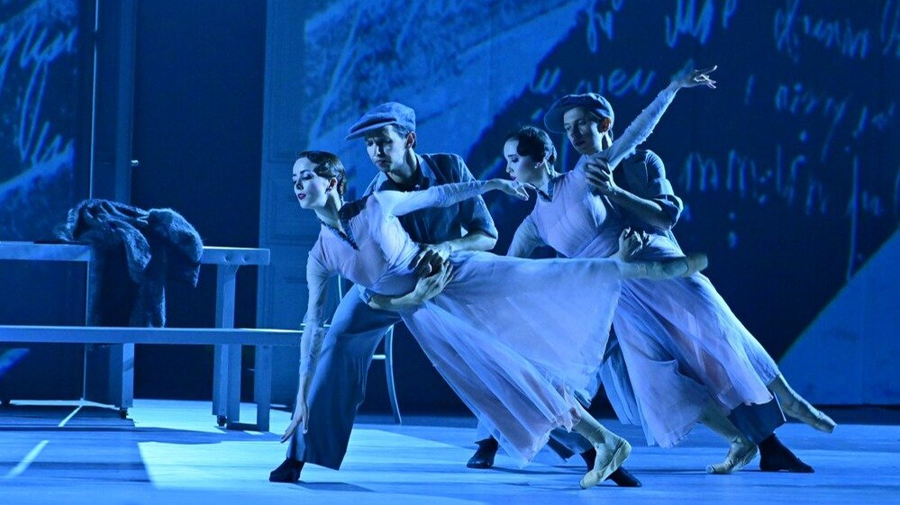

# Любовь и другие кошмары. Сегодня в столице громкая премьера. Об Анне Ахматовой и Анне Павловой в Малом театре поставили… не совсем балет

- **URL:** https://novayagazeta.ru/articles/2025/04/10/liubov-i-drugie-koshmary
- **Дата:** 2025-04-10
- **Автор:** Лариса Малюкова

## Любовь и другие кошмары

## Сегодня в столице громкая премьера. Об Анне Ахматовой и Анне Павловой в Малом театре поставили… не совсем балет

Балет «Две Анны». Фото: Агентство «Москва»

На исторической сцене — московская премьера одноактных балетов «Две Анны». Хореографические истории, посвященные иконам XX столетия, современницам: Анне Ахматовой и Анне Павловой. Строго говоря, не совсем балет. Скорее музыкально-поэтические спектакли (Поэтому и выбраны драматические площадки: в БДТ в Петербурге и Малый — в Москве). Режиссер Феликс Михайлов давно разрабатывает собственный жанр театрального коллажа, соединяя в своих спектаклях разные виды, разные, порой полярные языки искусств.

«Ахматова» в постановке знаменитого хореографа — Юрия Посохова на музыку Сезара Франка — неоклассика. Строгая. И предсказуемая. Головокружительный роман Анны с Амедео Модильяни — после встречи-вспышки в знаменитой Ротонде в пору их свадебного путешествия с Гумилевым. И вдруг это электрическое замыкание. Их тайные встречи. Партию двадцатилетней Ахматовой танцует прима Большого Элеонора Севенард. Роман кружит и вьюжит, как предрассветный час жизни. «Его — очень короткой, — говорит Ахматова, — моей — очень длинной… И «страшный бодлеровский Париж, который притаился где-то рядом». На сцене Париж условно представлен несколькими парами, обрамляющими любовный четырехугольник: Гумилев–Ахматова–Модильяни и натурщица — любовница Амедео. Актриса БДТ Полина Маликова читает письма, стихи и делает это отменно. Стихи оказываются на первом плане, на их фоне хореография блекнет. Как чернила, которые разбухают и исчезают вместе с поэтическими черновиками на сером заднике. В некоторых сценах есть изящество, фантазия (Анна «драматическая» и «хореографическая» отражаются друг в друге, как в зеркале).

Возможно, все дело в выборе музыки. Знаменитый Фортепианный квинтет фа минор Сезара Франка (в исполнении камерного оркестра OpensoundOrchestra). Музыка — самостоятельное произведение, концентрированный экспрессионизм, ярчайшая палитра красок.

А сценическое действие существует как бы отдельно, само по себе, не вызывает такого же эмоционального отклика, как музыка. И пафосный финал — про короткую жизнь Модильяни и посмертную мировую славу. Ну зачем?

Балет «Две Анны». Фото: Евгения Матвиенко

Балет «Павлова» — полная противоположность первому отделению. Илья Демуцкий («Герой нашего времени», «Чайка» и «Нуреев») композитор талантливый и непредсказуемый. В союзе с ним хореограф Павел Глухов и режиссер Феликс Михайлов сочинили — не байопик, но импрессионистические вспышки-впечатления о мифе великой танцовщицы. И о ее прихотливой судьбе.

Тяжелый алый многослойный занавес — потоком с колосников — как образ многих сцен во многих странах. Миссионерка — на трех континентах открыла слово «балет».

В театральном коллаже: и классический балет, и балет-кабаре, и стилистика немого кино, и эксцентрика, и цирк.

Поэтому танцуют Павлову сразу несколько балерин. Начнется все с постижения балетной профессии под руководством итальянского танцовщика-виртуоза Чекетти (этот танец с тростью — вариация на тему известного фото 1907 года: Павлова и ее педагог Чекетти, указывающий тростью, как тянуть руки). Потом сценки-диалоги с мужчинами, спутниками жизни, теми, которые очаровывали и разочаровывали, но которые вдохновляли. Оказались короткими или долгими отрезками ее постоянного поиска себя. Дуэт с хореографом Михаилом Фокиным — профессиональным сподвижником, создавшим для нее Шопениану. Ссоры и примирения с брутальным Михаилом Мордкиным и их хореографическая «Вакханалия». Знаменательная встреча с Чарли Чаплиным — танец как микрофильм о «Бродяге и сильфиде» (Чаплин так называл их недолговечный союз), но внутри этого фильма есть и сама немая фильма. Павлова и Чаплин смотрят кино о бродяге и «Прибытие поезда». Пребывание в дягилевской антрепризе, роман и тайное венчание с бароном Дандре — главной страстью и мукой ее жизни, дружба с Вертинским, который в этом балете не слишком убедительно воплощает мечту и ностальгию по родине. И изысканный черно-белый танец Пьеро с пером, оброненным лебедем-Павловой.

Поддержите нашу работу!

1000 500 300 Нажимая кнопку «Стать соучастником», я принимаю условия и подтверждаю свое гражданство РФ

Если у вас есть вопросы, пишите [email protected] или звоните:+7 (929) 612-03-68

Балет «Две Анны». Фото: Михаил Вильчук

Павлова сама создала (сочиняла) легенду о своей жизни. На сцене эти легенды оживают в каскаде классики и эксцентрики, гротеска и клоунады, магических фокусов, балагана и парадоксального шутовского танца на дешевых красных (пластмассовых) стульях. После роскошных русских сезонов Дягилева, где она воплощала саму сущность романтического, воздушного, неземного, нарушая законы тяготения, и была олицетворением сильфиды, балерина Павлова действительно и в кафе-шантанах, в лондонском «Паласе» — вперемежку с акробатами, чревовещателями, клоунами, куплетистами, дрессированными собачками и пирожками в зрительном зале. И потом гастроли, гастроли с изнурительными ежедневными выступлениями. Над сценой летят чемоданы, из которых вываливаются костюмы и тряпье. Путаются вокзалы, страны.

Кто она — парящее божество или женщина из плоти и крови, зарабатывающая каторжным трудом, чтобы содержать большую труппу. Вдохновляющаяся любовью и горечью — и вымотанная гастрольным конвейером.

В музыке Демуцкого сочетание несочетаемого: мелодики и какофонии, классики и авангарда, танго и джаза, капели фортепиано и всплесков скрипок.

Балет «Две Анны». Фото: Михаил Вильчук

И сквозь завесу балаганной эксцентриады, любовных перипетий, сценок и ролей — сначала в музыке, потом в пластике пробивается главная тема, превращаясь в кульминацию спектакля. Хореографический монолог — ее Умирающий Лебедь из сюиты «Карнавал животных». Его исполняет под осыпающимся с колосников снегом — лебедиными перышками — хоровод Павловых (Анастасия Сташкевич, Ярославна Куприна, Елизавета Кокорева, Ульяна Мокшева), пуанты в их руках — геометрия нескончаемого продолженного движения. Постепенно они исчезнут в том самом луче прожектора, зажженном 23 января 1931 года на следующий день после ее скоропостижной смерти — на очередных гастролях в очередном отеле (Hotel des Indes в Гааге). Тогда в лондонском театре «Аполлон» выключили свет и ярким лучом прочертили в темноте путь, который Павлова проделывала в «Умирающем лебеде». Спектакль как попытка разгадать тайну искусства, тайну существования Артиста.

### Этот материал входит в подписку

Культурные гидыЧто читать, что смотреть в кино и на сцене, что слушать

### Добавляйте в Конструктор свои источники: сайты, телеграм- и youtube-каналы

Войдите в профиль, чтобы не терять свои подписки на разных устройствах

Поддержите нашу работу!

1000 500 300 Нажимая кнопку «Стать соучастником», я принимаю условия и подтверждаю свое гражданство РФ

Если у вас есть вопросы, пишите [email protected] или звоните:+7 (929) 612-03-68
