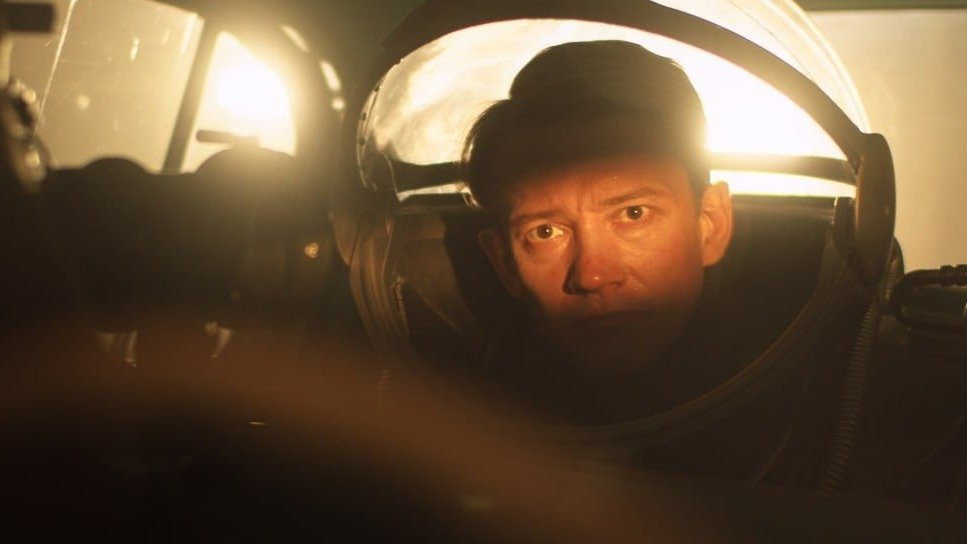

# И на Венере будут яблони цвести. Премьера Московского кинофестиваля — «Планета» Михаила Архипова

- **URL:** https://novayagazeta.ru/articles/2025/04/19/i-na-venere-budut-iabloni-tsvesti
- **Дата:** 2025-04-19
- **Автор:** Лариса Малюкова

## И на Венере будут яблони цвести

## Премьера Московского кинофестиваля — «Планета» Михаила Архипова

Кадр из фильма «Планета»

При всех огрехах рыхлого сценария — картина не просто байопик о талантливом человеке, но попытка понять способ сосуществования уникального дарования, прорывающегося за пределы привычного понимания вещей, и социума, прошитого идеологией крепко-накрепко.

Прототип главного режиссера Николая Беренцева, который в 1960-е создает новаторскую научно-фантастическую ленту про экспедицию на Венеру — Павел Клушанцев. Тот самый тихий гений, визионер «из бывших», пионер научного кино, выдающийся изобретатель, открытия которого помогали удивлять зрителя во всем мире. Можно спорить о влиянии экспериментов Клушанцева на кинематограф Лукаса и Кубрика, но порезанные и перемонтированные фильмы Клушанцева «гуляли» по кино- и телеэкранам США. Не случайно Роберт Скотак — знаменитый мастер по спецэффектам «Титаника», «Терминатора-2», «Прибытия» — приезжал, отыскал Клушанцева и расспрашивал его о техно-секретах.

Кадр из фильма «Планета»

1960-е. Идет подготовка к съемкам научно-фантастической картины об экспедиции на Венеру. В павильоне начинается строительство грандиозных декораций. Баренцев конструирует макет планеты и космического корабля, придумывает хитроумные приспособления для комбинированных съемок. Он уже видит свой будущий фильм и просто пытается воссоздать с помощью подручных материалов то, что никто никогда не видел — жизнь на других планетах. Он — «физик и лирик»: из технарей и мечтателей, фантазия которых обгоняет и общие представления о мире, и науку.

Поэтому ему трудно пробивать стены косности, чиновничьи заговоры и постоянные подозрения в неблагонадежности. Фильм начинается эпизодом из жизни Клушанцева — спором о свекле. К чему нам фильмы про далекий космос, лучше снять научпоп про выращивание сахарной свеклы. Геннадий Смирнов в роли директора студии — точный слепок чиновника в квадрате, в котором и «как бы чего не вышло», и подозрение, и ненависть к неуправляемому таланту (его прототип директор «Леннаучфильма» Аксенов таки выжил Клушанцева со студии, запретив его фантастические проекты).

Венеру создают тут же, в павильоне, Баренцев замазывает глиной сферу из папье-маше, руками создавая планету, на которую вскоре запустит своих космонавтов.

В фильме много черно-белой хроники — от Хрущева до Че Гевары и Кастро, от Нины Дорда с ее «песенкой по кругу» до Кеннеди и Мэрилин Монро. Это гул времени, он нужен режиссеру фильма «Планета» с супер-скромным бюджетом для воссоздания бурной эпохи.

А Баренцеву нужен актер на роль капитана космического корабля «Сириус» в его будущем фильме «Планета бурь». И он уговаривает замечательного советского актера Георгия (Александр Кудренко). Он же играл Астрова в «Дяде Ване» (прототип актера — Георгий Жженов, вернувшись после лагерей, и Астрова играл, и в картине Клушанцева в роли инженера «Сириуса» снялся). Как и Баренцев, доктор Астров с трудом находит общий язык с окружающими. Как и Баренцев, мечтает о недостижимом будущем, которое можно изменить. Об этом и его картина «К звездам».

Баренцев уже придумал свою Венеру с дикими желтыми и бурыми песками. Теперь ему нужно найти музу — венерианку в развевающемся белом платье. Живую и мираж одновременно. Найти здесь, на земле.

Кадр из фильма «Планета»

Гилев играет закрытого, интеллигентного — не по времени зацикленного на своих идеях, проектах автора. Он даже точно воспроизводит суховатую манеру речи Клушанцева. Очень тонкая, психологически выверенная работа.

Архипов показывает и технологию «чуда» — из проволоки, сеток и магнитофона с бобинами. Так возникает и уникальный Робот Джон — предвестник будущего, предвестник R2D2.

Они придумывают будущее каждый день: как снять высадку космонавтов, как создать тени и свет на другой планете: рамы из тонкой проволоки, сетка и специальная оптика дадут мерцание звезд.

Поддержите нашу работу!

1000 500 300 Нажимая кнопку «Стать соучастником», я принимаю условия и подтверждаю свое гражданство РФ

Если у вас есть вопросы, пишите [email protected] или звоните:+7 (929) 612-03-68

Запутанная история с черным соглядатаем в шляпе, присматривающим за сумасшедшими киношниками. С сыном директора студии, поставленного доносить и «портить имущество», чтобы сорвать съемку. А тот влюбляется и в Клушанцева, и в его жену. Потому что они и есть люди будущего, которым несмотря ни на что, ни на какое противодействие здесь, на земле, необходимо создавать свой неземной «радиус добра».

Но главное в этой пунктирной истории — атмосфера, здесь все бредят космосом. И кино — часть познания гигантской Вселенной.

Визуальный ряд — микс эстетики самого Клушанцева (есть и фрагменты его разных фильмов), «Соляриса» и «космических» фантазий Федорченко. Главный козырь авторов — съемки на том самом «Леннаучфильме», в котором сохранился и павильон, и кафе, и фойе со сводчатыми окнами.

Главный конфликт — столкновение тоталитарно-рутинного («ваш Робот — преклонение перед Западом») и передового, рвущегося вперед, мечт о будущем. А на вопрос «что есть люди» отвечают герои фильмов Клушанцева — русские и американцы, бредущие по планете «утренней и вечерней зари», рискуя собой в поисках лучшей мирной жизни.

Кадр из фильма «Планета»

Всегда будут те, кто вырвется и полетит.

Михаил Архипов и сам немного не от мира сего. Помню его индустриальную сказку «Топливо». Видеофантазия с фактурой платоновского мира: черное маслянистое железо, цепи. Выпачканное черным маслом и копотью лицо завороженного происходящим чудом тракториста-изобретателя. Пар, источающий адской машиной-матерью, которая вот-вот родит своего чудо-ребенка, — топливо. И вот уже под музыку Мясковского мчит первобытный человек на своем тракторе в будущее.

«Если художник придумывает сны, — говорит режиссер, — он за них головой и животом отвечает». Про это и его кино.

Лариса Малюкова ведет телеграм-канал о кино и не только. Подписывайтесь тут.

### Этот материал входит в подписки

Смотровая площадкаКино с Ларисой Малюковой

Культурные гидыЧто читать, что смотреть в кино и на сцене, что слушать

### Добавляйте в Конструктор свои источники: сайты, телеграм- и youtube-каналы

Войдите в профиль, чтобы не терять свои подписки на разных устройствах

Поддержите нашу работу!

1000 500 300 Нажимая кнопку «Стать соучастником», я принимаю условия и подтверждаю свое гражданство РФ

Если у вас есть вопросы, пишите [email protected] или звоните:+7 (929) 612-03-68
