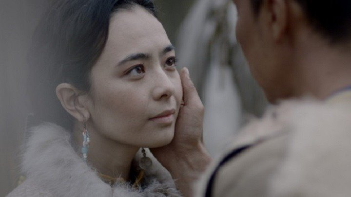

# По-волчьи выть. У нас есть алтайское кино! В программе ММКФ — премьера брутального алтайского киноэпоса «Волки»

- **URL:** https://novayagazeta.ru/articles/2025/04/24/po-volchi-vyt
- **Дата:** 2025-04-24
- **Автор:** Лариса Малюкова

## По-волчьи выть

## У нас есть алтайское кино! В программе ММКФ — премьера брутального алтайского киноэпоса «Волки»

Кадр из фильма «Волки»

Феномен якутского кинематографа уже стал частью мирового кинопространства. Алтайское кино негромко возвещало о себе короткометражками, скромной, но выразительной картиной «Тропа» Михаила Кулунакова, в которой рассказана история одной алтайской семьи, где муж одержим идеей прорубить тропу через горы. Как одержимость разрушает человеческие связи.

И вот тот же Михаил Кулунаков снял брутальную этно-трагедию «Волки». В оригинальной истории он одушевил национальную алтайскую мифологию, у которой много общего с якутской (например, сосуществование трех миров: небесного, земного и подземного), но есть и свои духи, первопредки, фольклорные герои и легенды, которые отчасти сохранились. Одну из таких историй Михаилу Кулунакову рассказывала его бабушка. Рассказывала обрывками, которые он соединил в одно повествование.

Однажды влиятельный бай, землевладелец Кутус, решил похитить красавицу Кымыскай — невесту табунщика бедняка Токне. Силой увозят связанную девушку. Приучают к обычаям нового дома. Спустя короткое время она все же убежит. Вместе с Токне начнут жить они за оврагом, двух сыновей воспитывать (старший — от Кутуса, младший — от Токне). Но зерна вражды посеяны. Месть оскорбленного бая будет напитываться силой, обрастать необратимыми трагическими событиями, в которые будут втянуты сородичи, односельчане.

Постепенно месть разбухает, разрастается в кровавый театр. После того как люди Кутуса зарежут корову Токне, а к его юрте подбросят коровьи ноги, безбашенный племянник Токне придумает, как ответить. Ночью он с друзьями нападет на большую отару овец Кутуса. Они будут убивать одну овцу за другой — и так половину отары. А чтобы отвести от себя подозрение, не только резать, но рвать туши, как волки. И выть волками. И стать волками.

Авторы рассказывают, что фильм снят по реальным событиям XIX века, которые произошли в окрестностях села Каспа Шебалинского района и легли в основу исторического романа алтайского писателя Кюгея Телесова «Катунь весной». Возможно, бабушка режиссера и знала о преданиях, передаваемых из уст в уста.

Но вся эта история, в которой и романтическая любовь, и гибель многих персонажей, и связь с тотемными предками — кажется протомифом. Легендой вне времени, но крепко привязанной к пространству этих заросших лесом гор, лощин, просторов.

Кадр из фильма «Волки»

В первой части фильма события разворачиваются неспешно, чинным шагом, как в сказе. Но постепенно, примерно с середины, почти сказочная милейшая история превращается в страшноватый триллер, почти хоррор. Да, именно народный хоррор. Как рвут-режут овец, и лица людей забрызгиваются кровью, как в наказание затопчут копытами одного, зарежут другого. Будет и попытка суицида, и жестокие казни, и охота… на людей, и одно неожиданное спасение.

Мотив волков здесь ключевой. Люди страшнее волков, потому что готовы уничтожать друг друга не ради выживания. Но для авторов настоящие волки — дети. Те самые чудесные мальчики, сыновья Токне и Кутуса, которых мама ласково звала «волчатами».

Выросшие в ненависти, даже если выживут, скорей всего, перестанут быть людьми. Эти дети — предвестье будущих катастроф.

Поддержите нашу работу!

1000 500 300 Нажимая кнопку «Стать соучастником», я принимаю условия и подтверждаю свое гражданство РФ

Если у вас есть вопросы, пишите [email protected] или звоните:+7 (929) 612-03-68

В отличие от неброского, с минимальным бюджетом дебютного фильма Кулунакова «Тропа», «Волки» — красочный, живописный, с размахом — эпик.

Идиллический нечеловеческой красоты мир природы: зеленые и охряные леса, покрывшие горы, кристально чистые озера, белый покров. Камера Ольги Кулунаковой словно соединяет горный ландшафт с небом. В этой гармонии нет разрывов. Этот рай противопоставлен мрачным, беспросветным событиям и прегрешениям, на которые способен человек. Его неумеренная злость и ненависть. Неспособность прощать. Нет, он не заслуживает этой красоты.

Читайте также

Возвращение великого Поэта

К юбилею одного из лучших документалистов мира — Арутюна Хачатряна — ретроспектива на Московском кинофестивале

Дизайн в фильме подчеркнуто декоративен. Нарядные женские костюмы — шелк и мех, с орнаментами, нарядными пуговицами, стеклярусом, бисером. У мужчин — рукодельные полушубки, добротная кожаная обувь. Народные празднества, мужские поединки.

И отдельной строкой — о саундтреке Азулая Тадинова. Музыка соединяет древние мотивы с современным звучанием, поющий и плачущий голос смычкового — что-то вроде древнего моринхура — с электроникой, плюс разнообразная перкуссия, нагоняющая и «разогревающая» действие, имитирующая то глухой, то тяжелый конский топот.

Работа, безусловно, яркая. Михаил Кулунаков говорил журналистам, что чувствует себя обязанным своим предкам, прежде всего бабушке, она же ему не случайно рассказывала эти легенды. Он просто обязан их нам передать.

Лариса Малюкова ведет телеграм-канал о кино и не только. Подписывайтесь тут.

### Этот материал входит в подписки

Смотровая площадкаКино с Ларисой Малюковой

Культурные гидыЧто читать, что смотреть в кино и на сцене, что слушать

### Добавляйте в Конструктор свои источники: сайты, телеграм- и youtube-каналы

Войдите в профиль, чтобы не терять свои подписки на разных устройствах

Поддержите нашу работу!

1000 500 300 Нажимая кнопку «Стать соучастником», я принимаю условия и подтверждаю свое гражданство РФ

Если у вас есть вопросы, пишите [email protected] или звоните:+7 (929) 612-03-68
