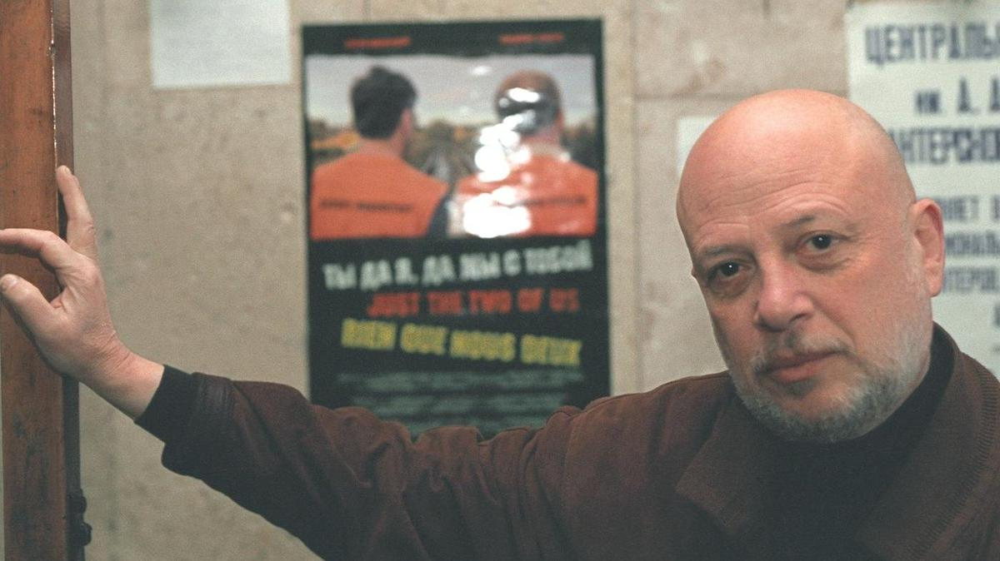

# Как услышать Достоевского? Вышла книга «Кино после Сталина» Павла Финна. Объясняем, почему ее нельзя пропустить

- **URL:** https://novayagazeta.ru/articles/2025/05/07/kak-uslyshat-dostoevskogo
- **Дата:** 2025-05-07
- **Автор:** Лариса Малюкова

## Как услышать Достоевского?

## Вышла книга «Кино после Сталина» Павла Финна. Объясняем, почему ее нельзя пропустить

Павел Финн. Фото: Сергей Пономорев / Коммерсантъ

Павел Финн — драматург, автор шестидесяти сценариев, по которым сняты фильмы «Объяснение в любви», «26 дней из жизни Достоевского», «Леди Макбет Мценского уезда», «Всадник без головы», «Тайны дворцовых переворотов», «Миссия в Кабуле», «Роль», «Смерть Таирова», «Подарок для Сталина»

Как же я люблю авторские энциклопедии. Это и не мемуары в чистом виде, и не сторонний взгляд ученого-исследователя. Большая книга «Кино после Сталина» — захватывающее путешествие в относительно недавнюю историю советского кино с Вергилием — Финном, который сам был не только свидетелем, но и участником кинопроцесса. Редкий жанр, соединяющий воспоминания, прозу и хронику — документы, выписки из архивов, публичных речей, дневников, — дает объемный взгляд на эпоху, в которой свет пытался пробиться сквозь тьму. Но тень у темени, как говорили классики, — необъятна.

В этой книжке жизнь и кино сплавлены в дружеском объятии, промокшем под июльским дождем послевоенной ненадолго вздохнувшей от тягот Москвы.

В ней звучат каблуки прекрасных подружек по ВГИКу — красавиц Ларисы Шепитько и Натальи Рязанцевой, горит огонь волос ломкой Дульсинеи короля монтажа Кулешова — Александры Хохловой.

В главе «Последний киносеанс» вспоминаем, что же смотрел вождь в своем кинозале, почему 37 раз пересматривал «Чапаева», как принимал готовые картины (над сюжетом про потерю сознания Козинцева при сдаче «Юности Максима» даже смеяться не хочется).

Фото из книги «Кино после Сталина»

Сложная, противоречивая, не слишком образованная, но живая Екатерина Фурцева. Как точно — про тогда и про сейчас — подметит вгиковка Кира Муратова: «Тогда время рождало двоение и троение в личности». Любопытнейшая история ее помощи фильму «Чистое небо», свидетелем которой был автор.

Финн прослеживает, как зритель 53-го, 54-го, 55-го отдаляется от зрителя послевоенного — меняется общественное сознание. Прежде всего, благодаря фильмам-ледоколам, таким как «Весна на Заречной улице» Хуциева, «Большая жизнь» Лукова, «Дело Румянцева» Хейфица — кино без фальши, в котором личная жизнь человека берется крупным планом, пробивая асфальт общественной надобности героев.

Памятный вгиковский показ «Летят журавли» с волшебной камерой Урусевского, ставшей соавтором великого фильма. И размышления, почему молодому поколению кинематографистов больше нравился «Дом, в котором я живу» Кулиджанова и Сегеля, скромная картина уловившая новую тональность в настроении социума, движение к правде. Тогда в пылу споров и рискованных замыслов рождался советский неореализм..

Фото из книги «Кино после Сталина»

Бурлящий талантами легендарный ВГИК шестидесятых со своей не спущенной сверху иерархией, где царили скромнейший Гена Шпаликов, близкий друг автора, и, конечно же, Андрей Тарковский, уникальное дарование знаменитой мастерской Ромма. Самые дерзкие, ведомые своим талантом, они задавали тон времени, были его символами.

Поддержите нашу работу!

1000 500 300 Нажимая кнопку «Стать соучастником», я принимаю условия и подтверждаю свое гражданство РФ

Если у вас есть вопросы, пишите [email protected] или звоните:+7 (929) 612-03-68

А в коридорах можно было встреть живых классиков — Герасимова, Ромма, Козинцева, Габриловича, Каплера, Волчека. Выдающиеся учителя и их ученики, рвущиеся в кино, как в бой с судьбой. Казалось, профессии и жизни они учились, варясь в этом бульоне, их надежды питал сам воздух золотого века ВГИКа.

Прекрасные собеседники, бражники и повесы, помешанные на кино. Кто сейчас вспомнит курсовую, объединившую трех операторов-гениев: Рерберга, Княжинского и Ильенко?

Есть здесь и воспоминания о долгих съемках той самой знаменитой сцены вечеринки из «Заставы Ильича», так разозлившей Хрущева.

Сам по себе выдающийся был съемочный процесс, куда щуплого Финна затащил его верный друг, автор сценария Шпаликов. И он очутился в компании будущих небожителей нашего кино: Тарковский, Кончаловский, Митта, Рязанцева. И страдания Ольги Гобзевой, которая из дубля в дубль должна была давать пощечину Тарковскому. Ленинградская школа с муками кино морального беспокойства — и успешное в прокате, но менее личностное кино «Мосфильма».

Работа с Авербахом и многолетняя дружба, в которой у Авербаха роль старшего, и мучительная сдача в Госкино фильма «Объяснение в любви».

Чиновники, чиновники, чиновники — всех рангов и достоинств. Почти по-гоголевски — 35 тысяч одних чиновников, запретителей, боящихся собственного голоса. 45 поправок получила картина. 45! И это еще не предел. Ее хотя бы не спрятали на полку. И авторов хотя бы не стирали в пыль, как Аскольдова. И все же чего им это стоило. А когда Авербаха не станет (его, доктора по первой профессии, сожрет безжалостная болезнь), Финн каждый свой сценарий будет писать словно для него, для Ильи. Ему был жизненно необходим этот камертон, недостижимая «нравственность стиля», которой владел Авербах. Когда первостепенна не ситуация, а состояние человека в мире.

Фото из книги «Кино после Сталина»

Почему гигантский потенциал нашего кинематографа, проснувшегося после тяжелой спячки, не удалось полностью реализовать? При всех вершинных прорывных картинах. Нет простого ответа. Но вся книга Павла Финна, по сути, отвечает на этот больной вопрос.

В этой книге не только рассказ о кинопроцессе, но и о маете творчества, пути на ощупь, поиска «голоса» фильма.

Как может говорить Достоевский в картине? Как услышать его подлинный голос в истории написания «Игрока», романа, который должен был спасти писателя от кабального договора? И Финн садится за многотомное издание писем, вырезает фразы, предложения, слова, монтирует вживую речь классика, вписывая ее в сюжет. Как роль постепенно тлела и вдруг зажглась у Олега Борисова. И гром среди ясного неба — он уходит с картины из-за недопонимания с режиссером Александром Зархи. Как спешно искали нового Достоевского и нашли… Анатолия Солоницына, у которого был в тот момент свой кризис, и он полностью совпал с настроением картины.

Под обложкой этой книги можно «услышать» голоса Рязанцевой, Климова, Муратовой и Ахмадулиной, Иоселиани, Германа и Сокурова, Параджанова и Абдрашитова, Панфилова и Балаяна. Поколения уникумов. Но главное в ней — размышления о шуточной профессии — кинодраматургии, слово, которое начинается с корня «кино». И как примирить разлад между стремлением автора выразить свою личность — и необходимостью полностью растворить свое «я» в материи кино. Сценарий не средство выражения — это материал для картины. Павел Константинович точно знает, о чем говорит и пишет. Его книга — в какой-то степени отпечаток собственной жизни и судьбы в кино. Не пропустите ее.

Лариса Малюкова ведет телеграм-канал о кино и не только. Подписывайтесь тут.

### Этот материал входит в подписки

Смотровая площадкаКино с Ларисой Малюковой

Культурные гидыЧто читать, что смотреть в кино и на сцене, что слушать

### Добавляйте в Конструктор свои источники: сайты, телеграм- и youtube-каналы

Войдите в профиль, чтобы не терять свои подписки на разных устройствах

Поддержите нашу работу!

1000 500 300 Нажимая кнопку «Стать соучастником», я принимаю условия и подтверждаю свое гражданство РФ

Если у вас есть вопросы, пишите [email protected] или звоните:+7 (929) 612-03-68
