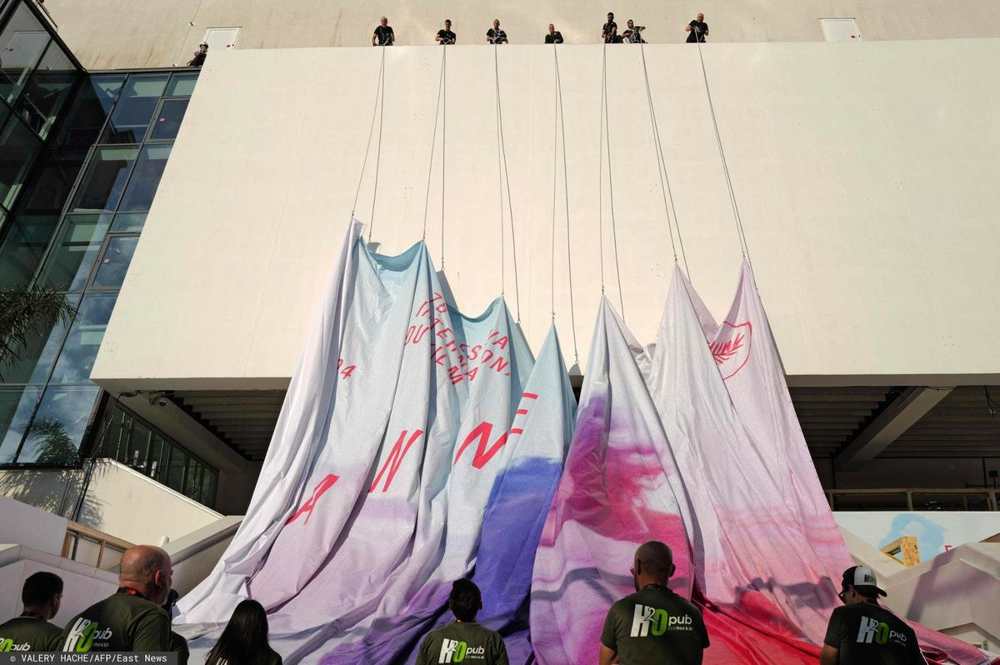

# Канны-2025. Что смотреть? 13 мая открывается главный мировой кинофестиваль. Рассказываем о наиболее ожидаемых картинах

- **URL:** https://novayagazeta.ru/articles/2025/05/12/kanny-2025-chto-smotret
- **Дата:** 2025-05-12
- **Автор:** Лариса Малюкова

## Канны-2025. Что смотреть?

## 13 мая открывается главный мировой кинофестиваль. Рассказываем о наиболее ожидаемых картинах

Фото: VALERY HACHE / AFP / East News

## «Сентиментальная ценность» Йоакима Триера

Фильм оскаровского номинанта («Худший человек на свете») — история семьи, которая уже несколько поколений живет в одном доме в Осло. После смерти матери в жизнь Норы и Аньес вернется их отец Густав. Известный в свое время кинорежиссер, он написал сценарий, в котором хотел бы видеть свою дочь Нору в главной роли, но она отказывается. На французском кинофестивале Густав знакомится с молодой голливудской звездой, мечтающей поработать с ним. Ей и достается роль, написанная для Норы.

В ролях: Рената Рейнсве, Стеллан Скарсгорд и Элль Фаннинг.

## «Орлы республики» Тарика Салеха

Новая работа автора громкого католического триллера «Заговор в Каире» (приз за лучший сценарий в Каннах-2022).

Главный герой — египетский актер, который вынужден сниматься в фильме по госзаказу, он и заводит не совсем безопасный роман с женой генерала.

## «Альфа» Жюлии Дюкорно

Третий полнометражный фильм создательницы шокирующего боди-хоррора «Титан» (главный приз и сенсация Канн-2021-го).

1980-ые. Действие новой картины разворачивается в вымышленном мегаполисе (отдаленно напоминающем Нью-Йорк), который настигает эпидемия СПИДа. Об 11-летней девочке в школе узнали, будто она заражена опасной болезнью, потому что заболел один из ее родителей.

В главных ролях: Голшифте Фарахани («Патерсон») и Тахар Рахим («Пророк»).

## «Молодые матери» братьев Дарденн

Драма о пятерых молодых женщинах и их детях-подростках, живущих в специализированном приюте. Как рассказывал директор программы Тьерри Фремо, это кино о молодых девушках, которым трудно (в том числе и из-за нехватки средств) стать матерями и которых (из-за нехватки средств) берут к себе медики и сиделки, чья самоотверженность и мастерство необычайны. Кино о том, каким становится мир через конкретные судьбы современной Бельгии.

## «Эддингтон» Ари Астера

В мае 2020 года в Эддингтоне, небольшом городке в штате Нью-Мексико, противостояние между амбициозным шерифом и мэром разожгло войну жителей друг против друга. Астер («Реинкарнация», «Солнцестояние») снова воссоединился с Хоакином Фениксом, а также с Педро Паскалем, Эммой Стоун и Люком Граймсом. В вестерн с привкусом нуара для Астера возможность поделиться беспокойством о непредсказуемом будущем Америки, которую колотят взрывоопасные преобразования.

## «Финикийская схема» Уэса Андерсона

Комедийный шпионский триллер с эксцентрическими персонажами, стилизованными декорациями, сумасшедшими диалогами в духе Андерсона. О бизнесмене, торговце оружием, решившим осчастливить наследством свою дочь монахиню.

Сценарий режиссер написал с Романом Копполой, своим постоянным соавтором.

В звездном составе: Скарлетт Йоханссон, Майкл Сера, Бенедикт Камбербэтч, Билл Мюррей, Бенисио Дель Торо и Миа Триплтон (дочь Кейт Уинслет), Матье Амальрик, Скарлетт Йоханссон, Том Хэнкс, Уиллем Дефо, Джеффри Райт, Шарлотта Генсбур.

## «Простая случайность» Джафара Панахи

Новая работа иранского режиссера-диссидента, который по решению суда получил запрет на профессию на 20 лет. Тюрьма, домашний арест… Тем не менее Панахи продолжает снимать кино. Год назад он получил наконец заграничный паспорт и даже вырвался на время из страны. Тем не менее, приедет ли он в Канны, большой вопрос. В синопсисе фильма сказано: «То, что начинается как незначительный инцидент, запускает серию нарастающих последствий».

## «Умри, моя любовь» Линн Рэмси

Черная комедия по мотивам одноименного романа аргентинской писательницы Арианы Харвец. Рэмси любит снимать кино на основе хорошей литературы ( «Морверн Каллар», «Что-то не так с Кевином», «Тебя никогда здесь не было»). Эта история разворачивается во французской глубинке. Главная героиня страдает от послеродовой депрессии, переходящей в психоз.

Рэмси представляла в Каннах в 1999 году свой дебютный фильм «Крысолов», затем «Морверн Каллар» (приз C.I.C.A.E. и Приз молодежи за лучший иностранный фильм). Ее картина «Что-то не так с Кевином» удостоена приза за сценарий, а «Прекрасный день» получил приз за сценарий и лучшую мужскую роль — Хоакину Фениксу.

Среди продюсеров картины — Мартин Скорсезе.

Поддержите нашу работу!

1000 500 300 Нажимая кнопку «Стать соучастником», я принимаю условия и подтверждаю свое гражданство РФ

Если у вас есть вопросы, пишите [email protected] или звоните:+7 (929) 612-03-68

## «Досье 137» Доминик Молль

История о тотальном контроле и бесконтрольной слежке. Леа Друкер («В моей коже», «Бюро», «Опека») играет женщину-полицейского, которая проверяет работу своих коллег. Сценарий написала Молль со своим постоянным соавтором Жилем Маршаном («Таинственное убийство»).

## «Тайный агент» Клебера Мендонса Фильо

1977-ой. Ресифи — родной город известного бразильского режиссера и кинокритика Клебера Мендонса Фильо. Последние годы военной диктатуры в Бразилии. Школьный учитель Марсело, бегущий от проблем прошлого, приезжает в город Ресифи, где идет карнавал. Он ищет своего маленького сына и надеется на возможную новую жизнь.

## «Два прокурора» Сергея Лозницы

По мотивам повести советского писателя и физика, узника ГУЛАГа Георгия Демидова из трилогии «Оранжевый абажур».

История молодого прокурора, который после долгих сомнений решает откликнуться на письмо заключенного в 1937 году, пытаясь бросить вызов репрессивной машине.

В главных ролях Александр Кузнецов и Анатолий Белый*.

## «Новая волна» Ричарда Линклейтера

Первый фильм автора картин «Перед рассветом», «Отрочество» на французском языке.

Черно-белая картина о становлении Новой волны, как Жан-Люк Годар (Гийом Марбек) снимал эпохальный фильм «На последнем дыхании». Среди действующих лиц — Жан-Поль Бельмондо, Жан Кокто, Робер Брессон, Роберто Росселлини, Эрик Ромер, Аньес Варда.

В ролях Джин Сиберг и Жана-Поля Бельмондо — Зои Дойч и Обри Дюллен.

## «Исчезновение» Кирилла Серебренникова

Режиссер в шестой раз принимает участие в главном киносмотре ("УЧЕНИК» (2016), «ЛЕТО» (2018), «ПЕТРОВЫ В ГРИППЕ» (2021), «ЖЕНА ЧАЙКОВСКОГО» (2022)

В прошлом году в конкурсе фестиваля был «Лимонов. Баллада» по сценарию Павла Павликовского с Беном Уишоу в главной роли.

Черное-белая история о беглом нацистском преступнике, докторе Йозефе Менгеле, нашедшем убежище в Южной Америке. По мотивам романа Оливье Геза, исследующего один из чудовищных мифов ХХ века.

В главной роли Аугуст Диль.

«Оруэлл: 2+2=5» Рауль Пек (Каннские премьеры)

Документальный фильм, посвященный Джорджу Оруэллу и истории создания двух его знаменитых романов-пророчеств «Скотный двор» и «1984». Продюсер — оскаровский лауреат Алекс Гибни. Режиссер гаитянец Рауль Пек ( байопик Джеймса Болдуина «Я вам не негр»).

## Звезды дебютируют в режиссуре

Кажется, Канны делают акцент на «перемене участи». В Особом взгляде «Мальчишка» Харриса Дикинсона с Фрэнком Диллэйном из «Гарри Поттера) — о том как лондонский бездомный пытается изменить свою жизнь.

«Великая Элеонор» Скарлетт Йоханссон — о 90-летней жительнице Флориды, завязавшей необычную дружбу со студентом из Нью-Йорка. В главной роли Джун Скуибб, 95-ти летняя актриса, любимица Александра Пэйна.

«Хронология воды» — история, основанная на мемуарах американской писательницы Лидии Юкнавич — режиссерский дебют Кристен Стюарт с Имоджен Путс («Я и Орсон Уэллс», «Ночь страха») в главной роли.

## Фильм ОТКРЫТИЯ

«Уехать однажды» режиссерский дебют Амели Боннен. Закономерно — французская картина. Боннен расширила и досняла свою короткометражку, удостоенную премии Сезар. Про молодую женщину Сесиль, приехавшую в родной город, готовую осуществить свою мечту, и встретившую свою первую любовь.

В главных ролях: певица и актриса Жюльетт Армане и Бастьен Буйон («Месье Азнавур», «Граф Монте-Кристо», «Конец любви») — обладатель Сезара в номинации «самый многообещающий молодой актер».

Почетную «Золотую пальмовую ветвь» получит Роберт Де Ниро. В 1973 году в Каннах показали «Злые улицы» Мартина Скорсезе и мир узнал имя новой звезды.

## Кто в жюри

Председательница жюри основного конкурса — Жюльетт Бинош, обладательница лучшей женской роли за фильм «Копия верна» Аббаса Киаростами.

### * Признан иноагентом в РФ

Поддержите нашу работу!

1000 500 300 Нажимая кнопку «Стать соучастником», я принимаю условия и подтверждаю свое гражданство РФ

Если у вас есть вопросы, пишите [email protected] или звоните:+7 (929) 612-03-68
