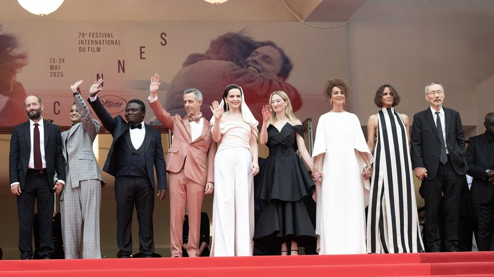

# Звезды, политика и Золушка. Открытие 78-го Каннского кинофестиваля стало одним из самых политизированных за всю историю форума

- **URL:** https://novayagazeta.ru/articles/2025/05/14/zvezdy-politika-i-zolushka
- **Дата:** 2025-05-14
- **Автор:** Лариса Малюкова

## Звезды, политика и Золушка

## Открытие 78-го Каннского кинофестиваля стало одним из самых политизированных за всю историю форума

Члены жюри 78-го Каннского кинофестиваля. Фото: Niviere David / ABACAPRESS.COM

Перед началом смотра было опубликовано открытое письмо: более 380 кинодеятелей обвинили Израиль в геноциде и призвали фестиваль высказаться. Среди подписавших письмо, инициированное пропалестинскими активистами, — Педро Альмодовар, Рубен Эстлунд, Гай Пирс, Ральф Файнс, Мелисса Баррера, Йоргос Лантимос, Сьюзан Сарандон, Альфонсо Куарон и Дэвид Кроненберг.

На самой церемонии председатель жюри Жюльет Бинош вспомнила о трагической гибели палестинской фотожурналистки Фатмы Хасуне в результате атаки армии Израиля.

### Жюльет Бинош:

«Война, нищета, изменение климата, примитивное женоненавистничество… У художников есть возможность свидетельствовать. Чем сильнее страдания, тем важнее их участие. Искусство — мощное свидетельство нашей жизни, наших мечтаний, и мы, зрители, принимаем его».

На открытии фестиваля чествовали Роберта де Ниро.

Леонардо ди Каприо вручил почетную «Золотую пальмовую ветвь» «гению трансформаций», не просто актеру, но, как заметил Ди Каприо, «архетипу актера». Он вспомнил, как встреча с выдающимся мастером изменила всю его жизнь. Сказал о невероятной силе их союзе с Мартином Скорсезе.

Гигантский зал «Люмьер» аплодировал стоя.

Де Ниро зажег политический спич в своем духе (он известен как последовательный яростный критик Трампа):

### Роберт де Ниро:

«В моей стране мы боремся за демократию, которую когда-то считали само собой разумеющейся. И это касается всех нас здесь, потому что искусство демократично. Искусство инклюзивно. Оно принимает разнообразие, объединяет людей, как сегодня вечером. Искусство ищет правду, и именно поэтому искусство и мы — его представители — являем угрозу для автократов и фашистов мира… Американский мещанин-президент назначил себя главой одного из ведущих культурных учреждений Америки. Он сократил финансирование и поддержку искусству, гуманитарным наукам и образованию. А теперь он объявил 100%-ную пошлину на фильмы, снятые за пределами Соединенных Штатов. Вы не можете установить цену на творчество, но, по-видимому, вы можете установить на него тариф.

И это не только американская, но и глобальная проблема. Мы не можем просто сидеть и смотреть. Мы должны действовать сейчас. Без насилия, но со страстью и решимостью. Пришло время всем, кто заботится о свободе, организоваться, протестовать и, когда будут выборы, конечно, голосовать».

Леонардо ди Каприо вручил почетную «Золотую пальмовую ветвь» Роберту Де Ниро. Фото: AP / TASS

О поиске правды с помощью кино в мире лжи и фейк-ньюс говорил на пресс-конференции жюри актер Джереми Стронг, представивший в прошлом году скандальную картину «Ученик» Али Аббаси о становлении Дональда Трампа.

А в финале церемонии был еще один сюрприз. На сцену вышел Квентин Тарантино и буквально станцевал этюд «Фестиваль открыт!».

В общем, открытие получилось сверхэмоциональным и ярким. На одной сцене были звезды и режиссеры первой величины: Де Ниро и Ди Каприо, Тарантино и Рейгадас, Хон Сансу Паял Кападиа, Жюльет Бинош и Холли Берри, Альба Рорвахер и Джереми Стронг.

И вот на этой высокой ноте показали, мягко говоря, скромный сверхсентиментальный музыкальный фильм «Уехать однажды» — режиссерский дебют Амели Боннен, которая досняла-расширила свою короткометражку, удостоенную премии «Сезар». Это очень французская картина (в этом, думаю, главная причина ее выбора), в ней — ностальгия по старой доброй Франции с приперченной андуйет и жареной картошкой, с узнаваемыми по первым нотам мелодиями Parole и Cette Année-là, а также хитов 60-х и 70-х с неловкими текстами.

Кадр из фильма «Уехать однажды»

Поддержите нашу работу!

1000 500 300 Нажимая кнопку «Стать соучастником», я принимаю условия и подтверждаю свое гражданство РФ

Если у вас есть вопросы, пишите [email protected] или звоните:+7 (929) 612-03-68

Сесиль (ее играет певица Жюльетт Армане, которая пела Imagine Джона Леннона на открытии парижской Олимпиады) под сорок. Она шеф-повар парижского мишленовского ресторана, участник кулинарного шоу Top Chef. Мы встречаемся с ней на пике проблем: Сесиль беременна, у ее отца — третий инфаркт, и значит, надо все бросить и нестись в провинцию, в глушь, где она выросла. Где готовила свои первые блюда. Влюблялась. Под угрозой открытие ее собственного ресторана. Под угрозой вся ее жизнь.

Будет любовный треугольник. Прошлое поможет выйти из кризиса в настоящем. В фильме есть живые и обаятельные моменты. Из удачных — то, как Боннен справляется музыкальными номерами. Они не вставные зубы — не украшают, напротив, естественно (или внезапно) вшиваются в действие. Поют рыбаки, вытаскивающие рыбу из сети, поют — дурачатся — подвыпившие друзья детства, пишет эсэмэску-стихи, которые превращаются в музыку, сама Сесиль. Или вообще не поют: собираются и… передумывают. И наконец, самый трогательный музыкальный монолог поет-произносит ее своенравный отец, такой же упрямец, как она. Успокаивая распереживавшуюся дочь, он дает ей кусочек рафинада, и она, как в детстве, макает его в кофе. Лучший десерт в биографии мишленовского повара. Сахара в этом кино вообще многовато.

Читайте также

Канны-2025. Что смотреть?

13 мая открывается главный мировой кинофестиваль. Рассказываем о наиболее ожидаемых картинах

Дома или даже в кинотеатре необязательную картину можно посмотреть. Но для открытия крупнейшего в мире фестиваля арт-кино она выглядит как Золушка, явившаяся на бал в рабочей одежде, забыв попросить фею о волшебстве. Но зато Золушка запела.

Лариса Малюкова ведет телеграм-канал о кино и не только. Подписывайтесь тут.

### Этот материал входит в подписки

Смотровая площадкаКино с Ларисой Малюковой

Культурные гидыЧто читать, что смотреть в кино и на сцене, что слушать

### Добавляйте в Конструктор свои источники: сайты, телеграм- и youtube-каналы

Войдите в профиль, чтобы не терять свои подписки на разных устройствах

Поддержите нашу работу!

1000 500 300 Нажимая кнопку «Стать соучастником», я принимаю условия и подтверждаю свое гражданство РФ

Если у вас есть вопросы, пишите [email protected] или звоните:+7 (929) 612-03-68
