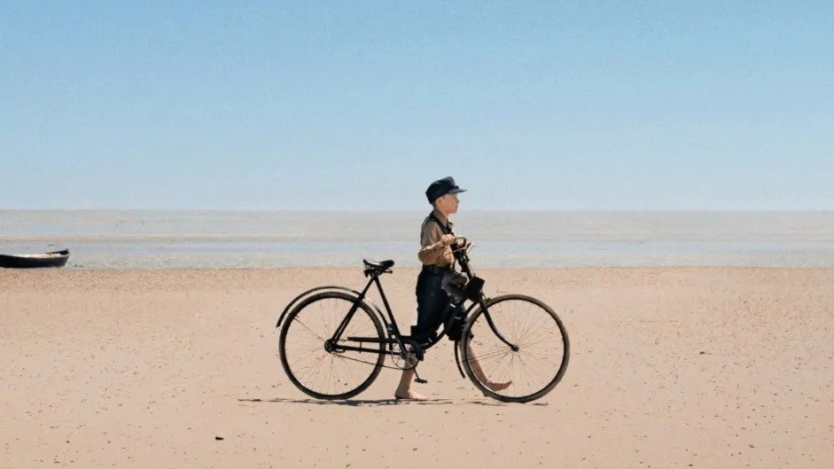

# Каннское досье. Мелодрама о хрупком возрасте, жизнь на грани войны и социальный детектив о полицейском насилии. Лариса Малюкова — о премьерах Каннского фестиваля

- **URL:** https://novayagazeta.ru/articles/2025/05/16/kannskoe-dose
- **Дата:** 2025-05-16
- **Автор:** Лариса Малюкова

## Каннское досье

## Мелодрама о хрупком возрасте, жизнь на грани войны и социальный детектив о полицейском насилии. Лариса Малюкова — о премьерах Каннского фестиваля

Кадр из фильма «Амрум»

«Энцо». Фильм Открытия «Двухнедельника режиссеров». Франко-итальянская картина. Среди продюсеров братья Дарденн.

Замечательный режиссер картины Лоран Канте, обладатель «Золотой пальмовой ветви» за педагогическую драму «Между стен» («Класс»), ушел из жизни в прошлом году. Над этой картиной он начал работать в 2024-м и даже успел подобрать актеров. Его постоянный соавтор и режиссер монтажа Робин Кампильо снял и завершил фильм.

Мы знакомимся с Энцо, 16-летним подростком, на стройке в живописном приморском Ла-Сьоте, в Провансе. Интернациональная бригада гастарбайтеров, в основном из Украины, возводит очередную виллу. Энцо — разнорабочий. Его честят за криворукость (плохо кладет кирпичи), неуклюжесть (плохо кидает цемент в бетономешалку), разорванные ладони (перчатки не мог надеть?). В какой-то момент бригадир-француз не выдерживает и отправляет парня домой, а чтоб не потерялся, сам отвозит его к родителям… И буквально теряет дар речи, попадая на красивую семейную виллу в саду: с бассейном, стеклянными стенами, на берегу моря. Энцо просто вырвался из-под давления любящего отца, желавшего, чтобы сын получил высшее образование (как положено). Бросил школу, не хочет никуда поступать.

Кадр из фильма «Энцо»

Ему трудно дается учеба, зато он хорошо рисует. В отличие от отца-математика и матери-инженера, от брата, поступившего в престижный университет, подросток отказывается проводить жизнь в офисах и бюро. Это скучно. Лучше заниматься чем-то настоящим. Работать руками. Строить. Люди умрут, а здания, возведенные им, останутся. Ребенок, одним словом.

Впрочем, все это риторика. Энцо похож на потерявшегося в пространстве жизни подростка, который не знает, куда идти и зачем. Ищет себя и не может найти. За завесой цементной пыли, штукатурки, сближением со взрослыми рабочими-мигрантами, прежде всего с Владом, он открывает «другую жизнь», о которой даже не подозревал. Может быть, там больше боли, риска и трагедий, но это жизнь.

Его новые друзья, Влад и Мирослав, переживают за свою страну, чувствуют неловкость, что они здесь, во Франции, а их сверстники воюют. Мирослав готов вернуться. Влад, напротив, хочет зарабатывать, создать свой ресторанный бизнес, не хочет быть убитым. Кино пунктирное, в дарденовском духе, подчеркнуто сдержанное, неровное, скромное. Все держится и вращается вокруг планеты Энцо. Его внутренних метаний, немотивированных шокирующих поступков.

Тактильная и нежная история о самом хрупком, непредсказуемом и драматичном возрасте, о болезнях роста. О мучительной, опасной, неуловимой и необъяснимой тайне юности.

В главных ролях Элой Пох (Энцо) и Максим Сливинский (Влад). Родителей сыграли Пьерфранческо Фавино и Элоди Буше.

«Амрум» — фильм открытия программы «Каннские премьеры». Германо-турецкий режиссер, большой поклонник Тарковского, Фатих Акина возвращается на Круазетт спустя почти 20 лет после получения сценарного приза на Каннском фестивале 2007 года за фильм «Другой берег». Обладатель призов Берлинского и Венецианского кинофестивалей привез в Канны тонким пером выписанную психологическую драму, эмоциональную картину-размышление о мире, пограничном с войной. И то, что все беды мира сосредоточены в переживаниях ребенка, — впечатляет.

кадр из фильма «Амрум»

Амрум — германский остров в Северном море. 1945-й, конец войны. Здесь и живет двенадцатилетний Наннинг. Когда они собирают картошку, умело прячутся от бомб. Он храбрый, боится моря, которое здесь то поглощает часть острова, то убегает. Охотится со взрослыми на тюленя (очень жалко тюленя), рыбачит по ночам и даже готов, зажмурившись, убить кролика (очень жалко кролика) и разделать его. Все ради того, чтобы помочь маме прокормить семью. Но у мамы депрессия, причем не только послеродовая. Главная причина — падение нацистского режима. Поэтому мама, как камень, не ест ничего. Наннинг и совершает, как сказочный герой, подвиг за подвигом, едва не тонет в приливе: лишь бы принести маме вожделенный белый хлеб с маслом и медом. Может, она оживет? Не только мама молится на фюрера. Наннинг и сам в гитлерюгенде, носит в кармане дядин нож — для врагов рейха. И только в самом конце войны узнает семейную тайну: о неблаговидных поступках родителей, о дяде, которому принадлежал нож и который успел бежать от фашистов в Америку (его девушку убили в концентрационном лагере). Многое чего придется узнать Наннингу. У него еще вся жизнь впереди, и под нацистской формой у него живое человеческое сердце.

Поддержите нашу работу!

1000 500 300 Нажимая кнопку «Стать соучастником», я принимаю условия и подтверждаю свое гражданство РФ

Если у вас есть вопросы, пишите [email protected] или звоните:+7 (929) 612-03-68

А живет Наннинг в настоящем раю. Продуваемый ветрами остров космически красив в серебряных закатах, белых песках, утопает в сочном разнотравье и синеем-синем море. И лишь когда наступит мир, который буквально сотрясет жизнь деревни, — станет очевидно, что райская красота лишь маскировала моральное уродство. Сквозная тема фильма — взаимоотношения ребенка и матери, убежденной нацистки, которая при этом очень любит сына. И калечит его, потому сама — искалечена. Режиссер говорит: «Амрум исследует изгнание из рая. Для меня этот фильм стал миссией, путешествием в глубины моей немецкой души».

Фатих Акин размышляет о нынешнем возрождении нацизма. Он признается, что его друзья, которые сетовали на то, что жили в «Диснейлендской версии Германии», теперь угрожают покинуть этот сказочный мир.

10 миллионов его соотечественников голосуют сегодня за правых радикалов. Значит, история может повториться.

Фильм снят по мемуарам, полным метафор и рифм Харка Бома. Главное открытие картины — юный Джаспер Биллербек. Его Наннинг — предельно искренен, в том числе в своих заблуждениях.

«Досье 137» Доминика Молла («Гарри здесь, чтобы нам помочь»).

Подробный процедурал-детектив, практически реконструкция событий 2018 года. На пике протестов желтых жилетов полицейский попал в подростка-демонстранта из пистолета LBD, стреляющего резиновыми пулями. Пуля попала в голову, юноша стал инвалидом.

Кадр из фильма «Досье 137»

Героиня фильма Стефани (почти документальное существование Леа Друкер) — полицейский в IGPN, агентстве внутренних расследований. Она пытается разобраться, что же произошло. Полицейские убеждены, что защищают республику, без их жесткой «руки» хаос и террор захватят столицу. Товарищи жертвы и его мать требуют справедливого возмездия. По сути, сама Стефани оказывается в ловушке, где она везде чужая среди своих. Свидетели боятся давать показания против полицейских. Полицейские смотрят на нее как на предательницу. Прежде всего, ее бывший муж, полицейский Жереми (Станислас Мерхар), считающий, что она подрывает и так качающийся авторитет правоохранительных органов, вместо того чтобы обеспечивать безопасность Франции, особенно после атак в Батаклане.

Напряженное следствие (камеры видеонаблюдения, случайный свидетель в отеле напротив, исследование маршрута офицеров полиции) соединяется с ТВ-хроникой (массовые протесты, газ, цветные дымы, петарды, пожары, стычки с полицейскими на улицах) и записями на смартфонах, которые и объясняют происшедшее. Социальный конфликт скручен с криминальным сюжетом в один узел. Но главный вопрос фильма, на который пытается ответить Стефани: почему люди так не любят полицию?

Лариса Малюкова ведет телеграм-канал о кино и не только. Подписывайтесь тут.

Читайте также

Черно-белая история о сталинском терроре

«Два прокурора» — новый фильм Сергея Лозницы с Александром Кузнецовым, Александром Филиппенко и Анатолием Белым*

### Этот материал входит в подписки

Смотровая площадкаКино с Ларисой Малюковой

Культурные гидыЧто читать, что смотреть в кино и на сцене, что слушать

### Добавляйте в Конструктор свои источники: сайты, телеграм- и youtube-каналы

Войдите в профиль, чтобы не терять свои подписки на разных устройствах

Поддержите нашу работу!

1000 500 300 Нажимая кнопку «Стать соучастником», я принимаю условия и подтверждаю свое гражданство РФ

Если у вас есть вопросы, пишите [email protected] или звоните:+7 (929) 612-03-68
