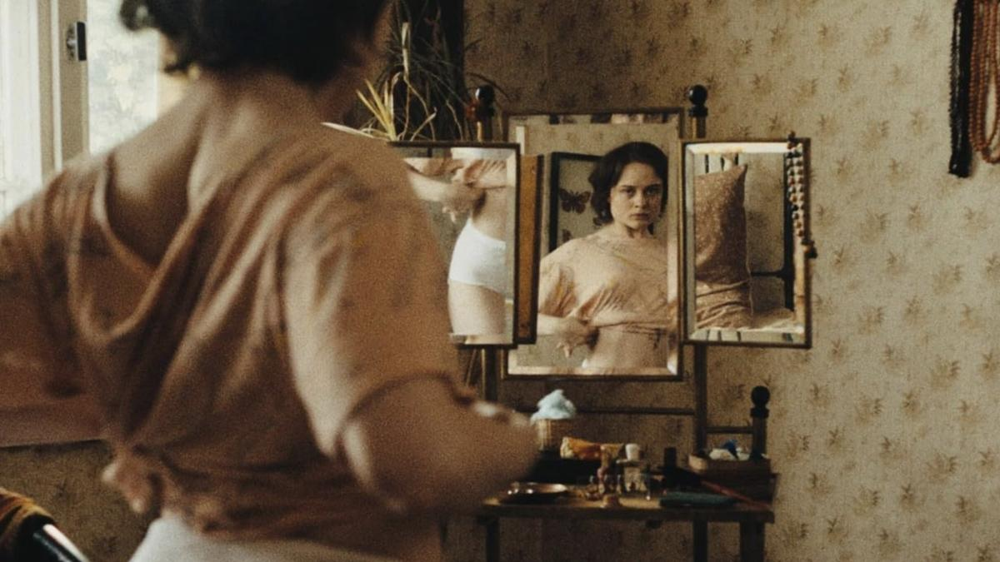

# Ферма вечной травмы. Одна из любопытнейших картин Канн-2025 — атмосферная и феминистская лента «Звук падения»

- **URL:** https://novayagazeta.ru/articles/2025/05/17/ferma-vechnoi-travmy
- **Дата:** 2025-05-17
- **Автор:** Лариса Малюкова

## Ферма вечной травмы

## Одна из любопытнейших картин Канн-2025 — атмосферная и феминистская лента «Звук падения»

Кадр из фильма «Звук падения»

«Звук падения» Маши Шилински снят, словно списан с картин Грютцнера, Франса Шварца, Миле. Сумрачная живопись с прописанными деталями. Или со старых дагерротипов (мы их увидим в кадре).

Фильм похож на историческую поэму, в которой спутались времена. На самом деле, странным образом срифмовались жизни четырех дев — Альмы, Эрики, Ангелики и Ленке — из разных исторических эпох. Все они взрослели на одной и той же ферме в регионе Альтмарк. Их судьбы отражаются друг в друге, как в старом, покрытом амальгамой зеркале.

1940-е. Эрика познает собственную сексуальность, подсматривая за своим дядей Фрицем, как всем кажется, «инвалидом войны». Она его «портретирует», трогает и даже пытается сама ходить на костылях, имитируя ампутацию. Получая пощечины от строгого отца, Эрика лишь согласно улыбается. Но из следующих обрывков глав мы узнаем ужасную семейную тайну о том, как юный Фриц лишился ноги (семья не хотела отпускать его на фронт). Узнаем и о его фантомных болях.

Начало ХХ века. Малышка Альма из молчаливой религиозной помещичьей семьи. Вместе с сестрами они развлекаются жестокими розыгрышами. Прибивают башмак служанки, чтобы она со всей силы грохнулась. Ей дали имя в честь умершей сестры.

И в день усопших она должна надеть черное кружевное платье мертвой девочки, которая смотрит на нее с пожухлой фотографии, держа в руках ту же самую куклу. Ангелоподобная Альма ложится на диван в той же позе. Она играет в смерть, она теперь тоже — как мертвая.

1980-е. ГДР. Юная Ангелика, племянница Эрики. Ее мать — суровая с неподвижным лицом Ирма улыбается только в самые страшные моменты жизни. А Эрика готова плясать до утра, глотать жизнь ложками. Она очарована взрослым дядей, дурачит влюбленного в нее кузена… пока не станет жертвой насилия взрослого. Как и все живущие в этом доме девушки, она плывет между неотчетливым страхом, жаждой жизни и притяжением смерти.

Настоящее время. Нелли вместе с сестрой Ленкой и родителями приехала на запущенную семейную ферму, которую они хотят отреставрировать. И кажется, все совершенно безоблачно, за исключением странных неотчетливых предвестий, звуков. Очередная трагедия свяжет прошлое с настоящим.

Читайте также

Каннское досье

Мелодрама о хрупком возрасте, жизнь на грани войны и социальный детектив о полицейском насилии. Лариса Малюкова — о премьерах Каннского фестиваля

Про выписанный каллиграфически саундтрек можно писать отдельно. В одной партитуре: скрип дверей, сдавленные крики, глухие стуки, жужжание мухи, и какой-то странный то удаляющийся, то приближающийся гул — шум времени.

Кино снято субъективной камерой, будто бы Альма из давнего дагеротипного прошлого продолжает подсматривать за текущей сквозь десятилетия жизнью. Сама камера смотрит будто бы из живой части пространства потаенного мира человека. И сейчас мы прикасаемся к этой тайне, слышим его внутренний голос.

Кадр из фильма «Звук падения»

Поддержите нашу работу!

1000 500 300 Нажимая кнопку «Стать соучастником», я принимаю условия и подтверждаю свое гражданство РФ

Если у вас есть вопросы, пишите [email protected] или звоните:+7 (929) 612-03-68

На этой ферме время остановилось. Не только в посмертных дагерротипах. В стенах дома. В реке, соединяющей восток с западом, по-прежнему плавают скользкие, мерзкие угри (выхватить угря из миски, проносясь на велике, — любимая игра Ангелики и ее родни). Прошлое, как привидение, стоит рядом, дышит в спину. И ты повторяешь судьбу кого-то живущего здесь до тебя. Испытываешь те же межпоколенческие травмы, обиды, чувство совместных прегрешений. Вины.

За буколическими картинами Германии просматривается второй и третий план.

Интимное, скрытое здесь соединено с коллективным бессознательным, с давящим чувством вины, ментальными и физическими страданиями, насилием (дремлющим милитаризмом) и эротикой. Всем тем, что Юнг называл «массовой душой» и ее подспудной мукой.

В этом смысле картина схожа с «Белой лентой» Ханеке. Латентная жестокость распылена, рассыпана, вкраплена в будничные зарисовки, в игры подростков, в отношения взрослых. Но здесь же находится место и мрачному юмору, и чувственности, и редким всплескам света (одно из первых названий фильма «Вглядываясь в солнце»). А еще героини этого рассыпанного, словно бусы, века вдруг смотрят прямо в камеру: мы здесь, рядом. Прямо за вами. Вглядываются. И чем дольше смотрят на него, тем оно темнее.

Идеальное ли это кино, можно ли назвать его произведением искусства? Вопрос. Это очень женский взгляд на историю. В этом сила и слабость фильма, сочиненного пунктирно и большими пропусками, в которые мы вписываем свои собственные интерпретации.

Лариса Малюкова ведет телеграм-канал о кино и не только. Подписывайтесь тут.

### Этот материал входит в подписки

Смотровая площадкаКино с Ларисой Малюковой

Культурные гидыЧто читать, что смотреть в кино и на сцене, что слушать

### Добавляйте в Конструктор свои источники: сайты, телеграм- и youtube-каналы

Войдите в профиль, чтобы не терять свои подписки на разных устройствах

Поддержите нашу работу!

1000 500 300 Нажимая кнопку «Стать соучастником», я принимаю условия и подтверждаю свое гражданство РФ

Если у вас есть вопросы, пишите [email protected] или звоните:+7 (929) 612-03-68
