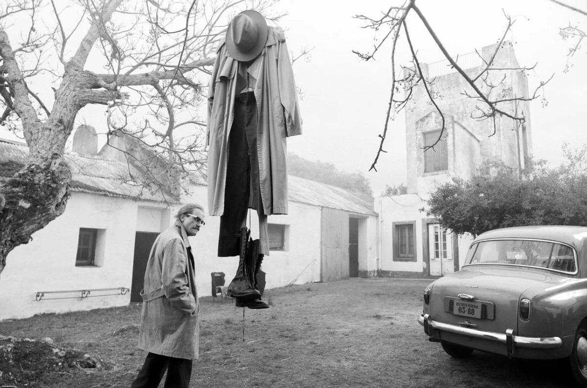

# Путешествие из Освенцима в Буэнос-Айрес и обратно. Состоялась мировая премьера фильма Кирилла Серебренникова «Исчезновение Йозефа Менгеле»

- **URL:** https://novayagazeta.ru/articles/2025/05/21/puteshestvie-iz-osventsima-v-buenos-aires-i-obratno
- **Дата:** 2025-05-21
- **Автор:** Лариса Малюкова

## Путешествие из Освенцима в Буэнос-Айрес и обратно

## Состоялась мировая премьера фильма Кирилла Серебренникова «Исчезновение Йозефа Менгеле»

Кадр из фильма «Исчезновение Йозефа Менгеле»

Сколько весит скелет? На лекции студентам-антропологам в Бразилии показывают настоящий скелет человека. Он принадлежал доктору Менгеле, проводившему в лагере смерти Аушвице чудовищные эксперименты. Впрочем, студенты о нем и не слыхивали, как, скорее всего, и о Холокосте (вспоминается фильм Мумина Шакирова о беспамятстве «Холокост — это клей для обоев»).

«Исчезновение» — замысловато устроенный кинороман, главы которого носят все новые имена «ангела смерти», который избежал наказания. Создан по мотивам романа, написанного французским журналистом Оливье Гезом. Художественными средствами автор пытается осмыслить корни зла обыкновенного фашизма, который рассеян по миру и никуда не делся.

Йозеф, Грегор, Петер. Известно, что в 1938-м, поступив на службу в СС, он отказался вытатуировать свой регистрационный номер на груди, как полагалось, и когда американцы после войны арестовали его, то приняли за простого солдата и через несколько недель отпустили.

Мы знакомимся с ним в 1956-м в Буэнос-Айресе. Сейчас он Грегор. Он умащивает после душа тело кремом. Аккуратно пакует чемодан, покупает газету Der Weg. Многие нацистские преступники благополучно скрывались в Аргентине, не случайно прозванной «четвертым рейхом».

Режиссер и автор фильма перетасовывает времена, географические пространства, словно многолетний беглец прячется и от нас, при этом история бегства будто рассказывается от лица самого Менгеле.

Вот 1977-й. К нему в Сан-Пауло приезжает сын Рольф, совершивший долгий путь, чтобы задать главные вопросы: действительно ли отец убивал и мучил людей? Почему он оказался в Аушвице?

1956-й, Мюнхен. Сюда, озираясь, прибывает Менгеле. Его почтительно встречают солидные мужчины в черных шляпах и пальто. Как и Йозеф, они абсолютно верят в величие нацистской Германии, которая никуда не делась. Она, как феникс, воспрянет из-под обломков. Пусть американцы и русские разрушат друг друга. Со всеми мерами предосторожности его привозят в родовое поместье. Там мы знакомимся с его отцом — крупным бизнесменом, олицетворяющим «деньги партии», с не менее твердыми убеждениями истинного нациста. В доме серебро, хрусталь, тяжелая мебель, белоснежная скатерть, которую расправляет руками в белых перчатках мажордом Фальк. Здесь все по-прежнему. Немцы за столом, и прежде всего — сам убежденный наци Йозеф, честят Америку, негров, евреев. Предлагают забыть о военном проигрыше и двигаться вперед. Им прислуживают два мальчика-официанта, близнецы, — главная тема «изысканий» Менгеле.

Он меняет имена, адреса, сжигает паспорта, чувствует себя бегущей в никуда крысой.

Кадр из фильма «Исчезновение Йозефа Менгеле»

Выдающаяся работа Аугуста Диля («Бесславные ублюдки», «Скрытая жизнь», «Мастер и Маргарита») — будь фильм в конкурсе, это была бы определенно лучшая мужская роль. Он играет Менгеле на протяжении всей жизни: от довоенного безмятежного романа со своей будущей женой до самой смерти. Это выразительнейший язык тела, оно дряхлеет, походка меняется. Но все тот же то ледяной, то встревоженный, подозрительный взгляд, режущий скальпелем. Он никому не верит, он то жесток, то жалок. Своих каменных убеждений не меняет, остается патриотом несуществующего рейха. Ни в чем не раскаивается. Проповедует теорию сионистского заговора. Требует от сына, которого так долго не видел, немедленно коротко постричься, а то он, как все эти американцы-наркоманы. Это не просто конфликт отцов и детей, Рольф испытывает неподъемный груз ответственности за преступления отца, пытается разобраться в его мотивах,

Поддержите нашу работу!

1000 500 300 Нажимая кнопку «Стать соучастником», я принимаю условия и подтверждаю свое гражданство РФ

Если у вас есть вопросы, пишите [email protected] или звоните:+7 (929) 612-03-68

Кадр из фильма «Исчезновение Йозефа Менгеле»

За спиной «господина Никто» тысячи убитых, но он любвеобильный собачник. Где бы ни был, собаки рядом. Либо целая свора, либо любимый Цыган (ирония), и за кадром во многих эпизодах слышен лай собак (дальнее эхо лагеря), который вписывается в музыку Ильи Демуцкого. Саундтрек изобретателен, но полностью вписан в драматургию: от раскачивающейся джазовой мелодии в стиле шпионских фильмов в начале — до модернистской в кульминационной сцене и сложной какофонии ближе к финалу: многоярусного гула, который преследует героя.

Продуманная цветовая и световая партитура (оператор Владислав Опельянц). Весь фильм черно-белый, нуаровый, в стиле шпионского триллера. Кадры выстроены как изощренная контрастная графика, мокрый асфальт, полосы от солнца сквозь жалюзи, игра света и тени. Зато сцены в Аушвице — ослепительно цветные, солнечные. И от этого контраста — беспечного и бесконечного залитого солнцем утра — и лиц прибывших на перрон полуживых узников, подопытных Менгеле в лаборатории, срезанных кусков мяса — становится не по себе.

Читайте также

Бенефис Феникса

Мировая премьера нового фильма автора «возвышенных хорроров» Ари Астера

Во время его «докторства» в Аушвице ему было немного за тридцать. Красавец Аугуст Диль в этих сценах особенно хорош. Его доктор безоблачно улыбается солнышку, у него прекрасное настроение. Прибыл очередной состав с заключенными-обреченными. У него в руках смычок, отобранный у скрипача оркестра карликов. Смычком он выбирает своих «экспонатов» для опытов. Особенно любит он близнецов: для генных исследований это чрезвычайно полезно. Известно, что Менгеле искал секреты наследственности, проводил переливания крови, закапывание в глаза химических веществ, спинномозговые инъекции и пункции без анестезии, удаление органов, стерилизации, кастрации, ампутации — и прочие зверства «чисто в медицинских целях».

Он вроде бы сбежал от наказания. От местных властей, нагоняющих его агентов Моссада, вычисливших его собрата по убийствам Эйхмана. Но его война не закончена, потому что рейх — внутри него. Потому что зло неискоренимо.

В книге Геза есть эпиграф польского поэта Чеслава Милоша:

Ты, сделавший столько зла простому человеку, смеявшийся при виде страдания, Не думай, что спасен, — Ибо поэт помнит.

### P.S.

Продюсерами «Исчезновения Йозефа Менгеле» выступили Шарль Жильбер из CG Cinema («Аннет») и Илья Стюарт из Hype Studios («Жена Чайковского»), а сопродюсером выступил Феликс фон Бём из Lupa Film («Цикады»).

Довольно странно, что фильм не в конкурсе, в котором много, мягко говоря, необязательных работ. Надеюсь очень, что не из-за еврейской темы, сегодня в Европе и Америке более чем взрывоопасной.

Лариса Малюкова ведет телеграм-канал о кино и не только. Подписывайтесь тут.

### Этот материал входит в подписку

Смотровая площадкаКино с Ларисой Малюковой

### Добавляйте в Конструктор свои источники: сайты, телеграм- и youtube-каналы

Войдите в профиль, чтобы не терять свои подписки на разных устройствах

Поддержите нашу работу!

1000 500 300 Нажимая кнопку «Стать соучастником», я принимаю условия и подтверждаю свое гражданство РФ

Если у вас есть вопросы, пишите [email protected] или звоните:+7 (929) 612-03-68
