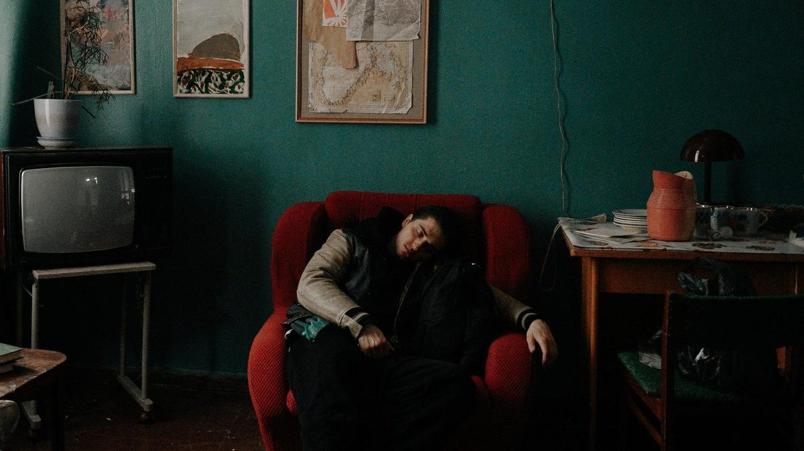

# Ад пуст, все бесы — в кино. 19 мая состоялась премьера нового сезона одного из самых обсуждаемых сериалов последнего времени «Фишер»

- **URL:** https://novayagazeta.ru/articles/2025/05/22/ad-pust-vse-besy-v-kino
- **Дата:** 2025-05-22
- **Автор:** Лариса Малюкова

## Ад пуст, все бесы — в кино

## 19 мая состоялась премьера нового сезона одного из самых обсуждаемых сериалов последнего времени «Фишер»

Кадр из сериала «Фишер»

Если бы многосерийный криминальный психотриллер был про серийного монстра, которым в свое время пугали в пионерских лагерях, он был бы столь же неинтересен, как и множество подобных страшилок для щекотания нервов.

«Фишер» же лишь формально был про одного из самых мерзких маньяков СССР Сергея Головкина, которого при жизни называли учеником Чикатило и которого расстреляли в 1996-м. Это был последний смертный приговор, приведенный в исполнение в Советском Союзе перед введением моратория.

В сущности, это тру-крайм на актуальную тему: о природе иррационального зла и причинах его вирусного распространения в обществе. Помните, как в первом «Фишере» толпа набрасывается на мать преступника, которая ничего не подозревала об убийствах, но толпа готова ее растерзать? И еще один аспект проблемы меня привлек — это история следователей, они же вынуждены в бесконечном зле ежедневно копаться, закапываться. И эта постоянная связь со злодейством способна разрушить психику человека. Как они с этим справляются?

В новом сезоне те же авторы — Сергей Кальварский и Наталья Капустина. А вот вместо Любови Львовой и Сергея Тарамаева в режиссерском кресле — Александр Цой («Жвачка»), оператор — Максим Осадчий («Сталинград»).

Снова 90-е как прореха времени между эпохами. Одна страна со своим устоявшимся, хотя и ветхим, строем разрушилась, другая на ее фундаменте замерла, не зная, куда двигаться.

Снова в основе сюжета реальные события. Серия убийств в Краснодарском крае в 90-е, где орудовал «кубанский душитель» Леван Ароян (между прочим, до сих пор живой, отсиживается в психушке).

Кино о монстрах среди нас и внутри нас. Один из слоганов фильма: «Зла, когда много становится, его не спрячешь». Авторы исследуют темную сторону мира, куда не хочется заглядывать, но нередко темная сторона сама заглядывает к нам.

В первых кадрах по мрачному тюремному коридору идет Евгений Боков (Иван Янковский), заходит в камеру к подследственному Фишеру (Андрей Максимов). Надо бы тому вспомнить, сколько еще убийств совершил, кроме 11 доказанных. Надо бы вспомнить, где закопал. Надо бы его дожать.

Кадр из сериала «Фишер»

А тут новое дело. В небольшом южном городке Курортный в семье гляциолога Ершова беда — им киднепперы прислали палец похищенного ими ребенка. Ершов мчит с сумкой собранных денег (170 тысяч долларов) на встречу с бандитами, которые диктуют ему путь по пейджеру, но разбивается на горной дороге. Его жена перед самоубийством от отчаяния отправляет письмо в Генпрокуратуру Бокову. И едет он разбираться на курорт. Здесь знакомится с Надеждой Райкиной (Ирина Старшенбаум), возглавляющей милицию города Курортный (Александра Бортич в новом сезоне не участвует), женщиной сильной, решительной, палец в рот не клади. И когда московский сыщик наезжает на местных за нерасторопность, она интересуется: что же Боков, получив письмо от Ершовой, сразу им не сообщил? Может быть, удалось бы остановить несчастную женщину? Неужели верит московский сыскарь исключительно в себя?

Здесь, в Курортном, — пустынные пляжи с галькой, застывшее колесо обозрения, застывшая внесезонная жизнь. В старинном особняке с садом собирается странное общество высоконравственных людей, соединяющих идеи духовности с ростом капитала. Их декларация: не только выжить в трудные времена, но и помочь ближнему. Они и помогли Ершову собрать нужную сумму. Кто ж знал, что так все случится.

Общая цветовая тональность — пожухлая, приглушенная. Тускло освещенные казенные помещения, темноватые квартиры. А вокруг — серо-серебристые просторы с похолодевшим морем, практически без солнца.

Поддержите нашу работу!

1000 500 300 Нажимая кнопку «Стать соучастником», я принимаю условия и подтверждаю свое гражданство РФ

Если у вас есть вопросы, пишите [email protected] или звоните:+7 (929) 612-03-68

Между тем ползет по городу слух об убийствах девушек. Их уже четыре. И мэр (Александра Ребенок) должна решить: обнародовать ужасы или скрыть. Милиции следует поторопиться. Еще есть любопытный персонаж Степана Девонина: местный радиоведущий, который должен по радио сообщить, что нашел сумку с деньгами. Ту самую, Ершова. И на его объявление откликаются неизвестные.

Кадр из сериала «Фишер»

Боков наконец-то избавился от дурного шоканья, учит французский, теперь у него собака Шо. Он, конечно, профи, но и ему нелегко — невроз и выгорание пытается лечить с помощью драки с местными урками. Его юный помощник Ваня — из местных: смотрит на легендарного московского сыщика с восхищением — самого Фишера вычислил. И учится Ваня у старшего коллеги правильно драться.

Но чтобы отыскать преемника Фишера, придется им самим погружаться во тьму.

По первым сериям судить трудно, но мне показалась режиссура Александра Цоя крепкой, хотя и более очевидной. У Тарамаева и Львовой в первом сезоне было больше чувственности, зыбкой непредсказуемости в каждом моменте. Словно они что-то нам недорассказывают.

Но, кажется, авторам удалось вновь создать приличный по качеству мрачный и захватывающий психотриллер с атмосферой, выверенными диалогами. И снова — не только про маньяка. О том, что ад — пуст.

Лариса Малюкова ведет телеграм-канал о кино и не только. Подписывайтесь тут.

### Этот материал входит в подписку

Смотровая площадкаКино с Ларисой Малюковой

### Добавляйте в Конструктор свои источники: сайты, телеграм- и youtube-каналы

Войдите в профиль, чтобы не терять свои подписки на разных устройствах

Поддержите нашу работу!

1000 500 300 Нажимая кнопку «Стать соучастником», я принимаю условия и подтверждаю свое гражданство РФ

Если у вас есть вопросы, пишите [email protected] или звоните:+7 (929) 612-03-68
