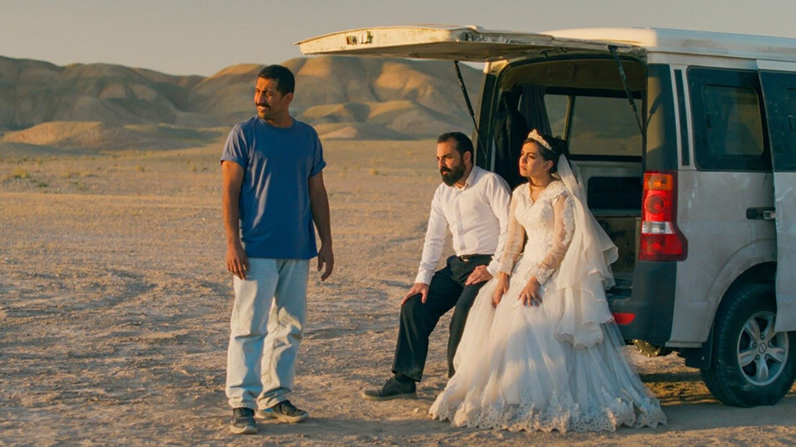

# Это был просто фильм. Итоги Каннского фестиваля

- **URL:** https://novayagazeta.ru/articles/2025/05/26/eto-byl-prosto-film
- **Дата:** 2025-05-26
- **Автор:** Лариса Малюкова

## Это был просто фильм

## Итоги Каннского фестиваля

Кадр из фильма «Это был просто случай»

Впервые церемония Закрытия фестиваля оказалась под угрозой. Почти полдня на западе Приморских Альп был полный блэкаут. Злоумышленников, распиливших опоры ЛЭП, питающей Канны, ищут. К счастью, на фестивале работали резервные генераторы, пресс-центр сообщил, что шоу непременно состоится во Дворце фестивалей. Потом и свет дали.

78-й Каннский кинофестиваль и его награды, отразившие нынешние умонастроения Европы, был сверхполитизирован. Хотя в призовом списке главного жюри под управлением Жюльетт Бинош — в основном сильные картины.

На церемонию Закрытия фестиваля Бинош пришла в костюме в цветах французского флага (на Открытии она читала стихотворение палестинской фотожурналистки Фатме Хассуне).

Впервые в истории Каннского кинофестиваля в конкурсе участвовал иракский фильм. «Торт для президента» — режиссерский дебют режиссера Хасана Хади. Именно он получил приз «Золотая камера». История про то, как девятилетнего ребенка обучали поздравить президента Хусейна с днем рождения.

Одну из наград «Особого взгляда» получила картина «Однажды в Палестине». Режиссеры братья Тарзан и Араб Нассеры. Герой фильма живет в Газе, ХАМАС усиливает контроль, его лучший друг найден мертвым. Он хочет найти убийцу.

Юная дебютантка Надя Меллити неожиданно получила награду за лучшую женскую роль в фильме «Младшая сестра» Афсии Эрзи, в котором она играет суровую дочь из благочинной алжирской семьи, живущей во Франции. Девушка-подросток пытается найти свою сексуальную ориентацию в консервативной иммигрантской среде. Жаль, проигнорировали тонким пером выписанную трагикомическую роль Ренаты Реинсве («Сентиментальная ценность»).

Мне показалось, что тема конфликта на Ближнем Востоке, поддержка Палестины просматривалась и в отборе, и в решениях жюри. Стоит ли удивляться, что картину Кирилла Серебренникова заблаговременно не включили в конкурс.

В ней «Моссад» охотится за нацистским преступником Менгеле. В ней звучит тема Холокоста. Сегодня здесь это неактуально. Роль Аугуста Диля, сыгравшего Доктора Смерть на протяжении всей его жизни — одна из лучших, уж точно могла получить награду.

Кадр из фильма «Сентиментальная ценность»

Фильм «Сентиментальная ценность», который снял Йоаким Триер, удостоен Гран-при жюри. Фильм о попытке с помощью искусства обрести себя и потерянных близких. Известный режиссер Борг (великолепный и харизматичный Скарсгард) приглашает свою дочь, талантливую актрису Нору (Рената Реинсве) в свой самый личный фильм.

«Я не думаю, что искусство — это просто то, что вы делаете ради цели или понимания, — сказал Триер, получая приз. — Мы не знаем, почему мы это делаем. Это то, что я наблюдаю за своими маленькими детьми. Они поют и танцуют до того, как умеют говорить. Но это другой язык, это может быть язык объединения».

Приз жюри получила Маша Шилински за семейную сагу «Звук падения», действие которой происходит на протяжении четырех поколений в одном фермерском доме. Она разделила эту награду с испано-французским режиссером Оливером Лаше за «Сират» — ядреный веселый и страшный рейв в марокканской пустыне, снятый как пыльный Апокалипсис.

Призы за режиссуру и лучшую мужскую роль (Вагнер Моура) ушли «Секретному агенту» — мощному историческому триллеру Клебера Мендонсы Фильо, в котором помимо густо закрученной политизированной интриги есть тайна, воздух, медленно нарастающий саспенс. Мендоса сгущает жанр политического триллера до черной комедии: в акульем брюхе обнаруживают человеческую ногу. СМИ спешат распространить новость о «волосатой ноге», которая пугает ночами людей. Здесь гигантское число синефильских отсылок. Герою Вагнера Моуры должна помочь бежать из Сан-Паулу, а потом и из страны таинственная группа партизан. Это кино о машине репрессий, повседневной рутине деспотии и подпольной сети сопротивления в Бразилии 70-х во времена диктатуры, когда человеческие жизни считались расходным материалом.

Кадр из фильма «Звук падения»

Иранский режиссер Джафар Панахи получил «Золотую пальмовую ветвь» за фильм «Это был просто случай», вдохновленный его пребыванием в тюрьме.

В Каннах любят Панахи. Здесь приветствовали его работы, и когда он был под арестом. В 2010 году режиссера обвинили на родине в антиправительственной деятельности, приговорив к шести годам тюрьмы. Срок заменили на домашний арест, запретили снимать кино, выезжать из страны, общаться с журналистами. Но он продолжал в подпольных условиях создавать картины, которые потом отбирали ведущие киносмотры мира. Самая известная среди них — «Такси» (два приза Берлинале), картину он снял на видеорегистратор автомобиля. На последнем Венецианском кинофестивале была иранская картина «Свидетельница» Надера Севара о старой учительнице, борющейся за свои права. Автором сценария и режиссером монтажа был Панахи.

Недавно власти сняли запрет на его выезд из страны, поэтому свой одиннадцатый фильм «Простая случайность» в Каннах он представил сам. Это притча о праве на месть. И уязвимости мстящих.

Поддержите нашу работу!

1000 500 300 Нажимая кнопку «Стать соучастником», я принимаю условия и подтверждаю свое гражданство РФ

Если у вас есть вопросы, пишите [email protected] или звоните:+7 (929) 612-03-68

Действие происходит в современном Иране. Вахид (Вахид Мобассери) работает в своей автомастерской, куда поздним вечером приезжает после небольшой аварии семья: муж, беременная жена и маленькая дочь. После того, как они сбили собаку, машина барахлит. В мужчине Вахид узнает человека, который допрашивал его в тюрьме. После недолгих раздумий герой решает отомстить и убить палача. Но в последний момент его начинают терзать сомнения: а точно ли это тот самый Эгбал по кличке Деревянная Нога, который вместе с подельниками допрашивал и мучил заключенных?

Режиссер Джафар Панахи, получивший Золотую пальмовую ветвь 78-го Каннского кинофестиваля за фильм «Простая случайность». Фото: AP / TASS

Он обращается за помощью к рассудительной и проницательной Шиве (Мариам Афшари непрофессиональная актриса, тренер по карате, но в кадре органична, камера ее любит). Свадебный фотограф Шиве сейчас делает фотосессию жениха и невесты (невеста тоже была в заключении). Потом к ним присоединяются еще жертвы режима: продавец книг, взрывоопасный, кипящий мщением и злостью Хамид (Мохамад Али Элиасмер). Ну и жених с невестой, разумеется. Постепенно в микроавтобусе собирается довольно фриковая компания «мстителей». (Решительней других — невеста в фате.) Пока все они не окажутся на месте предполагаемой казни, выглядящим условно, если не сказать театрально: высохшее дерево, пустыня и вырытая для гипотетической казни могила.

Решатся ли они привести свой приговор насильнику и мучителю в исполнение?

Читайте также

Путешествие из Освенцима в Буэнос-Айрес и обратно

Состоялась мировая премьера фильма Кирилла Серебренникова «Исчезновение Йозефа Менгеле»

Это история о жертвах и палачах, мести и милосердии, чувстве вины, неизживаемых травмах, которые порождают ненависть. О циклической природе насилия, которое превращено в повседневную «банальность зла» государственными институциями. О моральном болоте существования в стране, где травмированные жертвы режима соседствуют с людьми, которые их преследовали, терроризировали. В фургоне разгорается моральный спор, как же им поступить, в самый острый момент спор прерывается полицейскими — фургон неправильно припаркован. Придется давать взятку: улыбчивый полицейский достает терминал и сам забивает немаленькую сумму. Все как всегда. Панахи смешивает жанры, превращая политический триллер в притчу, притчу — в комедию абсурда.

В одном из интервью режиссер рассказал, что, когда в очередной раз оказался в тюрьме, его поместили в общую камеру с 300 другими заключенными, большинство из которых в разных формах выступали против правительства. Но они никак не могли договориться о лучшей тактике действий. Кинорежиссер был всерьез обеспокоен, понимая, что разногласия между этими людьми станут еще острее после их освобождения. Одни просто будут «жить свою жизнь», другие — искать выход переполняющей их мести. Тогда и зародилась идея этого «просто фильма».

«Я думаю, сейчас самое время спросить всех, всех иранцев, чьи мнения отличаются от мнений других, в Иране и во всем мире… — начал он. — Я хотел бы попросить их об одном: отложите все проблемы и разногласия в сторону. Самое главное — это, конечно, наша страна и свобода нашей страны».

Панахи теперь обладатель трех главных призов трех главных кинофестивалей мира: Каннского, Венецианского и Берлинского, как Клузо, Антониони и Олтман.

Думаю, для жюри это был скорее красивый этический выбор, чем эстетический, хотя картина «Это был просто случай» кажется мне интересной. По многим причинам у нее теперь реальный шанс претендовать на «Оскар». Золотая каннская ветвь — мощный локомотив в продвижении «просто фильма». Мы это помним по «Паразитам» и «Аноре».

### Этот материал входит в подписки

Смотровая площадкаКино с Ларисой Малюковой

Культурные гидыЧто читать, что смотреть в кино и на сцене, что слушать

### Добавляйте в Конструктор свои источники: сайты, телеграм- и youtube-каналы

Войдите в профиль, чтобы не терять свои подписки на разных устройствах

Поддержите нашу работу!

1000 500 300 Нажимая кнопку «Стать соучастником», я принимаю условия и подтверждаю свое гражданство РФ

Если у вас есть вопросы, пишите [email protected] или звоните:+7 (929) 612-03-68
