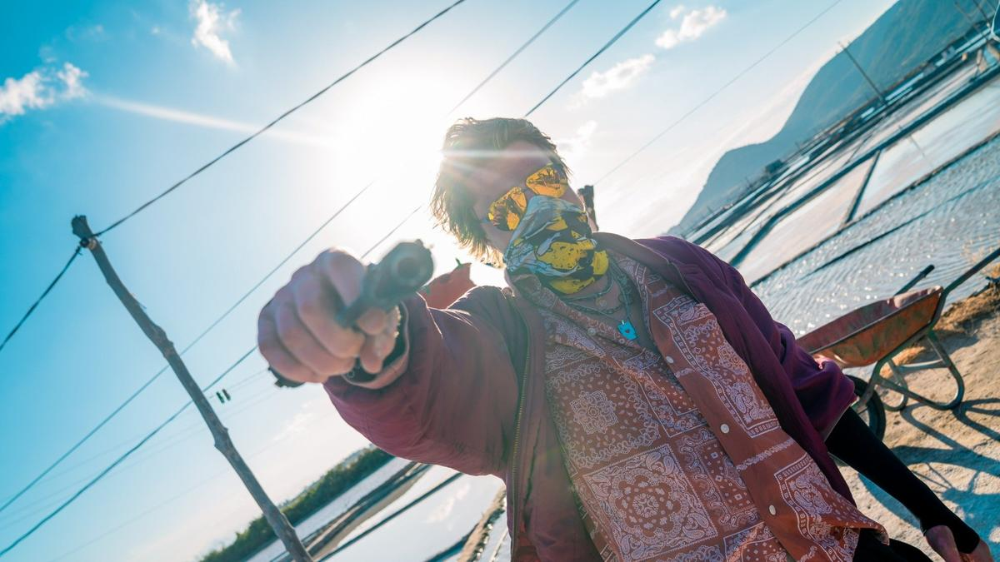

# На кайте в Нячанг. 11 июня на платформах Start и Okko стартует российско-вьетнамский триллер «Высокий сезон»

- **URL:** https://novayagazeta.ru/articles/2025/06/10/na-kaite-v-niachang
- **Дата:** 2025-06-10
- **Автор:** Лариса Малюкова

## На кайте в Нячанг

## 11 июня на платформах Start и Okko стартует российско-вьетнамский триллер «Высокий сезон»

Кадр из сериала «Высокий сезон»

Пропавшая девушка, кидалово, море кайтов, мотоциклы, заезжие и местные банды на экзотических азиатских курортах. Это тебе не Евпатория, детка.

«Высокий сезон» — бодрый экшн с аллюзиями на «Светлое будущее» и «Круто сваренные» Джона Ву или на «Карты, деньги, два ствола» Гая Ричи.

Все начнется безобидно, по-каникулярному. Молодая пара — кардиолог Миша (Павел Попов) и «просто красавица» Аня (Анна Завтур) — наслаждается последними днями отпуска на солнечном побережье вьетнамского Нячанга. А постоянный оператор Стаса Иванова Степан Бешкуров («Король и Шут», «ЮЗЗЗ», «Немцы») и его камера — наслаждаются ослепительными открыточными видами и модельной внешностью Анны Завтур («Отпуск в октябре», «Немцы», «Цикады»). Крабы съедены, вино выпито, чемоданы почти собраны…

Курортная идиллия рушится, когда неожиданно появляется Саша Сахар (Артур Бесчастный) — бывший возлюбленный Ани, которого она считала мертвым (или исчезнувшим — не важно). А с ним и его криминальная шайка. После этой встречи «бывших» девушка и исчезнет. Не дождавшись помощи от местной полиции, Миша сам займется поисками и ввяжется в круговорот криминальных событий: темные сделки и аферы, перестрелки и погони. Ему помогает капитан Народной Армии Вьетнама — бесстрашная Тао (вьетнамская актриса Сиу Нгуен), которая вернулась в свой город, знакомый до слез, чтобы разобраться в обстоятельствах гибели младшей сестры — она тоже внезапно исчезла. Постепенно Михаил начинается понимать, что совершенно не знал свою девушку.

Бело-золотые пески и лазурная вода Южно-Китайского моря, переливающиеся всеми оттенками зеленого холмы, тропические острова, ущелья и джунгли посреди залива, пляжные вечеринки, оживленные ночные улицы мегаполиса.

Кадр из сериала «Высокий сезон»

Среди козырных карт криминального экшена — экзотика местных пейзажей и фактур. Экстремальный кайтсерфинг (все небо над заливом усеяно воздушными змеями, управляемыми серфингистами), вечное лето, шальной праздник непослушания, серферские тусовки и вольные кайтеровские деревушки, китайская триада, шальные деньги и фальшивые деньги, куча стволов. И порнушка, которую снимают подпольно по соседству. Разношерстная группа Сахара (Артур Бесчастный с химической завивкой) участвует в мошеннических авантюрах и опасных криминальных операциях. Решает, к примеру, раскрутить русского лоха с портфелем кэша, покупающего фейковые брендовые часы. А заодно они барыжат наркотой. У них тут полное баунти и вседозволенность. Самое удивительное, что любимая и ненаглядная Мишина невеста Анна Андреевна, 1999 года рождения, с ними заодно.

Съемки проходили в 2024 году в городах Вьетнама — Фанранге, Нячанге и густонаселенных районах Хошимина. Полтора года плотной работы. Режиссер — из ведущих: Стас Иванов («ЮЗЗЗ», «Немцы», «Одним днем»).

При всей густоте событий, красочной ослепительно солнечной картинке, крепкой режиссуре опытного Стаса Иванова — сама история пока не кажется ни экзотичной, ни удивляющей.

Поддержите нашу работу!

1000 500 300 Нажимая кнопку «Стать соучастником», я принимаю условия и подтверждаю свое гражданство РФ

Если у вас есть вопросы, пишите [email protected] или звоните:+7 (929) 612-03-68

Кадр из сериала «Высокий сезон»

Иванову лучше удаются сюжеты, основанные на хорошей литературе (как «Немцы», например, по роману Александра Терехова). Здесь он писал сценарий сам. Возможно, в следующих сериях авторам удастся зарядить историю и новой энергией, и неожиданными арками героев.

Высокий сезон — международный проект, помимо Вьетнама в титрах значится Ирландия.

Больше о кино

Лариса Малюкова ведет телеграм-канал о кино и не только. Подписывайтесь тут.

### Этот материал входит в подписки

Смотровая площадкаКино с Ларисой Малюковой

Культурные гидыЧто читать, что смотреть в кино и на сцене, что слушать

### Добавляйте в Конструктор свои источники: сайты, телеграм- и youtube-каналы

Войдите в профиль, чтобы не терять свои подписки на разных устройствах

Поддержите нашу работу!

1000 500 300 Нажимая кнопку «Стать соучастником», я принимаю условия и подтверждаю свое гражданство РФ

Если у вас есть вопросы, пишите [email protected] или звоните:+7 (929) 612-03-68
