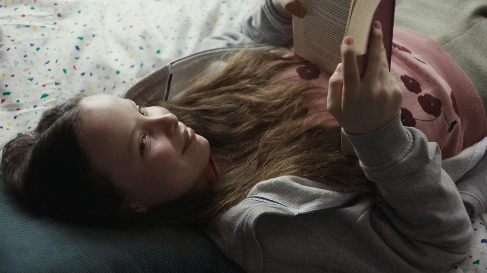

# Как вылечить правду. На экраны выходит «Что знает Мариэль» — любопытная скандинавская сатирическая парабола

- **URL:** https://novayagazeta.ru/articles/2025/06/17/kak-vylechit-pravdu
- **Дата:** 2025-06-17
- **Автор:** Лариса Малюкова

## Как вылечить правду

## На экраны выходит «Что знает Мариэль» — любопытная скандинавская сатирическая парабола

Кадр из фильма «Что знает Мариэль»

Только представьте, кто-то из ваших близких получил возможность слышать вас, наблюдать за вами денно и нощно. И вроде бы вы не делаете ничего предосудительного… Но ситуация наверняка выйдет из-под контроля и окажется кошмарно непредсказуемой. Ведь даже смотрясь в зеркало, мы видим свою улучшенную копию.

Фильм из конкурсной программы Берлинале — вторая полнометражная работа немецкого режиссера и сценариста Фредерика Хамбалека.

Получив пощечину от одноклассницы, двенадцатилетняя Мариэль (Лэни Гейзелер) сделалась телепатом. Но она не просто «читает мысли». Она «слышит» все, что говорят, и знает все, что делают ее родители. Словно превращается в скрытую, безостановочно преследующую их камеру.

Впрочем, в скромной комедийной притче «Что знает Мариэль» — ничего криминального родители не делают. Люди как люди. На первый взгляд ведут обычную и даже весьма благополучную жизнь: современный загородный дом, высокооплачиваемые руководящие должности.

Правда, в офисе мама (Юлия Йенч) рискованно флиртует с сослуживцем (Мехмет Атески) во время тайных перекуров, и их разговоры о сексе переходят рамки «рабочих отношений». А ее отец Тобиас (Феликс Крамер), отвечающий за стратегии маркетинга для своей издательской компании, скрывает, что на работе его не ценят. Ту самую обложку журнала, которой он гордится, молодые и амбициозные коллеги с язвительной иронией отвергают. Мариэль переживает вместе с отцом его публичное унижение. Хотя дома он изображает победительную уверенность, почти искренне верит в собственную ложь, как в правду. И только Мариэль и ее всевидящее око отрезвляет его от очередной дозы самообмана, обнаруживая страх потерять место ведущего дизайнера.

Да они просто не готовы к тому, чтобы их личное пространство оказалось на всеобщем обозрении, чтобы за завтраком Мариэль могла обсуждать их «скрытое», тайное. Их реакции, непредсказуемые для них самих, гуляют в пространстве от изумления, недоверия — до страха и отвращения. Поначалу они пытаются вести себя лучше, притворяться… но все становится только хуже. Ну а если полностью отказаться от притворства, идти в своих слабостях до конца — патовую ситуацию исправить?

Во многих семьях родители следят за своим детьми, устанавливая в их телефонах специальные программы, а в комнате малышей — камеры и радионяни. Идея фильма и родилась в тот момент, когда Хамбалек впервые увидел в доме у друзей чуткую рядионяню. Но в интригующем мысленном эксперименте этот сюжет меняется на противоположный: подросток не просто следит за родителями, но становится их совестью, с которой непросто договориться, зеркалом их истинных неприглядных «Я». При этом непогрешимый родительский авторитет трещит по швам. И кто тут взрослый — для авторов большой вопрос (особенно когда родители обсуждают: не стоит ли дочери снова вкатить пощечину, чтобы ее «вылечить»?)

Кадр из фильма «Что знает Мариэль»

Как будто бы абсурдист Лантимос решил снять семейную драму. Фильм как актуальный социально-психологический эксперимент с открытым финалом (страх современного человека быть постоянно «на обозрении»: от камер слежения до прозрачных банковских карт и биометрии).

Про страх обнаружения не видимостей, но сущностей в том круговом спектакле под названием «жизнь», где все люди, как говорил Шекспир, — актеры.

Поддержите нашу работу!

1000 500 300 Нажимая кнопку «Стать соучастником», я принимаю условия и подтверждаю свое гражданство РФ

Если у вас есть вопросы, пишите [email protected] или звоните:+7 (929) 612-03-68

Ну хорошо. Правда и только правда. А что делать с этим знанием? С этой правдой? Почему она не приносит счастья, а только все разрушает, причиняет боль самым близким. И как избавиться от этого невыносимого недуга — правды?

Главные герои этой картины — взрослые. Жаль, что протагонист — Мариэль, по сути, остается в тени их отношений, она здесь лишь катализатор, функция. Мы так и не узнаем о ее собственном восприятии и переживаниях всей этой обрушившейся на голову девочки правды. А жаль.

Читайте также

Круто ты попал на TV

С 12 июня на экранах комедийный триллер «Как стать миллионером» Самира Оливероса

Тем не менее картина Хамбалека, в чем-то напомнившая «Гипноз» Эстлунда, смотрится на одном дыхании. За комедией положений — конфликт разрушительной честности и лжи во благо, которые меняются местами: и уже ложь рвет семейные связи, а честность позволяет взглянуть по-новому на устоявшиеся отношения близких. Ведь попытались же взрослые создать «идеальную жизнь» для ребенка, демонстрируя образцовое правильное поведение. А потом махнули рукой, понимая, что они уже проиграли.

Премьерные показы картины пройдут в Петербурге, 18 июня в 19.50, в кинотеатре «Аврора» и в Москве, 19 июня в 20.00, в «Синема Парк Мосфильм».

Лариса Малюкова ведет телеграм-канал о кино и не только. Подписывайтесь тут.

### Этот материал входит в подписку

Смотровая площадкаКино с Ларисой Малюковой

### Добавляйте в Конструктор свои источники: сайты, телеграм- и youtube-каналы

Войдите в профиль, чтобы не терять свои подписки на разных устройствах

Поддержите нашу работу!

1000 500 300 Нажимая кнопку «Стать соучастником», я принимаю условия и подтверждаю свое гражданство РФ

Если у вас есть вопросы, пишите [email protected] или звоните:+7 (929) 612-03-68
