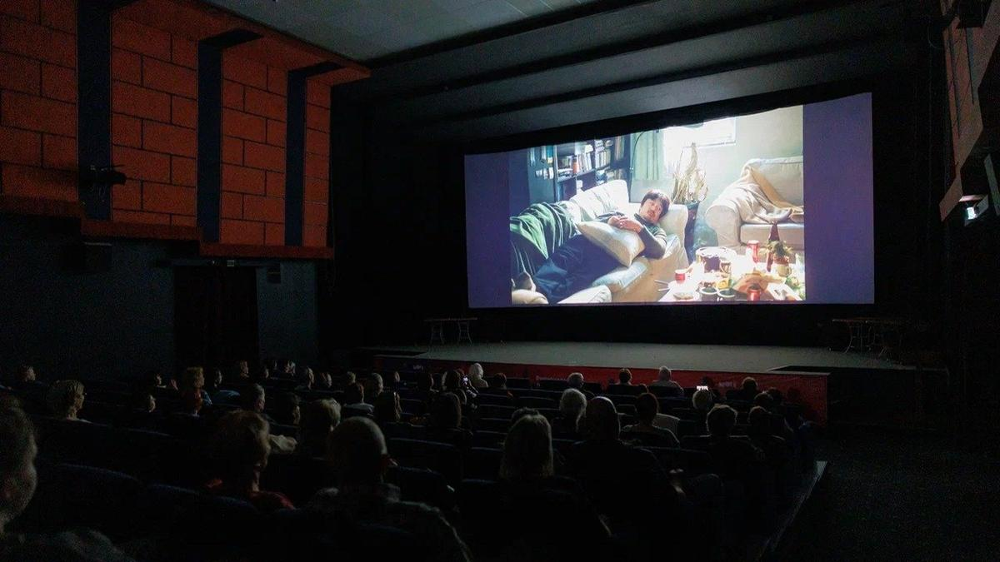

# С Запада на Восток. Завершился фестиваль «Западные ворота» в Пскове. Несмотря на название, в конкурсе преобладали картины с Востока

- **URL:** https://novayagazeta.ru/articles/2025/07/08/s-zapada-na-vostok
- **Дата:** 2025-07-08
- **Автор:** Лариса Малюкова

## С Запада на Восток

## Завершился фестиваль «Западные ворота» в Пскове. Несмотря на название, в конкурсе преобладали картины с Востока

Фото: Кирилл Кожуков

Главный приз неожиданно получила индийская комедия «Потерявшиеся невесты» болливудского режиссера Кирана Рао. Как жен после свадьбы перепутали, потому что они были в одинаковых накидках с золотым шитьем. И потому что ночная остановка поезда была слишком короткой. Свадебный фильм-перевертыш «Laapataa Ladies» представлял Индию на «Оскаре». Милый добрейший Болливуд, не игнорирующий социальные проблемы. Обнаружить проблему мешает плохая связь. Вроде мобильники есть, но не ловят. Из любопытных особенностей: одна из невест не называет имени мужа, когда ее спрашивают. Это культурное табу.

Как сказал председатель жюри Ринат Давлетьяров: «Был бы другой состав судейства, все было бы инче». Не будем с ним спорить.

Кадр из фильма «Потерявшиеся невесты»

Кыргызский триллер «Сделка на границе» Дастана Жапара Рыскелди — приз жюри. Из лучших в программе.

Два близких друга Азамат и Самат по тайным горным тропам через горные реки доставляют наркотики за немалые деньги (у Самата больна сестра). Волей случая они встречают девушку, сбежавшую из рабства. Азамат решает спасти ее любой ценой, хотя его хозяева готовы продать девушку обратно. Так начинается рискованный и своевольный путь героя, который действует вопреки законам банды. По человеческим законам. Не случайно его тренер по борьбе возлагал на него большие надежды.

В фильме можно угадать мотивы «Заложницы», «Исчезнувшей» и множества голливудских триллеров, связанных с похищением. Но киргизскому режиссеру удалось насытить расхожий сюжет самобытными красками, тревожным воздухом «пресеченной» горной местности, на которой не скрыться героям.

Кадр из фильма «Сделка на границе»

Ощущением тотальной опасности и незащищенности от беспредела сильных мира сего — противостоять которому можно только эмпатией, гуманитарными ценностями… даже ценою собственной жизни.

А китайский фильм «Зеленая волна» режиссера Лея Сю жюри проигнорировало, хотя эта картина, в отличие от многих, помимо истории, обладает редким качеством — созданием мира, в котором живут-поживают герои. Кажется, что дядюшка Вэй (Чаоин Сюй) работал на стройке задолго до начальных титров фильма. И вот однажды в пыли и песке он обнаруживает коробку с бледно-голубой керамической миской. А вдруг она представляет ценность? Он едет в Пекин к сыну Вэй Фэю (Чуанцзюнь Ван) — известному сценаристу… во всяком случае, так думает отец. Ведь как раз сейчас на экраны выходит новый фильм по его сценарию. Но у сына все складывается более прозаично. Он ищет свое имя в интернете и… не находит. В книжном его повесть пылится на задворках. Он идет на премьеру своего фильма и ужасается увиденному: от сценария и крохи не осталось в этой бойне, а зритель пялится в телефон или плюется, гневно вычисляя автора. Тем временем папаша Вэй пытается загнать подороже миску. Сначала в антикварной лавке, но предлагают мало денег. Случайно они с другом набредают на роскошный офис по оценке исторических раритетов. Там и обнаружат с помощью высокоточной техники, что покрытая глазурью миска почти бесценная, принадлежит династии «Северный Сон». Разумеется, папаша Вэй поверит. Разумеется, напрасно…

Видимое и сущностное. Вымечтанное и реальное. Эти двое, «далекие близкие», нелепые раздолбаи, двигаясь сквозь мрак проблем, начинают понимать и слышать друг друга.

Меланхолическая трагикомедия про людей со своими недостатками, ошибками, изъянами. Как говорил Воланд: «Люди как люди».

«Огниво против Волшебной Скважины» — дебют Анджея Петраса в полнометражном формате. Фильм Открытия фестиваля «Западные ворота».

Недавно уже выходило «Огниво» Александра Войтинского — очередная нарядная зрительская сказка.

«Огниво» Анджея Петраса и продюсера Анастасии Разлоговой (дочери киноведа Кирилла Разлогова) делалось очень-очень долго за микробюджет. Поэтому и получился немного кустарный, рыхлый, но местами самобытный, ни на что не похожий фильм, в котором сказка Андерсена погружена в готические мотивы немецкого фольклора, в духе «Гензеля и Гретель», мрачную атмосферу и подчеркнутую театральность, как в фильмах Тима Бертона.

Фото: Кирилл Кожуков

Из-за дурного предсказания — принцессе Грете (Полина Войченко) суждено выйти замуж за солдата — ее спрятали в башню. И она там тоскует. Солдата отправили на нескончаемую войну. А злобный обер-полицмейстер (Антон Адасинский), похожий на Кощея, с помощью Волшебной Скважины управляет Данией, манипулирует Королем и Королевой и собирается сам жениться на принцессе. Он же не знает, что солдат Ганс (Алексей Демидов) уже обхитрил коварную хохотушку-ведьму Фьюти Пьюти (Ольга Лапшина), спустился в подземелье и завладел волшебным огнивом.

Сюжет нового «Огнива» кружит и путается, и в отсутствие крепкой руки режиссера монтажа растягивается. Марионетки (сами по себе отличные) вступают в игровое действие, чтобы сшить недостающие фрагменты действия. Но временами просто его дублируют.

И в то же время есть в этом самодельном, рукотворном кино обаяние, энергия авторских усилий создать нечто вне общего ряда «сказочного конвейера».

Поддержите нашу работу!

1000 500 300 Нажимая кнопку «Стать соучастником», я принимаю условия и подтверждаю свое гражданство РФ

Если у вас есть вопросы, пишите [email protected] или звоните:+7 (929) 612-03-68

Прежде всего музыка, сочиненная самим Анджеем Петрасом, композитором и режиссером. Я даже легко могу представить себе современную оперу «Огниво» с номерами — ариями и хорами из этого проекта. Музыка — микс советской (вроде зацепинских шлягеров из «31 июня») и современной классической музыки. Неожиданные гармонические соцветия, удивительной сложности хоры. Колкие тексты. «У вашего величества огромное количество неведомых врагов». Сплотимся же, датчане, вокруг короля! Впрочем, марионетками ощущают себя и сами Король (Сергей Барковский) с Королевой (Юлию Ауг с помощью компьютера «видоизменили» до полной неузнаваемости, в титрах ее нет), их движения кукольные, им кажется, будто их кто-то дергает за веревочки. Не Обер ли Полицмейстер руководит этим кукольным театром? И внимательно следит за гражданами прекрасной столицы, подозревая их во всем («Если на улицах Копенгагена идет дождь, не виноваты ли его жители?»).

Кадр из фильма «Огниво против Волшебной Скважины»

Три андерсеновские собаки здесь — доморощенные ржавые механизмы. У третьей, с тележкой вместо хвоста, на носу то ли факел, то ли зажигалка. Есть запоминающиеся детали: гигантские лупы, кружевной метроном, Король с Королевой, которых «укачивает» прямо на троне, тайный механизм, который и «заводит всю эту шарманку». А Сказочник — это ребенок со своим выдуманным театром. Получилось создать «островное королевство», отдельное от всего мира. Правда, временами действие замирает и не двигается, как в старых советских телеспектаклях. Детям такой фильм покажется слишком сложным и долгим. Взрослых на сказку не зазвать.

Многие зрители на показе во время Открытия фестиваля «Западные ворота» тихонько покидали зал. Оставшиеся аплодировали. Уносили с собой слова финального хора: «Не будет вынь да положь, / Сам разберись, где правда, где ложь».

На тему правды и лжи была дискуссия «На войне как на войне» — в честь нестареющей трагикомедии Виктора Трегубовича.

Режиссер Дмитрий Месхиев вспомнил, как снимал фильм «Свои» во Пскове и подо Псковом. Потому что драматург Валентин Черных («Москва слезам не верит») — из этих мест, писал сценарий по своим юношеским воспоминаниям об оккупации, которую здесь пережил. Нашли старую деревню, ее для съемок достроили. В съемках принимали участие и местные жители. Семейные воспоминания соединялись с вымыслом.

Вообще, менее всего интересно было слушать кинематографистов. Все предсказуемо, даже когда справедливо. Про то, что военная тема сильно коммерциализировалась. В кино про войну пришел глянец, фальшак: все искусственное — и декорации, и грим, и актеры (об этом мне с горечью говорил еще Владимир Осипович Богомолов, автор остросюжетного, при этом почти документального романа «В августе 44-го», знал бы он, что сейчас по его книге сняли сразу два скороспелых сериала). Снимают быстро и… дорого. Зато много хромакея, спецэффектов, графики, заковыристых полетов камер. Много, как заметили выступающие, патриотической показухи. И ноль сопереживаний. В советское время при всех цензурных препонах снимали кино не столько про войну, сколько про людей.

Петра Тищенко. Фото: Кирилл Кожуков

Самым любопытным было выступление историка Петра Тищенко, председателя Архивного комитета Санкт-Петербурга об обнаруженных документах и новых знаниях. О цене победы.

Он говорил о постепенной смене парадигмы. Коллективная память, подвиг миллионов, жертвы, все это важно. Но каждая жертва — трагедия.

Сколько в Псковской области незахороненных защитников? Во многих регионах в 90-е начали вести книги памяти, чтобы вспомнить всех поименно. Более того, во многих семьях стали искать личную историю. В эти годы в архивы было сделано невиданное число запросов. Создаются документальные порталы, на которых описан каждый день войны.

Рассекречены документы о Штабе партизан. О рыбаках в блокадном Ленинграде, о работе журналистов. Лишь однажды не вышла в окруженном городе газета из-за отсутствия электричества. Но уже на следующий день проблема была решена. Историки обнаруживают массу любопытных документов. Например, только оплатив жилье и предъявив жировки, ленинградец мог получить разрешение на эвакуацию. Было вывезено из города 400 тысяч детей. Сколько семей тогда было разорвано. Как люди искали друг друга. Многие так и не нашли. Есть списки эвакуированных. Каждая семейная история — фантастические сюжеты.

И вот еще. «Ленфильм» передал в архив 700 (!) сценариев, по которым не созданы фильмы (причины — экономического характера и цензурного). Это какие же клады, особенно в эпоху сценарного дефицита.

Лариса Малюкова ведет телеграм-канал о кино и не только. Подписывайтесь тут.

### Этот материал входит в подписку

Смотровая площадкаКино с Ларисой Малюковой

### Добавляйте в Конструктор свои источники: сайты, телеграм- и youtube-каналы

Войдите в профиль, чтобы не терять свои подписки на разных устройствах

Поддержите нашу работу!

1000 500 300 Нажимая кнопку «Стать соучастником», я принимаю условия и подтверждаю свое гражданство РФ

Если у вас есть вопросы, пишите [email protected] или звоните:+7 (929) 612-03-68
