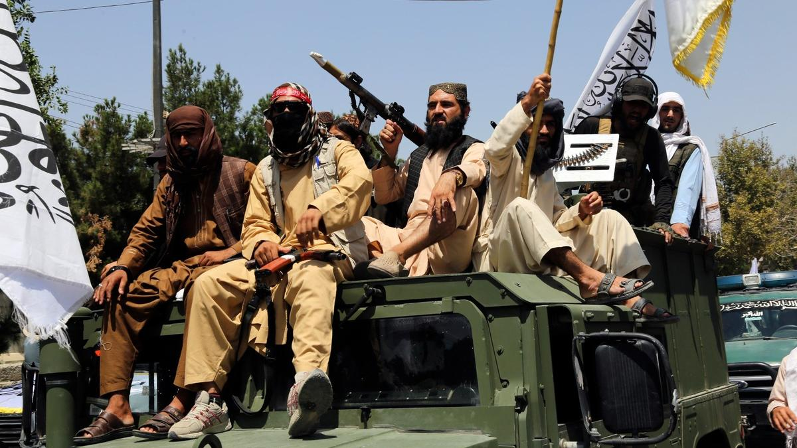

# Горячие камни Талибана. Первый российско-талибанский фильм могут снять в Афганистане — по повести Аркадия Гайдара

- **URL:** https://novayagazeta.ru/articles/2025/07/09/goriachie-kamni-talibana
- **Дата:** 2025-07-09
- **Автор:** Лариса Малюкова

## Горячие камни Талибана

## Первый российско-талибанский фильм могут снять в Афганистане — по повести Аркадия Гайдара

Фото: AP / TACC

Фильм, как рассказывают провластные информплатформы, планирует снять военный журналист Виктор Хоменко, на протяжении восьми лет работавший в Афганистане. Хоменко сам написал сценарий. Это современное прочтение притчи Гайдара о том, как старик отказался менять свою трудную, но честную судьбу на молодость с помощью волшебного камня. А киногероем станет ветеран горячих точек. Он вспомнит свою трудную жизнь и борьбу. Гайдаровский текст романтически подсветит эту историю. Ведь старик объясняет в рассказе мальчику Ивашке, что не хочет начинать жизнь сначала, потому как считает себя самым счастливым человеком на свете. Все его раны и увечья были получены в борьбе за светлое будущее страны.

Адвокат Александр Молохов займется юридическим сопровождением съемок. Он заявил, что талибы (движение «Талибан» внесено в список террористических организаций, но 17 апреля Верховный суд РФ временно приостановил запрет на деятельность террористического движения) горячо приняли сценарий.

Александр Молохов. Фото: соцсети

Недавно самого российского адвоката Молохова хотели лишить статуса — он защищал интересы Талибана, когда движение еще было под запретом. После того как адвокат предъявил ордер в защиту интересов движения «Талибан», судья Олег Нефедов поинтересовался у него, с кем заключено соглашение на предоставление услуг. Защитник сослался на адвокатскую тайну и ушел от ответа. Адвоката удалили из процесса, после чего последовало заявление судьи в Минюст.

По данным источников,

съемки будут проходить при поддержке местных властей, а основная тема картины — «смысл жизни, раскаяние и выбор будущего пути».

О Викторе Хоменко в кинематографической среде практически ничего не знают, хотя у него, судя по справке, немаленькая фильмография и работы с говорящими названиями: «Голубые береты. Песни нашей жизни», «Десантник Степочкин», «Генеральский сынок», «Поколение победителей. Лев Яшин», «Афганистан до востребования», «Операция «Вывод», «Десантный Батя», цикл видеопрограмм «Подвиг и слава». Впрочем, на «Кинопоиске» о режиссере с такой богатой кинематографией не сказано ничего. В анимационной среде о нем тоже не слышали. И в титрах патриотического сериала «Десантник Степочкин» (о героическом парнишке, который совершает подвиг за подвигом хоть на земле, хоть на воде, хоть в небе) я его имя не увидела.

Самая крупная документальная работа Хоменко — «Афганистан до востребования».

Виктор Хоменко. Фото: соцсети

Вот что сам Виктор Васильевич рассказывает о своем фильме: «Двадцать пять лет спустя воины-афганцы вновь на пылающей земле. Вернувшись с афганской войны, они хотели поскорей забыть все, что довелось пережить. Прошло много лет, и теперь они готовы вернуться туда, где пришлось воевать и терять друзей-однополчан. Ветераны-афганцы решились на поездку к местам боевых действий и сняли документальный фильм для тех, кто никогда не слышал об Афганистане, и тех, кто не может его забыть».

Картина была создана в период с 2012 по 2015 год творческой группой ветеранов боевых действий при участии заслуженного артиста России Михаила Жигалова и кавалера трех орденов Красной Звезды Олега Гонцова, который возглавил проект и организовал экспедиции в Центральную Азию. Жигалов лично отправился с кинематографистами на съемки в Афганистан.

Видимо, «Горячий камень» продолжит эту героическую историю.

Поддержите нашу работу!

1000 500 300 Нажимая кнопку «Стать соучастником», я принимаю условия и подтверждаю свое гражданство РФ

Если у вас есть вопросы, пишите [email protected] или звоните:+7 (929) 612-03-68

Фото: соцсети

В Сети сказано, что Хоменко — главный редактор газеты «Вестник героев» Российской Ассоциации Героев, по профессиональным интересам часто бывает в Афганистане и других горячих точках. В свободное от командировок время он встречается со зрителями.

Например, в Алтайском государственном университете. С учениками витебской СШ № 45 им. В. Маргелова. Директор школы Ирина Лошакова отметила, что благодаря таким встречам воспитываются настоящие патриоты. В рамках проекта «Я горжусь. Герои» состоялась встреча режиссера с семинаристами Барнаульской духовной семинарии. Смотрели фильм «Афганистан. До востребования», слушали рассказы о подвигах героев в разных горячих точках.

Тем временем туристическая индустрия РФ уже спешит с организацией туров в Афганистан. Цена путешествия начинается от 223 тысяч рублей без учета перелета, охраны и местной визы.

После признания власти талибов Россия может наладить прямое авиасообщение с Афганистаном. Как уверяет генеральный директор ассоциации гражданской авиации «Аэропорт» Виктор Горбачев, если турпоток в Кабул будет налажен, «Аэрофлот» сможет обеспечить регулярные рейсы. А там и кино подтянется.

Лариса Малюкова ведет телеграм-канал о кино и не только. Подписывайтесь тут.

### Этот материал входит в подписку

Смотровая площадкаКино с Ларисой Малюковой

### Добавляйте в Конструктор свои источники: сайты, телеграм- и youtube-каналы

Войдите в профиль, чтобы не терять свои подписки на разных устройствах

Поддержите нашу работу!

1000 500 300 Нажимая кнопку «Стать соучастником», я принимаю условия и подтверждаю свое гражданство РФ

Если у вас есть вопросы, пишите [email protected] или звоните:+7 (929) 612-03-68
