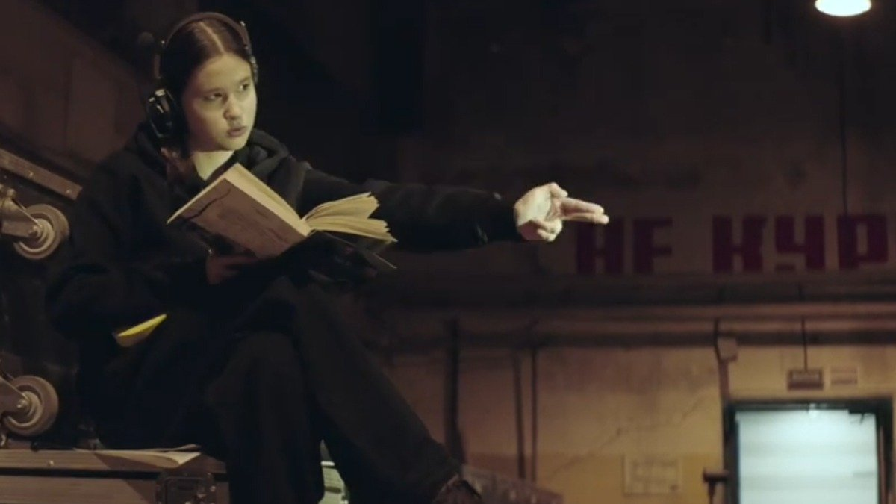

# Кастинг фриков на роль фриков. «Горький fest» порадовал абсурдистскими удачами. Из лучших — «Тени Москвы» Валерия Переверзева

- **URL:** https://novayagazeta.ru/articles/2025/07/15/kasting-frikov-na-rol-frikov
- **Дата:** 2025-07-15
- **Автор:** Лариса Малюкова

## Кастинг фриков на роль фриков

## «Горький fest» порадовал абсурдистскими удачами. Из лучших — «Тени Москвы» Валерия Переверзева

Кадр из фильма «Тени Москвы». Фото: kinomania.ru

«Горький fest» в Нижнем Новгороде завтра завершит работу. Фестиваль с особым конкурсом, в котором полнометражные игровые картины соревнуются с коротким метром и доком.

Просветительская программа нижегородского киносмотра в этом году посвящена авангарду, которому сегодня вновь сложно пробиваться сквозь давний оберег советской культуры: «традиционные ценности». Но когда-то все те, кем принято ныне гордится — Эйзенштейн, Пудовкин, Барнет, Довженко, — совершали переворот в искусстве, открывали новые пути, числились в рядах авангардистов… за что и поплатились в 30-е. Об этом, в частности, и рассказывали Наум Клейман, Всеволод Коршунов, Наталья Рябчикова и другие.

Программа нынешнего года, собранная Андреем Апостоловым, была спорной, провокационной, много экспериментальных работ, взбесивших одних и заинтересовавших других.

## Примет ли фильм Министерство техники безопасности?

Наиболее интересная среди них — «Тени Москвы» Валерия Переверзева.

Перед показом режиссер, похожий на Карабаса-Барабаса, сказал, что нас ждет что-то неадекватное. И что сегодня кино будет смотреть нас.

Смотрит.

В начале путаница со словами: «пропедевтика», «кадр», «кино» — поиск определений. Поиск языка. Поиск кино как ускользающей материи.

Дистрибьютор отражается в зеркале, ломает кадр на съемке. Кто уберет дистрибьютора? Режиссер же требует: уберите!

Героиня фильма Эмма (Юлия Переверзева) ухаживает за очень пожилой дамой Людмилой Ивановной (Елена Коренева). Дама говорит метафорами: «Мои шторы как диафрагма кинокамеры. Открываются шторы — рождается кинообраз». Дама категорически возражает против полиэкрана — вслед за Тарковским. Но Эмма, которая помогает бабушке (не безвозмездно), и не ведает, кто такой Тарковский. Она влюблена в Москву, она бродит (плывет) по городу в поисках зыбкой Москвы. Кто кого создает? Эмма — сочиняющая свой город-мозаику? Или город — девушку? Или автор фильма Переверзев?

В этом городе грез старые братья Электроники встречаются в метро на Площади революции. Орлова летит в Кремль. И две стюардессы косплеят разные образы из разных времен.

Кастинг фриков на роли… фриков. Снег летом. И распавшийся на отдельные кадры экран.

Сентенции вроде: «Телевидение не влияет, а просто удовлетворяет спрос». Так сказал Стив Джобс. Но кто такой Стив Джобс, не знает уже бабушка.

Фильм как диспут о кино, его сути. О привычном, убивающем поиск.

Но диспут — слишком сухо. Здесь абсурд рулит. Впрочем, где именно? В этом кино… или в разрешительных документах на кино? И авторы фильма в фильме до последнего не знают, примет ли их фильм Министерство техники безопасности?

Любопытно, что безумному фильму Переверзева в жизни дали прокатное удостоверение, не обнаружив крамолы.

«Песни хорошие будут?» — спрашивают авторов продюсеры. О да. Саундтрек отменный. Так что это музыкально-поэтический абсурд.

Критик упрекает автора — где в его бессвязном кино драматургия, глубина эмоций персонажей. И в конце концов, «про что в конце твое кино?»

Кадр из фильма «Тени Москвы». Фото: kinomania.ru

Худрук тоже против фильма: этот авангардист-режиссер никак не поймет, что кино — это деньги. Кого волнуют эксперименты?

А режиссер создает свой фильм вопреки. Правилам, жанрам, устоявшимся традициям. Мерчандайзингу (водку и пиво требуют «вставить» в кадр). Героиня целится в нас, думая, что мы инопланетяне. Скорей всего, она не права.

По привычке решаешь, на что похожа эта наглая, отвязная авангардная комедия. Это безумие (вполне себе увлекательное) вне всяких конвенций. На позднее кино Годара? Нет. На раннее кино Переверзева, снявшего скандальный фильм «Брат 3». И у новой картины точно будут почитатели. Я, например.

P.S. Обещанный Александр Ревва, которого ждут-ждут… все-таки появится. И это спойлер.

P.P.S. Вопиющая несправедливость. Блистательную Елену Кореневу закрыли жирным белым крестом. Я, честно говоря, думала, что возникли какие-то проблемы с актрисой. Но нет, скорей всего это решение режиссера. И пожалуй, вот это безумие никак не оправдано, непростительно.

## Доброй ночи всем! Это Конец света!

Второй экспериментальный фильм «Конец концов» Антона Бильжо и Альфии Хабибуллиной. Про апокалипсис, который уже идет.

Коллективное кино. Movie-by-committee, подобное фри-джазу, когда мелодия одного музыканта подхватывается и развивается другим. Здесь это молодые «съемщики». Кино в духе экспериментов и лабораторий Андрея Сильвестрова или поисков Расторгуева и Костомарова, которые во время съемок фильма «Я тебя люблю» раздали своим героям камеры. И они сами себя снимали. Причем среди участников-персонажей и продюсер фильма Максим Добромыслов.

Поддержите нашу работу!

1000 500 300 Нажимая кнопку «Стать соучастником», я принимаю условия и подтверждаю свое гражданство РФ

Если у вас есть вопросы, пишите [email protected] или звоните:+7 (929) 612-03-68

Кадр из фильма «Конец концов». Фото: gorkyfest.ru

У самого Антона Бильжо, который монтировал картину, был опыт подобных поисков — «Я. Страх. Клаустрофобия».

Итак, режиссеры, актеры, операторы, художники, звукорежиссеры, музыканты, один продюсер и просто друзья. Решили разыграть «Меланхолию». Тема же актуальная.

Фильм-фантазия, как будем встречать конец света. У каждого свой микросюжет внутри апокалипсиса, случившегося из-за непонятного вируса. Сюжетные обломки сводили на монтаже в одно целое. Каждый придумал себе персонажа, маленькую судьбу, разные истории пересекаются.

Кто кого играет и кто кого снимает, авторы превращаются в персонажей и наоборот. Они уже отрезаны от «бывшего» мира. Лес — последнее убежище, а из примет рухнувшей цивилизации — телевизор, среди помех вещающий: «Доброй ночи всем! Это конец света».

…Предприниматель Петр ищет в сумрачном лесу пропавшую жену-походницу. Девушка погрязла в воображаемом романе с револьвером и готова идти до последнего. Мошенница обворовывает разбойника. Анна чувствует себя Офелией после смерти возлюбленного. Лиза занялась своим духовным развитием. Марго найдет виновного во всех бедах — телевизор — и попытается его убить. Айтишник-изобретатель Павел, замотанный в фольгу, решает спастись через портал в другое измерение с помощью велика, подключенного к спутниковой тарелке.

В финале будет поминальное застолье, в котором герои соединятся окончательно со своими персонажами.

А еще песни в рацию, тревожные пыльные грибы, рассветный дурман. И очень много фольги.

Кадр из фильма «Конец концов». Фото: gorkyfest.ru

Маргинальный фильм как попытка нащупать пути выхода из патовой ситуации. Кино сегодня действительно очень дорого. А государство в основном поддерживает «государственные фильмы». Как быть автору? По следам Руссо: «Назад к природе?» Но зритель уже купил попкорн и плотно расположился в кресле. Пойдет ли он за маргиналами со своей авторской оптикой в лес?

### * * *

Алексей Герман на одной из дискуссий заметил: «Прекрасно, что начали делать фантастику и создавать миры. Давайте не обманывать себя: 80% будет копипаст. Но это необходимый этап индустрии, ждущей мечтателей, которые будут создавать свои фантастические уникальные миры. Проблемы в том, что идеи идут от продюсеров, а должны идти от авторов. Нам нужны свои «Звездные войны», где огромную роль играют музыка, костюмы, визуальные образы. Потихоньку будут находиться такие авторы… Пусть цветут все цветы».

Лариса Малюкова ведет телеграм-канал о кино и не только. Подписывайтесь тут.

### Этот материал входит в подписки

Смотровая площадкаКино с Ларисой Малюковой

Культурные гидыЧто читать, что смотреть в кино и на сцене, что слушать

### Добавляйте в Конструктор свои источники: сайты, телеграм- и youtube-каналы

Войдите в профиль, чтобы не терять свои подписки на разных устройствах

Поддержите нашу работу!

1000 500 300 Нажимая кнопку «Стать соучастником», я принимаю условия и подтверждаю свое гражданство РФ

Если у вас есть вопросы, пишите [email protected] или звоните:+7 (929) 612-03-68
