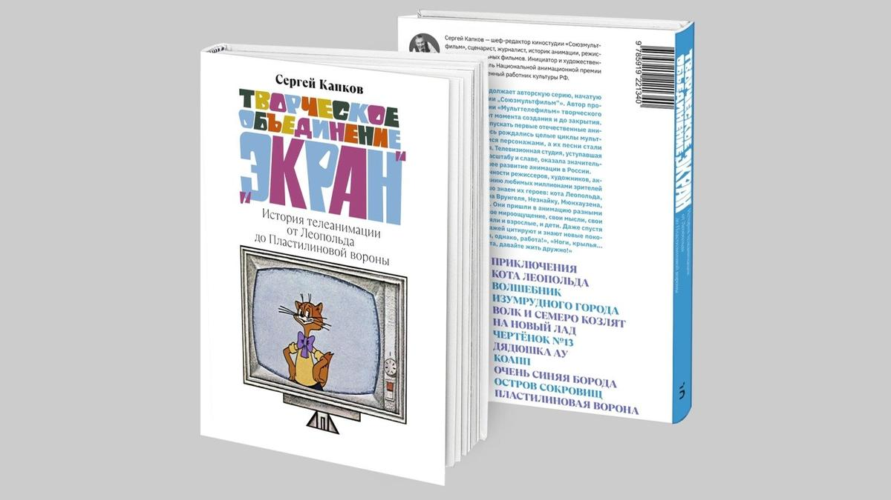

# Как сын Лапина Незнайку разрешил, а Кота Леопольда запретили. 15 июля на «Союзмультфильме» прошла презентация книги Сергея Капкова об истории студии «Мульттелефильм»

- **URL:** https://novayagazeta.ru/articles/2025/07/16/kak-syn-lapina-neznaiku-razreshil-a-kota-leopolda-zapretili
- **Дата:** 2025-07-16
- **Автор:** Лариса Малюкова

## Как сын Лапина Незнайку разрешил, а Кота Леопольда запретили

## 15 июля на «Союзмультфильме» прошла презентация книги Сергея Капкова об истории студии «Мульттелефильм»

Фото: boslen.ru

Книга с длинным труднопроизносимым названием «Творческое объединение «Экран»: история телеанимации от Леопольда до Пластилиновой вороны» вышла в издательстве «Бослен».

Она описывает историю знаменитой телевизионной студии — от момента создания в 1970 году, когда кукольные спектакли постепенно перерастали в мультфильмы, — до закрытия.

В первой книге Сережи Капкова «Легенды студии «Союзмультфильм» рассказывалось о тех, кто создавал шедевры и просто хорошие мультфильмы (что тоже непросто). Картины, на которых взросло не одно поколение. Картины, которые до сих пор кормят и поят и «Союзмультфильм», да и все наше игровое кино (от «Чебурашки» до «Летучего корабля», от «Умки» до «Домовенка Кузи»).

«Мульттелефильм», конечно, был меньше, скромней гигантской фабрики «Союзмультфильм». Но именно здесь начали выпускать первые сериалы, популярнейшие циклы с любимыми персонажами: Незнайка и Пластилиновая Ворона, Домовенок Кузя и Кот Леопольд. В архиве Гостелерадиофонда более 700 (!) названий мультфильмов. Это тоже история отечественной анимации. И в книге звучат голоса многих создателей этих фильмов.

Сергей Капков. Фото: boslen.ru

Режиссер и художник Юрий Трофимов — один из основателей студии — рассказывает, каким чудом судьба «Экрана» оказалась в его руках и возник Незнайка. Пилотную серию глава телевидения Лапин принимал вместе со своим маленьким сыном. Мультик сыну понравился. И тогда Трофимов осмелился попросить и о расширения цеха… до студии.

Александр Курляндский вспоминает о рождении главного хита «Ну, погоди!», который буквально выскочил из «Веселой карусели». Авторы сразу придумали жанр: фильм-погоня. Но долго не могли решить, кто за кем гонится. А первый фильм сделал вовсе не Котеночкин, а Геннадий Сокольский.

Интеллигентнейшим человеком был режиссер Анатолий Резников. И как же он был поражен, когда его «Кот Леопольд» был запрещен к показу.

Фильм про дружелюбного Кота обозвали антисоветским, прокитайским, пацифистским, дискредитирующим партию… Ничего не напоминает? А все из-за того, что Кот не ест мышей. Неправильно это, даже вредно.

Александра Татарского именовали на студии «Везувием», он фонтанировал идеями, за ним было не угнаться. А прекрасную трагикомедию «Падал прошлогодний снег» критиковали за чрезвычайно скоростной темп. Но Татарский сам ходил в кинотеатры, следил за реакцией детей, настаивал на том, что пришел зритель новой формации. И темпоритм должен успевать за ним.

Режиссер Мария Муат вспоминает, с каким трудом «выскользнула» из конвейера образовательного цикла «КОАПП», чтобы снять непозволительно вольную по тем временам «Влюбчивую ворону», — о том, что любовь — «законов всех она сильней». И ее кукольная «неправильная Ворона» вскружила голову не только обитателям леса, но и зрителям всех возрастов.

Поддержите нашу работу!

1000 500 300 Нажимая кнопку «Стать соучастником», я принимаю условия и подтверждаю свое гражданство РФ

Если у вас есть вопросы, пишите [email protected] или звоните:+7 (929) 612-03-68

Фото: boslen.ru

Аида Зябликова — создательница приключений лохматого зеленоглазого замарашки Кузи — с самого начала решила, что это будет сериал. Первая глава рождалась под чутким присмотром замечательного писателя Валентина Берестова. Она ужасно волновалась в ожидании прихода восьмидесятилетней Татьяны Ивановны Пельтцер, о сложном характере которой ходили легенды. Но когда Пельтцер вошла в студию звукозаписи и увидела Вицина, бросилась к нему: «Ой, Гошенька!»… и работа покатилась как по маслу.

…Это книга не киноведческая, в ней история отечественной анимации рассказывается от «первых лиц», ее создателей. А Сергей Капков, не только внимательный слушатель, но и историк, который не дает уйти Атлантиде нашей великолепной анимации в забвение. Возвращает имена не только известных режиссеров, актеров, но и кукольников, художников, драматургов, мультипликаторов, композиторов, звукооператоров. Без которых бы не было ни студии, ни мультипликации, да и гигантская зрительская аудитория была бы совсем другой. Сегодня в отсутствие таких творческий институций, каким был «Мульттелефильм», мы знаем, во что может превратиться зрительская аудитория.

### Этот материал входит в подписку

Смотровая площадкаКино с Ларисой Малюковой

### Добавляйте в Конструктор свои источники: сайты, телеграм- и youtube-каналы

Войдите в профиль, чтобы не терять свои подписки на разных устройствах

Поддержите нашу работу!

1000 500 300 Нажимая кнопку «Стать соучастником», я принимаю условия и подтверждаю свое гражданство РФ

Если у вас есть вопросы, пишите [email protected] или звоните:+7 (929) 612-03-68
