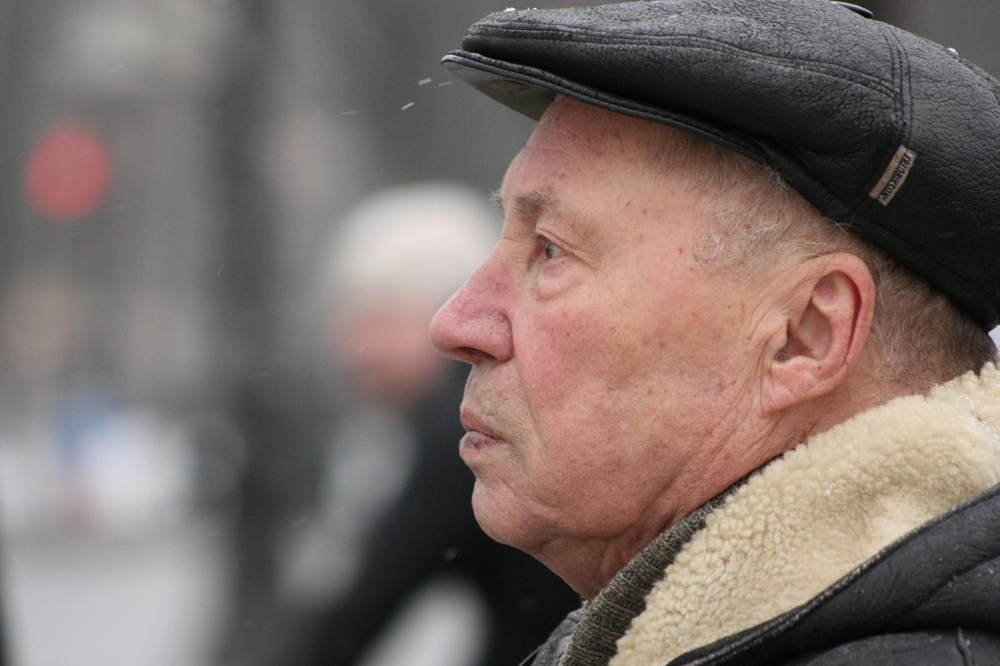

# Черно-белое. Документальный портрет недооцененного классика Виталия Мельникова. Помните «Начальника Чукотки» и «Женитьбу»?

- **URL:** https://novayagazeta.ru/articles/2025/08/05/cherno-beloe
- **Дата:** 2025-08-05
- **Автор:** Лариса Малюкова

## Черно-белое

## Документальный портрет недооцененного классика Виталия Мельникова. Помните «Начальника Чукотки» и «Женитьбу»?

8 августа открывается фестиваль «Окно в Еропу» в Выборге.

В одной из программ — «Жизнь — кино» — документальный портрет Виталия Мельникова.

Единственного и неповторимого создателя всенародных картин «Начальник Чукотки», «Женитьба», «Мама вышла замуж», «Старший сын». Недооцененного классика.

Невозможно представить, что «Женитьбу» и «Отпуск в сентябре» по «Утиной охоте» Вампилова, «Старшего сына» и «Семь невест ефрейтора Збруева» сделал один автор. Их смотрят и засматривают до дыр. А имени режиссера практически не знают. Как писал Карамзин: «Но в славе всех других — скромнейший»

Хотя о нем самом можно было снимать кино. Вот сняли. Пока документальное. Режиссер Анатолий Аграфенин и Андрей Егоров. Фильм в каком-то смысле семейный. Внук режиссера Артем Аграфенин перебирает сценарии с правками, раскадровки в кабинете деда, рассказывая, как тот перед съемкой долго ходил себе в сторонке от группы. Сосредотачивался, хотя к съемкам был всегда готов, но себя не выпячивал. Считал, что режиссура — это искусством объединять талантливых людей во имя общей творческой цели. Он умел заражать этой целью.

Виталий Мельников. Фото: oknofest.com

Сын лесничего и учительницы рос в Благовещенске, когда ребенком увидел первомайский парад, решил, что это праздник в его честь. А когда впервые попал в синематограф, потихоньку заглядывал за экран. Ну где там чудо? Куда все делось? Почему за экраном глухая стена? Он сразу безоговорочно поверил в волшебство и, не разуверившись до самого конца, пробивал эту стену. И когда репрессировали отца. И когда началась война, а он совсем юным попал в агитбригаду — показывать в Сибири кино (потом он расскажет об этом опыте в фильме «Агитбригада «Бей врага!»). И когда уже стал режиссером, но надолго застрял в научпопе. И когда его наконец позвали на заветный «Ленфильм», но снять предложили фильм… без актеров. И он снял комедию «Барбос в гостях у Бобика» по рассказу Носова — бесшабашное трюковое кино с животными, словно всю жизнь только этим и занимался.

Кажется, для него вообще не существовало невозможного. Комедии и социальные драмы, лирические истории и гротеск. Потому что стержень его фильмов — маленький человек, тема его фильма — поиск человеческого. И сам Виталий Вячеславович — скромный труженик.

Виталий Мельников с родителями. Фото из семейного архива

Из документального фильма узнаем предысторию легендарного комедийного триллера «Начальник Чукотки», по сути, полнометражный игровой дебют будущего классика. Идея возникла из газетной заметки. Сценарий писали с другом Владимиром Валуцким о том, как комиссара отправили на Чукотку советскую власть среди снегов устанавливать. И вроде все было правильно. Революция есть, комиссар есть и даже вражина — империалист, осколок тлетворного прошлого. Тема проходная… в смысле «инстанции» утвердят. Но вдруг самим авторам стало скучно. И стали они дурачиться, хулиганить, совсем бдительность потеряли. Вместо геройского многоопытного комиссара возник безусый отчаянный юнец Алеша Бычков, недоучившийся гимназист со срывающимся, дающим «петуха» голосом: «Товарищи далекого Севера, люди холода и голода! Теперь вы граждане свободной Чукотки! Теперь всё ваше — и земля, и море… И фабрики!!! Да здравствует экспроприация экспроприаторов! Ураааа!!!» Бессребреник Бычков буквально горит: на революционном топливе и запале, строит в тундре новый светлый мир. Но пафосные речи его вызывали в зале гомерический хохот». Что сказать, чистый Иван-дурак, антигеройский герой, который и Жар-птицу добудет, и за правдой через три моря пойдет.

Съемки фильма «Женитьба». Фото из семейного архива

Сценарий начали на худсовете распинать. Но вступились коллеги. Алексей Герман вспомнил про Гайдара, который в 16 лет полком командовал. И что сделал начинающий режиссер? Он, как Леша Бычков, немедленно уехал за тридевять земель в Заполярье. Кино снимать подальше от начальственных глаз. Тогда ведь как. Если деньги большие государственные на съемки потрачены, надо и фильм заканчивать. Во время съемок он вспоминал, как после ареста отца, они прятались с мамой на берегах Иртыша в поселке ссыльных. Из всех развлечений — кинопередвижки, без электричества с помощью машин-динамок кино показывали, и он помогал киномеханику.

Виталий Мельников со съемочной группой. Фото: oknofest.com

Поддержите нашу работу!

1000 500 300 Нажимая кнопку «Стать соучастником», я принимаю условия и подтверждаю свое гражданство РФ

Если у вас есть вопросы, пишите [email protected] или звоните:+7 (929) 612-03-68

Потом на протяжении всей жизни он на время съемок старался уезжать в дальние экспедиции. «3дравствуй и прощай» снимали в Новочеркасске и Ростовской области, экзистенциальную драму «Ксения, любимая жена Федора» — в Армении, объявленный крамолой «Отпуск в сентябре» — в Петрозаводске. Он не геройствовал, но кино снимал по велению сердца. И когда в апогей застоя снял свою «Утиную охоту» (он же пробил ее как «антиалкогольное кино»), картину убрали подальше от зрительских глаз… на 8 лет.

Олег Даль так и не дождался премьеры, не увидел на большом экране одну из лучших своих ролей — Зилова. А ведь его «лишний человек» был рожден за три года до «Полетов во сне и наяву» Романа Балаяна. Но начальство сочло фильм и героя слишком депрессивными, мрачными.

Съемки фильма «Бедный, бедный Павел». Фото из семейного архива

А не тяготится ли этот отщепенец советской действительностью? Впрочем, автору фильма ничего и не объясняли, просто не показывали фильм, и все. И столько боли в словах режиссера об этой молчаливой подлости: «ничего не говорить, но не показывать».

Пятнадцать лет жизни он посвятил своей исторической трилогии «Царская охота», «Царевич Алексей», «Бедный, бедный Павел». И волновали его не столько внутренний конфликт человека и власти, сколько моральные дилеммы человека власти. Своими фильмами он пытался соединять звенья исторической цепи из прошлого в будущее. Хотел передать собственное ощущение: быть частицей долгой и трагической, прекрасной и уродливой истории народа. Считал необходимым знать, что было за нами, чтобы не наступать на одни и те же грабли.

Виктор Сухоруков и Виталий Мельников. Фото: oknofest.com

Есть еще одно уникальное качество режиссера Мельникова, о котором мы вспомним во время фильма. Он, безусловно, актерский режиссер. Был первооткрывателем неоспоримых дарований Кононова, Караченцова, Шакурова, Зайцевой. У него снимались актеры первого ряда, с которыми сверхсложно и которые в его фильмах узнавались и разворачивались по-новому. Актеры — планеты. Олег Борисов и Олег Ефремов, Евгений Леонов и Алексей Петренко, Светлана Крючкова и Юрий Богатырев, Люсьена Овчинникова и Ирина Купченко, Зинаида Шарко и Лев Дуров.

В его фильмах своя неповторимая интонация, каким бы нелепым ни был герой, мы ему сочувствуем, потому что непостижимым образом он становится близким, родным. Отчасти из-за особой выделки мельниковского юмора, зашитого в складках всех его фильмов.

Юмора, в котором растворена нежность. Вспомните пластику героя Ефремова, водителя грейдера, в драмеди «Мама вышла замуж», когда он буквально убегает от своих подельников — он же первую зарплату в новую семью несет! Или тихий, полный отчаяния смех невесты Агафьи Тихоновны Крючковой, словно вышедшей прямиком из живописи Федотова, только что упустившей жениха. И нежности этой хоть отбавляй во всех его бурлескных комедиях и социальных драмах. Он говорил, что не сюжет-конфликт его прежде всего интересует, а то, как на глазах зрителя рождается чувство. Вот это и есть основная часть сюжета.

Его упрекали в «мелкотемье»: отчего тоскует Зилов? Какой дурью мается Ксения? Чего не хватает Подколесину? Какие «смыслы жизни» уехал в город искать Митька из «Здравствуй и прощай». Обычная жизнь обычных людей. Которые живут рядом. Но, кажется, жизнь их продолжается за экраном. Пробил-таки он эту стену.

### Этот материал входит в подписку

Смотровая площадкаКино с Ларисой Малюковой

### Добавляйте в Конструктор свои источники: сайты, телеграм- и youtube-каналы

Войдите в профиль, чтобы не терять свои подписки на разных устройствах

Поддержите нашу работу!

1000 500 300 Нажимая кнопку «Стать соучастником», я принимаю условия и подтверждаю свое гражданство РФ

Если у вас есть вопросы, пишите [email protected] или звоните:+7 (929) 612-03-68
