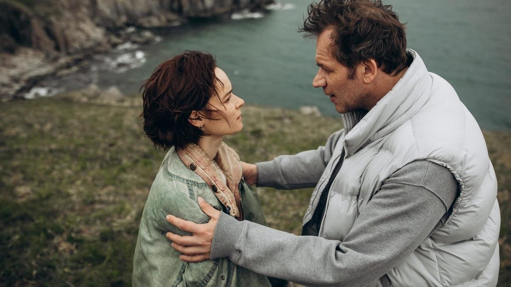

# Кит и бедный Жорик. Хроники кинофестиваля в Выборге

- **URL:** https://novayagazeta.ru/articles/2025/08/12/kit-i-bednyi-zhorik
- **Дата:** 2025-08-12
- **Автор:** Лариса Малюкова

## Кит и бедный Жорик

## Хроники кинофестиваля в Выборге

Кадр из фильма «Большая земля». Источник: kino-teatr.ru

В программе выборгского фестиваля много дебютов. Несмотря на все проблемы, молодые авторы находят силы и возможности снимать кино, пытаются нащупать беспокоящие их темы, которые были бы вне конъюнктуры.

### «Большая земля» Юлии Трофимовой

Марфа (Анастасия Куимова) со своим сыном Тимошей возвращается в отчий дом на дальнем маяке в Тихом океане, где ее отец был смотрителем. Кажется, ей нужны эта тишина, серебро северного моря и шум волн, чтобы избавиться от давней травмы, выместить ее нездешними красотами.

Их дом на обрыве, в нем — словно в сказке: сухие растения, кружево люстры, рисунок на обоях, сквозь который можно рассмотреть зажженные в честь 13-летия Марфы свечи на пироге… Вспомнить. В многочисленных флешбэках — ее оборванная жизнь.

А вокруг кружит кит, напоминая о давней трагедии, но и сегодня он то и дело лодки переворачивает. И только Марфа кита не боится — мчит навстречу, словно ведьма. Большое чудище лишь плавниками миролюбиво взмахнет и исчезнет.

Вскоре приплывет сводный брат Марфы Илья (Артем Быстров, в подростковом возрасте — Рузиль Минекаев), с которым их намертво связывает темная тайна. Появится на этом конце света и муж Марфы Олег (Евгений Харитонов). И вымечтанная терапевтическая тишина превратится в надрывный трип в прошлое, в котором спрятались и боль, и стыд, и вина.

Но может, необходимо заново пережить трагедию, чтобы от нее избавиться, чтобы не повторилась. Может, поэтому они все и очутились на этом пустынном клочке земли в океане в доме у скалистого обрыва.

…Про то, как неизжитое прошлое взрывается в настоящем не только переживаниями, но новыми бедами. Про то, что это прошлое — это не какие-то внешние события, оно спряталось-уединилось черным пятном в них самих на самом донышке.

Северные ослепительные закаты, разноцветное небо, маяк — святыня для морей, спасительный для кораблей. Не для людей. Неслучайно есть японская пословица: «Под маяком темно».

Кадр из фильма «Большая земля». Источник: kino-teatr.ru

Впервые после подростковой драмы «Страна Саша» и неровной меланхолической комедии «Лгунья» Юлия Трофимова погружает историю в мерцающий символами магический реализм, источником которого становится само место действия. Переливающийся красками маяк, покрытый мхом берег. И главный, несколько навязчивый символ фильма — кит, самый человечный в этом злом мире.

Изысканная работа оператора Михаила Дементьева. Снимали картину в Приморском крае на полуострове Брюса. Кино эффектное, с завораживающими пейзажами. С достойными актерскими работами. Да и сценарий интересный. Из минусов — режиссерские промахи, из-за которых возникает смысловая невнятность. Эмоциональная чрезмерность, экзальтированность. И внутренне неоправданный, словно приклеенный к драматической истории внезапный музыкально-танцевальный номер Марфы в финале. Впрочем, фильм Юлии Трофимовой выбивается из ряда однообразных, полностью предсказуемых сюжетов, и у него уже есть и будут свои горячие поклонники.

Фильм поддержан фондом «Кинопрайм».

### «Встречные» Камилы Рамазановой

Поддержите нашу работу!

1000 500 300 Нажимая кнопку «Стать соучастником», я принимаю условия и подтверждаю свое гражданство РФ

Если у вас есть вопросы, пишите [email protected] или звоните:+7 (929) 612-03-68

Кадр из фильма «Встречные». Источник: kino-teatr.ru

Драма, напомнившая о «деревенщиках» и «шукшинских чудиках». С идеей припадания к животворным родным истокам, траве по пояс и «васильковой синей тишине». Кажется, фильм прилетел из прошлого, тем неожиданней, что снимала его выпускница ВГИКа. В этой дебютной и оттого немного неловкой картине есть несколько точных и здорово сыгранных сцен, есть попытка докопаться до социальных проблем.

Кинодебютант Саня (Филипп Ершов), возвращающийся (неведомо откуда) в Москву с вальяжным продюсером Станиславом Леонидовичем (Горевой с начесом) на премьеру их фильма, знакомится с забубенным попутчиком — рабочим Геной. А дальше, как водится, самогон, «По диким степям Забайкалья», байки и прочие дорожные радости.

Под перестук колес Гена и сманивает наивного Саню сойти с ним на крошечной станции. Навестить бабушку, у которой сердце… Помирать, мол, собралась.

Так начинается кратчайшая, но памятная деревенская одиссея юного кинематографиста и местного (в прошлом), а ныне ничейного Гены. Прыжок в чужую жизнь, которая и есть «топливо» для кино начинающего автора Сани. И начинающего автора Камилы Рамазановой.

В сельпо — обнадеживающее «Лебединое озеро» по телику, сервелат, «Птичье молоко» с вятскими вафлями для бабушки. И продавщица Наташа (Виктория Тихомирова), позабытая-позаброшенная Геной лет двадцать назад. В тамбуре у бабушки (Раиса Рязанова), которая живее всех живых, — крышка от гроба как повод для приезда внука. Вначале много искусственности, нажима, да и в диалогах живая речь чередуется с манифестами. Но потом — застолье у Гениного друга Кости, водителя полуживого автобуса, обзаведшегося большой православной семьей: дети талантливы, жена-красавица. Не то что перекати-поле Генка, к 40 годам так бобылем и оставшийся. Однако и под крышей большого семейного дома нет счастья и с будущим проблемы: муж едва сводит концы с концами, не хватает денег оплатить обучение старшего сына в университете, красавица-жена света белого не видит за плитой и уборкой.

Кино не только про силу судьбы, но и про битву с ней: выбор без очевидного решения (неслучайно муссируется гамлетовское «быть или не быть?», правда, вместо Йорика здесь череп любимого барана Жорика). Уйти и не вернуться? Остаться и влачить?.. чтобы на могиле написали, как и на всех других на поселковом кладбище: «Я умер здесь».

Кадр из фильма «Встречные». Источник: kino-teatr.ru

Лучшая сцена в фильме — любовная, в сельпо. Редкой тонкости и драматизма работа Виктории Тихомировой, она настоящее открытие фильма. В ее продавщице Наташе — и внутренняя сила, и горечь неслучившейся жизни, и способность взять на себя ответственность за свою судьбу. Давно не видела в нашем кино столь убедительной, сложной работы, причем на довольно скромном материале. Есть, правда, один интересный момент. Сцена в магазине и история взаимоотношений Гены и Наташи что-то смутно мне напомнила. Едва ли не по словам… Юля Шагельман подсказала. Точно такая новелла была в «Мужчине и женщине» — альманахе Владимира Котта, в мастерской которого и училась Камила Рамазанова. Городской клерк (Павел Деревянко) заезжает наконец в родную деревню, чтобы продать дом покойной бабушки, но встречает за прилавком магазина свою школьную любовь (ее более жирно и навязчиво играет Ирина Пегова)…

Сам же фильм качает из натужности в правду, от редкой органики (как у Виктории Тихомировой) — к штукарству Раисы Рязановой, от газетной передовицы славных времен ударничества — к живым человеческим диалогам. Дебют интересный. Смотрите, кто пришел: Камила Рамазанова. При поддержке фонда «Кинопрайм».

### Этот материал входит в подписки

Смотровая площадкаКино с Ларисой Малюковой

Культурные гидыЧто читать, что смотреть в кино и на сцене, что слушать

### Добавляйте в Конструктор свои источники: сайты, телеграм- и youtube-каналы

Войдите в профиль, чтобы не терять свои подписки на разных устройствах

Поддержите нашу работу!

1000 500 300 Нажимая кнопку «Стать соучастником», я принимаю условия и подтверждаю свое гражданство РФ

Если у вас есть вопросы, пишите [email protected] или звоните:+7 (929) 612-03-68
