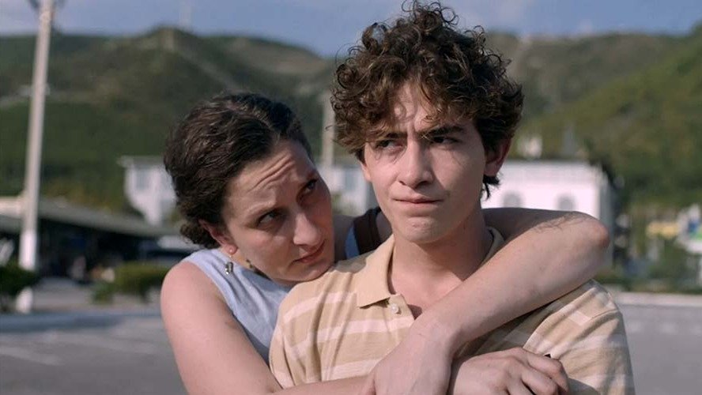

# Я, бебия и «Мимино». «День рождения Сидни Люмета» — претендент на главный приз фестиваля «Окно в Европу»

- **URL:** https://novayagazeta.ru/articles/2025/08/14/ia-bebiia-i-mimino
- **Дата:** 2025-08-14
- **Автор:** Лариса Малюкова

## Я, бебия и «Мимино»

## «День рождения Сидни Люмета» — претендент на главный приз фестиваля «Окно в Европу»

Кадр из фильма «День рождения Сидни Люмета»

«День рождения Сидни Люмета» — дебют режиссера Рауля Гейдарова. Большинство картин конкурса — конструкторы сценаристов: истории разной степени качества, но словно в каких-то аквариумах происходящих. За стеклом.

Гейдаров снял высокотемпературную, пульсирующую страстями трагикомедию, одновременно крепко связанную с реальностью и в то же время концентрированно сказочную. Тем удивительней, что во многом это автофикшн.

Конец нулевых. Семнадцатилетний Дато (Артем Кошман) живет в маленьком поселке среди гор в Краснодарском крае вместе с бабушкой — бебия, как он зовет ее на грузинском. В уютнейшем райском домике с заросшим зеленью балконом. Мир и покой в доме обеспечивает фирменное бабушкино хачапури. Она раскатывает его и в минуты тревоги. Но однажды на пороге дома после долгих лет отсутствия возникает Анна, мама Дато (Мариетта Цигаль-Полищук). Женщина-праздник, с долгожданным подарком — видеокамерой, ведь Дато давно тайно мечтает о невозможном: стать кинорежиссером. Ему в этом и просмотр любимого «Мимино» помогает с кумиром бабушки Фрунзиком Мкртчяном.

С ее приездом равномерная жизнь парня взорвется каскадом событий: от восхитительного взлета — майского путешествия с мамой на море, до падения в криминальную яму.

И лишь мечта как спасительная соломинка способна вытянуть в щель просвета даже из безвыходных ситуаций. Если, конечно, у тебя есть такая бебия.

Кадр из фильма «День рождения Сидни Люмета»

Полнокровные и яркие актерские работы — все без исключения. Прежде всего, это Джульетта Степанян. Кажется, ей и играть ничего не надо (хотя, говорят, на съемочной площадке было немало трудностей, например, с языком, актриса говорит по-армянски). Она и с тестом, и с текстом «живет» душа в душу. И кажется, сердце ее болит за внука по-настоящему. Но рада я и за Мариетту Цигаль-Полищук, дождавшуюся сложной, противоречивой роли. В пересказе ее мамаша — стерва и кукушка, а в киновоплощении — страдающая, загнанная в угол с потрясающей харизмой женщина, проигравшая свою жизнь. Мариетта «доигрывает» недописанное автором, поэтому ее героиня и вызывает сочувствие.

Фильм во многом наивный, сверхсентиментальный, с несложными предсказуемыми драматургическими ходами, но подкупающий авторским темпераментом, искренностью и добросердечием, за что и был вознагражден овацией.

Поддержите нашу работу!

1000 500 300 Нажимая кнопку «Стать соучастником», я принимаю условия и подтверждаю свое гражданство РФ

Если у вас есть вопросы, пишите [email protected] или звоните:+7 (929) 612-03-68

Читайте также

Кто кого обкрадывает

Как кино эмигрирует в параллельную реальность. Премьеры фестиваля в Выборге

Напомнил по интонации грузинские короткометражки и «Я, бабушка, Илико и Илларион» Абуладзе. Не случайно первая работа Рауля Гейдарова называлась «Бебия, бабуа, Анзорик, я и мама». Это был приквел нынешней киноистории. Дато там было 9 лет, и он тоже загадывал сокровенное желание, как и сам Гейдар. И вот мечты сбываются.

Продюсеры: Алексей Учитель, Анастасия Акопян, Кира Саксаганская

Лариса Малюкова ведет телеграм-канал о кино и не только. Подписывайтесь тут.

### Этот материал входит в подписку

Смотровая площадкаКино с Ларисой Малюковой

### Добавляйте в Конструктор свои источники: сайты, телеграм- и youtube-каналы

Войдите в профиль, чтобы не терять свои подписки на разных устройствах

Поддержите нашу работу!

1000 500 300 Нажимая кнопку «Стать соучастником», я принимаю условия и подтверждаю свое гражданство РФ

Если у вас есть вопросы, пишите [email protected] или звоните:+7 (929) 612-03-68
