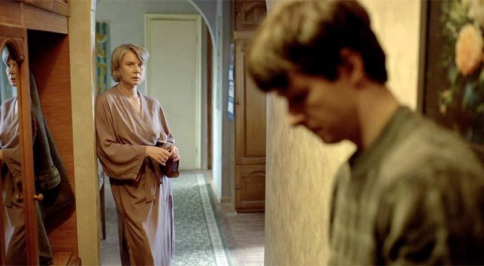

# Взрослый сын к отцу пришел. Дебютанты кинофестиваля «Короче» забурились в вечную тему непонимания поколений родных людей. Есть несомненные удачи

- **URL:** https://novayagazeta.ru/articles/2025/08/25/vzroslyi-syn-k-ottsu-prishel
- **Дата:** 2025-08-25
- **Автор:** Лариса Малюкова

## Взрослый сын к отцу пришел

## Дебютанты кинофестиваля «Короче» забурились в вечную тему непонимания поколений родных людей. Есть несомненные удачи

В программе фестиваля «Короче», показывающем новое российское кино, прежде всего дебютное, определилась главная тема — «Дети и отцы». Именно так: молодые авторы снимают кино про себя, про сложные, травматичные отношения с родителями.

Кадр из фильма «Взрослый сын». Источник: kino-teatr.ru

## «Взрослый сын»

- Режиссер Иван Шкундов, продюсер Мария Бородянская

Камерная семейная драма в духе советского кино 70–80-х, прежде всего фильмов Райзмана и Мельникова, прозы Трифонова с ее поэтикой повседневности. Редкая в нашей «сказочной» киноиндустрии картина про обычных людей, их запутанные взаимоотношения. Причем без энтэвэшного криминала и сиропа канала «Россия».

Еще одна редкость — взрослые герои. Это в европейском арткино «третий возраст» — в центре исследований авторов. У нас актерам за пятьдесят обычно предлагают роли бабушек и дедушек.

Марии (Дарья Михайлова) примерно пятьдесят. Она спокойна, интеллигентна, сама себя обеспечивает. Судьба преподносит нечаянную радость вместе с букетом любимых подсолнухов: Марии делает предложение настойчивый поклонник Михаил (Владислав Ветров). Наконец она решается переехать к нему в квартиру, оставив своему взрослому сыну и его девушке свои скромные апартаменты.

И вот уже деятельная чистюля Маша пытается стать хозяйкой нового дома: стирает-моет-убирает. Трет чужой хрусталь, смахивает пыль с сувениров, купленных не ею. Встречается с не своими друзьями. Со своим сыном она на кладбище, с чужим — на одной кухне. Слушает, улыбается. Пытается приладиться к чужой жизни.

Но однажды в их уютное обустраивающееся гнездышко вламывается взрослый сын Михаила (Кузьма Котрелев), решившийся вернуться по месту прописки. Он вообще не планирует изображать семью, существует отдельно, превращает дом в коммуналку. А отношения с отцом — в ежедневную молчаливую битву на выживание.

Без вины виноватая Маша пытается связать порванные нити. Но постепенно обнаруживается темная сторона ее избранника, живущего по принципу «не делай людям добра, не получишь зла». Поздними вечерами на балконе он звякает бутылками со спиртным. А днем в нем вдруг просыпается… мелочный засранец.

В этой неторопливой хронике устройства личной жизни — свои подводные камни, фантомные и реальные боли. Редкая внимательность молодого автора к мелочам, когда быт разъедает бытие. Когда люди, даже любя, мучают друг друга незаметно, монотонно, словно зубная боль. Когда дети становятся взрослыми — взрослей родителей.

Главный магнит фильма — актеры. В первую очередь — Дарья Михайлова, дождавшаяся серьезной роли. Немногословная, подробная психологически, внимательная работа, следить за которой — редкое удовольствие. Ей впору партнеры. Прежде всего — Владислав Ветров (Чехов в последнем фильме Марлена Хуциева). Он словно меняет фокусное расстояние, и вот уже один и тот же человек обнаруживает совершенно новые, непривлекательные качества. Точно, как в жизни. А сын Кузьмы Котрелева из второстепенного колючего инфантила, маячащего на заднике картинки, превращается в страдающего, травмированного с детства, едва ли не главного героя фильма.

Кадр из фильма «Взрослый сын». Источник: kino-teatr.ru

При всех шероховатостях — зрелая картина. С точно подмеченными психологическими и бытовыми деталями. Чего стоит «семейный ужин», который наконец удается устроить несчастной Маше. Она вдруг видит, как совершенно одинаково, синхронно едят курицу домашние антагонисты: папа и сын. Яблоня и яблоко.

Фильм явно очень личный. Перед показом Иван Шкундов говорил о том, как родители ведут нас за руку, вводя во взрослую жизнь, но с какого-то момента мы начинаем вести их. И об этом тонком «переходном моменте» его картина.

Удивительно, когда подобные фильмы не подхватывают на лету прокатчики. При правильном подходе, продвижении с психологами, актерами можно было бы привлечь относительно широкую аудиторию. Да и на федеральных каналах, если бы им действительно были интересны человеческие истории, фильм бы смотрели и обсуждали.

## Фильм «Закругляемся»

- Режиссерский дебют еще одного члена славной кинематографической династии Хлебниковых — Глеба, который до сегодняшней поры оставался в тени своих известных родственников Бориса и Макара.

Поддержите нашу работу!

1000 500 300 Нажимая кнопку «Стать соучастником», я принимаю условия и подтверждаю свое гражданство РФ

Если у вас есть вопросы, пишите [email protected] или звоните:+7 (929) 612-03-68

Кадр из фильма «Закругляемся». Источник: kino-teatr.ru

Черная комедия и драмеди.

Утро. Телефонный звонок. Коля с бодуна, едва соображает. Сестра звонит сказать, что тело их отца пропало из морга. Колю эта информация не то чтобы поражает. Но в своей ванной он обнаруживает тело отца.

Теперь надо вернуть папашу в морг.

Там и происходит последний «разговор» с отцом, который когда-то давил, требовал невыполнимого, был всегда недоволен, от которого мать сбежала. Козел, одним словом.

Плотно смонтированное и уверенно снятое кино в трех частях про непонимание, внутренние разрывы в семье, про тоску по нормальной жизни, накопившуюся жгучую обиду, невысказанное. Про невозможность понравиться, угодить, быть поддержанным отцом. Быть вровень с ним. Эксцентриада и драма в одном флаконе.

И кульминация — единственная в жизни, отчаянная вечеринка с отцом под домашнюю цветомузыку. И «Песню про пожар» группы «Тима ищет свет».

Каждый вздох — внутри дым, и мне важно,

С кем рядом мне будет так страшно.

Удивительно, но кажется, Глеб вложил в этот фильм много своих личных травм и переживаний. Это кино о неприятии, сопротивлении и любви, которая тонет во взаимной обиде.

В главной роли — актер и рэпер Андрей Прытков. В роли неживого и живого отца — Евгений Муравич.

Можно было бы вспомнить «Обычную женщину» Бориса Хлебникова (там тоже труп с места на место таскали) и назвать картину «Обычный юноша»…

## «Зима, Весна, Лето, Осень… и снова Зима»

- Режиссер Ильдар Шангараев

Кадр из фильма «Зима, Весна, Лето, Осень… и снова Зима». Источник: kino-teatr.ru

Из немногих фильмов, связанных с сегодняшней реальностью.

Из соображений психологической безопасности папа отправляет 13-летнюю Ксюшу на учебу в Германию. У папы свои проблемы: спектакль запрещают, приходится объявлять о замене на Вампилова «по не зависящим от театра причинам». Ксюша в Германии скучает, но возвращаться не хочет.

Главная мысль — «возможно, скоро все закончится, главное сейчас — не делать глупостей». Про детей, судьбу которых выбирают родители, которые сами не способны сделать свой выбор.

Лариса Малюкова ведет телеграм-канал о кино и не только. Подписывайтесь тут.

### Этот материал входит в подписки

Смотровая площадкаКино с Ларисой Малюковой

Культурные гидыЧто читать, что смотреть в кино и на сцене, что слушать

### Добавляйте в Конструктор свои источники: сайты, телеграм- и youtube-каналы

Войдите в профиль, чтобы не терять свои подписки на разных устройствах

Поддержите нашу работу!

1000 500 300 Нажимая кнопку «Стать соучастником», я принимаю условия и подтверждаю свое гражданство РФ

Если у вас есть вопросы, пишите [email protected] или звоните:+7 (929) 612-03-68
