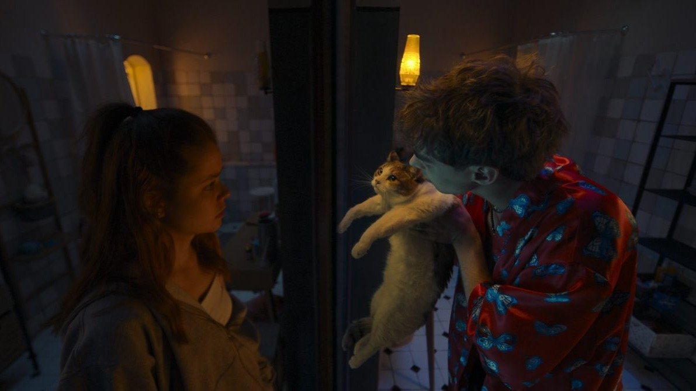

# Любовь, цензура и роботы. Итоги и лучшие фильмы кинофестиваля «Короче»

- **URL:** https://novayagazeta.ru/articles/2025/08/25/liubov-tsenzura-i-roboty
- **Дата:** 2025-08-25
- **Автор:** Лариса Малюкова

## Любовь, цензура и роботы

## Итоги и лучшие фильмы кинофестиваля «Короче»

Кадр из фильма «Сводишь с ума»

Программа смотра фестиваля «Короче» во многом сканировала происходящие в российском кино перемены.

После многочисленных запретов тем (от наркотиков и насилия до намека на однополые отношения) экран вырулил на самую безопасную магистральную и всех касающуюся проблему: взаимоотношения в семье. Видеовестник фестиваля подробно расспрашивал меня и других участников об отношении к традиционным ценностям — рулевой задаче кино. Удивительно, едва ли не все картины конкурса, в этом году действительно сильного, разнообразного, были про «ценности». Но без «воспитательного давления». Про мучительный прорыв «далеких близких», «родненьких» — друг к другу. В итоге — к себе. Про попытку рассмотреть себя в зеркале другого.

Вот лучшие фильмы конкурса.

«Взрослый сын» Ивана Шкундова — хроника устройства личной и семейной жизни — с острыми подводными камнями, фантомными и реальными болями и обидами. Когда быт разъедает бытие, а люди не умеют договориться, услышать друг друга: особенно родители и дети. В этой картине удивляет щадящая — по отношению к инфантильным родителям — сочувственная интонация.

Кадр из фильма «Взрослый сын»

Главное открытие фильма, да и фестиваля — актриса Дарья Михайлова, дождавшаяся большой серьезной роли. Она играет женщину за пятьдесят, которой неожиданно судьба предложила выйти за пределы устоявшегося амплуа мамаши/хозяйки/бабушки — почувствовать себя желанной, красивой. Всмотреться в собственное отражение и увидеть в нем не итог жизни, телевизионное пенсионное доживание, но надежду… Жюри поддержало эту работу спецпризом.

В мелодраме (под видом ромкома) «Сводишь с ума» Дарьи Лебедевой герои из параллельных миров Ваня и Алиса (Юрий Насонов и Мила Ершова) встречаются и влюбляются друг в друга с помощью магического зеркала в съемной питерской квартире. Алиса, как и ее литературная предшественница, путешествует сквозь зеркала. В реальной жизни — вне зеркала — у каждого из них есть двойник. Двойникам сложнее. Впрочем, кто из них двойник?

Кадр из фильма «Сводишь с ума»

Отражения путаются с реальными персонажами. Отражения — ярче, лучше и честнее реальных людей, которые в какой-то момент очень стараются походить на своих зеркальных двойников. Среди запомнившихся эпизодов — остроумная пародия на «Сумерки» и совместный кинопросмотр «отражениями» Вани и Алисы старого «Вия» про попытки черной силы прорвать меловой круг.

Вспоминаются «Параллельные миры», «В твоих глазах» и страшноватые «Зеркала». Мелодраматическая городская сказка, которую режиссирует уже пожившая фея — владелица «нехорошей квартиры». (Людмила Артемьева)

Главный приз получила работа «Счастлив, когда ты нет» Игоря Марченко.

Чувственное и тонкое кино про притяжение и отталкивание, романтически-токсичные отношения зумеров, неумение выстраивать диалог. Она (Александра Бортич) — пьет красное — одним глотком. Он (Гоша Токаев) — никак не решится нажать кнопку звонка. Он — тусклый, уставший, зачем-то с пергидрольными волосами (для протеста — поздно). Она — на грани то ли срыва, то ли загула. Тридцатилетние — зависшие перед вопросами «куда», «как», «зачем»? Кажется, всюду опоздавшие — к роману, к карьере. Тезки, обладатели универсального имени. Ни мясо, ни рыба. Запутались в личной жизни. Но плюс на плюс дает минус. Они и переспать могут, и хамить друг другу обидно, но как-то лениво. Но в постели она задаст сакраментальный вопрос: что бы он сделал, если бы прямо сейчас она разбила ему нос своим лбом? Он ее никогда не забудет.

Кадр из фильма «Счастлив, когда ты нет»

«Лох Педальный» и истеричка. Хотят быть хуже, бить больнее. Бесят друг друга. Постоянно на невидимом ринге. Где тут ошибка, когда вместе не получается, а порознь — невмоготу? Возможно, они слишком разные, просто пытаются стать счастливыми, назло друг другу. Это похоже на школьный синдром, когда подростки больше всего ранят тех, кто им близок.

Впрочем, в этом фильме все взрослые — инфантилы. Все любят «не тех», безответно, неправильной, дисфункциональной, токсичной любовью. Я оглянулся посмотреть… Женя + Женя, Женя в квадрате. Могли бы стать одним целым. Скорей всего, проблема в их собственных комплексах и травмах, недовольство собой переносят на партнера. Как научиться жить в мире с самим собой, а значит, и с другим, не чувствуя себя жертвой. Кто кого вытянет? Перестанет ли ранить всех вокруг Евгения? Она не способна удержать отношения, да и себя саму, в пределах разумного. Делает все для того, чтобы о ней думали хуже, чем она есть. Отталкивает других, страшась, что оттолкнут ее?

Драмеди в духе Шамирова про притяжение и отталкивание, неспособность понять, решить, простить, почувствовать другого. Пауз, «больших секунд» и моментов неловкости в фильме больше, чем диалогов. Кстати, в музыке интервал «секунда» — это всегда какофония, несовпадение. «Я привыкаю к несовпаденью».

Но однажды он или она решит: «Пусть мне лучше будет плохо с тобой, чем хорошо без тебя».

В короткометражном конкурсе победила анимационная картина «Сын» (приз Шанхайского фестиваля). Режиссер Жанна Бекмамбетова — дочь Тимура.

Поддержите нашу работу!

1000 500 300 Нажимая кнопку «Стать соучастником», я принимаю условия и подтверждаю свое гражданство РФ

Если у вас есть вопросы, пишите [email protected] или звоните:+7 (929) 612-03-68

Кадр из фильма «Сын»

История о мальчике и его папе, живущих в маленьком домике на краю света в степи. Мальчик-колясочник ничем не интересуется, не способен взять даже ложку с кашей. Интерес к жизни у малыша просыпается, когда он слышит по телеку новость про маленького робота, отправленного на Марс.

Марс похож на казахстанские степи, а малыш, похоже, соотносит себя с роботом на далекой планете, встретившимся с грандиозным незнакомым миром. День за днем в течение трех месяцев мальчик следит по телевизору за уникальным путешествием-исследованием марсохода.

И берет в руки ложку, а потом карандаш — чертит траекторию полета и путешествия робота Опортьюнити. Технические проблемы в космосе отражаются на здоровье ребенка. Но кажется, они — малыш и робот — смогут помочь друг другу. Не без папиного участия, разумеется. И маминого, которая продолжает жить в зеркалах дома. И чайной ложки.

Романтическая сказка о мощнейшей силе любви и сочувствии как способе спасения всех нас. В основе фильма реальная история робота Опортьюнити, продвинувшем мировую науку с помощью казахского малыша.

А среди немногих работ — за границами семейной темы — неожиданная картина «Цензурократия» Никиты Миклушова («Мох»).

Кадр из фильма «Цензурократия»

Полнометражный фильм Никиты «Любовь» только что так и не показали в Выборге. И вот мощное философское визуальное эссе о кафкианской жизни под пятой цензуры.

Застывшие и подвижные кадры как картины уплывающей в никуда реальности. Флюиды-пузыри от Останкинской телебашни заполняют мир. Проникают сквозь стекла в квартиры. Заблюривают сигареты на столе, изображение в компьютере, книги в доме, грудь любимой девушки. Постепенно весь мир размывается в мареве всеядного прожорливого блюра. Вот-вот в нем растворимся и мы.

Фильм отметило и жюри, и журнал «Искусство кино». А режиссер, имя которого скандировал зал под проливным дождем, говорил о том, что даже в самые драматичные времена надо говорить о том, что волнует больше всего.

Лариса Малюкова ведет телеграм-канал о кино и не только. Подписывайтесь тут.

### Этот материал входит в подписки

Смотровая площадкаКино с Ларисой Малюковой

Культурные гидыЧто читать, что смотреть в кино и на сцене, что слушать

### Добавляйте в Конструктор свои источники: сайты, телеграм- и youtube-каналы

Войдите в профиль, чтобы не терять свои подписки на разных устройствах

Поддержите нашу работу!

1000 500 300 Нажимая кнопку «Стать соучастником», я принимаю условия и подтверждаю свое гражданство РФ

Если у вас есть вопросы, пишите [email protected] или звоните:+7 (929) 612-03-68
