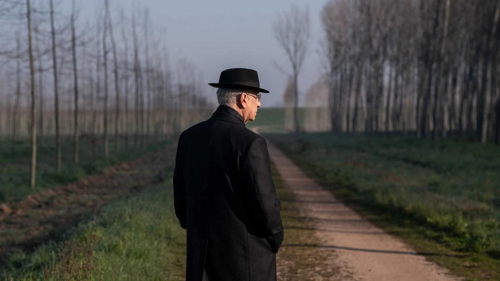

# Джармуш, Данте и «кремлевские волшебники». Сегодня открывается Венецианский кинофестиваль. Рассказываем о самых ожидаемых фильмах

- **URL:** https://novayagazeta.ru/articles/2025/08/27/dzharmush-dante-i-kremlevskie-volshebniki
- **Дата:** 2025-08-27
- **Автор:** Лариса Малюкова

## Джармуш, Данте и «кремлевские волшебники»

## Сегодня открывается Венецианский кинофестиваль. Рассказываем о самых ожидаемых фильмах

Кадр из фильма «Благодать»

Фильм Открытия «Благодать» Паоло Соррентино по его же сценарию. Кстати, именно на Мостре Соррентино дебютировал в кино фильмом «Лишний человек», картина «Рука бога» получила приз жюри. Здесь впервые показали и «Молодого папу».

Мариано Де Сантис — вымышленный президент Итальянской Республики. В самом конце президентского срока возникают последние обязанности: принять решение по двум деликатным прошениям о помиловании. Моральные дилеммы, личные проблемы, кризис возраста. Наконец, он решает вернуться в родной город, знакомый до слез, где давно не был. Здесь и ждет его главная встреча, и надежда на то, что любовь поможет ему достичь состояния благодати.

В главной роли — альтер эго режиссера, его любимый Тони Сервилло («Великая красота», 2013; «Лоро», 2018). Фильм, снятый с помощью артовой платформы Mubi, участвует в основном конкурсе.

Драмеди Джима Джармуша «Отец, мать, сестра, брат», фильм, который не взяли в Канны. Действие разворачивается в Нью-Йорке и Нью-Джерси, в Париже и в Дублине. Три главы.

«Отец» — о брате и сестре Джеффе и Эмили (Адам Драйвер и Майим Бялик), которые навещают своего замкнутого папашу (отшельника играет Том Уэйтс) в сельской местности Нью-Джерси;

«Мать» — о сестрах Лилит и Тимоти (Крипс и Бланшетт), воссоединяющихся со своей настороженной матерью-писательницей (Шарлотта Рэмплинг) в Дублине, живущей отдельной жизнью;

«Сестра, брат» — о близнецах Скай и Билли (Индия Мур и Лука Саббат), которые возвращаются в свою парижскую квартиру, чтобы разобраться с семейной трагедией.

Кадр из фильма «Отец, мать, сестра, брат»

Джармуш говорит, что исследует расстояние, возникающее между выросшими детьми и их стареющими родителями.

Он признается, что это один из самых личных его фильмов: «Комедия, переплетенная с меланхолией, исследование характеров тихим, наблюдательным и непредвзятым взглядом».

Джармуш, как обычно, воплощает свои замыслы в кино с помощью проверенных временем коллег: виртуозных операторов — Фредерик Элмс («Синий бархат», «Кофе и сигареты», «Патерсон») и Йорик Ле Со.

В фильме снимались: Кейт Бланшетт, Адам Драйвер, Вики Крипс, Том Уэйтс, Шарлотта Рэмплинг и другие.

«Дом динамита» Кэтрин Бигелоу («Вес воды», «Повелитель бури», «Почти стемнело», «На гребне волны») политический триллер Netfix о кризисе национальной безопасности в Белом доме, кажется, более чем актуальный.

Кадр из фильма «Дом динамита»

Из релиза: «В сторону США выпущена одна-единственная неопознанная ракета. Сразу начинаются поиски ответственных и вариантов ответных действий». Бигелоу возвращается в Венецию со своим первым фильмом после «Детройта», вышедшего восемь лет назад.

В ролях: Идрис Эльба, Ребекка Фергюсон, Грета Ли и другие.

Экран соединил в одной программе — Кремль и Белый дом. В «Кремлевском волшебнике» Оливье Ассайаса («Ирма Веп», «Карлос») Джуд Лоу играет Владимира Путина. Экранизация бестселлера Джулиано да Эмполи. 90-е.

Кадр из фильма «Кремлевский волшебник»

Главный герой — телевизионный продюсер реалити-шоу Вадим Баранов (его прототипом считают Владислава Суркова) становится политтехнологом, пиарщиком Владимира Путина. «Маг Кремля», «серый кардинал», «новый Распутин», стирая границы между правдой и ложью, начинает превращать реальность в театр, и на какое-то время сосредоточивает в своих руках огромное влияние.

Среди персонажей киноромана Михаил Ходорковский (объявлен в РФ «иноагентом»), Борис Березовский, Евгений Пригожин, Билл Клинтон, а также некая Ксения (Алисия Вакандер). Вот теперь и гадают, кто она.

«Франкенштейн» Гильермо дель Торо с Джейкобом Элорди, Оскаром Айзеком, Кристофом Вальцем.

Готика, романтика, гротеск, визуальное пиршество.

По словам авторов, в новом взгляде на историю «Современного Прометея» ужаса будет меньше, чем лирики. «Меня на днях спросили, есть ли в фильме прямо-таки страшные сцены? Прежде я об этом не задумывался. Для меня это эмоциональная история. Личная, как и все мои фильмы. В ней я задаюсь вопросом: каково это быть отцом, каково быть сыном?»

Ожидаема и фантастическая комедия «Бугония» Йоргоса Лантимоса — ремейк корейской ленты «Спасти зеленую планету!». Разумеется, Эмма Стоун в главной роли.

Кадр из фильма «Бугония»

Поддержите нашу работу!

1000 500 300 Нажимая кнопку «Стать соучастником», я принимаю условия и подтверждаю свое гражданство РФ

Если у вас есть вопросы, пишите [email protected] или звоните:+7 (929) 612-03-68

Как двое молодых людей, одержимых теориями заговора, похищают влиятельного гендиректора крупной фармацевтической компании, поверив в то, что она — инопланетянка, вознамерившаяся уничтожить Землю.

В 2023-м «Бедные-несчастные» — союз Лантимоса и Стоун принес им «Золотого льва» Венеции.

«Джей Келли» Ноа Баумбака (сценарий он писал вместе с Эмили Мортимер).

Кадр из фильма «Джей Келли»

Популярный актер и его менеджер отправляются в совместный трип по Европе, по ходу путешествия рефлексируя на тему карьеры, отношений и творческих успехов. В роли актера, переживающего кризис возраста и идентичности, — Джордж Клуни. С ним рядом увидим Адама Сэндлера, Лору Дерн, Билли Крудапа, Альбу Рорвахер.

Среди потенциальных лауреатов венгерские мастера: Ласло Немеш (автор незабываемого трагического эпоса «Сын Саула») представляет историческую драму «Сирота». Мать воспитывала своего сына Андора на романтических байках о геройском отце, скрывая историю зачатия ребенка в концлагере. Но после венгерского восстания 1956 года на пороге их дома появляется грубый, жесткий человек, который утверждает, что он и есть отец. Известно, что это самый личный фильм в карьере режиссера.

А Ильдико Эньеди продолжает философские изыскания, начатые фантазией «О теле и душе», на сей раз сопоставляя людей с растениями. Ее «Молчаливый друг» — поэма о величественном дереве, наблюдающем за людьми на протяжении веков. Дерево гинкго живет в центре ботанического сада средневекового университетского городка Марбург в Германии. В главной роли звезда «Любовного настроения» Кар-Вая — Тони Люн Чу-Вая.

Вне конкурса криминальный триллер и долгострой Джулиана Шнабеля («Скафандр и бабочка») «В руках Данте», продюсер Мартин Скорсезе. 150-минутная Одиссея с Оскаром Айзеком в главной роли, по мотивам романа Ника Тошеса, размывающего жанры и временные границы. Две сюжетные линии связаны с «Божественной комедией» Данте.

Среди актеров также Аль Пачино, Джейсон Момоа, Джерард Батлер, Галь Гадот, Джон Малкович, сам Скорсезе и Франко Неро.

Триллер «Взрывное устройство» Гаса Ван Сента («Харви Милк», «Слон»). 1977 год. Индианаполис. Бывший риелтор Тони Кирицис вступает в открытый конфликт с банкиром, перешедшим ему дорогу, и берет его в заложники. Он хочет получить от банкира $5 млн и извинение. Это первый фильм режиссера после почти семилетнего перерыва.

Кадр из фильма «Взрывное устройство»

Франсуа Озон экранизировал дебютный роман Камю «Посторонний» — классику экзистенциализма. Черно-белая ретро-эстетика, постколониальный Алжир 1930-х. Бенжамен Вуазен в роли Мерсо, отстраненного франко-алжирца, чье убийство араба приводит к суду, который исследует безразличие преступника. «Адаптировать шедевр Альбера Камю, который читали все и который каждый читатель уже поставил в своем воображении, — говорит Озон, — было огромным вызовом.

Кадр из фильма «Посторонний»

Но мой интерес к книге сильнее моих опасений, поэтому я полностью отдался работе. И быстро понял, что погружение в «Постороннего» — это способ воссоединиться с забытой частью моей личной истории. Мой дед по материнской линии был судьей в Бонне (ныне Аннаба, Алжир), и в 1956 году он едва избежал нападения, что ускорило возвращение моей семьи на материковую Францию. Работая с документами и архивами, встречаясь с историками и свидетелями того времени, я понял, насколько все французские семьи имеют какую-то связь с Алжиром и что на нашей общей истории по-прежнему часто лежит тяжелое молчание».

София Коппола сняла док «Marc by Sofia» о близком друге — дизайнере Марке Джейкобсе, создателе собственной марки, который более 15 лет возглавлял модный дом Louis Vuitton. Это не первая их совместная работа, София Коппола уже давно муза и друг американского модельера.

Читайте также

Любовь, цензура и роботы

Итоги и лучшие фильмы кинофестиваля «Короче»

В Венеции покажут и новый док Александра Сокурова «Записная книжка режиссера». Фильм снят на средства Александра Николаевича Сокурова — сценариста, режиссера и продюсера фильма. Хронометраж почти пять часов, в течение которых автор осмысляет события, встречи, пересечения мыслей и судеб. «Это не публицистика и не политика, — говорит Сокуров, — это попытка художественного осмысления времени, художественная работа с документами. Это передача лирическими и драматическими средствами моего впечатления, ощущения от времени, в котором я жил, жили мои соотечественники — я имею в виду советских людей, потому что это о советском периоде жизни. О тревогах, которые мы испытывали тогда. И это не только о том, как жил в общем маленький, небольшой город Ленинград, но и том, что происходило вокруг Ленинграда во всем мире». Мировая премьера фильма состоится 28 августа.

Лариса Малюкова ведет телеграм-канал о кино и не только. Подписывайтесь тут.

### Этот материал входит в подписки

Смотровая площадкаКино с Ларисой Малюковой

Культурные гидыЧто читать, что смотреть в кино и на сцене, что слушать

### Добавляйте в Конструктор свои источники: сайты, телеграм- и youtube-каналы

Войдите в профиль, чтобы не терять свои подписки на разных устройствах

Поддержите нашу работу!

1000 500 300 Нажимая кнопку «Стать соучастником», я принимаю условия и подтверждаю свое гражданство РФ

Если у вас есть вопросы, пишите [email protected] или звоните:+7 (929) 612-03-68
