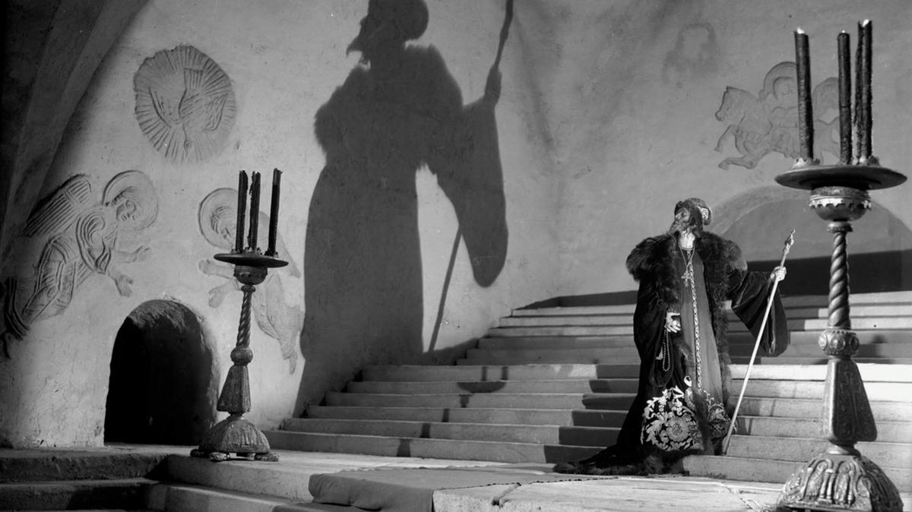

# В топ пошли одни старики. Современное российское кино не попало в «золотую подборку» для воспитания «традиционных ценностей» у школьников, составленную чиновниками

- **URL:** https://novayagazeta.ru/articles/2025/09/01/v-top-poshli-odni-stariki
- **Дата:** 2025-09-01
- **Автор:** Лариса Малюкова

## В топ пошли одни старики

## Современное российское кино не попало в «золотую подборку» для воспитания «традиционных ценностей» у школьников, составленную чиновниками

Фото со съёмок второй части «Ивана Грозного» Сергея Эйзенштейна. Фото: В. Домбровский

Еще 13 мая президент Владимир Путин поручил Минпросвещения вместе с президентским Советом по культуре и искусству сформировать перечень из 100 лучших советских и российских художественных фильмов для их показа в общеобразовательных организациях. Перечень следовало составить к 30 августа.

Успели к сроку. Как сказано на сайте ведомства, список позволит использовать золотой фонд российского кино для укрепления традиционных ценностей среди школьников, а также будет способствовать формированию эстетического вкуса, культурного кругозора и национально-культурной идентичности на основе лучших образцов российского кинематографа.

Главная цель — «использование воспитательного потенциала художественных фильмов для сохранения и укрепления традиционных российских духовно-нравственных ценностей».

Кадр из фильма «Айболит-66»

Надо заметить, что список в основном состоит действительно из картин вне срока давности. Здесь и «Чапаев» братьев Васильевых, и «Айболит-66» Ролана Быкова, и «Дикая собака Динго» Юлия Карасика, «Алые паруса» и «Руслан и Людмила» Александра Птушко, «Кавказская пленница, или Новые приключения Шурика» Леонида Гайдая, «Белое солнце пустыни» Владимира Мотыля, «Мимино» Георгия Данелии, «Берегись автомобиля» Эльдара Рязанова, «Мы из джаза» Карена Шахназарова, «В бой идут одни «старики» Леонида Быкова, «Обыкновенное чудо» Марка Захарова, «Свой среди чужих, чужой среди своих» Никиты Михалкова, «Покровские ворота» Михаила Козакова. Фильмы Тарковского, Митты, Кулиджанова, Хейфица, Козинцева.

«Национально-культурную идентичность» следует укреплять с помощью исторических байопиков «Петр Первый» Владимира Петрова, «Александр Невский» и «Иван Грозный» Сергея Эйзенштейна.

Изумляет число военных фильмов. Но выбор вполне аргументированный, ведь все лучше советские картины о войне — мощные антимилитаристские высказывания.

«Летят журавли» Михаила Калатозова, «Баллада о солдате» Григория Чухрая, «Белорусский вокзал» Андрея Смирнова, «А зори здесь тихие…» Станислава Ростоцкого, «Они сражались за родину» Федора Бондарчука, «Иди и смотри» Элема Климова, «Проверка на дорогах» Алексея Германа.

Но есть и удивительное. В списке отсутствуют современные картины. То есть совершенно. Последние по времени работы: «Собачье сердца» Бортко (1988) и «Гардемарины, вперед!» Дружининой (1987).

Кадр из фильма «Дикая собака Динго»

Поддержите нашу работу!

1000 500 300 Нажимая кнопку «Стать соучастником», я принимаю условия и подтверждаю свое гражданство РФ

Если у вас есть вопросы, пишите [email protected] или звоните:+7 (929) 612-03-68

Видимо, в Минпросвещении считают, что во всей российской фильмографии почти за три десятилетия не создано ни одной достойной просмотра школьниками картины? Сравнимой в художественных достоинствах с избранными экспертами образцами золотой классики, такими как «Гардемарины, вперед!»? Может, поэтому в списке нет произведений киноискусства Сокурова, Звягинцева, Хлебникова. Нет «Мастера и Маргариты» Локшина.

Не менее любопытной кажется тема «возрастных ограничений». Кажется, их писали наобум (на самом деле, возрастная категория каждого фильма вписана в соответствии с прокатным удостоверением).

Любовную драму «Мой ласковый и нежный зверь» Эмиля Лотяну и христологическую трагедию «Восхождение» Ларисы Шепитько, народную драму «Калина красная» Шукшина, триллер «Холодное лето пятьдесят третьего…» Александра Прошкина, к примеру, рекомендовано смотреть детям с 12 лет.

А вот «Я шагаю по Москве», «Гусарскую балладу», «Александра Невского», «Летят журавли» и даже «Кубанские казаки» детям до 12 лет разрешен просмотр исключительно в сопровождении родителей.

Наверное, чтобы разъяснили, что люди вовсе не жили так сытно и нарядно, как изобразил Пырьев в «Кубанских казаках».

Кадр из фильма «Кубанские казаки»

Лариса Малюкова ведет телеграм-канал о кино и не только. Подписывайтесь тут.

### Этот материал входит в подписки

Смотровая площадкаКино с Ларисой Малюковой

Культурные гидыЧто читать, что смотреть в кино и на сцене, что слушать

### Добавляйте в Конструктор свои источники: сайты, телеграм- и youtube-каналы

Войдите в профиль, чтобы не терять свои подписки на разных устройствах

Поддержите нашу работу!

1000 500 300 Нажимая кнопку «Стать соучастником», я принимаю условия и подтверждаю свое гражданство РФ

Если у вас есть вопросы, пишите [email protected] или звоните:+7 (929) 612-03-68
