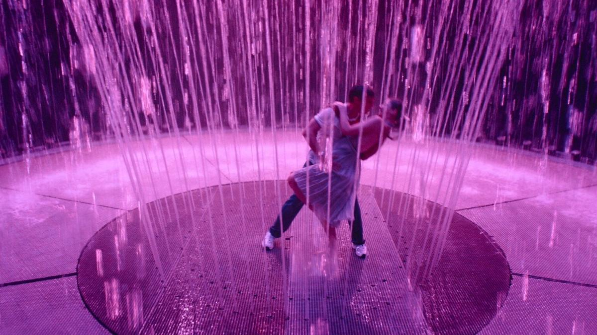

# «Танцуют все». 4 сентября на Wink выходит сериал «Москва слезам не верит. Все только начинается»

- **URL:** https://novayagazeta.ru/articles/2025/09/04/tantsuiut-vse
- **Дата:** 2025-09-04
- **Автор:** Лариса Малюкова

## «Танцуют все»

## 4 сентября на Wink выходит сериал «Москва слезам не верит. Все только начинается»

Кадр из сериала «Москва слезам не верит. Все только начинается»

Авторы — Жора Крыжовников («Горько!», «Слово пацана») и Ольга Долматовская — покусились на святое: переосмысление нашей главной всенародно любимой оскаровской мелодрамы Владимира Меньшова. Правда, они повторяют, что экранизировали именно сценарий Валентина Черныха. Но когда берешься за историю, которую зритель знает наизусть — по репликам, — сравнивать все равно будут с киноисточником.

Действие сериала развивается в начале 2000-х и в наши дни. Не думаю, что роль машины времени здесь, как и в классическом фильме, исполнит будильник. Гадать не буду, видела только первую серию.

Итак, три подруги намерены покорить столицу. Храбрая скромница Ксюша Тины Стойилкович (реинкарнация героини Веры Алентовой), сбежавшая в Москву из Самары-городка от мужа-тирана. Уже с ребенком на руках, но после провала в институт без определенного места жительства. Со шрамом на животе от ножевого ранения (муж-абьюзер, видимо, еще появится).

Оля Анастасии Талызиной (Тося Раисы Рязановой в первоисточнике) — серьезная, фанатично преданная будущей профессии студентка мединститута. Она и приютит Ксюшу в поначалу негостеприимной столице.

Маша — Мария Камова, известная как блогерша Маш Милаш (по данным на лето-2024, число ее подписчиков в блогах выросло до трех миллионов). В отличие от героини Муравьевой, мечтает выйти не за генерала, а за иностранца. Нахрапистая, временами смешная авантюристка без царя в голове.

Первая серия — долгая экспозиция, медленная раскачка истории: вуз, «Фабрика звезд», где пытаются зацепиться провинциалки, «Макдональдс», мединститут. Застенчивая и целеустремленная Ксюша Лаврова решает остаться в Москве вместе с сыном. Готова работать уборщицей, почтальоном, в пекарне… Хоть кем, главное — остаться в самом красивом городе на свете. Она влюбится в принца Ивана Янковского, который здесь никакой, зато модельно носит на плечах красный свитер. Маша встретит вожделенного иностранца (Дэниел Барнс), но загуляет с соседом по квартире, любителем толкиновских реконструкций, правоведом (Андрей Максимов). Камова несколько пережимает, но зрителю нравится. Оля начнет ассистировать на настоящей операции… правда, неудачно (но лиха беда начало), зато под руководством известного хирурга (Андрей Бурковский). Анастасия Талызина, как всегда, снайперски точна в каждом жесте, реплике.

Сюжетные узелки неспешно завяжутся и развяжутся, как в песне Апиной, как в девичьих мечтах: героини на крыше на звездное небо глядят, гадая на виллу, собачку, иностранца, профессию… А главная героиня, как в пушкинской сказке про трех девиц, — на самое недосягаемое. На любовь.

Кадр из сериала «Москва слезам не верит. Все только начинается»

Порадовать зрителя призваны ностальгические локации: еще живой «Макдональдс», отбор на «Фабрику звезд» в Останкино, клуб «Пропаганда». Среди примет времени — реконструкторы-толкинисты, костюмированная дискотека, второй «Терминатор», который, конечно же, лучше первого.

Вместо камео Смоктуновского и Юматова — мелькнувший в ночном клубе Сергей Зверев и Рыжий (Григорьев-Апполонов). Ну… что имеем.

И так как это мюзикл, действие будет прерываться романтическими номерами с отсылками к «Ла-Ла Ленду», «Самому лучшему дню», «Стилягам», музыкальным голливудским комедиям 40–50-х. Но, увы, не дотягивать до оригиналов. Музыкальные номера, несмотря на очевидный размах, выглядят довольно слабо. Как будто их снимал не автор «Самого лучшего дня» с блистательной, оригинальной, без единой склейки сценой «I will survive» с лодкой на авто, автобусом, массовкой, оркестром… Здесь все видано-перевидано: гигантская луна на заднике (даже больше, чем в «Самой большой луне» Попогребского), калейдоскоп фонтанов и танцующих «под дождем» с прозрачными зонтиками, с мерцанием красных лампочек, и героиня, которую прогоняют с работы злые дяди (в пекарне, на почте и в ЖЭКе)… Без зонтика.

Кадр из сериала «Москва слезам не верит. Все только начинается»

Поддержите нашу работу!

1000 500 300 Нажимая кнопку «Стать соучастником», я принимаю условия и подтверждаю свое гражданство РФ

Если у вас есть вопросы, пишите [email protected] или звоните:+7 (929) 612-03-68

Легендарная песня «Александра» Никитина, Сухарева и Визбора кажется притянутой за уши. Центральный номер героини «Я люблю» — изначально вторичный, незапоминающийся, текст глохнет в оркестровой аранжировке. Наиболее уверенный номер — «Лучший город земли».

По первой серии судить сложно: может быть, проект, в который вложено столько сил и ресурсов, будет развиваться по нарастающей?

Режиссура — привычно, как любит Крыжовников, энергичная, с драйвом, фирменными джамп-катами, которые ускоряют ритм.

Мешает одно — банальный сюжет… Он и от первоисточника вроде бы ушел, но и до самостоятельной оригинальной яркой истории пока не дошел.

Кино со сквозной темой «Лучшего города Земли» напоминает расширенный клип, посвященный «нашей нарядной Москве» с ее высотками, фонтанами, широкими проспектами, метро, Останкино, кинотеатром «Пушкинский» (на нем, чтобы не путаться в переименованиях, название — «Любовь»). Неужели и до ВДНХ не доедут?

Читайте также

Ядерный полигон, ледяной котлован, заминированные горы

В центре фестиваля «Докер» — уязвимые люди, не кричащие о своей беде, а живущие рядом с ней. Рассказываем о важных премьерах

Закономерно, что зрительская премьера мюзикла состоится 6 сентября в рамках цветущего городского проекта «Сделано в Москве» и «Лето в Москве». Почему-то на Болотной площади (место «бури и натиска» превратят в место народных гуляний?). Показ новой версии «Москва слезам не верит» оказался частью городских «Мероприятий». Мы-то наивно думали, что пилот громкого сериала, запущенный на орбиту платформой Wink, студией «Водород», НМГ-студией при поддержке ИРИ, сначала покажут на фестивале сериалов «Новый сезон». Но нет — возможно, продюсеры справедливо опасались не слишком доброжелательного сарафана от профессионалов. А на празднике — «танцуют все». На момент публикации на сайте «МосБилет», где проходила регистрация, доступных билетов не осталось.

Лариса Малюкова ведет телеграм-канал о кино и не только. Подписывайтесь тут.

Поддержите нашу работу!

1000 500 300 Нажимая кнопку «Стать соучастником», я принимаю условия и подтверждаю свое гражданство РФ

Если у вас есть вопросы, пишите [email protected] или звоните:+7 (929) 612-03-68
