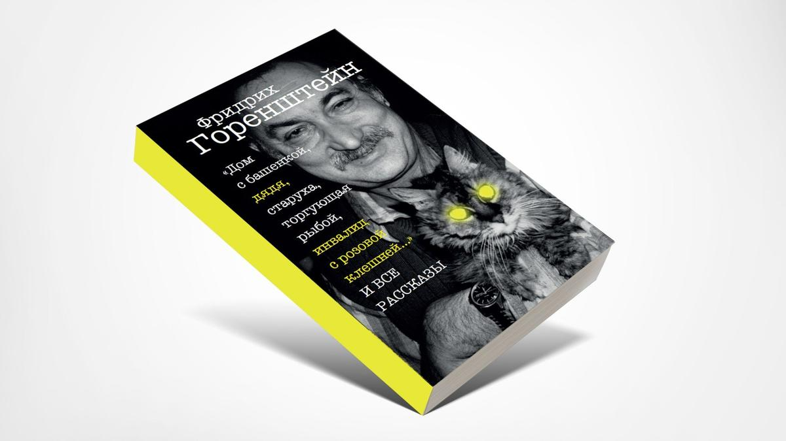

# Нестерпимое ощущение ушедшей сквозь пальцы жизни. В издательстве ISIA вышла книга «Дом с башенкой… и все рассказы» Фридриха Горенштейна — оптимиста в аду

- **URL:** https://novayagazeta.ru/articles/2025/09/04/nesterpimoe-oshchushchenie-ushedshei-skvoz-paltsy-zhizni
- **Дата:** 2025-09-04
- **Автор:** Лариса Малюкова

## Нестерпимое ощущение ушедшей сквозь пальцы жизни

## В издательстве ISIA вышла книга «Дом с башенкой… и все рассказы» Фридриха Горенштейна — оптимиста в аду

Обложка книги «Дом с башенкой… и все рассказы» Фридриха Горенштейна

Соединенные в единый текст рассказы башенкой складываются в трагическое с проблесками язвительного юмора кафкианское пространство, сгущенное, как квинтэссенция, в молекулах восстановленное вещество сталинской эпохи.

Тарковский называл Горенштейна гением. Не ошибался.

Под одной обложкой собраны рассказы выдающегося писателя, до сих пор у нас недостаточно известного, мало прочитанного. Автора потрясающих романов «Искупление», «Место», «Псалом» (после его прочтения Тарковский назвал Горенштейна гением). При жизни Горенштейна в СССР был опубликован лишь один его рассказ — «Дом с башенкой», и публикация в «Юности» вызвала огромный резонанс. Но больше его не печатали, книги были под запретом. Цензоров возмутил беспросветный ужас повести «Зима 53-го». И тексты для кино стали для Горенштейна спасением и средством для выживания.

Он написал сценарии «Соляриса», «Нечаянных радостей» и «Рабы любви», «Седьмой пули», сочинил монологи Рублева для фильма Андрея Тарковского.

Новая книга вышла благодаря усилиям литературоведа Юрия Векслера — просветителя, который десятилетия неустанно рассказывает, пишет и снимает кино о Горенштейне.

Соединенные в единый текст рассказы складываются в трагическое с проблесками язвительного юмора кафкианское пространство, сгущенное, как квинтэссенция, в молекулах восстановленное вещество сталинской эпохи. Его называли оптимистом в аду. Враждебный, колючий мир в его произведениях подобен темноте шахты, которую скребком с фонариком на лбу пытается подцепить герой «Зимы 53-го». Но снайперская приметливость, точность деталей воссоздают в неуловимых подробностях и нюансах поток истекшей советской жизни.

Его проза захватывает и не отпускает с первых строк, но в тоже время требует от читателя работы, отказа от стереотипов, готовности к восприятию обжигающей неудобной правды жизни, характеров, отношений.

Его слова и метафоры царапают и ранят, но впиваются в сознание — не забудешь. И к удовольствию от чтения вдруг плюсуется неловкость от узнавания в малопривлекательных героях каких-то своих склонностей, комплексов, изъянов.

Герои рассказов и повестей — инженеры, рабочие, заключенные, «продовольственные старухи», творческая интеллигенция, «начальники», запуганные граждане неконвенциональной национальности, яростные антисемиты, студенты, силовики, пенсионеры, дети. Весь срез общества, но в точечных характеристиках каждого персонажа угадывается сосед — по лестничной клетке, дому отдыха, плацкарту, очереди. Каждый из них трехмерен, обладает своим неповторимым языком, запахом, состоит из плоти и крови. Даже люмпен, хам, отвратительный бюрократ, гэбэшник на какой-то миг оказывается уязвимым и хрупким. Неся зло, сам оказывается жертвой зла. Но в этом темном круговороте есть и просветы человечности едва ли не самого жесткого, если не сказать жестокого по отношению к гомо сапиенсу писателя.

Фридрих Горенштейн. Фото: архив

В одном из самых известных рассказов Горенштейна («Шампанское с желчью») театральный режиссер Ю. — человек не храброго десятка, — будучи под колпаком органов, умудрился влюбиться в иностранку, а потом еще набраться смелости и отказаться от предложения сверху вступить в общество палестино-советской дружбы. Но арабо-израильская война настигла его в доме отдыха в Крыму в 1973-м во время войны Судного дня. Когда победный, захлебывающийся антисемитизм накрыл, словно пенная волна, с головой отдыхающих. И не было места, где Ю. мог бы укрыться. Ни в море, ни в столовой, ни в номере. Каждой клеточкой режиссер чувствовал бурлящую в глотках ненависть, ежеминутно сознавая, что «в социалистической России антисемит — лицо общественное, и за спиной каждого уличного хулигана стоит государство всей своей громадой». Тошнотное же название повести помогает расшифровать эпиграф из Деяний апостолов: «Ибо вижу я тебя исполненного горькой желчи и в узах неправды».

Поддержите нашу работу!

1000 500 300 Нажимая кнопку «Стать соучастником», я принимаю условия и подтверждаю свое гражданство РФ

Если у вас есть вопросы, пишите [email protected] или звоните:+7 (929) 612-03-68

Задушенный неправдой и несправедливостью маленький человек в произведениях Горенштейна уже не кричит, подобно Акакию Акакиевичу: «Оставьте меня, зачем вы меня обижаете!» Он барахтается-тонет в клокочущей, как горячая адская смола, злобе «среди лжи и клеветы, среди ненависти, бесконечной и разнообразной, как хаос», и чувствует, как сам превращается в морального и физического урода…

В книге целый калейдоскоп подобных героев — на первый взгляд жалких, уродов, недалеких, нелепых, но страдающих. И при всей нелицеприятности, язвительной обидной иронии ты не можешь им не сочувствовать.

Например, старухе Авдотьюшке из изумительного рассказа «С кошелочкой». Время для нее застыло, она живет, мелко топоча по одному и тому же кругу, как заведенная: булочная, мясной, молочный, универсальный, «килинария». Колбасные электрички и поезда идут из Москвы, алчущий голодный люд стекается в столицу, но Авдотьюшка навострилась сухими ручками выхватывать у реальности дефицит. Однажды очередь сжимает старуху, и ей, очнувшейся в больнице, кажется, что все кончилось… Но нет, вспоминает она о главном своем сокровище — «кормилице-кошелочке». Значит, не завершился еще никчемный век Авдотьюшки, тусклая жизнь-беготня со своими мелкими продовольственными радостями, значит, не погас еще едва заметный «Божий огонек».

Или доживающим век двум седеньким старушкам, матери и дочери (не поймешь, кто моложе) из рассказа «Старушки». Один день их ничтожного, никому не интересного бытия — крупным планом. И нестерпимое ощущение ушедшей сквозь пальцы жизни в этот последний день лета. И воспоминания, из которых ускользают репрессии, настигнувшие семью, и переживания, зато старушка помнит, как самозабвенно танцевала, как дочь ревновала своего мужа к сестре. И хочется вспомнить сладковатый вкус помады на губах. И уже неважно, слезы какой из двух старушек — старшей или младшей — по пропащей жизни капают в сумочку.

Читайте также

Мог ли Горенштейн писать о любви?

Новая книга писателя открывает его с неожиданной стороны

Или первокурснику Митеньке, который мечтал идти в колонне под общий ритм по утреннему свежему городу, чеканя шаг. Все вместе. Но потом случилось трагическое: его выставили из кадра во время съемки коллективной фотографии из-за семитской внешности. И казалось, все видят Митенькин позор, как его выставляют, отстраняют от коллектива. И только полет к звездам может спасти от земного отчаяния.

И наконец, совершенно прекрасный рассказ «Дом с башенкой» о встрече восьмилетнего ребенка с гигантским, просто космическим горем. Он едет в лихие военные годы в теплушке с умирающей мамой, охраняет ее от недоброжелателей, которые так и норовят их выкинуть. Но все же их высаживают в каком-то городе, и в больнице мама умирает. Когда он уезжает, единственное, что остается у него в памяти, — дом с башенкой за заснеженной платформой на площади и вечная старуха рядом с ним, продающая печеную рыбу.

О том, как война лишает детства, безопасности. О нестерпимой боли, которую не передать словами. Но автор находит эти слова: «И вдруг что-то повернулось и защемило в груди, и мальчик удивился, потому что еще никогда так не щемило…»

А по вагонам поезда, который увозит ребенка от мертвой мамы, снует старик, «подбирая хлебные крошки, воруя последнее у голодных, потому как сам едва от голоду не помирает». Так вот именно этот вороватый и беспринципный старик укроет заснувшего мальчика… и тому приснится, будто рядом мама. «Неужели это никогда не кончится?» — вопрошает в небеса старик. По Горенштейну — никогда. Его «библейский реализм» предполагает, что в основе человека — не добро, а зло. «Несмотря на Божий замысел, лежит сатанинство, дьявольство, и поэтому нужно прикладывать такие большие усилия, чтобы удерживать человека от зла. И это далеко не всегда удается».

«Ад пуст. Все бесы здесь». Мы сами разверзли преисподнюю, обживаем ее, сжигая мосты к спасению. И только усилие — громадное, трудное, незаметное другим усилие — сделать добро, стать чуть добрее делает нас людьми, обещая последний шанс.

### Этот материал входит в подписки

Смотровая площадкаКино с Ларисой Малюковой

Культурные гидыЧто читать, что смотреть в кино и на сцене, что слушать

### Добавляйте в Конструктор свои источники: сайты, телеграм- и youtube-каналы

Войдите в профиль, чтобы не терять свои подписки на разных устройствах

Поддержите нашу работу!

1000 500 300 Нажимая кнопку «Стать соучастником», я принимаю условия и подтверждаю свое гражданство РФ

Если у вас есть вопросы, пишите [email protected] или звоните:+7 (929) 612-03-68
