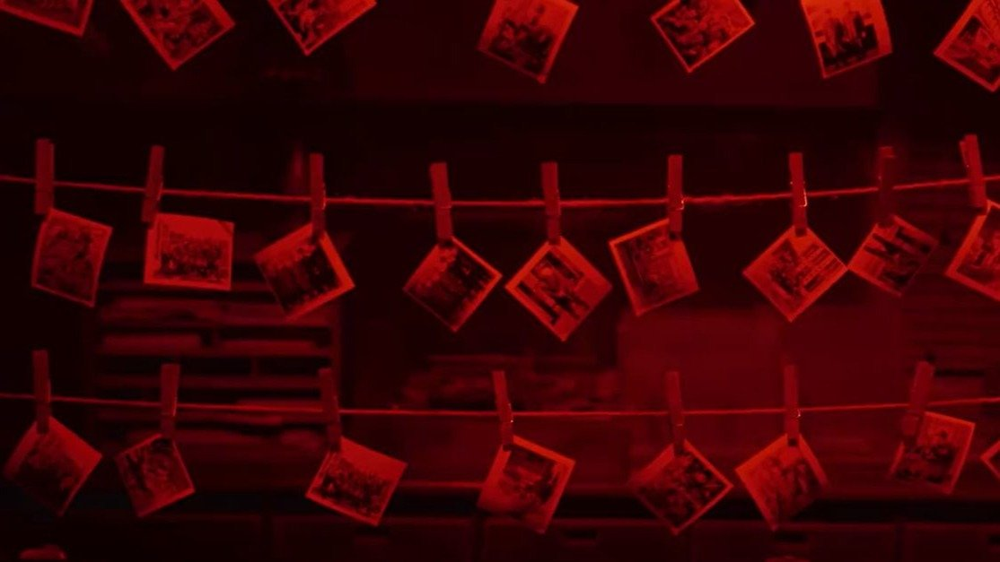

# Резня, негатив, нарратив. На российские экраны вышел китайский исторический блокбастер «Нанкинский фотограф», сам превратившийся в пропаганду

- **URL:** https://novayagazeta.ru/articles/2025/09/15/reznia-negativ-narrativ
- **Дата:** 2025-09-15
- **Автор:** Лариса Малюкова

## Резня, негатив, нарратив

## На российские экраны вышел китайский исторический блокбастер «Нанкинский фотограф», сам превратившийся в пропаганду

Проявочная «Счастливой фотомастерской» из фильма «Нанкинский фотограф». Кадр из фильма / kino-teatr

Я бы показывала это кино в киношколах как пример «Особо значимого китайского кино», которое отвечает всем выверенным идеологемам, идейным шаблонам кипящего патриотизма и поэтому при всем мощном историческом материале проигрывает по всем статьям.

Вспоминаем, что 1937-й проклинают не только наследники жертв сталинских репрессий, но и в истории Китая это один из самых страшных черных годов. Нанкин был охвачен чудовищной резней. Нанкин захлебывался кровью.

Начало фильма — хаос эвакуации во время вторжения Японских императорских вооруженных сил. Бежит армия, бегут сломя голову толпы жителей. Пропаганда твердит о японо-китайской дружбе, но японские солдаты режут, насилуют, расстреливают людей. Мирных и китайских военнопленных, несмотря на все конвенции, потому что «они не люди, а свиньи».

Белые флаги с красным кругом — словно запятнавшие себя кровью — развеваются повсюду. И нет от них спасения.

Одно из главных средств пропаганды — фотография. Раздавленных морально и физически горожан заставляют позировать с улыбками на измученных лицах.

Ито Хидэо, японский фотограф при правительстве, нуждается в проявителе пленки — он и поставляет наверх удовлетворяющие режим фото. Он нанимает китайского почтальона Лючана Су (Хаожань Лю), который выдает себя за фотографа из популярной в мирные времена «Счастливой фотомастерской». А в подполе той самой «Счастливой мастерской», на стенах которой фото счастливых жителей Китая, прячется настоящий фотограф с детьми и женой. Они не успели убежать и мечтают лишь об одном: дожить до конца войны.

«Нанкинский фотограф». Кадр из фильма / kino-teatr

Кино о том, как вроде бы цивилизованные люди преступают моральные принципы во время войн и превращаются в зверей.

Как пропаганда работает на дегуманизацию людей, девальвируя понятия «патриотизм», «патриотический долг». Есть здесь и коллаборационисты, пытающиеся приспособиться к новым условиям, но заведомо проигрывающие. Потому что к условиям существования за пределами человеческих норм — не приспособиться.

Интересна и тема фотографий. Если японец Ито воюет с помощью фотоаппарата, то Лючан Су своими фото свидетельствует о преступлениях против человечности. Благодаря фотодокументации японских военных преступлений Нанкинский трибунал получил доказательства для судебного преследования.

Герой фильма Лючан Су своими снимками свидетельствует о преступлениях против человечности. Кадр из фильма / kino-teatr

Поддержите нашу работу!

1000 500 300 Нажимая кнопку «Стать соучастником», я принимаю условия и подтверждаю свое гражданство РФ

Если у вас есть вопросы, пишите [email protected] или звоните:+7 (929) 612-03-68

Визуально картина интересная, несмотря на чрезмерное увлечение компьютерной графикой. Изображение города словно присыпано пеплом от постоянных взрывов, и только в проявочной фотостудии — красный цвет. Здесь рождаются на свет и те снимки, которые лгут. И те, которые говорят правду.

Но сама история прямолинейна до беспредела. Японцы — стадо беспощадных зверей и злобных тварей. Детей убивают прямо в кадре (младенца со всей силой японский солдат швыряет на асфальт, а потом этого мертвого младенца с кровавым виском вручат китайской женщине — для фото мирных семейных сцен). Массовые расстрелы завоеватели ведут под декламирование стихов. Река Янцзы, заполненная трупами, меняет серый цвет на багровый (там захватчики устроили настоящую бойню: расстрел из пулеметов более 57 тысяч (!) военнопленных).

Показательный героизм мирных китайцев. Все трусы и коллаборационисты ближе к финалу будут наказаны.

Интересный замысел, основанный на реальной трагедии, превращается тоже в пропагандистское кино, в агитку, а агитке трудно сочувствовать.

Фильм выходит у нас через месяц после премьеры в Китае. Авторы картины перед премьерой говорили, что у военных преступлений нет срока давности.

## P.S.

Во время Нанкинской резни японцами было уничтожено до 300 тысяч жителей столицы.

### Этот материал входит в подписки

Смотровая площадкаКино с Ларисой Малюковой

Культурные гидыЧто читать, что смотреть в кино и на сцене, что слушать

### Добавляйте в Конструктор свои источники: сайты, телеграм- и youtube-каналы

Войдите в профиль, чтобы не терять свои подписки на разных устройствах

Поддержите нашу работу!

1000 500 300 Нажимая кнопку «Стать соучастником», я принимаю условия и подтверждаю свое гражданство РФ

Если у вас есть вопросы, пишите [email protected] или звоните:+7 (929) 612-03-68
