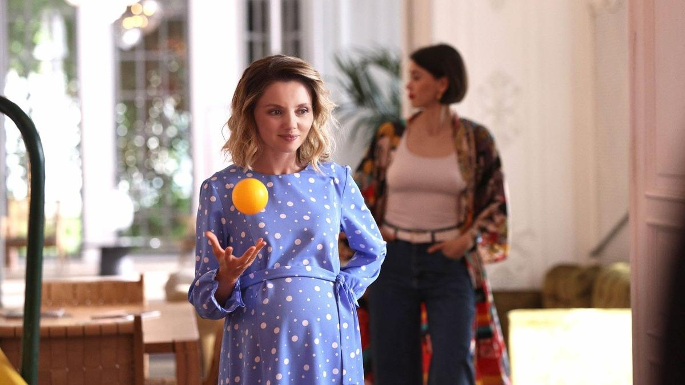

# Без вины виноватые в интересном положении. Сериальные новинки сезона

- **URL:** https://novayagazeta.ru/articles/2025/09/17/bez-viny-vinovatye-v-interesnom-polozhenii
- **Дата:** 2025-09-17
- **Автор:** Лариса Малюкова

## Без вины виноватые в интересном положении

## Сериальные новинки сезона

Кадр из сериала «Интересное положение»

Фестиваль «Новый сезон» набирает обороты. На главном смотре сериального кино пару лет назад было 500 аккредитованных участников и гостей, на нынешнем — полторы тысячи.

На Деловые сессии не пробиться. Проекты представляют сами платформы. И вот тут интересно: заметно усыхает поле авторских оригинальных проектов, все больше массовых «продуктов».

И первым сериалом конкурса оказался

- «Интересное положение» платформы ИВИ и режиссера Гоги Мамаджаняна. Продюсеры — братья Андреасяны

Так сказать, комедийная мелодрама про девушку, оказавшуюся в необычной ситуации с двойняшками от разных отцов. Уже лет 10 назад продюсеров поразил научный факт: явление суперфекундации, при которой две или более яйцеклетки оплодотворяются сперматозоидами разных мужчин в течение одного овуляционного периода. Отчего бы не повеселиться. Тем более что тема зачатия — из любимых у Андреасянов. Вспоминается «Беременный», где телеведущий Дмитрия Дюжева храбро беременел вместо жены.

Ладу (Ольга Кузьмина), которая работает в ЗАГСе и скрепляет кольцами браки, бросил возлюбленный, она отправляется прямиком в клуб, чтобы залечить душевные травмы. Там очень кстати встречает знакомого (Вячеслав Чепурченко), который готов той же ночью «утешить». Известие о беременности двойней провоцирует множество вопросов.

Будущей матери придется выяснить, кто их отец. Если посмотреть трейлер, считайте, посмотрели сериал. Выводы супероригинальные: беременность — это трудно (тошнит очень), но важно. Рождение ребенка — чудо. Главное — это любовь.

В первых кадрах Лада вся в косметике как бы тужится… на камеру, и как бы рожает. И в начале, и потом — все играют с пережимом. Диалоги запредельные. А вообще, было бы здорово внедрить научным образом суперфекундацию в массы, повысить рождаемость в соответствии с нацпрограммой — с сериальным промо «Интересное положение».

- «Тысяча «нет» и одно «да» (WINK), режиссер Андрей Силкин. Авторы сценария — Жора Крыжовников и Денис Уточкин (Крыжовников и среди продюсеров)

Когда решили сделать, перефразируя Гоголя, милейший во всех отношениях женский сериал про закономерность случайности.

Замуж выходит скандальная Татьяна (Ангелина Стречина), дочка скандальной мамы (Елена Лядова) и сестры-Золушки Оксаны (Ксения Трейстер). На самом деле, здесь все любят друг друга. Просто немного нервно. Жених Вадим (Павел Попов) — молодой и успешный хирург и просто «хороший человечек»: во время свадьбы мчится спасать погибающего ребенка.

В общем, случается свадебный переполох.

Друг жениха, избалованный олигарх Сергей (Константин Белошапка очень похож на всех звезд турецких сериалов сразу) навязчиво ухаживает за заботливой скромницей Оксаной и делает ей предложение прямо на свадьбе. Оксана разумно отказывается от «внезапно упавшего на голову счастья».

Тогда оскорбленный Сергей и произнесет: «И пусть ты тысячу раз скажешь «нет», рано или поздно ты все равно скажешь «да»!»

Получился микс свадебной комедии положений, семейной комедии с медицинским драмеди — новая версия «Горько», пожененная с «Бесприданницей» плюс шлейф востребованных турецких сериалов.

Кадр сериала «Тысяча «нет» и одно «да»

Свадебные шутки (сложить имя невесты пятитысячными купюрами), внутрисемейные конфликты (история домашнего ресторана, история вечно занятого мужа), возможное разбирательство Минздрава и прокуратуры (вспоминаем сериал «Дыши»), неразделенная любовь. Линий с перебором, сразу и не разберешься.

Поддержите нашу работу!

1000 500 300 Нажимая кнопку «Стать соучастником», я принимаю условия и подтверждаю свое гражданство РФ

Если у вас есть вопросы, пишите [email protected] или звоните:+7 (929) 612-03-68

Что же касается современной для Островского темы разрыва сословий, сегодня она не так актуальна. С точки зрения олигархов — вообще неактуальна.

По отдаленным мотивам пьес Островского «Бесприданница», «Грех да беда на кого не живет», «Шутники». Афоризм одного из главных героев из «Греха да беды…» становится центральным мотивом действия: «Не ждал, не гадал, а в беду попал. Беда не по лесу ходит, а по людям». В версии авторов «Тысячи «нет»…», люди — сами виновники собственных бед.

Да, вторично, но, видимо, расчет на широкую (прежде всего, женскую аудиторию). Елена Лядова в характерной роли сверхзаботливой рачительной мамаши, из тех, которые точно знают, что лучше их детям, действительно хороша.

- «Отпечатки» — первый собственный проект студии Kion-film

Кадр из сериала «Отпечатки»

Криминальный детектив с элементами мелодрамы о кровавых убийствах и сиротстве. Основано на реальных историях воспитанников детских домов.

Зверское убийство матери и двух маленьких детей — город Заречный стоит на ушах. Подозреваемый — отец убитых детей Глеб Васильев — алкаш смурной.

Следователь Яна Князева (Оксана Акиньшина), временно отстраненная от дел за наезд на абьюзера, подозревает, что Глеб, с которым она была в детском доме, невиновен.

Она хочет помочь в расследовании капитану местного СК Денису Симонову (Дмитрий Чеботарев), который подозревает Глеба Васильева.

Постепенно Яна начинает понимать, что убийство матери и детей напоминает ей другое аналогичное кровавое преступление. Петелька-крючок — все похоже на ритуальные душегубства.

Насколько эти злодеяния связаны с прошлым Яны, отчего их следы ведут в детский дом?

Как это связано с бывшей воспитательницей Кристиной, а ныне мэром города Заречный (как всегда, роскошная Полина Кутепова)?

Читайте также

Резня, негатив, нарратив

На российские экраны вышел китайский исторический блокбастер «Нанкинский фотограф», сам превратившийся в пропаганду

Колоритные персонажи вроде нехорошей фам фаталь Кутеповой, в юности тишайшей тоталитарной воспитательницы, или обманчиво ласковый в юности и спивающийся в старости воспитатель Иртеньев (Олег Рязанцев), рассуждающий о выборе, на который сил не хватает. Притягательна дуэль двух «неправильных» следователей: Симонова и Князевой. Они, как два минуса, дают плюс.

Многосерийный прилично снятый атмосферный детектив о мести и прощении, о детских травмах, которые подчас непоправимы. Из недостатков — слишком медленное повышение ставок, неспешный разогрев саспенса, пояснительные флешбэки. Но следующие серии ждем. Любопытно, как авторы решат проблему взаимосвязи социальных проблем и криминальных.

И мир сериала убедителен. В роли вымышленного провинциального города Заречный — кинематографический город Астрахань. Клумбочки в автомобильных шинах, шашлыки в парках, выпивка на бампере. Все как в жизни, только опасней. Особенно для «баторских детей». Хотя в подкладке кино — мысль о том, что «бывших сирот не бывает». Сиротство и есть самая неопровержимая улика: отпечаток на всю жизнь для без вины виноватых.

Лариса Малюкова ведет телеграм-канал о кино и не только. Подписывайтесь тут.

### Этот материал входит в подписку

Смотровая площадкаКино с Ларисой Малюковой

### Добавляйте в Конструктор свои источники: сайты, телеграм- и youtube-каналы

Войдите в профиль, чтобы не терять свои подписки на разных устройствах

Поддержите нашу работу!

1000 500 300 Нажимая кнопку «Стать соучастником», я принимаю условия и подтверждаю свое гражданство РФ

Если у вас есть вопросы, пишите [email protected] или звоните:+7 (929) 612-03-68
