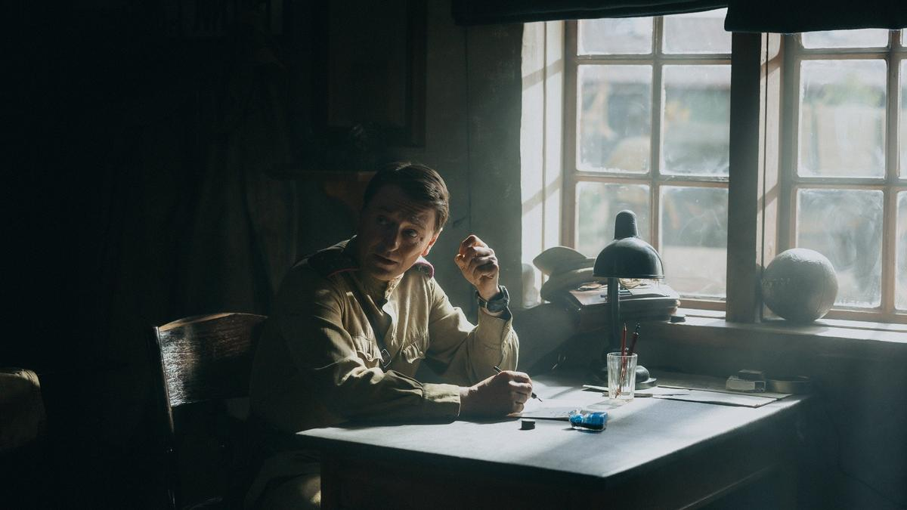

# Бабушка приехала. В Москве состоялась пышная премьера российского военного триллера «Август»

- **URL:** https://novayagazeta.ru/articles/2025/09/23/babushka-priekhala
- **Дата:** 2025-09-23
- **Автор:** Лариса Малюкова

## Бабушка приехала

## В Москве состоялась пышная премьера российского военного триллера «Август»

Кадр из фильма «Август»

Картина снята по мотивам романа Владимира Богомолова «В августе сорок четвертого» («Момент истины»), режиссеры — Никита Высоцкий и Илья Лебедев. Генпродюсером блокбастера выступил Константин Львович Эрнст, который четверть века мечтал экранизировать роман, и заметил недавно, что лес — главный герой картины: «Это путешествие трех наших героев вглубь себя, своего подсознания, в лес собственной души… чтобы вычислить и поймать врага». Об этой картине Эрнст мечтал много лет. Потом было три запуска в производство, менялись режиссеры, авторы сценария. Последний вариант написал Сергей Снежкин.

«Момент истины» — выдающийся увлекательный бестселлер и одно из самых загадочных современных произведений о войне, знаменитый роман о работе контрразведки (переведен на три десятка языков, выдержал более 100 изданий, тираж превысил несколько миллионов экземпляров.). Сложный сплав казенного языка документов, напряженной детективной интриги, которая затягивает тебя в свою воронку, прозаического, почти бытового описания будней разведчиков и их внутренних монологов. Сюжетные кольца сжимаются, и макровзгляд на фронт в Западной Белоруссии и Южной Литве, на начинающуюся войсковую операцию сужается, концентрируясь на внутреннем мире героев, укрупняя и приближая их.

Владимиру Осиповичу не нравилась предыдущая экранизация Михаила Пташука, довольно внимательная к тексту, он говорил, что из-за бессмыслия и непродуманных импровизаций режиссера были провалены многие эпизоды, потому и снял свое имя с титров. Но работа Евгения Миронова в роли капитана Алехина ему пришлась по душе. Да и во время съемок он постоянно наставлял актера.

Недавно благодаря усилиям «Рен ТВ» и канала «Звезда» вышел мини-сериал «Операция «Неман» по мотивам романа. На первом плане оказался не только Алехин Александра Яценко, но и — неожиданно — линия немецких диверсантов под предводительством агента Мищенко (Алексей Кравченко), получившая собственную историю развития. «Матильда» (в романе — позывной законспирированного немецкого агента, шифровальщика штаба фронта) в сериале обретает плоть и кровь. Хорошая роль Сергея Маковецкого, но при чем здесь Богомолов?

Все снято с привычным «прикидом» НТВ: гуляющими из фильма в фильм реквизитом, техникой «Военфильма». Чистенькими гимнастерками. И фальшаком в каждом кадре.

И вот новая версия. Военный триллер — с войсковым и компьютерным размахом, более серьезным подходом к съемкам. Про край войны и мира. Август обманчив, утягивает прекрасное лето в осень. Кажется, война вот-вот закончится. Но будет еще целый год войны.

Музыка молодого композитора Дмитрия Емельянова напоминает аранжировки и партитуры «Ликвидации».

Итак, имеем лес размером с Францию: там спрятались армия Крайова, литовские националисты, немцы… Но найти там трех вражеских упырей с рацией и шифровальными ключами — все равно, что иголку в стогу сена. Придется с риском для жизни прочесывать лес по квадратам. А их всего трое. А задание под личным контролем Сталина. В фильме причины поиска немецких диверсантов, отправлявших радиограммы врагу, прописаны более туманно, чем в книге. У Богомолова было все ясно. Передача диверсантами разведданных о передвижении наших войск грозит сорвать готовящееся стратегическое наступление советских войск в Прибалтике.

Кадр из фильма «Август»

Старший сержант Таманцев, он же Скорохват (Никита Кологривый) внимательнейшим образом проверяет документы всех машин на дороге. Наглый, но нервный майор с женой и младенцем вызывают подозрения, которые разделяет прямой начальник Таманцева, опытнейший капитан Алехин (Сергей Безруков). Примерно в этот нервный момент к ним и присоединяется прибывший из госпиталя новичок в разведке лейтенант Блинов (Павел Табаков). Они разоблачают врагов, везущих батареи для затухающей рации диверсантов, завязывается лихая перестрелка.

Центр фильма — самый яркий в тройке Таманцев Никиты Кологривого. Наглый, азартный, ловкий, солнышко крутит на турнике под аплодисменты солдат. С портовой (часто мимо оригинала) лексикой. Подозрительный хитрован. Находчивый и безбашенный: надо дешифровку для обнаруженной информации наверху запросить, но это долго, тогда он буквально пробивается к телефону, посылает телеграмму наверх… «Все для фронта». Патриотичен: «Наши птицы у немцев не поют» — аплодисменты в зале.

Кологривый играет жирно, но в рамках жанра убедительно, он трикстер, который поднимает температуру действия.

Поддержите нашу работу!

1000 500 300 Нажимая кнопку «Стать соучастником», я принимаю условия и подтверждаю свое гражданство РФ

Если у вас есть вопросы, пишите [email protected] или звоните:+7 (929) 612-03-68

Блинова, стажера-оперативника в группе СМЕРШ, играет Павел Табаков. Его история — трансформация неопытного, наивного студента-москвича в разведчика, способного принимать мгновенные решения.

Генерал-лейтенант Егоров — одна из последних работ Романа Мадянова. Слуга царю, отец солдатам: свой в доску, грозный, но справедливый. На бога надеющийся и на свой наган.

Здесь стоит заметить, что, судя по реакциям зала, подавляющее число зрителей роман не читали и смотрели фильм, не представляя, что их ждет впереди. Впрочем, и у читавших и перечитывавших роман ближе к финалу возникло схожее чувство.

Авторы довольно лихо двигались по проложенным ими рельсам экшена, приключенческого шпионского триллера с сильными обаятельными героями, хорошей динамикой, выверенным темпоритмом.

Кадр из фильма «Август»

Да, они не следовали роману буквально, не стали приводить документы, шифрограммы, приказы, которые составляют его внушительную часть. Изменили некоторые линии. В частности, офицера комендатуры Аникушина в кульминационной сцене встречи с диверсантами заменил шофер Хижняк, появилась старуха-диверсантка на вокзале. Отказались от внутренних монологов героев, которые на экране часто выглядят искусственными. Хотя для романа именно в монологах, прежде всего алехинских, раскрывается сложность работы смершевцев. Как передать мыслительный поток суперпрофи Алехина, страдающего от того, что, столкнувшись с чуждой жизнью, он вынужден не утешить, а потрошить человека, добывая необходимую информацию? «Проклятое занятие — хуже не придумаешь».

Кульминация (и в романе, и в кино) — прокачка диверсанта Мищенко, когда Алехин садится перед врагом на корточки, медленно развязывает узел вещмешка, рискуя собственной головой и задавая простецкие вопросы. Напряженное приближение к разоблачению. Моменту истины. Богомолов описывает, как параллельно готовится гигантская военная операция, которая повлечет немыслимые жертвы, но буквально за минуты до ее начала Алехин прокачает Мищенко.

Для Владимира Богомолова была сверхценной одна важнейшая сквозная мысль романа, которая утекла от авторов фильма. Вот как он сам рассказывал об этом мне в последнем интервью:

«Три офицера разыскивают вражескую радиостанцию. Уродуются по 16 часов — людей не хватает. А практически выходит, что никому это не нужно. На перехвате — целая очередь на дешифровку. Ждите… Но по какой-то случайности на абзац об этом конкретном розыске в ежедневной сводке положил глаз Сталин. И началась вращаться огромная государственная машина. Самое чудовищное — поведение людей, которые около Сталина. Более всего они боятся за свою жизнь, карьеру, продвижение. Готовы вывернуться наизнанку. Маховик раскручивается. А трое внизу по-прежнему делают свое дело. Вот она, система…»

Читайте также

Владимир Богомолов: «Я решил свести до минимума контакты с государством»

Последнее интервью писателя-фронтовика, автора романа «Момент истины». Текст 2004 года

Есть ощущение, что какие-то важные моменты истории выпали на этапе монтажа. Например, никак не объяснены галлюцинации Таманцева, во время которых он видит ближайшие события.

И все же примерно три четверти фильма все идет как по маслу, хоть и в самостоятельном режиме экшена, отстоящего от романа, но к нему прислушивающегося. Жанр диктует правила. Есть точные детали: чернильное пятно на губе от химического карандаша, лопнувший от напряжения сосуд в глазу, хитрая методика запоминания лиц.

Однако ближе к финалу авторы переключаются с Богомолова на Чапаева. Начинается бойня с окруженцами, численность которых кратно превосходит защитников деревни. Особенно героически бьется с несметным врагом генерал-лейтенант Егоров и его люди. Немцы наступают, уже окружили. Генералам запрещено идти в атаку. Но не Егорову… И только благодаря нашим разведчикам, расправившимся с диверсантами и давшим немцам шифровку отступать, «бабушка приехала» и в последний миг всех спасла.

Известно, кстати, что у фильма «Чапаев» два финала. В оригинале Василий Иванович гибнет. А в ролике, снятом для фронта во время войны, герой Бабочкина выплывает ради поднятия духа. Вдруг когда-нибудь авторы «Августа» решат переснять финал. И сделать как у Богомолова…

Лариса Малюкова ведет телеграм-канал о кино и не только. Подписывайтесь тут.

### Этот материал входит в подписки

Смотровая площадкаКино с Ларисой Малюковой

Культурные гидыЧто читать, что смотреть в кино и на сцене, что слушать

### Добавляйте в Конструктор свои источники: сайты, телеграм- и youtube-каналы

Войдите в профиль, чтобы не терять свои подписки на разных устройствах

Поддержите нашу работу!

1000 500 300 Нажимая кнопку «Стать соучастником», я принимаю условия и подтверждаю свое гражданство РФ

Если у вас есть вопросы, пишите [email protected] или звоните:+7 (929) 612-03-68
