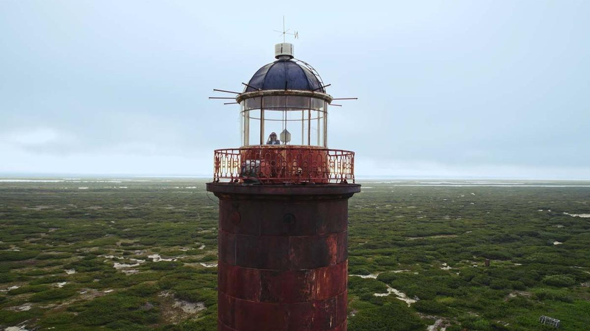

# О китах, квантах и чайниках. В Новосибирске открывается фестиваль научного кино «Кремний»

- **URL:** https://novayagazeta.ru/articles/2025/09/25/o-kitakh-kvantakh-i-chainikakh
- **Дата:** 2025-09-25
- **Автор:** Лариса Малюкова

## О китах, квантах и чайниках

## В Новосибирске открывается фестиваль научного кино «Кремний»

Кадр из фильма «О людях и китах»

У нас принято рассказывать о нарядных «центральных» фестивалях со звездами на красных дорожках — в столицах или прогретых солнцем местах вроде Геленджика или Розы Хутор. Но киносмотры проводятся по всей России. И чем дальше от избалованного культурными событиями центра, тем важнее самые разнообразные просветительские кинопрограммы.

Такие, например, как «Кремний» в Новосибирске.

Сибирский фестиваль научного кино «Кремний» в четвертый раз проводится в Новосибирске и его окрестностях. Смотр как объединение науки и культуры — в традициях и города, и Академгородка, куда и в советские времена приезжали лучшие барды, режиссеры, писатели, поэты.

Ключевой темой в нынешнем году стала научная фантастика. К этому лейтмотиву привязаны специальная программа игровых фантастических фильмов последних лет, ретроспектива экранизаций советской фантастики, тематическая выставка и питчинг современных фантастических книг.

В отдельную программу выделено научное и индустриальное кино Сибири. В основном конкурсе — неигровые фильмы научной и промышленной тематики, которые помогают разобраться с тем, что происходит вокруг нас… внутри нас.

## «О людях и китах»

Режиссер Владислав Гришин

Кадр из фильма «О людях и китах»

Красивое тихое кино.

Группа ученых и студентов приезжает на Сахалин и Камчатку для изучения серых китов и косаток. У каждого из них свои причины сюда отправиться. 30 лет подряд ученые, студенты, волонтеры упорно приезжают на Южный Сахалин отслеживать популяцию серых китов. Биолог Александр Бурдин рассказывает, что почти все лаборатории уже закрыты и работы ведутся на голом энтузиазме. Китообразные появились около 30 миллионов лет назад, а к водному образу жизни перешли 50 миллионов лет назад. А человек разумный (впрочем, о его разумности еще бабушка надвое сказала) — всего лишь 300 тысяч лет назад. Для китов океан — дом родной. Для нас — чужая стихия, которую мы постепенно уничтожаем.

Океан здесь прекрасен. Белое кружево волн, снятое сверху, бескрайний вольный простор. Спасибо авторам за то, что океан тут живой, меняющий оттенки, настроение. И живут в нем гигантские морские животные с красивыми глазами.

Кадр из фильма «О людях и китах»

Живут под водой, дышат воздухом, кормят малышей молоком. Ученые ведут свой каталог млекопитающих — своего рода перепись — с 1995 года. Из года в год. Знают всех морских животных. Знают, как разговаривают друг с другом киты. Как общаются косатки.

Как они понимают друг друга, несмотря на разные «диалекты», которые исследователи уже научились отличать. Морские животные неагрессивны — напротив, отчаянно миролюбивые… в отличие от людей.

Число китов с каждым годом неумолимо уменьшается. Катастрофически истощается кормовая база. Ситуация трагическая. Особенно остро это ощущается, когда хотя бы немного приближаешься к их образу жизни, к глобальной проблеме выживания. Благодаря работе энтузиастов серые киты внесены в Красную книгу. Человек продолжает ощущать себя царем природы, не понимая, что без этих самых умных обитателей океана наша экосистемы станет еще более уязвимой.

## «Время квантов»

Режиссер Саша Агафонов

Кадр из фильма «Время квантов»

Погружение в одну из самых загадочных и перспективных областей физики. Героиня — популяризатор науки Елена Мастюкова. По образованию она физик. Но такой… нетипичный физик. Скорее похожа на модель или телеведущую. При этом ее занимают научные области и темы квантов, телепортации частиц, управление жизнью ионов. Елена с увлечением ведет с учеными диалог о фотоновом уровне Бога. Она переводчик: говорит с исследователями на одном языке и потом доходчиво объясняет нам сложнейшие вещи. Старается, чтобы мы хотя бы в какой-то степени могли оценить вклад ученых, нынешний революционный прорыв в области современной нанофизики. Несомненно, это важная работа, позволяющая науке не маргинализироваться.

## «Научная фантазия»

Режиссеры: Андрей Ананин, Маргарита Морозова, Павел Тихонов, Владимир Головнев

Кадр из фильма «Научная фантазия»

Поддержите нашу работу!

1000 500 300 Нажимая кнопку «Стать соучастником», я принимаю условия и подтверждаю свое гражданство РФ

Если у вас есть вопросы, пишите [email protected] или звоните:+7 (929) 612-03-68

Кино про народную науку и шукшинских «чудиков», ее поддерживающих. По статистике ВШЭ, почти каждый десятый житель России — изобретатель. Только вообразите: 9,5%, или 14 млн человек в нашей стране так или иначе связаны с изобретательством.

Оказывается, в наши дни, как и в давние времена, открытия нового, исследования, эксперименты живут не только в стенах столичных университетов, в лабораториях наукоградов, но и в самых дальних краях и просторах. Там, где живут исследователи. Фантазеры. Изобретатели. Кулибины. Их находки, творения, изобретения рождаются в маленьких селах, на окраинах уездных городов, в домашних мастерских, гаражных лабораториях, на кухнях.

Фильм о людях, преобразующих действительность.

Новелла № 1. Учитель занимается с учениками робототехникой. Под его руководством дети создают кукольный театр… из роботов, то есть школьный робототеатр. Сами пишут компьютерные программы, сами делают декорации, конструкции роботов. Все вместе ставят спектакль про папу Карло, Буратино и Карабаса Барабаса, у которого одно черное желание — сломать робота Буратино. Самая прекрасная здесь, разумеется, Мальвина — точнее, робот Мальвина. Зрители в восторге.

Новелла № 2. Кирилл запускает в стратосферу, то есть в ближайший космос, наноспутник. Парень давно уже занимается дистанционным исследованием Земли… с неба. У него постоянная прописка. Погода немного мешает. Но Кирилл и его друзья за тучами видят чистое небо.

Новелла № 3. Про Ивана — изобретателя генератора, который в полевых условиях Севера, вне цивилизации, при любых погодных условиях дает свет (не очень яркий, всего одна лампочка) и даже тепло. Хитро устроенный генератор находится в обыкновенном железном чайнике. Иван свое изобретение термоэнергии отстаивает и на телевизионном конкурсе. Но глянцевому модному жюри не нравится генератор в чайнике. За Ивана переживает мама: надо бы о перспективах думать, о семье, а он все возится со своими чайниками. Тридцать восемь уже. Инфаркт пережил. И никакого просвета. А упрямый Иван едет к оленеводам на Крайний Север, пытается жителей чума заинтересовать так необходимым им генератором…

Что их всех объединяет? Упрямство? Желание жить не в сегодняшнем дне, скучном и тревожном, а в завтрашнем? И конечно, детское, не прагматичное отношение к миру. Но, как говорит один из героев фильма,

«если бы все до конца были взрослыми, нам бы надо было вступать в партию «Грусть».

Лариса Малюкова ведет телеграм-канал о кино и не только. Подписывайтесь тут.

### Этот материал входит в подписки

Смотровая площадкаКино с Ларисой Малюковой

Культурные гидыЧто читать, что смотреть в кино и на сцене, что слушать

### Добавляйте в Конструктор свои источники: сайты, телеграм- и youtube-каналы

Войдите в профиль, чтобы не терять свои подписки на разных устройствах

Поддержите нашу работу!

1000 500 300 Нажимая кнопку «Стать соучастником», я принимаю условия и подтверждаю свое гражданство РФ

Если у вас есть вопросы, пишите [email protected] или звоните:+7 (929) 612-03-68
