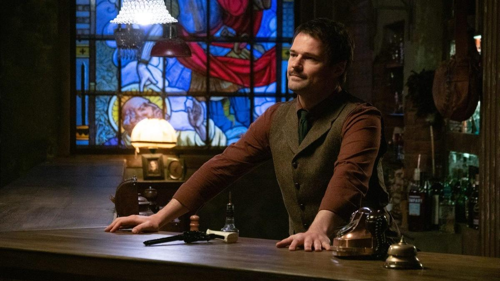

# Позвони мне, позвони. 1 октября KION выпускает долгожданный детективный триллер «Бар «Один звонок» с Данилой Козловским в главной роли

- **URL:** https://novayagazeta.ru/articles/2025/09/29/pozvoni-mne-pozvoni
- **Дата:** 2025-09-29
- **Автор:** Лариса Малюкова

## Позвони мне, позвони

## 1 октября KION выпускает долгожданный детективный триллер «Бар «Один звонок» с Данилой Козловским в главной роли

Кадр из сериала «Бар «Один звонок»

Премьерный показ был намечен в день закрытия «Нового сезона», 12 сентября 2023-го. Но исчез внезапно без объявления причин. Судя по всему, основной причиной стал сам Данила Козловский, фильмы и спектакли которого срочно изымали из афиш. Но иногда они возвращаются…

Мистический триллер о баре, в котором любой желающий может позвонить своему умершему близкому, согласившись на игру в «русскую рулетку». Минута — один выстрел. Второй звонок — в барабане уже две пули.

Бар этот — мерцающий: его невозможно найти на карте. Возникает в разных местах, открывает двери сугубо избранным и исчезает. Но не каждый из «дорогих гостей» его покинет живым.

Начнется все в центре заснеженного поля, где полицейские обнаруживают машину без водителя с мертвым пассажиром в багажнике. Всего лишь пару дней назад водитель авто — отец Федор (неузнаваемый Максим Виторган) — заглядывает в залитый теплым светом уютный бар — выпить водки в память об усопшей дочери. Предложение бармена позвонить дочке вызывает понятный гнев, смятение, а потом желание позвонить. Но звонит он некоему Ломову, виновному в смерти дочери и убитому самим Федором. Звонит, чтобы выяснить: вдруг он убил невиновного.

Следователь Андрей Морозов (Александр Ильин-младший) занимается поисками исчезнувшего сына Вити (Кай Гетц), он обещал найти подростка своей жене, которая лежит в коме. Улики ведут к таинственному бару «Один звонок», с которым связаны исчезнувшие люди.

Кадр из сериала «Бар «Один звонок»

Каждая серия рассказывает о новых посетителях заведения, их личных счетах, отношениях с теми, кого они потеряли, не завершили спор, об их травмах и драмах. Героиня Оксаны Акиньшиной приходит с новым мужем, но объясняется в любви своему убитому — прежнему. И позволяет новому мужу расплачиваться за ее неутоленную печаль и тоску. Молодой мужчина, успешный адвокат, рыдает в трубку: он не может сепарироваться от матери. Но мама трубку бросила, мертвые так разве делают? «А еще говорят, что семейные ценности — не те».

Они проклинают и молят покинувших их навечно. Они бередят раны. Копаются в себе. Рискуя жизнью, продолжают смертельно опасный разговор и не могут его закончить. Потому что гештальты не закрыты, жизненно важные вопросы остаются без ответов, сомнения не разрешены, от чувства вины не избавиться.

Звонок на тот свет помогает осуществить улыбчивый и смешливый Бармен, управляющий заведением, в счет которого он готов угощать «дорогих гостей». Средство связи — старинный дисковый «забронзовевший» телефон. Кажется, Бармен, напоминающий Люцифера, сам — нездешний и с потусторонним миром на «ты». Данила Козловский играет язвительного харизматика. Он — переводчик с живого языка на потусторонний и обратно с помощью огромных старинных книг, которые заполняют стены бара рядом с бутылками.

Работа, конечно, веселая, но не безмятежная. То после неудачного выстрела зуб на полку залетит, то кровью лицо забрызгают, то мозги с пола оттирать.

Поддержите нашу работу!

1000 500 300 Нажимая кнопку «Стать соучастником», я принимаю условия и подтверждаю свое гражданство РФ

Если у вас есть вопросы, пишите [email protected] или звоните:+7 (929) 612-03-68

А помогает ему прислужник Азазелькин, он же «падший ангел», он же Витя (Кай Алекс Гетц). Похоже, что это тот самый пацан, которого так фанатично ищет следователь Морозов. И очень Вите хочется из этого запойного чистилища как-то выбраться.

Кадр из сериала «Бар «Один звонок»

Для режиссера Сергея Филатова («Урок», «Отпечатки») это история о сожалении: «Мы часто жалеем о том, что сделали, и, может быть, еще чаще о том, чего не сделали. Некоторые вещи невозможно повернуть вспять — в этом весь ужас и красота жизни, она сиюминутна. Об этом важно иногда себе напоминать». Авторы решились нарушить конфуцианский закон: «Три вещи никогда не возвращаются обратно — время, слово, возможность». Впрочем, и на сей раз исключение или попытка нарушить правило лишь подтвердят его неколебимость.

И тайна будет связана каким-то образом с судьбой следователя Морозова, его впавшей в кому женой и пропавшим сыном.

Данила Козловский — не только исполнитель главной роли, но и сопродюсер проекта (вместе с Игорем Мишиным и Максимом Филатовым).

Продюсеры осмотрительно решили выложить на платформе сразу все серии. Сегодня ничего нельзя откладывать на завтра.

Читайте также

Кулич с глазами и атомный проект

Как новые сериалы развлекают и воспитывают будущие поколения зрителей

### P.S.

Любопытно, как носятся идеи в воздухе. Пока сериал Данилы Козловского и Сергея Филатова отлеживался на «полке», вышел короткометражный фильм «До последнего клиента» режиссера Валерия Карпова. Триллер с элементами комедии, без всякой мистики, в котором бармен Влад получает заказ — срочно привезти на вечернику элитное спиртное. Но в баре последний клиент никак не уходит. Написано же: «До последнего клиента». Темные тона бара вне времени. Абажуры с бахромой, старый музыкальный автомат. Загадочный клиент. И официантке Яне он явно нравится. Но «последний клиент» — это не просто ночной посетитель… Бар превращается в место, где можно признаться в чем-то ужасном. А в случае смертельной опасности — дартс вам в подмогу. Ничего не напоминает?

Лариса Малюкова ведет телеграм-канал о кино и не только. Подписывайтесь тут.

### Этот материал входит в подписки

Смотровая площадкаКино с Ларисой Малюковой

Культурные гидыЧто читать, что смотреть в кино и на сцене, что слушать

### Добавляйте в Конструктор свои источники: сайты, телеграм- и youtube-каналы

Войдите в профиль, чтобы не терять свои подписки на разных устройствах

Поддержите нашу работу!

1000 500 300 Нажимая кнопку «Стать соучастником», я принимаю условия и подтверждаю свое гражданство РФ

Если у вас есть вопросы, пишите [email protected] или звоните:+7 (929) 612-03-68
