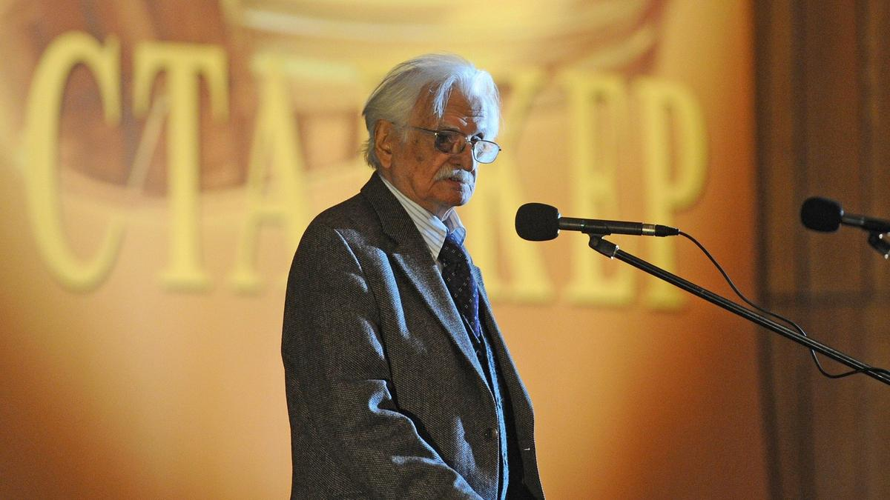

# Режиссер настоящего продолженного времени. Сто лет Марлену Хуциеву

- **URL:** https://novayagazeta.ru/articles/2025/10/03/rezhisser-nastoiashchego-prodolzhennogo-vremeni
- **Дата:** 2025-10-03
- **Автор:** Лариса Малюкова

## Режиссер настоящего продолженного времени

## Сто лет Марлену Хуциеву

Марлен Хуциев на открытии XVII международного фестиваля фильмов о правах человека «Сталкер» в Доме кино. Фото: ITAR-TASS

Из плеяды режиссеров, пробужденных оттепелью, кто своим талантом, своим дыханием согревал, очеловечивал. У него был абсолютный слух ко времени, его ритмам, звукам, дыханию, цвету. Его неумолимому неспешному движению. Это медленное с воздухом хуциевское кино, сосредоточенное на мгновении и жизни в целом. Ее бесконечности.

Если его героям хотелось подумать-помолчать, они молчали. Мы думали вместе с ними. Замирали в легендарные хуциевские паузы, вслушивались в гулкие проходы по московским улицам. Он вслушивался в реальность, но и сам сочинял ее ритм, язык. И человека в центре этого раздумчивого круговорота. Живущий сейчас. Или 200 лет назад. Задающий себе и нам вопросы, которыми задавалось все молодое послевоенное «двадцатилетнее» поколение.

Его экранный мир заряжен током напряженной мысли, любви, споров, током искусства в высшем его проявлении, не гнущегося, не угождающего. Зовущего нас из прошлого в будущее, которое не отрицает своего прошлого.

Словно мы отправляемся на последнем троллейбусе в восхитительное путешествие с близким нам проводником, которому 20 лет и который современник Пушкина.

Едем по маршруту от станции «Весна на Заречной улице» — через взбесившую власть «Заставу Ильича» — эстетический и этический манифест поколения — к несостоявшемуся, замученному в процессе создания «Пушкину»… через «Июльский дождь» — к самому проникновенному фильму о войне «Был месяц май»… от философского «Послесловия» — к «Бесконечности»…

Но и у «Бесконечности», и незавершенной «Невечерней», в которой он соединил своих любимых Чехова и Толстого, — открытый финал. Потому что станция назначения — «Марлен Хуциев» — одновременно приближается и отдаляется. Он и есть та самая «Бесконечность», которую пытаемся постигать на протяжении всей жизни. Понять-почувствовать сомнение, волнение и даже страх, с которыми он вступал в новые съемки, в каждый съемочный день: осмысленно и каждый раз — словно на первое свидание. Эти почти мистические взаимоотношения с каждой сценой, с актером, с кадром снова и снова возвращали его к уже снятому материалу.

Марлен Хуциев. Фото: Елена Никитченко / ТАСС

Поддержите нашу работу!

1000 500 300 Нажимая кнопку «Стать соучастником», я принимаю условия и подтверждаю свое гражданство РФ

Если у вас есть вопросы, пишите [email protected] или звоните:+7 (929) 612-03-68

Он смешивал на палитре экрана документальность и даже хронику со своими снами, представления о реальности — с вымыслом, в разных пропорциях. Чистая алхимия. Ведь хуциевский метод начал складываться с момента расставания с соавтором Феликсом Миронером. Говорят, вопрос ребром поставил сам Хуциев: «Тебе важно, куда идет человек?» Феликс ответил: «Да, обязательно!» «А мне не важно», — сказал Хуциев. Ему был важен человек, ищущий дорогу.

Феллини пытался помочь ему пробить «Заставу Ильича», когда был в Москве. Вайда пишет о том, как случайно выпала возможность пересмотреть на одном из фестивалей картину «Два Федора»: «…И еще раз убедиться, что место, которое Вы в моем убеждении занимаете среди моих любимых мастеров — Бергмана, Феллини, которых я обожаю, — достойно Вас».

Для меня Хуциев не просто путешественник во времени, но один из самых современных авторов. Режиссер настоящего продолженного. Не случайно в год его столетия выйдет завершенная коллегами его последняя картина, в которой гении размышляют о самом насущном — о человеке: зачем он и куда идет.

Читайте также

Толстой входит в палату Чехова — Чехов щупает пульс Толстого…

Фильм-артефакт «Невечерняя», который Марлен Хуциев не успел завершить, скоро доделают его друзья и ученики

Лариса Малюкова ведет телеграм-канал о кино и не только. Подписывайтесь тут.

### Этот материал входит в подписки

Смотровая площадкаКино с Ларисой Малюковой

Культурные гидыЧто читать, что смотреть в кино и на сцене, что слушать

### Добавляйте в Конструктор свои источники: сайты, телеграм- и youtube-каналы

Войдите в профиль, чтобы не терять свои подписки на разных устройствах

Поддержите нашу работу!

1000 500 300 Нажимая кнопку «Стать соучастником», я принимаю условия и подтверждаю свое гражданство РФ

Если у вас есть вопросы, пишите [email protected] или звоните:+7 (929) 612-03-68
