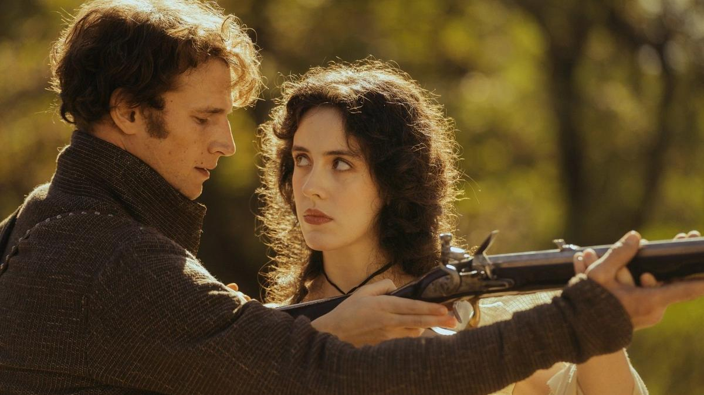

# Кино — приближение к смерти. «Лермонтов» Бакура Бакурадзе — фильм открытия фестиваля «Маяк»

- **URL:** https://novayagazeta.ru/articles/2025/10/06/kino-priblizhenie-k-smerti
- **Дата:** 2025-10-06
- **Автор:** Лариса Малюкова

## Кино — приближение к смерти

## «Лермонтов» Бакура Бакурадзе — фильм открытия фестиваля «Маяк»

Кадр из фильма «Лермонтов»

Трудно сформулировать жанр этой работы, я бы сказала — поэтическая фантазия на тему «смерть поэта». Как «Каприччио на отъезд возлюбленного брата» Баха. Там есть и ласковые увещевания друзей, чтобы удержать духовного брата от путешествия, и тревога за будущие испытания, и музыкальные образы, передающие предотъездные шум, суету и образ смерти.

«Лермонтов» — редкой образной целостности поэтическая импровизация, прорывающаяся сквозь хрестоматию — в спрятанное, скрытое, иррациональное. Про промежуток-просвет между жизнью и смертью.

Пятигорск, подножие горы Машук. Нет, не то самое утро 15 июля 1841 года. Какое-то условное раннее утро. Буквально позавчера произошла ссора с Николаем Мартыновым, прежде приятелем, ныне — врагом. Последний день перед дуэлью распущен на нитки, рассыпан на секунды и рифмы, случайные и преднамеренные встречи.

С шести утра до шести вечера день неспешно ползет к закату. Тихое лето — к поздней осени, от полноцветия — к умиранию природы, почти потопу.

На рассвете Лермонтов в своей маленькой комнате одевается, домотканый ковер на стене для тепла, плохо прокрашенные двери, горный пейзаж в окне, умывальник, ведро с питьевой водой, зеркало для бритья.

День как день, и в его обычности, будничности — блеянии овец и мычании коров, необязательных разговорах о кахетинском и клетке для чижа, о мизерной причине дуэли, несносном характере поэта — еще больнее мысль о возможной гибели. Заурядное смотрит трагедию, как будто в ней нет ничего особенного.

Звуковая партитура — едва ли не на переднем плане. Это все звуки жизни.

Кадр из фильма «Лермонтов»

День как день, без всяких признаков близкой беды. И сам Михаил Юрьевич скачет куда-то ни свет, ни заря. Несется сквозняком по лугам, по дороге мимо скал, валунов, по степям: есть здесь такие просторные степи, будто море спряталось вдалеке.

Все как обычно. Слуга птицу несет резать, и собака с радостным возбуждением прыгает. Лошадь громко жует овес у изгороди. Охотничья собака с куропаткой в зубах рядом с довольным добычей охотником, «чьи стрелы ветер разнесет». Этот охотник — Николай Мартынов. И он тоже проживает свой день перед дуэлью.

Текут минуты… Лермонтов купается в быстрой горной реке — быть чистым перед битвой — закон военного времени. Река утаскивает его за собой до исчезновения за рамками кадра. Словно смывает. Репетиция смерти.

День как день. Его друзья стремятся предотвратить неминуемое. Его приятели «проводят время». Серные источники и ванны по 50 копеек. Пари дискресьон. Ухаживания, сплетни, интриги. Прогулки в горы, пикники. Обсуждают в праздных застольях и прогулках несносный характер Мишеля. Фам-фаталь «Роза Кавказа» Эмилия Клингенберг, та, что прячет черкесский нож в складках платья, предлагает не обращать внимания на уродца, язык которого делает его еще уродливее. «Он ранимый, — возражает ее наперсница, — я читала его стихи».

Бакурадзе находит воплощение стихов в визуальном ряде: пейзажах «под дикой пеленой мглы», шуме реки, ветра, дождя. Он снимает вроде бы концептуальное, точно сформулированное кино — но на полупальцах, чувственное, меланхоличное, балансирующее между условностью и реализмом.

И слаженность, пригнанность, слитность вроде бы случайных деталей и подробностей «того самого дня» — как спонтанность, хрупкость жизни хрустальная. Сложно устроенная простота; то, что Куросава называл кинематографическим эффектом.

Режиссер показывает тактильное, в легкое касание, прощание героя. Вот он ласкает пса. Замирает, соединившись головами со своим конем, распутывая в гриве колтуны. Потом гонит коня — в учащенном предсердном ритме скачки, в топоте копыт к тишине подножия Машук — месту дуэли.

Неприкаянный, одинокий, «без всяких внешних признаков страдания», упрямо задиристый в последние минуты жизни, словно нарывающийся — определившийся. Кажется, внутреннее равновесие потеряно, его место занимает предрешенность.

И кадр смещается с вертикали в горизонталь как неумолимое притяжение смерти.

В изображении признаки киногении — импрессионистические легкие фоны, кроны деревьев смешиваются с облаками, а четкие линии стволов штрихуют, режут туман. Постепенно небо мрачнеет: изображение работает на атмосферу.

В самом фильме есть эскизность, словно автор тасует моменты-эпизоды, словно мог бы разложить их и как-то иначе. Игра со временем, которое то замирает, то летит. Есть сгущенность событий, и воздух пауз, и вместе с тем подобие репортажа: нас превращают в свидетелей выученной по учебникам истории, которая не совпадает со сложенными трафаретами. В близком приближении — распознавание невидимого, изумляющее ощущением ломкой судьбы. Как будто сам небесный доктор прописал герою свое назначение: смерть. Дуэли не избежать, если Лермонтов не принесет извинений. И отговаривать их с Мартыновым бесполезно, конфликт не исчерпан: все равно они друг друга вызовут. Да и сам поэт, кажется, уже знает, предвидит, предчувствует. Оттого и велит слуге: «Ужин не готовь».

Поддержите нашу работу!

1000 500 300 Нажимая кнопку «Стать соучастником», я принимаю условия и подтверждаю свое гражданство РФ

Если у вас есть вопросы, пишите [email protected] или звоните:+7 (929) 612-03-68

Кадр из фильма «Лермонтов»

Лермонтов Ильи Озолина лишен книжного романтического ореола. У него высокий с хрипотцой голос, он вообще далек от хрестоматийного образа со школы. В решающей дуэльной сцене в нем столько вдруг детского, почти мальчишеского упрямства и заносчивости. Когда вот-вот он протянет вчерашнему другу руку и… не может. Нелепо, ужасно, фатально. Да и в Николае Мартынове (Евгений Романцов) нет никакого злодейства. Так сложились обстоятельства, его оскорбили при дамах, он обязан как дворянин постоять за себя. Кто поступил бы иначе? Его объятие с Эмилией похоже и на объяснение в любви, и на прощание. Во время показа я думала о Мартынове — майоре из Кавалергардского полка, поехавшего добровольцем на Кавказ, вместе с Лермонтовым учившемся в школе юнкеров. О случайности и закономерности их дружбы, ссор, вражды. Как остановка музыки в доме Верзилиной, из-за чего оскорбительное окончание реплики Лермонтова стало слышно всему залу и послужило поводом для вызова… В фильме нет этой сцены, но в доме Верзилиной играют Шуберта.

«Кино снимает смерть за работой» — Кокто имел в виду неизбежность смерти в каждом кадре, которое фиксирует кино.

Мы оказываемся наблюдателями за тем, что герой демонстрирует миру — и что чувствует на самом деле. Дистанция огромных размеров. Тонкая работа и безыскусность в изображении травматичного разворота к неизбежному. Пророческий кадр — медленный наезд на скалистую, изрезанную временем скалу: долгий и неотвязный, как страшный вещий сон поэта.

Кино как приближение к смерти. Уже судьбою осужденный, уже с застывшею душой, в беззащитной хрупкости замирает в последнем объятии с единственно созвучной ему кузиной Катенькой, напоминающей ему любовь всей его жизни Варю Лопухину. И бело-серебристая ленточка Катеньки — на счастье.

…Где-то рядом с простреленным боком эта нежность. Серый ливень смоет цвета жизни юного гения. И перед глазами останется непоправимое: 26-летний мертвый мальчик на камнях и листьях под ливнем. Укройте его.

Лариса Малюкова ведет телеграм-канал о кино и не только. Подписывайтесь тут.

Читайте также

Толстой входит в палату Чехова — Чехов щупает пульс Толстого…

Фильм-артефакт «Невечерняя», который Марлен Хуциев не успел завершить, скоро доделают его друзья и ученики

### Этот материал входит в подписки

Смотровая площадкаКино с Ларисой Малюковой

Культурные гидыЧто читать, что смотреть в кино и на сцене, что слушать

### Добавляйте в Конструктор свои источники: сайты, телеграм- и youtube-каналы

Войдите в профиль, чтобы не терять свои подписки на разных устройствах

Поддержите нашу работу!

1000 500 300 Нажимая кнопку «Стать соучастником», я принимаю условия и подтверждаю свое гражданство РФ

Если у вас есть вопросы, пишите [email protected] или звоните:+7 (929) 612-03-68
