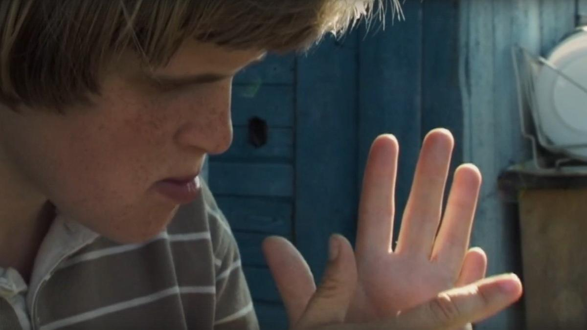

# «Родители тут рядом». Картине Любови Аркус не выдали прокатное удостоверение. Рассказываем о фильме, который сегодня так важно увидеть — и в России, и во всем мире

- **URL:** https://novayagazeta.ru/articles/2025/10/15/roditeli-tut-riadom
- **Дата:** 2025-10-15
- **Автор:** Лариса Малюкова

## «Родители тут рядом»

## Картине Любови Аркус не выдали прокатное удостоверение. Рассказываем о фильме, который сегодня так важно увидеть — и в России, и во всем мире

Кадр из фильма «Родители тут рядом»

«Родители тут рядом» — приквел известной документальной драмы Аркус «Антон тут рядом», снятой в 2012 году, показанной на Венецианском кинофестивале, удостоенной премий «Золотой орел» и «Ника». И тогда же продюсер Сергей Сельянов говорил о второй главе, которая отчасти была снята и которая его особенно волновала и заботила.

«Антон тут рядом» — персонализированное кинематографическое высказывание, автор которого — и режиссер, и второй герой, и голос за кадром. Фильм-портрет особенного, удивительного и удивляющего Антона в проекции времени и целого узла проблем, но еще и автопортрет автора. Его усилие разобраться в многосложной и непостижимой человеческой природе. Мы открываем для себя другой многостраничный мир, который проверяет нас на способность к эмпатии. На трудное обнаружение в себе человеческого. Фильм будто на наших глазах сам себя писал и снимал. И Антон действительно оказывался соавтором Любы и в финале картины брал в руки камеру. Я видела картину один раз на первых показах, но помню ее в деталях.

Антон, несмотря на все прогнозы скептиков, специалистов, все же вернулся в этот мир.

Тогда она сказала: «Придется заниматься каждым в отдельности. Так возник Фонд «Антон тут рядом», оказывающий поддержку детям, подросткам, взрослым с аутизмом и их близким. Сегодня их в одном Питере уже пять. 120 сотрудников.

Любовь Аркус. Фото: Антон Новодережкин / ТАСС

Из интервью Любови Аркус: «Я снимала фильм об Антоне и не планировала быть вторым персонажем. Но жизнь сложилась иначе: если убрать меня, то совершенно непонятно, что, собственно, происходит.

Нужен человек «тут рядом» для того, чтобы иметь дело с феноменом бессмысленности, отсутствием авторства собственной жизни, который — суть проблем аутистического спектра и в то же время в той ли иной степени знаком каждому из нас».

Новая картина рассказывает о жизни родителей детей с аутизмом. «Про человека тут рядом». Про тех, без которых им не выжить.

«Монтировать и доснимать его был тяжелый труд, — пишет Аркус, — но меня подгоняла мысль о том, что без прочих моих фильмов человечество могло бы и обойтись, а вот именно этот очень нужен сейчас людям. <…> Если коротко, он о больших настоящих чувствах, о том, как человек принимает трагические обстоятельства, делает Выбор, и как ежедневное горе обращается в часы великого счастья, потому что нет иного счастья, нежели Любовь, которая выходит из принятой душою и сердцем Участи».

Во время фестиваля в Выборге автор показала мне черновую сборку. «Родители тут рядом» («Онега») — по сути, первая глава дилогии. 13 лет ушло на то, чтобы собраться с силами и кинематографическими средствами рассказать о тех, кто живет внутри сейсмической зоны — аутического спектра.

Кино про ежедневные открытия, ежечасный труд, боль, попытки преодолевать черту между тобой и твоим ребенком. И про невидимые стены/стекла/скалы — с равнодушным внешним миром, которые родители особенных детей пытаются пробить (сейчас сквозь эти стекла не может пробиться и сам фильм).

Но я бы не сказала, что фильм «про героизм», «подвиг». Скорее кино о бесконечной любви внутри трагической, вовсе не бесконечной жизни.

…Комары стаями, запотевшее стекло, жара. Горячие лица с капельками пота. Жизнь лагеря на Онеге: все вручную — стирка, готовка. Ритуальные походы в сельпо (Антон покупает себе сок сам). Внешне похоже на отпуск, но и на скалолазание… только скалы — невидимые.

Потом — Петербург. Другая жизнь.

Документальное кино как погружение в физическую реальность, «жизнь других» — особенных во всех отношениях.

Один папа говорит о настигающем его периодами отчаянии. И о постоянном желании «переключить тумблер». А как включить в темноте свет? Самое невыносимое — беспросветная рутина жизни. Обыденная жизнь внутри предельно экстремальной. И где взять силы длить ее?

Но руки сынишки… но объятия, доверительный шепот… Но солнце, которое согревает… светом.

Из привычного мира попадаем в пространство иных масштабов, словно в страну великанов, в которой вся жизнь на суперкрупном плане. Где улыбка, самостоятельный шаг, чистка зубов, выученное стихотворение превращаются в события вселенского ряда.

Кино про выбор, который эти люди сделали и делают каждый день.

Их с женой уговаривали «больного ребенка» сдать («Зачем мучиться?»).

Зачем? Считается, что уходят из подобных семей в основном мужчины. Неправда. Мама Насти сломалась, когда Насте было четыре года. И вот Миша размышляет о смерти своего ребенка: если она умрет раньше его, будет всем легче — ее не засунут в дурку. Он берет на себя колоссальную ношу ответственности… за каждый ее шаг. И в то же время, сохраняя личное пространство Насти, помогает ей самой осваивать эти «шаги».

Да все они осознают, что без них их детей, скорее всего, не будет.

Настя доживет до четырнадцати почти нормально, а потом начнутся проблемы. Вообще «потом» — самое тревожное, пульсирующее то надеждой, то разочарованием слово в этом особенном многокрасочном пространстве жизни.

Кадр из фильма «Родители тут рядом»

Поддержите нашу работу!

1000 500 300 Нажимая кнопку «Стать соучастником», я принимаю условия и подтверждаю свое гражданство РФ

Если у вас есть вопросы, пишите [email protected] или звоните:+7 (929) 612-03-68

Смотрю на двух пап и не понимаю: откуда силы берутся, терпение? Другие и без того ломаются. Рассыпаются в потерях себя, в стычках с агрессивной реальностью. Что такое «праведник» в нецерковном понимании? Следование моральным законам из-за сочувствия к другому? Верность, стойкость, бесконечная и бескорыстная любовь? (Когда не создаешь себе картинок «ребенка мечты», а принимаешь и любишь собственного ребенка?) Не хочется громких слов, а других не хватает, чтобы описать Мишу.

Все время думаю о том, что они отдают и что получают… Это один из вопросов фильма. Только несведущие думают, что затрат тысячекратно больше…

Хотя Виктор, папа Вани, признается: их лишили возможности гордиться своими детьми. У других — олимпиады, престижный вуз. А твоя безмерная гордость и счастье, когда твой ребенок может учиться в обычной школе. Как обычные дети!

Поначалу кажется, что методы «воздействия» Виктора на его сына слишком жесткие. Я даже вспомнила справедливо раскритикованный фильм «Временные трудности», где герой Охлобыстина насилием «выбивал» из сына болезнь. Виктор в том самом онежском походе вынуждает Ваню идти вперед, даже когда у того нет сил — он лежит на земле, не хочет вставать. Здесь невидимая грань между усилием и любовью, которой должно быть, как говорил Костя Треплев, пять пудов и даже больше. Чтобы ребенок почувствовал ее своей бескожной душой.

Взрослый рядом не просто защищает, но, как говорят специалисты, и становится второй кожей для оголенной души аутичного ребенка, воспринимающего мир как громоподобное, непонятное, а часто враждебное пространство. Ребенка, испытывающего телесные и душевные муки и страхи.

Кино про любовь — мучительную и счастливую. Мостам не удержать берега? Тем более что берега вокруг нас осыпаются. Но есть люди, которые отведут реки и выпьют море. У них с их детьми — свой язык, спаянность, у них способность на какие-то мгновенья стать «иными», чтобы ощутить и разделить степень боли. Кульминационная сцена для меня, когда в походе Марьяна пытается вечером уложить своего Сережу в спальный мешок. Он от нее уходит. По ее просьбе возвращается. Не сразу, с трудом. И снова уходит. И снова. И снова… Это долгая, неописуемая словами сцена с разрывающим тебя финалом. И здесь надо сказать про гениальную камеру Алишера Хамидходжаева. Она все время «тут рядом», очень близко, и в то же время ее будто нет — высшая степень не только профессии, но деликатности, внимания. И да, сочувствия, потому что камера становится нашими глазами. Только что не плачет. Особенно когда любуется Ирой, мамой Макара. У нее же трое детей, но Макару нужно внимания столько… как целому классу. Как не разорваться?

Читайте также

Здесь были Рита, Юра и Саша…

Сегодня завершается фестиваль авторского кино «Маяк». Рассказываем про лучшие фильмы конкурса

Про счастье. Оно здесь есть. Ослепительные счастливые мгновения пойманы в дырявые сачки порванной жизни этих взрослых, нестерпимой и моментами прекрасной. Есть минуты и даже часы тишины и покоя, когда боль отползает — у них такие счастливые, спокойные лица. Они сидят и поют у костра: «А давайте еще вот эту… и эту…» А дети спят рядом. Разве это не счастье?

Кино про красивых, больших людей, которые «тут рядом», просто мы их не видим.

Про беспредельную ценность, отдельность каждого человека, взрослого и ребенка, здорового и не очень, и бесценность каждого мгновения жизни… Про нашу всеобщую связанность, о которой писали философы. Равнодушие рвет цепь всеобщей человечности.

Жанр? Трагедия со спрятанным внутри катарсисом.

Потому что про смерть и жизнь. Мы узнаем о сокрушительных потерях тех, к кому успели прикипеть в картине. Что мы можем сделать? С этим вопросом оставляют нас авторы фильма. Нам с этим жить.

«Родители тут рядом» — не исключительно российская, но универсальная история про непостижимый космос другого, непохожего. И про отчаянное подвижничество наших современников-соотечественников, кто без страховки давно отправился в этот бессрочный космический полет.

Увы, фильму о красоте русского человека, лишенному ложного патриотизма, в выдаче прокатного удостоверения отказали.

О причинах отказа авторам не сообщили.

Лариса Малюкова ведет телеграм-канал о кино и не только. Подписывайтесь тут.

### Этот материал входит в подписки

Смотровая площадкаКино с Ларисой Малюковой

Культурные гидыЧто читать, что смотреть в кино и на сцене, что слушать

### Добавляйте в Конструктор свои источники: сайты, телеграм- и youtube-каналы

Войдите в профиль, чтобы не терять свои подписки на разных устройствах

Поддержите нашу работу!

1000 500 300 Нажимая кнопку «Стать соучастником», я принимаю условия и подтверждаю свое гражданство РФ

Если у вас есть вопросы, пишите [email protected] или звоните:+7 (929) 612-03-68
