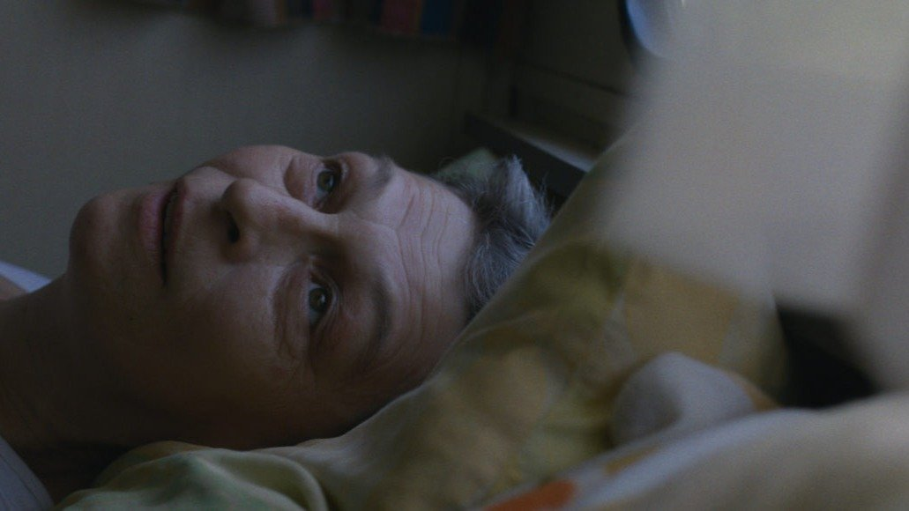

# Говори со мной, ветер. Гид по международному конкурсу остроактаульного фестиваля «Послание к человеку», который прямо сейчас и до 25 октября идет в Петербурге

- **URL:** https://novayagazeta.ru/articles/2025/10/17/govori-so-mnoi-veter
- **Дата:** 2025-10-17
- **Автор:** Лариса Малюкова

## Говори со мной, ветер

## Гид по международному конкурсу остроактаульного фестиваля «Послание к человеку», который прямо сейчас и до 25 октября идет в Петербурге

Кадр из фильма «Говори со мной, ветер»

## Конкурс

- «Комендант». Режиссер Данель Эльпелег

Один из самых актуальных фильмов. Сразу после завершения арабо-израильской войны в 1948-м перед Израилем, провозгласившим независимость, ребром встал вопрос: что делать с оставшимся на его территории арабским населением? 130 тысяч арабов стали израильскими гражданами. Людьми с ID… которым не доверяли. В арабских городках и деревнях были введены военная администрация и комендантский час.

Полковник Цви Эльпелег — один из комендантов, посвятивший всю жизнь управлению арабскими территориями. Эту ответственную должность он занял еще в 24 года. А рассказывает о нем его внучка, режиссер Данель Эльпелег. Она проводит обширное всестороннее расследование (документы, свидетели, историки) деятельности коменданта и его помощников, по ходу дела обнаруживая не только политические тайны, но и семейные секреты. Грехи отцов отзываются эхом в сегодняшних бедах и проблемах.

Стержень фильма — интервью, которое режиссер когда-то взяла у своего деда.

Все хотят победить в войне, но что делать на следующий день после победы? И не станет ли устройство «нового мира» причиной тлеющих конфликтов и новой войны?

Кадр из фильма «Комендант»

Люди из окружения Цви рассказывают о всемогуществе коменданта на завоеванных землях. Его слово решало буквально все: от открытия кафе или парикмахерской, приема у врача, закупки скота до степени наказания для подозреваемых. Жить им или умереть.

Цви стал частью массивного бюрократического аппарата, созданного как инструмент власти, открывающий путь произволу. Но оказывается, тотальный контроль (на каждого жителя в комендантской картотеке был отдельный файл) не способствует миру и покою.

Эльпелег удается создать картину прошлого — как своей семьи, так и Государства Израиль — во всех его сложностях и никуда не девшихся противоречиях.

- «Новое начало». Режиссеры Вивиан Перельмютер, Изабель Инголд

Одиссея ветерана вьетнамской войны. Эл Мун — коренной американец. Жил себе уединенно в резервации своего племени в Северной Калифорнии. Но в нынешнем шатком агрессивном мире он потерял покой. Снова духи войны стали тревожить его в снах (кошмарах) и бодрствовании. Тем более что рыболовный корм высыхает, уловы лосося тают, лосось умирает в огромных количествах. Океан болен. Рыбаки остаются без работы.

И тогда Эл отправляется через всю Америку искать своих боевых товарищей. Это путешествие к травмирующему прошлому, которое, как ему кажется, поможет справиться с настоящим.

Визионерский опыт медленного погружения в эмоциональное состояние героя. Киноязык фильма балансирует между тонкой символикой, продуманной выразительностью и реальной драматической биографией.

Кадр из фильма «Новое начало»

Есть красивая метафора возвращения лососей «домой», в том числе больных, раненых: «У них есть шрамы, — говорит Эл Мун, — они наполовину мертвы. Но выглядят так, как будто они уже мертвы, но они все равно идут. В конце концов вся их энергия исчезла, и они умирают… Но нет, это не конец. Напротив, подарок. Их туши возвращают все минералы из океана, чтобы помочь молодым выжить». Эл Мун наполовину жив, и это его лучшая половина.

Созерцательность или медитативность не растворяют — напротив, усиливают драматизм истории. Сам заголовок — «Новое начало» — предполагает возможность внутреннего перерождения героя. Но если и не так, то хотя бы идею принятия себя. Мрачные поэтические кадры с высвеченными в темноте крупными рельефными планами открывают пространство для размышлений и эмоционального отклика. Когда Эл Мун размышляет о войне, он вспоминает, что в День ветеранов всегда носит рубашку «джунгли», потому что хочет, чтобы слишком забывчивые люди помнили: «Эй! Ты послал нас через океан в одно время, чтобы сделать грязную работу… И вот я один из тех людей».

Кадр из фильма «Новое начало»

«Говори со мной, ветер». Режиссер Стефан Джорджевич

Семейный портрет в интерьерах одной смерти. Стефан планировал фильм о своей матери Негрике и даже начал его снимать. Мать больна. И внезапно она умирает. Все валится из рук у всех членов большой семьи. Да и сам фильм теперь висит на волоске. Но вдруг старая бабушка решается вместе с родней ехать в тот самый домик, на то самое озеро, где умерла ее дочь, чтобы помочь внуку снять кино.

Дебютный фильм Джорджевича сплетает факты, вымысел и воспоминания в трогательную кинематографическую вязь, в которой травмы, потери, меланхолия и юмор переплавляются в благодарную память.

Поддержите нашу работу!

1000 500 300 Нажимая кнопку «Стать соучастником», я принимаю условия и подтверждаю свое гражданство РФ

Если у вас есть вопросы, пишите [email protected] или звоните:+7 (929) 612-03-68

Кадр из фильма «Говори со мной, ветер»

В кульминации фильма сама Негрика в темной пещере со всполохами огня руководит съемкой сына — профессионального режиссера, и мы запомним эти подвижные портреты с рембрандтовским светом.

Семейные посиделки «у озера» (день рождения 80-летней бабушки, пережившей свою дочь Негрику), воспоминания братьев о маме (как она звала их домой во время игры в футбол), дневниковые записи и фантазии режиссера — микс документального и игрового кино. Все домочадцы не оправились от траура. Но ремонт скромного домика на берегу озера, где Негрика провела последний год своей жизни, расчистка шкафов и паутины, да и съемки этого фильм не дают прошлому превратиться в труху.

Постепенно мы знакомимся и с самой Негрикой, боровшейся с раком в этом самом домике. Ее кровать стоит прямо у окна. Ветер шевелит занавески, касается ее стриженых седых волос, ее щек. Она чувствует, как истончается по мере приближения смерти граница с иным миром, как обостряется ее взаимосвязь со стихией, она учит сына «слышать ветер», говорить с ним, верить в ветер как во что-то необъяснимое, находящееся за пределами разума.

И он повторяет ее слова: «Ветер заставляет желания сбываться». Он снимет этот фильм, в котором будет снова жива Негрика, помогая всем им справиться с ее смертью, прожить и пережить утрату. В этом фильме одним из главных геров станет ветер.

Читайте также

Бессмертие в метрополитене

В Петербурге 17 октября начнется юбилейный 35-й кинофестиваль «Послание к человеку»

## Программа экспериментального кино «Новые голоса»

- «Альфа». Режиссер Ян-Виллем ван Эвейк

Минималистская драма о холоде. Отчуждении в горе. Снежные вершины Альп. И замерзшие отношения между отцом и сыном. После смерти матери 30-летний Рейн (Рейнут Шолтен ван Ашат) отказался стать музыкантом, отказался от социальных связей и амбиций, уехал в горы. Стал тренером по сноуборду. Но однажды к нему приезжает отец ( Гейс Шолтен ван Ашат). Между ними — «дистанция огромного размера», напряжение, подпитанное ревностью, неразрешенные конфликты прошлого. Вытворяя головокружительные трюки на высоком склоне, Рейн словно пытается что-то доказать отцу, проучить его, испугать. И тогда сама гора вступает в этот неравный поединок… В подкладке фильме — тема владения, манипуляций другим, контроля. Но природа, но острые поднебесные козырьки гор не дадут себя контролировать.

Режиссер выбирает на главные роли реальных отца и сына, обладающих разным опытом, темпераментом, разным поколенческим мировоззрением. И превращает семейную драму в экзистенциальную схватку. Впрочем, эмоционально тоже ощутимо примороженную.

Кадр из фильма «Альфа»

- «Озеро». Режиссер Фабрис Араньо

Швейцарский режиссер фильма Фабрис — соратник и оператор Годара в последние 20 лет его жизни.

Формально кино про пару, участвующую в многодневной (точнее, многосуточной) парусной гонке. Но Араньо из пейзажа, плеска воды, шороха ветра, проблескивающих сквозь тучи солнечных лучей создает бессловесную экзистенциальную драму. Кино на ощупь. Герои драмы даже не столько муж и жена Клотильде Куро и Бернаре Штам, сколько само озеро и картины природы. Меняющие цвета небо и золотое отражение города в воде, «плавающий» в озере звездный небосвод с лунным светом, трепетание шелкового паруса среди угрожающих волн и сама темная, переливающаяся оттенками, будто масляная вода.

Это поэма об озере, в которую вписаны визуальные строки о паре понимающих друг друга без слов людей, и она тоже становится фрагментом ландшафта.

Кадр из фильма «Озеро»

Под парусом в темной воде. В зеленых пейзажах на берегу. Зависшие на высокой мачте под небом. Фантомная жизнь, накрепко соединенная со стихией. Живые картины, перетекающие друг в друга, напоминающие живопись Тернера, Моне и Эндрю Уайета.

Лариса Малюкова ведет телеграм-канал о кино и не только. Подписывайтесь тут.

### Этот материал входит в подписки

Смотровая площадкаКино с Ларисой Малюковой

Культурные гидыЧто читать, что смотреть в кино и на сцене, что слушать

### Добавляйте в Конструктор свои источники: сайты, телеграм- и youtube-каналы

Войдите в профиль, чтобы не терять свои подписки на разных устройствах

Поддержите нашу работу!

1000 500 300 Нажимая кнопку «Стать соучастником», я принимаю условия и подтверждаю свое гражданство РФ

Если у вас есть вопросы, пишите [email protected] или звоните:+7 (929) 612-03-68
