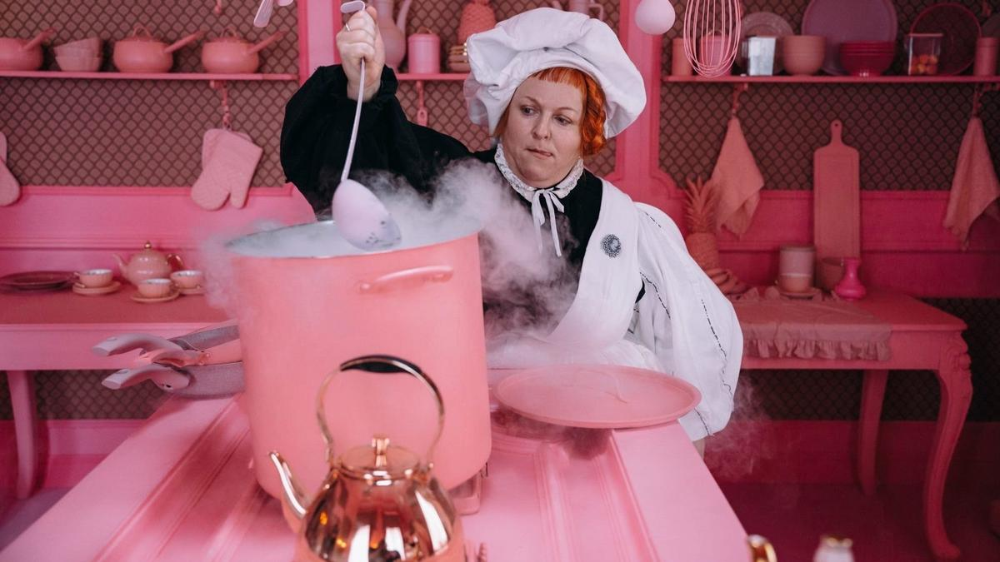

# Алиса-лайт, или Королевство кривых зеркал. 23 октября в прокат выходит киносказка-мюзикл «Алиса в Стране чудес» Юры Хмельницкого

- **URL:** https://novayagazeta.ru/articles/2025/10/22/alisa-lait-ili-korolevstvo-krivykh-zerkal
- **Дата:** 2025-10-22
- **Автор:** Лариса Малюкова

## Алиса-лайт, или Королевство кривых зеркал

## 23 октября в прокат выходит киносказка-мюзикл «Алиса в Стране чудес» Юры Хмельницкого

Кадр из фильма «Алиса в Стране чудес»

Это не экранизация сказки Кэрролла, а фантазия по мотивам аудиоинсценировки Олега Герасимова и пластинки, ставшей культовой для последнего поколения «рожденных в СССР». Того самого двойного винилового альбома с солнечным окном и голубыми глазами Алисы на черном фоне. С выученными песнями Владимира Высоцкого, аранжированными Евгением Геворгяном. О чудесатой жизни шизокрылых — закатной поры брежневской эпохи со всей ее пыльной фантасмагорией и полуживыми вождями. Я сама в хоре пела: «Ленин в тебе и во мне».

Режиссер сказки — Юра Хмельницкий. Сценарий — Карины Чувиковой (сочинившей отличный сериал «Между нами химия»). Кастинг — россыпь востребованных звезд. Алиса — Анна Пересильд, зазвездившая в «Слове пацана». Ирина Горбачева, Милош Бикович, Паулина Андреева, Олег Савостюк, Андрей Федорцов, Сергей Бурунов, Кристина Бабушкина, Полина Гухман и другие (некоторые знаменитости мелькают в массовке).

15-летняя школьница Алиса, только что завалившая ОГЭ (даже не спрашивайте), пыталась догнать Белого Кролика (Андрей Федорцов), стащившего у нее часы, и прямо с детской площадки через горку-трубу обрушилась в Страну чудес — в замершее время под застывшим предполуденным солнцем (полдень здесь никак не наступит, потому что время «не идет»). Здесь бессмысленно живут двойники тех, кого Алиса знает в реальном мире. Ее нервная мамаша превратилась в Королеву (Ирина Горбачева), бесхребетный добряга-папа — в Безумного Шляпника, приговоренного к вечному чаепитию (Милош Бикович), строгая биссектриса-директриса — в черно-розовую (по настроению) Герцогиню (Паулина Андреева), вредные одноклассники — в Мышь и Попугая-Пирата (Полина Гухман и Артем Кошман). А школьник Костя, в которого Алиса влюблена (зря, что ли, авторы сделали ее почти взрослой), — преображается в ее спасителя и проводника в чудесатую страну — в слишком милого для трикстера и вовсе не похожего на птицу — Додо (Олег Савостюк)

Мир в Зазеркалье управляется абсурдом. Верные слуги Королевы — антиподы дружно распевают тот самый известный гимн: «Стоим на пятках мы и на своем, а кто не с нами, те — антипяты». Для антипятов уготовлено наказание — бесконечный чайный стол.

Кадр из фильма «Алиса в Стране чудес»

Куда и угодит на время «антипятка» Алиса. Есть и своеобразный суд, после которого, как и положено, непременно следует казнь. Или должна последовать, но откладывается… все из-за вставшего намертво времени. И документы откладываются: «ни от кого никому». И только храбрый глас народа иногда можно услышать: «Если есть что молчать, тогда молчите!» Понятно, что армия антиподов в нелепых латунных раструбах-трубах на головах не станет мириться со вздорными выскочками антипятами.

Что же получилось и чего не удалось обнаружить за нарядной — «такой старой, тяжелой кулисой»? Хорошие актерские работы: Аня Пересильд и особенно Полина Гухман в роли подловатой, но обаятельной принюхивающейся к ситуации Мыши. Точная до микрон Паулина Андреева со своей готической Герцогиней. Она здесь главный антагонист, потому что не ведает границ между добром и злом («А как это — убить человека?»). Хороша, как всегда, Кристина Бабушкина в образе тоталитарно-музыкальной Классной руководительницы.

Вы не увидите комическую диктатуру Королевы червей, как в фильме Бёртона: при всех намеках — мило и пушисто, словно во сне девочки Алисы, мечтающей о сказочной любви. Приятная и славная чехарда, как в колыбельной (есть, правда, угрожающая жизни колыбельная Герцогини), которая незаметно перетекает в сон.

Кадр из фильма «Алиса в Стране чудес»

Авторы, прежде всего художник Анна Стрельникова и создательница костюмов Татьяна Мамедова, придумали свой эклектичный чудесатый мир. Именно что Зазеркалье. Каждый персонаж из реальности в «другом» мире отражается по-своему. По сути, это королевство кривых зеркал. Здесь есть даже настоящая комната Алисы, просто во сне она похожа на будуар «маленькой принцессы». Черное школьное платье превращается в розовое. Вечно раздерганная мама — примеряет эклектичный роскошный бордовый наряд Королевы с бриллиантовыми погонами. Вроде бы Королева, как ей и положено, хочет всех казнить… но почему-то травят в основном ее. Директриса Герцогиня — геометрия показного зла, каркасы, тюрнюры, острые углы. Словно «вся на иголках», того и жди — не отравит, так уколет. Это микс разноцветного мира Чарльза Фолкарда и готической неоготики в духе Бёртона. Начиная с «пешеходного перехода» в форме клавиш рояля — и до театральных малиновых драпировок и шахматного пола в дворце Малиновой Королевы.

Изобретательную пародийность текстов Кэрролла и Высоцкого разбавили ромкомом, чтобы привлечь подростков, прежде всего, девочек — главной аудитории картины (фильм выходит к осенним каникулам).

Поддержите нашу работу!

1000 500 300 Нажимая кнопку «Стать соучастником», я принимаю условия и подтверждаю свое гражданство РФ

Если у вас есть вопросы, пишите [email protected] или звоните:+7 (929) 612-03-68

Кадр из фильма «Алиса в Стране чудес»

Парадоксы из Чаепития Мартовского Зайца: («Не желаете ли вина? — Не вижу никакого вина. — А никакого и нет») в таком кино не приветствуются. Зато одним из сквозных лейтмотивов стала тема о потерянном, даже «убитом» времени. Хотя новая сказка о потерянном времени несколько подрастеряла важнейшие для Высоцкого мотивы «горького безвременья» («И тогда обиделось Время — и застыли маятники Времени», «Обижать не следует Время — плохо и тоскливо жить без Времени). Персонажи фильма Хмельницкого пьют чай… в поисках потерянного времени, если его найти, оно сдвинется с мертвой точки. Если стрелки не сдует с места ветер перемен — все будет, как всегда: вместо новостей — одни старости.

Горькое разочарование — подмена с музыкой. Прекрасный и легендарный саундтрек Геворгяна–Высоцкого растворили в маловыразительных композициях и розовых аранжировках композитор Владислав Саратовкин и музыкальный продюсер Евгений Воронцов. Ускользнули из музыки и острый темпоритм, и ирония.

Читайте также

«Родители тут рядом»

Картине Любови Аркус не выдали прокатное удостоверение. Рассказываем о фильме, который сегодня так важно увидеть — и в России, и во всем мире

Само действие немного увязло по пути трансформации абсурда, игры слов, смысловаых парадоксов и шуток — в фэнтези и ромком. Может быть, не хватило игры героев по обе стороны условного Зеркала? Вот и промелькивает слишком много персонажей, известных по книге и пластинке, многим из них не досталось не то что роли, даже микробенефиса, как Синей Гусенице Сергея Бурунова — Икару местного чайного разлива. Другие превратились в оркестровую массовку — «антиподов». Возможно, дело в рискованных текстах и смыслах Высоцкого, и по мере приближения к финальной версии, картину пришлось порезать мягкими, но решительными ножницами?

В общем, вышло суперярко, даже обаятельно, но «много неясного в этой стране, можно запутаться и заблудиться».

Лариса Малюкова ведет телеграм-канал о кино и не только. Подписывайтесь тут.

### Этот материал входит в подписки

Смотровая площадкаКино с Ларисой Малюковой

Культурные гидыЧто читать, что смотреть в кино и на сцене, что слушать

### Добавляйте в Конструктор свои источники: сайты, телеграм- и youtube-каналы

Войдите в профиль, чтобы не терять свои подписки на разных устройствах

Поддержите нашу работу!

1000 500 300 Нажимая кнопку «Стать соучастником», я принимаю условия и подтверждаю свое гражданство РФ

Если у вас есть вопросы, пишите [email protected] или звоните:+7 (929) 612-03-68
